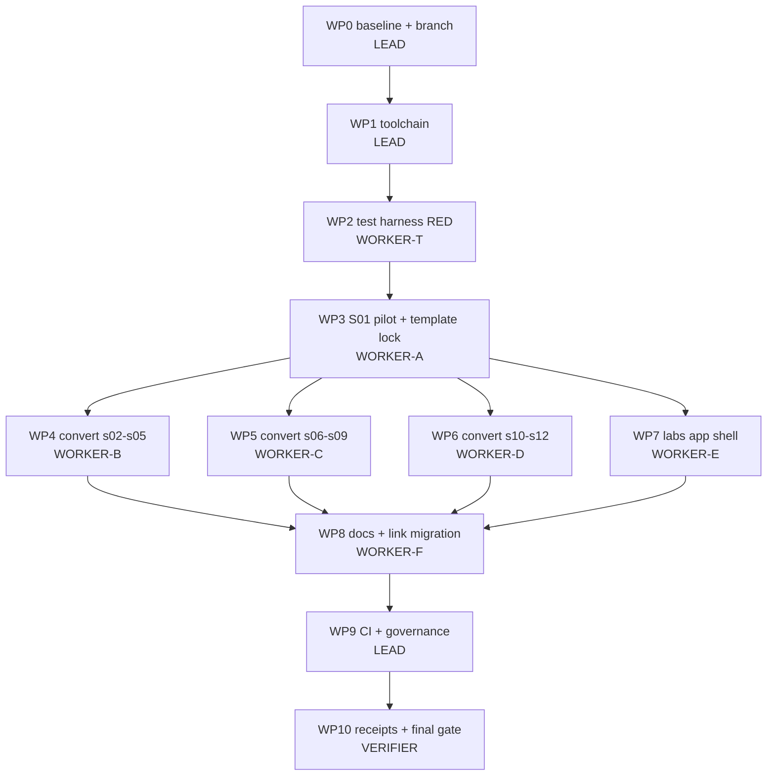

# Execution Plan 0001 — Retire Jupyter, adopt marimo, unify the lab interface

| Field | Value |
|---|---|
| **Status** | Ready to execute |
| **Created** | 2026-09-17 |
| **Target repo** | `agent-harness-path` @ `main` (`ee43b13`) |
| **Execution branch** | `feat/marimo-migration` |
| **Plan branch** | `plan/marimo-migration` (this document only) |
| **Runtime decision** | marimo `==0.24.2` (see ADR-001) |
| **Work packages** | WP0 – WP10 |
| **Tool facts** | Empirically verified on marimo 0.24.2 / CPython 3.11.2 — see §2 |
| **Supersedes** | The prose migration sketch in the AGENTS.md "One interface" section |

---

## 0. How to execute this plan

### 0.1 Execution model

This plan is written for **one LEAD agent coordinating worker subagents under TDD**.
It contains no open questions that an executor is allowed to resolve by improvisation.
Where a genuine unknown remains it is listed in §13 with a named spike and a
pre-authorised decision rule.

| Role | Count | Responsibility |
|---|---|---|
| **LEAD** | 1 | Owns the branch, the DAG, dispatch, merge order, and the final gate. Edits only files in LEAD-scoped work packages. |
| **WORKER** | up to 4 concurrent | Executes exactly one work package inside its declared write scope. Never edits outside it. |
| **VERIFIER** | 1 | Runs WP10 from a clean checkout. Never writes source; only reports. |

### 0.2 Hard rules for every agent

1. **Do not improvise.** If reality contradicts this plan, stop, record the
   contradiction verbatim, and escalate to LEAD. Do not "fix it and continue".
2. **TDD order is mandatory**: write the failing test (RED), capture its exact
   output, make the minimal change (GREEN), then run the package gate.
3. **A work package is complete only when its gate command exits 0** and the
   verbatim output is pasted into the handoff.
4. **Write scopes are disjoint and binding.** Two agents must never hold the same
   path. Touching a path outside your scope invalidates the package.
5. **Never `git push --force`, never rebase a pushed branch, never amend another
   agent's commit.**
6. **Never run `--live` against any provider.** No API key is required or
   permitted at any point in this migration.
7. **One conceptual change per commit**, Conventional-Commit prefix, session or
   package named in the subject.
8. If a gate fails three times on the same package, stop and escalate. Do not
   loosen the gate, do not add skips, do not delete assertions.

### 0.3 The single source of truth for "is it done"

§12 defines one verification block. Nothing is done until that block is green.

---

## 1. ADR-001 — Notebook runtime: marimo

### 1.1 Decision

Replace JupyterLab and the twelve `notebooks/*.ipynb` files with **marimo 0.24.2**
and twelve `notebooks/*.py` marimo notebooks. Present the optional hard path
(`labs/`) through a marimo app shell (`labs/app.py`) that wraps the unchanged
`labs/run.py` code path.

### 1.2 Requirements this repository actually imposes

| # | Requirement | Source |
|---|---|---|
| R1 | Zero network, zero keys, zero cost at learner runtime | `AGENTS.md` non-negotiable 2 |
| R2 | Course logic stdlib-only | `COURSE-MAP.md` session contract, rule 2 |
| R3 | Plain-text, git-diffable source, reviewable in a PR | `CONTRIBUTING.md` |
| R4 | Headless execution in CI with non-zero exit on failure | `.github/workflows/verify.yml` |
| R5 | No hidden execution state; out-of-order execution impossible | the flow complaint this migration answers |
| R6 | One interface across easy path and hard path | `AGENTS.md` "One interface" |
| R7 | Predict-first with a solution the learner cannot see by accident | `AGENTS.md` non-negotiable 3 |
| R8 | macOS + Linux, CPython 3.11 and 3.12 | `pyproject.toml`, CI matrix |
| R9 | Permissive licence, single dependency, no extra language toolchain | `LICENSE`, `LICENSES/` |
| R10 | Offline-readable lesson HTML must stay offline-readable | `AGENTS.md` layout notes |

### 1.3 Option scoring

Scale: 2 = fully satisfies, 1 = partial, 0 = fails.

| Option | R1 | R2 | R3 | R4 | R5 | R6 | R7 | R8 | R9 | R10 | Total |
|---|---|---|---|---|---|---|---|---|---|---|---|
| **marimo** | 2 | 2 | 2 | 2 | 2 | 2 | 2 | 2 | 2 | 2 | **20** |
| Jupyter + Jupytext (status quo +) | 2 | 2 | 2 | 2 | 0 | 0 | 1 | 2 | 1 | 2 | 14 |
| Quarto `.qmd` | 2 | 2 | 2 | 2 | 0 | 0 | 1 | 2 | 0 | 2 | 13 |
| Streamlit / Gradio / Panel app | 2 | 1 | 2 | 1 | 1 | 1 | 1 | 2 | 1 | 1 | 13 |
| Textual/Rich TUI over plain scripts | 2 | 2 | 2 | 2 | 2 | 2 | 1 | 2 | 1 | 0 | 16 |
| JupyterLite / WASM in the lesson page | 0 | 2 | 1 | 1 | 0 | 0 | 1 | 2 | 1 | 0 | 8 |
| Observable / Deepnote / Colab | 0 | 0 | 1 | 0 | 1 | 0 | 1 | 1 | 0 | 0 | 4 |

### 1.4 Why the runners-up lose

- **Jupytext** keeps the Jupyter kernel, therefore keeps hidden state and
  out-of-order execution (R5 = 0). It fixes diffability, which is not the
  complaint being answered.
- **Quarto** is a publishing toolchain, not a reactive runtime, and adds a
  non-Python binary dependency to a `uv`-only repository (R9 = 0).
- **Streamlit/Gradio/Panel** are app frameworks with no cell semantics; the
  predict-first, attempt-then-solution pedagogy would have to be re-invented as
  bespoke UI (R2/R7 degraded), and the top-to-bottom rerun model is its own kind
  of hidden state.
- **Textual TUI** scores well and is genuinely tempting for the labs, but it
  cannot render the lesson-adjacent prose/diagram experience (R10 = 0) and would
  mean hand-building a notebook UX from scratch.
- **WASM-in-lesson** breaks the offline guarantee (measured: §2 probe P11).

### 1.5 What marimo buys that Jupyter cannot

1. The notebook **is** a Python module: `python notebooks/s01_agent_loop_toy.py`
   executes it, so CI needs no `nbconvert` and the file is importable.
2. A cell's inputs are its function parameters, so the dependency graph is
   explicit and stale state is structurally impossible (R5).
3. `mo.stop()` gives a **genuinely hidden** solution that still defines its
   symbols for downstream cells — strictly better than a `# SOLUTION` cell the
   learner can read by scrolling (R7, probe P9).
4. `mo.ui.*` widgets default to their declared value in script mode, so the same
   file is both an interactive app and a deterministic CI artefact (probe P8).
5. `marimo run labs/app.py` renders an app with code hidden — the same surface as
   the toys, satisfying R6 without a second UI stack.

### 1.6 Reversal criteria

Revert to the status quo (restore `.ipynb` from `main`) if, during WP3:

- the pilot cannot reach a green §12 block within the WP3 budget, **or**
- preserving the predict-first contract requires rewriting the pedagogy of the
  session rather than its mechanics, **or**
- `marimo check --strict` (with the single documented ignore in §6.8) cannot be
  made green without disabling a correctness rule.

Reversal is a one-command operation: `git checkout main -- notebooks/ && git revert`
of the WP1 commit. No content is lost because conversion is additive until WP3.5.

---

## 2. Verified environment facts

Everything below was **executed**, not assumed. Probe host: Debian 12,
CPython 3.11.2, marimo 0.24.2 installed from PyPI on 2026-09-17.
Re-run P1–P3 on the macOS host before WP1 (§WP0 step 4).

| # | Probe | Command | Observed result |
|---|---|---|---|
| P1 | Current release | `marimo --version` | `0.24.2` |
| P2 | Converter exists, writes a file | `marimo -q -y convert IN.ipynb -o OUT.py` | exit `0`, file written |
| P3 | Notebook is an executable module | `python OUT.py` | runs all cells topologically; exit `0` on success |
| P4 | Failure is loud | same, on a broken notebook | exit `1`, real traceback |
| P5 | **Underscore names are cell-private** | convert + run `s01` | `NameError: name '_validate' is not defined. Did you mean: '_cell_bkHC_validate'?` |
| P6 | Naive conversion is not sufficient | convert + run all 12 | **5 of 12 fail** (§5) |
| P7 | Duplicate globals are rejected | two cells defining `x` | `MultipleDefinitionError`, exit `1`; `marimo check` reports `multiple-definitions`, exit `1` |
| P8 | Widgets are deterministic headless | `mo.ui.switch(value=False).value` in script mode | `False`; script exits `0` |
| P9 | `mo.stop` gates output only | cell with `mo.stop(not reveal.value, ...)` | cell output suppressed, **downstream cells still run**, exit `0` |
| P10 | pytest collects notebook cells | `pytest t.py` on cells named `test_*` | `1 failed, 1 passed` — real collection, real assertions |
| P11 | **Static HTML export is NOT offline** | `marimo export html nb.py` | exit `0`, but **181 references to `https://cdn.jsdelivr.net/npm/@marimo-team/frontend@0.24.2/...`** (JS, fonts, icons) |
| P12 | Named cells are supported | `@app.cell def s01_attempt(...)` | runs; name is a stable identifier |
| P13 | Modern idioms available | `with app.setup:` + `@app.function` | both execute and are pytest-collectable |
| P14 | `__file__` is available | in `app.setup` **and** in a cell | resolves correctly in both |
| P15 | Project config is honoured | `[tool.marimo.save]` in `pyproject.toml` | `marimo config show` prints `📁 Project overrides from .../pyproject.toml` |
| P16 | A bare `marimo.toml` in CWD is **not** picked up | `marimo config show` | only user config shown — **use `pyproject.toml`** |
| P17 | `marimo check --strict` on converted toys | `marimo check --strict .` | exit `1`, **17 × `MF004 empty-cells`**, all on intentional ATTEMPT/PREDICT comment-only cells |
| P18 | `marimo check` misses private-name breaks | `marimo check s01.py` (broken file) | exit `0` — **the linter is not a substitute for execution** |
| P19 | Security floor | marimo advisories | `< 0.23.15` affected by CVE-2026-75149 / CVE-2026-67618; `0.24.2` is above the floor |
| P20 | The plan's own static detector is exact | `bound_names`/`loaded_names` from §9.1 run over all 12 converted files | reports precisely the 5 files execution proves broken, 10 symbols, **zero false positives** |

**Two facts drive the whole plan**: P5/P6 (conversion is a refactor, not a
transcode) and P18 (only execution proves correctness).

---

## 3. Scope fence

**In scope:** notebook runtime swap, cell-level refactor required by that swap,
lab app shell, tests, CI, and every textual reference to `.ipynb`.

**Explicitly out of scope** — do not touch, do not "improve while you are there":

| Out of scope | Reason |
|---|---|
| Domain re-theme (trivia → anything) | Separate decision, taken **after** this lands (§14.6) |
| Lesson prose, arc, hooks, transitions | Separate work package in a later plan |
| `lessons/build.py`, `template.html`, diagrams, SVGs | Unaffected by the runtime swap |
| `labs/run.py`, `labs/client.py`, `labs/trivia_host/`, `labs/reference/`, cassettes | The CI contract must stay byte-identical |
| S13/S14 protocols | They have no notebook by design |
| Embedding notebooks into lesson HTML | Rejected for now: probe P11 breaks offline reading |
| Adding pytest to required dependencies | Assertions already fail the script run; pytest stays an optional group |

---

## 4. Invariant register

Each invariant has exactly one guarding test. If a change trips one of these, the
change is wrong — not the invariant.

| ID | Invariant | Guard |
|---|---|---|
| I1 | Exactly 12 toy notebooks exist, named `sNN_*_toy.py` | `test_exactly_twelve_notebooks` |
| I2 | No `.ipynb` file remains in the repository | `test_no_ipynb_files_remain` |
| I3 | No tracked text file references `.ipynb` | `test_no_ipynb_references_in_docs` |
| I4 | Course logic imports stdlib only; `marimo` is the sole exception | `test_imports_are_stdlib_only_plus_marimo` |
| I5 | No network-capable module is imported by any toy | `test_no_network_modules` |
| I6 | Every cell is uniquely named and follows the naming scheme | `test_cells_are_named_and_unique` |
| I7 | No cross-cell dependency on a `_`-private name | `test_no_cross_cell_private_dependencies` |
| I8 | Attempt cells remain unanswered and contain no solution | `test_attempt_cells_are_unanswered` |
| I9 | Committed cell sources match the receipt fixture | `test_cell_receipts_match` |
| I10 | Every notebook executes headless, exit 0, under 120 s | `test_every_notebook_executes` |
| I11 | The lab app never references a credential and defaults to replay | `test_app_shell_is_replay_first`, `test_app_shell_has_no_credential_strings` |
| I12 | `labs/run.py --all --replay` output is unchanged by this migration | existing CI step + `labs/test_contracts.py` |
| I13 | Generated lesson HTML is regenerated and drift-free | existing `git diff --exit-code -- lessons` |
| I14 | Only `MF004` is suppressed in `marimo check`, and only on predict/attempt cells | `test_comment_only_cells_are_intentional` |

---

## 5. Per-notebook defect inventory

Produced by converting all twelve notebooks and executing each one (probe P6),
then cross-checked with the static detector shipped in §9.1
(`test_no_cross_cell_private_dependencies`).

**The two columns agree on all twelve files** — the detector was tuned until it
reported exactly the set that execution proves broken, with no false positives.
That agreement is itself a verified result (probe P20): the static test gives a
fast RED signal and execution confirms it.

| Notebook | A: execution after naive convert | B: `_`-private names read across cells |
|---|---|---|
| `s01_agent_loop_toy` | **FAIL** `NameError: _validate` | `_reply`, `_tool_call`, `_validate` |
| `s02_scripted_user_eval_toy` | PASS | — |
| `s03_context_engineering_toy` | **FAIL** `NameError: _AMENITIES` | `_AMENITIES` |
| `s04_structured_generation_toy` | **FAIL** `NameError: _wo` | `_wo` |
| `s05_consent_gate_toy` | PASS | — |
| `s06_layered_detection_toy` | PASS | — |
| `s07_repair_loop_toy` | PASS | — |
| `s08_observability_replay_toy` | PASS | — |
| `s09_evidence_report_toy` | PASS | — |
| `s10_error_analysis_toy` | PASS | — |
| `s11_budgets_routing_toy` | **FAIL** `NameError: _summarize_usage` | `_resp`, `_summarize_usage` |
| `s12_judge_calibration_toy` | **FAIL** `NameError: _extract_allergen` | `_critic_response`, `_extract_allergen`, `_judge_response` |

Total: **5 hard failures, 7 clean**, 10 symbols to move, 17 `MF004` lint warnings
spread across the set.

### 5.1 The fix, stated once

A `_name` defined in cell A and read in cell B must become one of:

| Situation | Fix |
|---|---|
| Shared helper function used by 2+ cells | Move to `@app.function` (top-level, no underscore) |
| Shared constant / import used by 2+ cells | Move into the `with app.setup:` block |
| Genuinely cell-local scratch value | Keep the `_` prefix, keep it inside its own cell |
| Demo value the next cell inspects | Rename to a public `sNN_`-free descriptive name and return it |

Never "fix" a break by deleting the second use or by collapsing two cells that
teach two different things.

---

## 6. Canonical conventions — zero degrees of freedom

### 6.1 File naming

`notebooks/sNN_<snake_topic>_toy.py`, `NN` ∈ `01..12`, byte-identical stem to the
current `.ipynb`. No other files may exist in `notebooks/`.

### 6.2 Required file skeleton

Every notebook is exactly this shape, in this order:

```python
import marimo

__generated_with = "0.24.2"
app = marimo.App(width="medium")

with app.setup:
    # stdlib imports and shared constants ONLY
    import json

@app.function
def shared_helper(x):          # only if 2+ cells need it
    ...

@app.cell
def sNN_imports():
    import marimo as mo
    return (mo,)

# ... content cells ...

if __name__ == "__main__":
    app.run()
```

Rules: `width="medium"` on every notebook. `__generated_with` must equal the
pinned marimo version. The `mo` import lives in its own cell named `sNN_imports`.

### 6.3 Cell naming scheme (enforced by I6)

Regex: `^(test_)?s(0[1-9]|1[0-2])_[a-z0-9]+(_[a-z0-9]+)*$`

| Cell purpose | Name form | Decorator |
|---|---|---|
| Imports | `sNN_imports` | `@app.cell` |
| Narrative markdown | `sNN_md_<topic>` | `@app.cell(hide_code=True)` |
| Predict-first prompt | `sNN_predict_<topic>` | `@app.cell(hide_code=True)` |
| Demonstration / experiment | `sNN_demo_<topic>` | `@app.cell` |
| Learner attempt skeleton | `sNN_attempt_<topic>` | `@app.cell` |
| Reveal switch | `sNN_reveal_<topic>` | `@app.cell(hide_code=True)` |
| Reference solution definition | `sNN_solution_<topic>` | `@app.cell(hide_code=True)` |
| Gated solution rendering | `sNN_reveal_source_<topic>` | `@app.cell(hide_code=True)` |
| In-notebook assertion | `test_sNN_<claim>` | `@app.cell` |

`def _(` is **forbidden** anywhere in `notebooks/`. Names are unique per file.

### 6.4 The underscore rule

> A leading underscore means **cell-private** in marimo. Never read a `_name`
> from another cell. (Probe P5.)

### 6.5 Predict-first + attempt + hidden solution — the canonical template

This replaces the Jupyter "attempt cell then `# SOLUTION` cell" pattern, and is
strictly stronger: the solution is not visible until the learner asks for it,
while still being defined for the comparison harness.

```python
@app.cell(hide_code=True)
def s01_predict_tool_results(mo):
    mo.md(r"""
    **Predict first:** the assistant requested two lookups. Write down, before you
    run anything, the roles, the IDs and the content fields your result records
    need — and whether `ordinary_explanation` requires a tool result at all.
    """)
    return


@app.cell
def s01_attempt_tool_results():
    def attempt_tool_results(weather_calls):
        proposed_results = []  # Your attempt; do not change weather_calls to hide a missing result.
        return proposed_results
    return (attempt_tool_results,)


@app.cell(hide_code=True)
def s01_reveal_tool_results(mo):
    reveal_tool_results = mo.ui.switch(
        value=False, label="Reveal the reference solution (after your attempt)"
    )
    reveal_tool_results
    return (reveal_tool_results,)


@app.cell(hide_code=True)
def s01_solution_tool_results():
    def solution_tool_results(weather_calls):
        return [
            {"role": "tool", "tool_call_id": call["id"], "content": "..."}
            for call in weather_calls
        ]
    return (solution_tool_results,)


@app.cell(hide_code=True)
def s01_reveal_source_tool_results(mo, inspect, reveal_tool_results, solution_tool_results):
    mo.stop(
        not reveal_tool_results.value,
        mo.md("*Solution hidden. Flip the switch once you have run your attempt.*"),
    )
    mo.md("```python\n" + inspect.getsource(solution_tool_results) + "```")
    return


@app.cell
def s01_demo_compare(attempt_tool_results, solution_tool_results, weather_calls):
    supplied = attempt_tool_results(weather_calls)
    if not supplied:
        print("Attempt pending: supply result records and explain your reasoning "
              "before comparing the reference.")
    else:
        requested = {call["id"] for call in weather_calls}
        print("Covered IDs:", sorted({r["tool_call_id"] for r in supplied}))
        print("Uncovered IDs:", sorted(requested - {r["tool_call_id"] for r in supplied}))
    return
```

Load-bearing details, all verified:

- `mo.stop` suppresses **only that cell's** output; `solution_tool_results` is
  still defined for the comparison cell (probe P9).
- In script/CI mode `reveal_*.value` is `False`, so CI exercises the pristine
  attempt path and exits 0 (probe P8).
- The literal strings `proposed_results = []`, `Attempt pending` and (for S02)
  `return None` **must survive** — `tests/test_marimo_notebooks.py` asserts them,
  inherited from the retired `tests/test_pilot_notebooks.py`.
- `inspect` is imported in the `app.setup` block.

### 6.6 In-notebook assertions

Each notebook carries **at least two** `test_sNN_*` cells asserting the session's
central mechanical claim. They run as ordinary cells (so `python nb.py` fails on a
regression) and are additionally collectable by pytest (probe P10).

### 6.7 Import policy (I4, I5)

- Allowed: any module in `sys.stdlib_module_names`, plus `marimo`.
- Denied outright, even though stdlib: `socket`, `ssl`, `http`, `urllib`,
  `ftplib`, `smtplib`, `poplib`, `imaplib`, `telnetlib`, `xmlrpc`, `webbrowser`,
  `subprocess`, `ctypes`, `multiprocessing`.
- Rationale: R1 is enforced structurally, not by trust. The current toys import
  only `itertools, json, random, statistics, copy, re, pathlib, contextlib,
  datetime, difflib, hashlib, tempfile, time, collections, textwrap` — all allowed.

### 6.8 Lint policy (I14)

Gate command: `uv run marimo check --strict --ignore MF004 notebooks labs/app.py`

`MF004` (`empty-cells`) is the **only** suppressed rule. Justification: 17 of the
repository's attempt/predict cells are deliberately comment-only — that is the
predict-first pedagogy, not dead code (probe P17). The loophole is closed by
`test_comment_only_cells_are_intentional`, which requires every comment-only cell
to be named `sNN_predict_*` or `sNN_attempt_*`. No other `--ignore` may be added
without amending this section.

---

## 7. Work-package DAG



| WP | Title | Owner | Write scope (exclusive) | Parallel with |
|---|---|---|---|---|
| WP0 | Baseline + branch | LEAD | — (read only) | — |
| WP1 | Toolchain swap | LEAD | `pyproject.toml`, `uv.lock`, `.gitignore` | — |
| WP2 | Test harness (RED) | WORKER-T | `tests/test_marimo_notebooks.py`, `tests/test_marimo_execution.py`, `scripts/gen_marimo_receipts.py`, delete `tests/test_pilot_notebooks.py` + `tests/fixtures/original-notebook-cells.json` | — |
| WP3 | S01 pilot, template lock | WORKER-A | `notebooks/s01_agent_loop_toy.{py,ipynb}` | — |
| WP4 | Convert S02–S05 | WORKER-B | `notebooks/s0{2,3,4,5}_*.{py,ipynb}` | WP5, WP6, WP7 |
| WP5 | Convert S06–S09 | WORKER-C | `notebooks/s0{6,7,8,9}_*.{py,ipynb}` | WP4, WP6, WP7 |
| WP6 | Convert S10–S12 | WORKER-D | `notebooks/s1{0,1,2}_*.{py,ipynb}` | WP4, WP5, WP7 |
| WP7 | Lab app shell | WORKER-E | `labs/app.py`, `labs/test_contracts.py`, `labs/README.md` | WP4, WP5, WP6 |
| WP8 | Docs + links | WORKER-F | `README.md`, `CONTRIBUTING.md`, `COURSE-MAP.md`, `lessons/src/*.md`, `lessons/*.html`, `lessons/README.md`, `bridges/*.md`, `docs/COMPANION.md`, `docs/RELEASING.md`, `.github/ISSUE_TEMPLATE/*.yml` | — |
| WP9 | CI + governance | LEAD | `.github/workflows/verify.yml`, `AGENTS.md`, `CHANGELOG.md` | — |
| WP10 | Receipts + final gate | VERIFIER | `tests/fixtures/marimo-cell-receipts.json` | — |

---

## 8. Work packages

Every package follows the same contract:

**Preconditions → RED → GREEN → Gate → Commit → Handoff.**
A package that cannot reach its gate is escalated, never partially merged.

### WP0 — Baseline and branch (LEAD)

**Objective:** prove the tree is green *before* any change, so every later failure
is attributable.

```bash
cd /path/to/agent-harness-path
git switch main && git pull --ff-only
git status --porcelain                      # MUST be empty
git switch -c feat/marimo-migration

uv sync --frozen
uv run python -m unittest discover -s tests -v
uv run python -m unittest labs/test_contracts.py
uv run python labs/run.py --all --replay
uv run python lessons/build.py && git diff --exit-code -- lessons
uv run python lessons/check_links.py
uv run python lessons/check_sota_urls.py
for nb in notebooks/s*.ipynb; do
  uv run jupyter nbconvert --to notebook --execute --stdout "$nb" > /dev/null || echo "BASELINE FAIL $nb"
done
```

**Step 4 — re-verify the probe facts on this host** (they were measured on Linux):

```bash
uv run --with marimo==0.24.2 marimo --version        # expect 0.24.2
uv run --with marimo==0.24.2 marimo convert notebooks/s01_agent_loop_toy.ipynb -o /tmp/p_s01.py
uv run --with marimo==0.24.2 python /tmp/p_s01.py ; echo "expect exit 1 (NameError _validate): $?"
```

**Gate:** every baseline command exits 0 and the probe reproduces `exit 1`.
**Escalate if:** the baseline is already red, or the probe passes (meaning the
`.ipynb` differs from what this plan measured — re-run §5 before continuing).
**Handoff:** baseline log + confirmed marimo version.

---

### WP1 — Toolchain swap (LEAD)

**Write scope:** `pyproject.toml`, `uv.lock`, `.gitignore`.

**Step 1.** In `pyproject.toml`, replace the dependency line and its comment:

```toml
# Dependencies are tooling only: `marimo` runs the toy notebooks, `markdown`
# renders the lessons/ HTML. Course logic inside notebooks/ stays Python standard
# library only (COURSE-MAP.md session contract, rule 2); `marimo` is the notebook
# runtime itself — the direct analogue of the Jupyter kernel it replaces.
dependencies = ["marimo==0.24.2", "markdown>=3.5"]
```

Pin with `==`: marimo stamps `__generated_with = "<version>"` into every notebook,
so a floating range produces spurious diffs and `marimo check` formatting warnings.
`0.24.2` also clears the `< 0.23.15` security floor (probe P19).

**Step 2.** Append to `pyproject.toml`:

```toml
[tool.marimo.save]
autosave = "off"
format_on_save = false

[dependency-groups]
test = ["pytest>=8.0"]
```

`autosave = "off"` is **required**: marimo's user default is `after_delay`
(probe P15/P16 — project overrides work only from `pyproject.toml`). Without it,
a learner who merely opens a notebook rewrites the file and breaks I9.
Keep the existing `[dependency-groups] diagrams = [...]` entry; add `test` beside it.

**Step 3.** `.gitignore`: delete `.ipynb_checkpoints/` and `.jupyter/`; add:

```
__marimo__/
.marimo.toml
```

**Step 4.**

```bash
uv lock && uv sync
uv run marimo --version          # expect: 0.24.2
uv run marimo config show | head -3   # expect: 📁 Project overrides from .../pyproject.toml
```

**Gate:** both commands as expected; `git diff --stat` touches only the three files.
**Commit:** `build: replace jupyterlab with marimo 0.24.2 as the notebook runtime`

---

### WP2 — Test harness, RED first (WORKER-T)

**Write scope:** `tests/test_marimo_notebooks.py`, `tests/test_marimo_execution.py`,
`scripts/gen_marimo_receipts.py`; delete `tests/test_pilot_notebooks.py` and
`tests/fixtures/original-notebook-cells.json`.

**Step 1 (RED).** Create the three files exactly as specified in §9. Do **not**
create any `notebooks/*.py` yet.

**Step 2.** Run and capture the failure:

```bash
uv run python -m unittest discover -s tests -v 2>&1 | tail -30
```

Expected RED: `test_exactly_twelve_notebooks` fails with
`0 != 12`. This is the correct starting state — paste it into the handoff.

**Step 3.** Remove the superseded Jupyter-era guards:

```bash
git rm tests/test_pilot_notebooks.py tests/fixtures/original-notebook-cells.json
```

Their three contracts are carried forward by, respectively,
`test_each_file_declares_a_marimo_app` (kernel/format), `test_cell_receipts_match`
(cell receipts) and `test_attempt_cells_are_unanswered` (attempt purity).
**No contract is dropped.**

**Step 4.** Create the empty receipt fixture so the receipt test has a target:

```bash
printf '{}\n' > tests/fixtures/marimo-cell-receipts.json
```

**Gate:** `uv run python -m unittest discover -s tests -v` runs and fails **only**
on the marimo notebook tests (`test_lesson_build.py` and `test_transfer.py` must
still pass). Any other failure is out of scope — escalate.
**Commit:** `test: add marimo notebook contracts (red) and retire ipynb receipts`

---

### WP3 — S01 pilot and template lock (WORKER-A)

This is the **decision package**. The template it produces is copied verbatim by
WP4–WP6; get it wrong and the error is multiplied twelve times.

**Write scope:** `notebooks/s01_agent_loop_toy.py`, `notebooks/s01_agent_loop_toy.ipynb`.

**Step 1 — mechanical conversion:**

```bash
uv run marimo -q -y convert notebooks/s01_agent_loop_toy.ipynb -o notebooks/s01_agent_loop_toy.py
uv run python notebooks/s01_agent_loop_toy.py ; echo "exit=$?"
```

Expected: `exit=1`, `NameError: name '_validate' is not defined`. Confirms §5.

**Step 2 — de-underscore refactor.** For `_reply`, `_tool_call`, `_validate`:
apply §5.1. All three are shared helpers of the mock model, so all three move to
the top of the file as `@app.function` definitions named `reply`, `tool_call`,
`validate_messages` (rename `_validate` → `validate_messages`: `validate` alone is
too generic for a module-level name). Move `import itertools`, `import json` and
the `_ids` counter into `with app.setup:` — the counter becomes `_ids` → `ids`
because `@app.function reply()` reads it.

**Step 3 — name every cell** per §6.3. Replace all `def _(` occurrences.

**Step 4 — restructure the attempt/solution pair** into the §6.5 template. Preserve
verbatim: `proposed_results = []`, the `Attempt pending:` sentence, and the
"do not change weather_calls" comment.

**Step 5 — add assertion cells.** Minimum two, named `test_s01_*`:

```python
@app.cell
def test_s01_orphaned_tool_result_is_rejected(validate_messages):
    try:
        validate_messages([{"role": "tool", "tool_call_id": "nope", "content": "{}"}])
    except Exception:
        pass
    else:
        raise AssertionError("an orphaned tool result was accepted")
    return
```

The second asserts the loop terminates and the message list grows monotonically.
Do not weaken the S01 teaching point: the mock performs **one** check, not full
protocol validation.

**Step 6 — the intentionally broken variants stay broken.** `AGENTS.md` security
note: S01 demonstrates unsafe patterns inside labelled experiments. Converting
them to marimo must not repair them. If a broken variant now raises at *import*
time rather than inside its experiment cell, wrap the call — never the defect —
in `try/except` and print the failure.

**Step 7 — gate:**

```bash
uv run python notebooks/s01_agent_loop_toy.py            # exit 0
uv run marimo check --strict --ignore MF004 notebooks/s01_agent_loop_toy.py
uv run python -m unittest tests.test_marimo_notebooks -v  # only the "12 files" test may fail
git rm notebooks/s01_agent_loop_toy.ipynb
```

**Step 8 — human/LEAD review checkpoint.** LEAD opens the pilot interactively and
confirms all five: (1) `uv run marimo edit notebooks/s01_agent_loop_toy.py` opens;
(2) the reveal switch hides the solution until flipped; (3) the file on disk is
unchanged after opening and closing (proves `autosave = "off"`);
(4) `uv run marimo run notebooks/s01_agent_loop_toy.py` renders app mode with code
hidden; (5) `git diff` is reviewable — no giant JSON blob.

**Only after checkpoint 8 passes may WP4–WP7 be dispatched.**

**Commit:** `refactor(s01): port the agent-loop toy to marimo and lock the template`
**Handoff:** the final `.py` is the **template of record**; quote its skeleton in
the dispatch message for WP4–WP6.

---

### WP4 / WP5 / WP6 — Batch conversion (WORKER-B / C / D, parallel)

**Write scopes:** as per §7 — strictly disjoint, one batch each.

For **each** notebook in the batch, in order:

```bash
NB=sXX_name_toy
uv run marimo -q -y convert notebooks/$NB.ipynb -o notebooks/$NB.py
uv run python notebooks/$NB.py ; echo "convert-only exit=$?"     # record it
```

Then apply, in this order:

1. **De-underscore** every symbol listed for that notebook in §5 column B,
   using the §5.1 decision table. Re-run until exit 0.
2. **Name every cell** per §6.3 (`def _(` must not remain).
3. **Add `with app.setup:`** for imports and shared constants; hoist shared
   helpers to `@app.function`.
4. **Restructure attempt/solution pairs** into the §6.5 template. If the notebook
   has no attempt cell (S01/S02 are described in AGENTS.md as largely
   predict-then-run), do not invent one.
5. **Add ≥2 `test_sNN_*` assertion cells** capturing the session's central claim.
   Suggested claims, one per session — use these unless the notebook contradicts them:

   | S | Assertion to encode |
   |---|---|
   | s02 | the governed engine scores strictly above the naive baseline on the same fixture |
   | s03 | the pinned rule survives compaction; the buried rule does not |
   | s04 | an invalid payload is rejected, and the retry loop terminates within its cap |
   | s05 | reject produces no tool side effects; edit changes the spec that executes |
   | s06 | the keyword floor fires before the classifier, and the false-trigger counter increments |
   | s07 | regeneration stops at 3 attempts and reports the last failure reason |
   | s08 | two replays of one recorded session are content-identical |
   | s09 | every claim in the generated report carries a turn reference |
   | s10 | each fixture failure lands in exactly one taxonomy bucket |
   | s11 | a misconfigured route refuses to run instead of silently falling back |
   | s12 | recomputed detection and false-positive rates equal the documented n/5 |

6. **Preserve Spanish toy dialogue verbatim** in s02 and s12 (AGENTS.md
   notebook conventions). Explanatory prose stays English.
7. **Do not renumber, reorder, merge or delete teaching cells.** Cell count may
   grow (reveal/test cells); it may not shrink except where two cells existed
   *only* because Jupyter forced sequential execution — and that must be noted in
   the handoff, per notebook, with a one-line justification.

**Per-notebook gate:**

```bash
uv run python notebooks/$NB.py                                  # exit 0
uv run marimo check --strict --ignore MF004 notebooks/$NB.py    # exit 0
git rm notebooks/$NB.ipynb
```

**Batch gate:**

```bash
for f in notebooks/s*_toy.py; do uv run python "$f" > /dev/null || echo "FAIL $f"; done
uv run python -m unittest tests.test_marimo_notebooks -v
```

**Commit:** one per notebook — `refactor(sNN): port the <topic> toy to marimo`
**Handoff:** per notebook — convert-only exit code, symbols moved and where to,
cell-count before/after, and the two assertion-cell names.

---

### WP7 — The unified lab interface (WORKER-E)

**Write scope:** `labs/app.py` (new), `labs/test_contracts.py` (append only),
`labs/README.md`.

**Design constraint:** `labs/app.py` is a **thin shell over the identical code
path CI runs**. It calls `run.main(argv)` — it does not re-implement task
selection, reporting or client wiring. This guarantees UI/CLI parity by
construction, and keeps `labs/run.py` byte-identical (I12).

Create `labs/app.py` exactly:

```python
"""marimo app shell for the optional hard path — same interface as the toys.

CI and the terminal keep using labs/run.py. This file only renders it.
Replay is the default; --live requires two deliberate actions and is never CI.
"""

import marimo

__generated_with = "0.24.2"
app = marimo.App(width="medium")

with app.setup:
    import contextlib
    import io
    import sys
    from pathlib import Path

    LABS = Path(__file__).resolve().parent
    if str(LABS) not in sys.path:
        sys.path.insert(0, str(LABS))
    import run as runner


@app.cell
def labs_imports():
    import marimo as mo
    return (mo,)


@app.cell(hide_code=True)
def labs_md_intro(mo):
    mo.md(r"""
    # Hard path — trivia host lab runner

    Replay is first-class: it runs the committed cassettes recorded from a real
    model, with no key and no network. Live mode exists to let you feel
    stochasticity, latency and schema miss on your own endpoint — it is never CI,
    and it is never the default.
    """)
    return


@app.cell(hide_code=True)
def labs_controls(mo):
    session = mo.ui.dropdown(
        options=[f"s{i:02d}" for i in range(1, 13)], value="s02", label="Session"
    )
    impl = mo.ui.radio(
        options=["student", "reference"], value="student", label="Implementation"
    )
    arm_live = mo.ui.switch(value=False, label="Arm live mode")
    confirm_live = mo.ui.text(placeholder="type: live", label="Confirm")
    run_button = mo.ui.run_button(label="Run suite")
    mo.vstack([session, impl, mo.hstack([arm_live, confirm_live]), run_button])
    return arm_live, confirm_live, impl, run_button, session


@app.cell
def labs_run(arm_live, confirm_live, impl, mo, run_button, session):
    mo.stop(not run_button.value, mo.md("*Choose a session, then press **Run suite**.*"))

    live = bool(arm_live.value) and confirm_live.value.strip() == "live"
    argv = ["--session", session.value, "--impl", impl.value,
            "--live" if live else "--replay"]

    buffer = io.StringIO()
    with contextlib.redirect_stdout(buffer):
        exit_code = runner.main(argv)

    mo.md(
        f"**mode:** {'live' if live else 'replay'}  |  **exit:** {exit_code}\n\n"
        f"```\n{buffer.getvalue()}\n```"
    )
    return


@app.cell(hide_code=True)
def labs_report(mo):
    report = LABS / "reports" / "last.md"
    mo.md(report.read_text(encoding="utf-8") if report.exists()
          else "*No report yet — run a suite.*")
    return


if __name__ == "__main__":
    app.run()
```

**Credential safety (I11):** the string `OPENAI_API_KEY` must not appear in
`labs/app.py`. Live mode reads the environment inside `labs/client.py`, which
already never prints it. The app displays only the mode word.

**Append to `labs/test_contracts.py`:**

```python
class AppShellContract(unittest.TestCase):
    SRC = (Path(__file__).resolve().parent / "app.py").read_text(encoding="utf-8")

    def test_app_shell_exists_and_parses(self):
        ast.parse(self.SRC)

    def test_app_shell_is_replay_first(self):
        self.assertIn('"--replay"', self.SRC)
        self.assertIn('value=False, label="Arm live mode"', self.SRC)
        self.assertIn('confirm_live.value.strip() == "live"', self.SRC)

    def test_app_shell_has_no_credential_strings(self):
        for needle in ("OPENAI_API_KEY", "OPENAI_BASE_URL", "os.environ"):
            self.assertNotIn(needle, self.SRC)

    def test_app_shell_delegates_to_the_ci_code_path(self):
        self.assertIn("runner.main(argv)", self.SRC)

    def test_app_shell_adds_no_new_dependencies(self):
        allowed = set(sys.stdlib_module_names) | {"marimo", "run"}
        tree = ast.parse(self.SRC)
        for node in ast.walk(tree):
            if isinstance(node, ast.Import):
                for a in node.names:
                    self.assertIn(a.name.split(".")[0], allowed)
            elif isinstance(node, ast.ImportFrom) and node.module and node.level == 0:
                self.assertIn(node.module.split(".")[0], allowed)
```

Add `import ast`, `import sys`, `from pathlib import Path` to the imports of
`labs/test_contracts.py` if absent.

**`labs/README.md`:** add the app shell beside the CLI, without demoting the CLI:

```markdown
Two ways to drive the same runner — identical code path, identical results:

    uv run marimo run labs/app.py                 # same interface as the toys
    uv run python labs/run.py --session s02 --replay   # terminal / CI path
```

**Gate:**

```bash
uv run python -m unittest labs/test_contracts.py
uv run marimo check --strict --ignore MF004 labs/app.py
uv run python labs/run.py --all --replay        # unchanged, still green (I12)
git diff --exit-code -- labs/run.py labs/client.py labs/trivia_host labs/reference labs/cassettes
```

The last command **must** show no diff.
**Commit:** `feat(labs): add a marimo app shell over the unchanged lab runner`

---

### WP8 — Documentation and link migration (WORKER-F)

**Preconditions:** WP4, WP5, WP6, WP7 merged — every link target exists on disk.

**Do not use `sed -i`.** `sed -i` is not portable between macOS and Linux and this
plan forbids host-dependent steps. Apply the replacement table below with an
editor or a reviewed script, then prove completeness with the test.

| # | Find | Replace | Files |
|---|---|---|---|
| 1 | `notebooks/sNN_<stem>_toy.ipynb` | `notebooks/sNN_<stem>_toy.py` | all 12 stems, every file below |
| 2 | `notebooks/sNN_*.ipynb` / `notebooks/*.ipynb` | `notebooks/sNN_*.py` / `notebooks/*.py` | `README.md`, `lessons/README.md`, `CONTRIBUTING.md` |
| 3 | `uv run jupyter lab` | `uv run marimo edit notebooks/s01_agent_loop_toy.py` | `README.md`, `docs/COMPANION.md` |
| 4 | `uv run jupyter nbconvert --to notebook --execute --stdout notebooks/FILE.ipynb > /dev/null` | `uv run python notebooks/FILE.py` | `CONTRIBUTING.md`, `docs/RELEASING.md`, `.github/ISSUE_TEMPLATE/notebook-fail.yml`, `AGENTS.md` |
| 5 | `for nb in notebooks/s*.ipynb; do ... nbconvert ... done` | the loop in §10 | `docs/RELEASING.md` |
| 6 | "Run the notebook (30–60 min)" | unchanged wording, but the link target becomes `.py` | `README.md`, `lessons/src/index.md` |
| 7 | `Cursor's notebook UI, or:` | `Cursor, or in the browser with:` | `README.md` |

**Files to touch (exhaustive):** `README.md`, `CONTRIBUTING.md`, `COURSE-MAP.md`
(rows 1–12), `lessons/README.md`, `lessons/src/S01..S12-*.md` (the
`**Hands-on (easy):**` line), `lessons/src/index.md` (table rows 1–12),
`bridges/README.md` (table rows), `bridges/s01.md`–`s12.md`,
`docs/COMPANION.md`, `docs/RELEASING.md`,
`.github/ISSUE_TEMPLATE/notebook-fail.yml`, `.github/ISSUE_TEMPLATE/course-feedback.yml`.

**Then rebuild the reader and prove nothing else moved:**

```bash
uv run python lessons/build.py
uv run python lessons/check_links.py          # relative targets must resolve to the new .py
uv run python lessons/check_sota_urls.py
git diff --stat -- lessons/*.html | tail -3   # 14 files, link-line changes only
```

**Gate:**

```bash
uv run python -m unittest tests.test_marimo_notebooks.DocumentationReferences -v
uv run python lessons/check_links.py
```

**Commit:** `docs: point every surface at the marimo notebooks`

---

### WP9 — CI and governance (LEAD)

**Write scope:** `.github/workflows/verify.yml`, `AGENTS.md`, `CHANGELOG.md`.

1. Apply the workflow in §10 exactly.
2. Amend `AGENTS.md` per §11 — in particular the stdlib rule, which this
   migration genuinely changes and which must not be left ambiguous.
3. `CHANGELOG.md`: add under `Unreleased` (no date — AGENTS.md public-docs rule):

```markdown
### Changed
- Toy notebooks now run on marimo instead of Jupyter: `notebooks/*.py` are
  reactive, diffable Python modules that execute as scripts. Reference solutions
  are hidden behind a reveal switch rather than a scrollable `# SOLUTION` cell.
- The optional hard path gained `labs/app.py`, a marimo shell over the unchanged
  `labs/run.py`, so both paths share one interface. `--replay` stays the default
  and `--live` is still never CI.
```

**Gate:** `act` or a pushed branch produces a green `verify` run on 3.11 **and** 3.12.
**Commit:** `ci: execute marimo notebooks and drop the nbconvert path`

---

### WP10 — Receipts and final gate (VERIFIER)

**Write scope:** `tests/fixtures/marimo-cell-receipts.json` only.

```bash
git switch feat/marimo-migration && git pull --ff-only
uv sync --frozen
uv run python scripts/gen_marimo_receipts.py --write
uv run python scripts/gen_marimo_receipts.py --check      # must be idempotent: exit 0
```

Then run the §12 block **from a clean clone** (not the working tree):

```bash
git clone --branch feat/marimo-migration <repo> /tmp/verify-marimo
cd /tmp/verify-marimo && uv sync --frozen
# ... §12 block ...
```

**Commit:** `test: freeze marimo cell receipts`
**Deliverable:** the completed §12 table with one verbatim exit code per row, plus
a PR opened against `main` using the description template in §14.5.

---

## 9. Test specifications — full file contents

These are not sketches. Create them byte-for-byte.

### 9.1 `tests/test_marimo_notebooks.py`

```python
"""Structural, safety and receipt contracts for the marimo toy notebooks."""
from __future__ import annotations

import ast
import hashlib
import json
import re
import subprocess
import sys
import unittest
from pathlib import Path

ROOT = Path(__file__).resolve().parents[1]
NOTEBOOKS = ROOT / "notebooks"
RECEIPTS = ROOT / "tests" / "fixtures" / "marimo-cell-receipts.json"

EXPECTED_NOTEBOOKS = 12
CELL_NAME = re.compile(r"^(test_)?s(0[1-9]|1[0-2])_[a-z0-9]+(_[a-z0-9]+)*$")
INTENTIONAL_EMPTY = re.compile(r"^s(0[1-9]|1[0-2])_(predict|attempt)_")
RUNTIME_EXTRA = {"marimo"}
NETWORK_DENY = {
    "socket", "ssl", "http", "urllib", "ftplib", "smtplib", "poplib",
    "imaplib", "telnetlib", "xmlrpc", "webbrowser", "subprocess",
    "ctypes", "multiprocessing",
}
# Files allowed to mention the retired format: the migration plan and history.
IPYNB_ALLOWLIST = ("docs/plans/", "CHANGELOG.md")


def notebook_paths() -> list[Path]:
    return sorted(NOTEBOOKS.glob("s*_toy.py"))


def source_of(path: Path) -> str:
    return path.read_text(encoding="utf-8")


def cell_defs(tree: ast.Module) -> list[ast.FunctionDef]:
    found = []
    for node in tree.body:
        if not isinstance(node, ast.FunctionDef):
            continue
        for dec in node.decorator_list:
            target = dec.func if isinstance(dec, ast.Call) else dec
            if isinstance(target, ast.Attribute) and target.attr == "cell":
                found.append(node)
                break
    return found


def bound_names(node: ast.AST) -> set[str]:
    """Every name bound anywhere inside a cell, including nested scopes."""
    names: set[str] = set()
    for sub in ast.walk(node):
        if isinstance(sub, ast.Name) and isinstance(sub.ctx, ast.Store):
            names.add(sub.id)
        elif isinstance(sub, ast.arg):
            names.add(sub.arg)
        elif isinstance(sub, ast.alias):
            names.add((sub.asname or sub.name).split(".")[0])
        elif isinstance(sub, (ast.FunctionDef, ast.AsyncFunctionDef, ast.ClassDef)):
            names.add(sub.name)
        elif isinstance(sub, ast.ExceptHandler) and sub.name:
            names.add(sub.name)
    return names


def loaded_names(node: ast.AST) -> set[str]:
    return {
        sub.id for sub in ast.walk(node)
        if isinstance(sub, ast.Name) and isinstance(sub.ctx, ast.Load)
    }


def imported_roots(tree: ast.Module) -> set[str]:
    roots: set[str] = set()
    for sub in ast.walk(tree):
        if isinstance(sub, ast.Import):
            roots.update(a.name.split(".")[0] for a in sub.names)
        elif isinstance(sub, ast.ImportFrom):
            if sub.level == 0 and sub.module:
                roots.add(sub.module.split(".")[0])
    return roots


def is_comment_only(cell: ast.FunctionDef) -> bool:
    for stmt in cell.body:
        if isinstance(stmt, ast.Pass):
            continue
        if isinstance(stmt, ast.Return) and stmt.value is None:
            continue
        if isinstance(stmt, ast.Expr) and isinstance(stmt.value, ast.Constant) \
                and isinstance(stmt.value.value, str):
            continue
        return False
    return True


def cell_digest(text: str, cell: ast.FunctionDef) -> str:
    segment = ast.get_source_segment(text, cell) or ""
    normalised = "\n".join(line.rstrip() for line in segment.splitlines()).strip()
    return hashlib.sha256(normalised.encode("utf-8")).hexdigest()


class Inventory(unittest.TestCase):
    def test_exactly_twelve_notebooks(self):
        self.assertEqual(len(notebook_paths()), EXPECTED_NOTEBOOKS)

    def test_no_ipynb_files_remain(self):
        self.assertEqual(list(ROOT.rglob("*.ipynb")), [])

    def test_notebooks_directory_holds_nothing_else(self):
        stray = [p.name for p in NOTEBOOKS.iterdir()
                 if p.name != "__pycache__" and not p.name.endswith(".py")]
        self.assertEqual(stray, [])


class Structure(unittest.TestCase):
    def test_each_file_declares_a_marimo_app(self):
        for path in notebook_paths():
            text = source_of(path)
            with self.subTest(notebook=path.name):
                ast.parse(text)
                self.assertIn('__generated_with = "0.24.2"', text)
                self.assertIn('app = marimo.App(width="medium")', text)
                self.assertIn('if __name__ == "__main__":', text)

    def test_cells_are_named_and_unique(self):
        for path in notebook_paths():
            cells = cell_defs(ast.parse(source_of(path)))
            names = [c.name for c in cells]
            with self.subTest(notebook=path.name):
                self.assertNotIn("_", names, "unnamed cell: rename every `def _(`")
                self.assertEqual(len(names), len(set(names)), "duplicate cell name")
                for name in names:
                    self.assertRegex(name, CELL_NAME)
                prefix = path.name[:3]
                for name in names:
                    self.assertIn(prefix, name)

    def test_no_cross_cell_private_dependencies(self):
        for path in notebook_paths():
            cells = cell_defs(ast.parse(source_of(path)))
            profile = [(bound_names(c), loaded_names(c)) for c in cells]
            offenders: set[str] = set()
            for index, (bound, loaded) in enumerate(profile):
                for name in loaded:
                    if not name.startswith("_") or name.startswith("__"):
                        continue
                    if name in bound:
                        continue
                    if any(name in other for j, (other, _) in enumerate(profile)
                           if j != index):
                        offenders.add(name)
            with self.subTest(notebook=path.name):
                self.assertEqual(sorted(offenders), [],
                                 "underscore names are cell-private in marimo")

    def test_comment_only_cells_are_intentional(self):
        for path in notebook_paths():
            for cell in cell_defs(ast.parse(source_of(path))):
                if is_comment_only(cell):
                    with self.subTest(notebook=path.name, cell=cell.name):
                        self.assertRegex(cell.name, INTENTIONAL_EMPTY)


class Safety(unittest.TestCase):
    def test_imports_are_stdlib_only_plus_marimo(self):
        allowed = set(sys.stdlib_module_names) | RUNTIME_EXTRA
        for path in notebook_paths():
            with self.subTest(notebook=path.name):
                self.assertLessEqual(imported_roots(ast.parse(source_of(path))), allowed)

    def test_no_network_modules(self):
        for path in notebook_paths():
            with self.subTest(notebook=path.name):
                self.assertEqual(
                    imported_roots(ast.parse(source_of(path))) & NETWORK_DENY, set()
                )

    def test_no_credentials_or_absolute_home_paths(self):
        for path in notebook_paths():
            text = source_of(path)
            with self.subTest(notebook=path.name):
                for needle in ("API_KEY", "api_key", "/Users/", "/home/", "sk-"):
                    self.assertNotIn(needle, text)


class Pedagogy(unittest.TestCase):
    def test_attempt_cells_are_unanswered(self):
        expectations = {
            "s01_agent_loop_toy.py": ("proposed_results = []", "Attempt pending"),
            "s02_scripted_user_eval_toy.py": ("return None", "Attempt pending"),
        }
        for name, needles in expectations.items():
            text = source_of(NOTEBOOKS / name)
            cells = cell_defs(ast.parse(text))
            attempts = [c for c in cells if "_attempt_" in c.name]
            with self.subTest(notebook=name):
                self.assertTrue(attempts, "no attempt cell found")
                joined = "\n".join(ast.get_source_segment(text, c) or "" for c in attempts)
                for needle in needles:
                    self.assertIn(needle, text)
                self.assertNotIn("SOLUTION", joined)

    def test_every_notebook_has_at_least_two_assertion_cells(self):
        for path in notebook_paths():
            cells = cell_defs(ast.parse(source_of(path)))
            tests = [c for c in cells if c.name.startswith("test_")]
            with self.subTest(notebook=path.name):
                self.assertGreaterEqual(len(tests), 2)

    def test_solutions_are_gated_behind_a_reveal(self):
        for path in notebook_paths():
            text = source_of(path)
            cells = cell_defs(ast.parse(text))
            if not any("_solution_" in c.name for c in cells):
                continue
            with self.subTest(notebook=path.name):
                self.assertIn("mo.ui.switch(", text)
                self.assertIn("mo.stop(", text)


class Receipts(unittest.TestCase):
    def test_cell_receipts_match(self):
        self.assertTrue(RECEIPTS.exists(), "run scripts/gen_marimo_receipts.py --write")
        expected = json.loads(RECEIPTS.read_text(encoding="utf-8"))
        self.assertEqual(len(expected), EXPECTED_NOTEBOOKS)
        for path in notebook_paths():
            text = source_of(path)
            actual = {c.name: cell_digest(text, c) for c in cell_defs(ast.parse(text))}
            with self.subTest(notebook=path.name):
                self.assertEqual(actual, expected[f"notebooks/{path.name}"])


class DocumentationReferences(unittest.TestCase):
    def test_no_ipynb_references_in_docs(self):
        tracked = subprocess.run(
            ["git", "ls-files"], cwd=ROOT, capture_output=True, text=True, check=True
        ).stdout.split()
        offenders = []
        for rel in tracked:
            if rel.startswith(IPYNB_ALLOWLIST) or rel.endswith((".mp4", ".svg", ".png")):
                continue
            path = ROOT / rel
            try:
                text = path.read_text(encoding="utf-8")
            except (UnicodeDecodeError, FileNotFoundError):
                continue
            if ".ipynb" in text or "nbconvert" in text or "jupyter" in text.lower():
                offenders.append(rel)
        self.assertEqual(offenders, [])


if __name__ == "__main__":
    unittest.main()
```

### 9.2 `tests/test_marimo_execution.py`

```python
"""Every toy notebook must execute headless, offline, and exit 0."""
from __future__ import annotations

import os
import subprocess
import sys
import unittest
from pathlib import Path

ROOT = Path(__file__).resolve().parents[1]
TIMEOUT_SECONDS = 120


class Execution(unittest.TestCase):
    def test_every_notebook_executes(self):
        notebooks = sorted((ROOT / "notebooks").glob("s*_toy.py"))
        self.assertEqual(len(notebooks), 12)
        env = dict(os.environ, PYTHONDONTWRITEBYTECODE="1", MARIMO_SKIP_UPDATE_CHECK="1")
        for path in notebooks:
            with self.subTest(notebook=path.name):
                done = subprocess.run(
                    [sys.executable, str(path)],
                    cwd=ROOT, env=env, capture_output=True, text=True,
                    timeout=TIMEOUT_SECONDS,
                )
                self.assertEqual(
                    done.returncode, 0,
                    f"{path.name} failed\nSTDERR:\n{done.stderr[-4000:]}",
                )


if __name__ == "__main__":
    unittest.main()
```

### 9.3 `scripts/gen_marimo_receipts.py`

```python
#!/usr/bin/env python3
"""Generate or verify the marimo cell-source receipts."""
from __future__ import annotations

import argparse
import ast
import hashlib
import json
import sys
from pathlib import Path

ROOT = Path(__file__).resolve().parents[1]
RECEIPTS = ROOT / "tests" / "fixtures" / "marimo-cell-receipts.json"


def cell_defs(tree: ast.Module) -> list[ast.FunctionDef]:
    found = []
    for node in tree.body:
        if not isinstance(node, ast.FunctionDef):
            continue
        for dec in node.decorator_list:
            target = dec.func if isinstance(dec, ast.Call) else dec
            if isinstance(target, ast.Attribute) and target.attr == "cell":
                found.append(node)
                break
    return found


def digest(text: str, cell: ast.FunctionDef) -> str:
    segment = ast.get_source_segment(text, cell) or ""
    normalised = "\n".join(line.rstrip() for line in segment.splitlines()).strip()
    return hashlib.sha256(normalised.encode("utf-8")).hexdigest()


def build() -> dict[str, dict[str, str]]:
    out: dict[str, dict[str, str]] = {}
    for path in sorted((ROOT / "notebooks").glob("s*_toy.py")):
        text = path.read_text(encoding="utf-8")
        out[f"notebooks/{path.name}"] = {
            cell.name: digest(text, cell) for cell in cell_defs(ast.parse(text))
        }
    return out


def main(argv: list[str] | None = None) -> int:
    parser = argparse.ArgumentParser(description=__doc__)
    group = parser.add_mutually_exclusive_group(required=True)
    group.add_argument("--write", action="store_true")
    group.add_argument("--check", action="store_true")
    args = parser.parse_args(argv)

    current = build()
    if args.write:
        RECEIPTS.write_text(json.dumps(current, indent=2, sort_keys=True) + "\n",
                            encoding="utf-8")
        print(f"wrote {RECEIPTS.relative_to(ROOT)} ({len(current)} notebooks)")
        return 0

    if not RECEIPTS.exists():
        print("receipt fixture missing; run with --write", file=sys.stderr)
        return 1
    stored = json.loads(RECEIPTS.read_text(encoding="utf-8"))
    if stored != current:
        print("receipts are stale; re-run with --write and review the diff",
              file=sys.stderr)
        return 1
    print("receipts match")
    return 0


if __name__ == "__main__":
    raise SystemExit(main())
```

---

## 10. CI specification

Replace the two Jupyter-era steps in `.github/workflows/verify.yml`. Everything
else in that file stays byte-identical.

```yaml
      - name: Content and static freshness contracts
        run: uv run python -m unittest discover -s tests -v

      - name: Execute marimo notebooks
        run: |
          set -euo pipefail
          for nb in notebooks/s*_toy.py; do
            echo "=== $nb ==="
            uv run python "$nb" > /dev/null
          done

      - name: Lint marimo notebooks and the lab shell
        run: uv run marimo check --strict --ignore MF004 notebooks labs/app.py

      - name: Verify marimo cell receipts
        run: uv run python scripts/gen_marimo_receipts.py --check
```

Notes, binding:

- The `unittest discover` step already runs `test_marimo_execution.py`; the
  explicit loop is kept because it produces one readable log line per notebook.
  Measured cost of the whole loop: **~7 s** for all twelve.
- Job name, triggers, the 3.11/3.12 matrix, `lfs: false`, `uv sync --frozen`,
  the lesson-rebuild drift check, SOTA/link checks, `labs/test_contracts.py` and
  `labs/run.py --all --replay` are **unchanged**.
- No step gains network access beyond what `uv sync` already needed.
- `--live` appears nowhere.

---

## 11. Governance amendment to `AGENTS.md` (WP9)

The migration changes one non-negotiable in letter, not in spirit. Make the change
explicit rather than leaving an executor to interpret it.

**Replace** in "Non-negotiables", item 2:

> `notebooks/` and notebook-style cells import **nothing** from `.venv/`.

**With:**

> Course logic in `notebooks/` imports only the Python standard library. The one
> permitted non-stdlib import is `marimo`, the notebook runtime itself — the
> direct analogue of the Jupyter kernel it replaced — used only for rendering,
> reactivity and solution gating, never for course logic. Enforced by
> `tests/test_marimo_notebooks.py::Safety`.

**Replace** the "One interface" section body with the executed state:

> Notebooks are marimo files (`notebooks/sNN_*_toy.py`), pinned to the version in
> `pyproject.toml`. They are reactive, diffable, and execute headless as scripts.
> The hard path is presented by `labs/app.py`, a marimo shell over the unchanged
> `labs/run.py`, which remains the CI and terminal path. Jupyter is retired; no
> `.ipynb` may re-enter the tree (`tests/test_marimo_notebooks.py::Inventory`).

**Add** to "Notebook conventions" (replacing the nbformat/outputs bullet):

> - Every cell is named per the scheme in `docs/plans/2026-09-17-marimo-migration.md` §6.3;
>   `def _(` is forbidden. Never read a `_`-prefixed name across cells: in marimo
>   it is cell-private.
> - Reference solutions are defined unconditionally and revealed with
>   `mo.ui.switch` + `mo.stop`, never pasted below the attempt in plain sight.
> - Each notebook carries at least two `test_sNN_*` assertion cells.
> - After editing, run `uv run python scripts/gen_marimo_receipts.py --write` and
>   review the receipt diff.

**Update** the Build/test command list to the §12 block.

---

## 12. Definition of done

Run from a clean clone of `feat/marimo-migration`. Every row must be exit `0`.
The VERIFIER pastes the observed code into the right-hand column.

| # | Command | Expect |
|---|---|---|
| 1 | `uv sync --frozen` | 0 |
| 2 | `uv run marimo --version` | `0.24.2` |
| 3 | `uv run python -m unittest discover -s tests -v` | 0 |
| 4 | `for nb in notebooks/s*_toy.py; do uv run python "$nb" > /dev/null; done` | 0 |
| 5 | `uv run marimo check --strict --ignore MF004 notebooks labs/app.py` | 0 |
| 6 | `uv run python scripts/gen_marimo_receipts.py --check` | 0 |
| 7 | `uv run python lessons/build.py` | 0 |
| 8 | `git diff --exit-code -- lessons` | 0 (no drift) |
| 9 | `uv run python lessons/check_links.py` | 0 |
| 10 | `uv run python lessons/check_sota_urls.py` | 0 |
| 11 | `uv run python -m unittest labs/test_contracts.py` | 0 |
| 12 | `uv run python labs/run.py --all --replay` | 0 |
| 13 | `git diff --exit-code main -- labs/run.py labs/client.py labs/trivia_host labs/reference labs/cassettes` | 0 (untouched) |
| 14 | `git ls-files '*.ipynb'` | empty |
| 15 | `uv run --group test pytest notebooks -q` | 0 (optional group) |

Plus three manual confirmations by LEAD, recorded in the PR:

- M1 `uv run marimo edit notebooks/s01_agent_loop_toy.py` opens; closing it leaves
  `git status` clean (proves `autosave = "off"`).
- M2 The reveal switch keeps the S01 solution hidden until flipped.
- M3 `uv run marimo run labs/app.py` renders the lab shell, defaults to replay,
  and a replay run reproduces the CLI report.

---

## 13. Uncertainties, risks, and explicit flags

Nothing here blocks execution; each has a pre-authorised decision rule.

| # | Uncertainty | Why it is open | Decision rule |
|---|---|---|---|
| U1 | Probe facts were measured on Debian/CPython 3.11.2, not on the macOS/3.12 host | different OS and interpreter | WP0 step 4 re-verifies P1–P3. If they differ, halt and re-run §5 before WP3. |
| U2 | `marimo check` rule codes may shift between patch releases | the version is pinned `==0.24.2`, so this only bites on a future bump | Any bump is its own PR that re-runs §12 and re-derives the `--ignore` list. |
| U3 | Cell count will change (reveal + test cells added) | the receipt fixture is regenerated in WP10, so drift is expected *once* | Receipts are frozen only after the last conversion commit. Never regenerate receipts to make a red test green. |
| U4 | `marimo export html` is **not offline** (181 CDN refs, P11) | conflicts with the repo's offline guarantee and `check_links.py --http` | Static export stays out of scope. Revisit only with a vendored-asset spike that keeps `check_links.py` green. |
| U5 | ~~Static analysis may over-report~~ **Resolved** | the first detector flagged comprehension and loop targets (`_i`, `_cat`, `_tid`); `bound_names()` in §9.1 now also collects comprehension targets, `ast.arg`, import aliases and except-handler names | Columns A and B agree exactly (probe P20). If a future notebook makes them disagree, execution wins and the detector is fixed — never the other way round. |
| U6 | S08 writes JSONL to `tempfile` directories | reactive re-execution could re-run I/O more often than Jupyter did | Keep all writes inside `tempfile.TemporaryDirectory()`; assert in a `test_s08_*` cell that nothing is written under `ROOT`. |
| U7 | A learner's in-progress notebook conflicts with receipts | receipts guard the *committed* state | Documented in `CONTRIBUTING.md`: learners work in `study/work/` (already gitignored); receipts apply to the repo copy. |
| U8 | pytest-collected cells are an extra, not a gate | pytest is an optional dependency group | Keep in-notebook assertions effective under plain `python nb.py`; never make a teaching assertion pytest-only. |
| U9 | `marimo` appears in notebook imports, which the old AGENTS.md rule forbade | genuine invariant change | Resolved explicitly in §11. Do not execute WP4–WP6 before the §11 amendment is agreed. |

**Known-unknown deliberately not resolved here:** whether the café/kitchen
re-theme is the right successor to trivia. That decision is downstream of this
migration by design (§14.6) — it should be made while looking at a real marimo
session, not before one exists.

---

## 14. Subagent coordination protocol

### 14.1 Dispatch message template

Every worker dispatch contains exactly these fields. No worker starts without all seven.

```
WP:           <id and title>
PLAN:         docs/plans/2026-09-17-marimo-migration.md  (read §0, §4, §6 and your WP)
WRITE SCOPE:  <exact paths — you may not touch anything else>
PRECONDITION: <commit sha that must be merged first>
RED:          <the test that must be failing before you start, and its exact message>
GREEN:        <the gate command and expected exit code>
FORBIDDEN:    weakening a test, editing labs/run.py, adding a dependency,
              adding a --ignore rule, touching another WP's files
RETURN:       the handoff schema in §14.2
```

### 14.2 Handoff schema (worker → LEAD)

```markdown
## WP<id> handoff
**Files changed:** <paths, one per line>
**Commits:** <sha  subject>
**Gate command:** <verbatim>
**Gate output:** <verbatim last 20 lines, including the exit code>
**Deviations from plan:** <"none", or numbered, each with the §reference it contradicts>
**Invariants touched:** <I-ids, and how each was re-verified>
**Residual risk:** <one sentence, or "none">
```

### 14.3 LEAD validation checklist (run per handoff, before dispatching dependents)

1. `git diff --name-only <base>..HEAD` matches the declared write scope exactly.
2. The gate command is re-run by LEAD, not trusted from the report.
3. `git diff` contains no weakened assertion, no new `--ignore`, no `skipTest`,
   no `@unittest.expectedFailure`.
4. Deviations are either accepted **and written into this plan** in the same
   commit, or rejected and the package returned.
5. No dependency added to `pyproject.toml` outside WP1.

### 14.4 Parallelisation rule

WP4, WP5, WP6 and WP7 run concurrently **only after** the WP3 checkpoint. All four
write to disjoint paths, so no merge conflict is possible. WP8 is single-threaded
by construction: it touches every doc surface at once.

### 14.5 PR description template (WP10)

```markdown
## What
Retire Jupyter; the twelve toy notebooks are marimo modules and the hard path
gained a matching app shell.

## Why
Hidden state and out-of-order execution made the toys feel unreliable, and three
separate surfaces (HTML / .ipynb / terminal) made the path feel fragmented.

## Evidence
<the §12 table, filled in, with observed exit codes>

## Invariants
Zero network, stdlib-only course logic, predict-first, unaided S13/S14, replay-only
CI: all preserved. AGENTS.md §Non-negotiables item 2 amended in this PR (§11) —
`marimo` is now a named runtime exception, enforced by a test.

## Not in this PR
Domain re-theme, lesson prose/arc work, notebook embedding in lesson HTML.
```

### 14.6 What happens next (out of scope, stated so it is not forgotten)

1. Merge this migration.
2. LEAD opens `notebooks/s01_agent_loop_toy.py` and `labs/app.py` interactively and
   writes a short honest verdict: did the surface change fix the "boring" feeling,
   or is the remaining flatness in the lesson prose and the arc?
3. Only then decide the domain re-theme, using the acceptance criteria already in
   `AGENTS.md` ("Theme"). Expect the verdict to be "runs better, prose still flat" —
   the arc work is the larger half of the problem and this migration does not
   pretend to solve it.

---

## Appendix A — Probe transcripts

Reproduce on any host with network:

```bash
python3 -m venv /tmp/mv && /tmp/mv/bin/python -m pip install -q marimo pytest
export PATH=/tmp/mv/bin:$PATH
marimo --version                                        # P1  -> 0.24.2

mkdir -p /tmp/probe && cd /tmp/probe
for nb in /path/to/repo/notebooks/s*.ipynb; do
  marimo -q -y convert "$nb" -o "$(basename "${nb%.ipynb}").py"
done                                                    # P2
for f in s*.py; do
  python "$f" >/dev/null 2>/tmp/e && echo "PASS $f" || echo "FAIL $f :: $(tail -1 /tmp/e)"
done                                                    # P3-P6 -> 5 FAIL, 7 PASS

marimo check --strict .                                 # P17 -> exit 1, 17x MF004
marimo export html s05_consent_gate_toy.py -o /tmp/x.html
grep -c "cdn.jsdelivr" /tmp/x.html                      # P11 -> 181
```

## Appendix B — Rollback

Per package: `git revert <sha>` — every package is one or more self-contained
commits and no package rewrites history.

Whole migration, before WP8: `git switch main` and delete the branch; nothing
outside the branch was touched.

Whole migration, after WP8: `git revert` the range in reverse dependency order
(WP9 → WP8 → WP7 → WP6 → WP5 → WP4 → WP3 → WP2 → WP1), then
`uv sync --frozen` and re-run §12 against `main`'s Jupyter gates. The `.ipynb`
files are recoverable from `main` at all times: `git checkout main -- notebooks/`.

---

*End of plan. Nothing in this document is optional unless it says so explicitly.*
