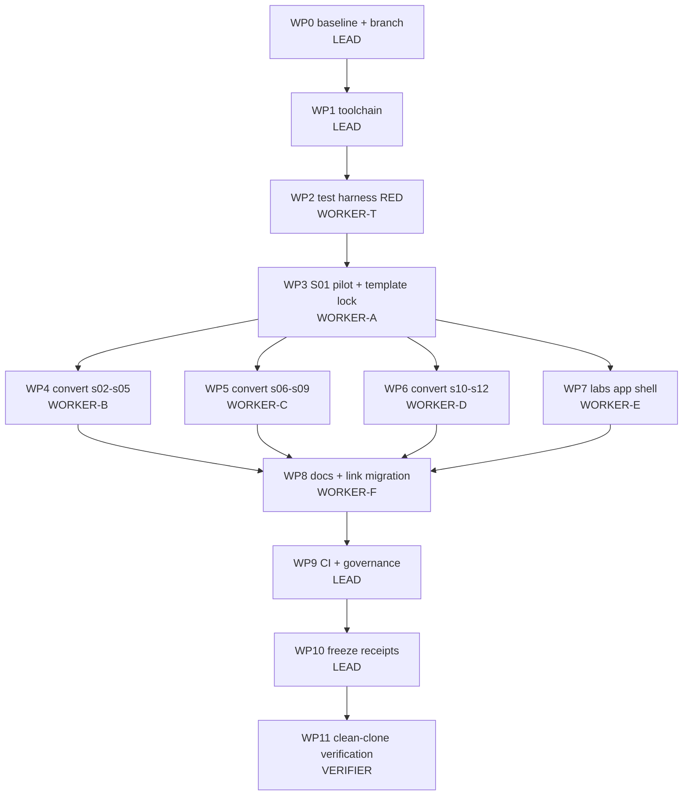

# Execution Plan 0001 — Retire Jupyter, adopt marimo, unify the lab interface

| Field | Value |
|---|---|
| **Status** | Ready to execute — revision 2 independently audited on 2026-09-17 |
| **Created** | 2026-09-17 |
| **Target repo** | `agent-harness-path` @ `main` (`ee43b13`) |
| **Execution branch** | `feat/marimo-migration` |
| **Plan branch** | `plan/marimo-migration` (this plan plus the previously requested contributor-mode `AGENTS.md`) |
| **Runtime decision** | marimo `==0.24.2` (see ADR-001) |
| **Work packages** | WP0 – WP11 |
| **Tool facts** | Empirically verified on marimo 0.24.2 / CPython 3.11.2 — see §2 |
| **Supersedes** | The prose migration sketch in the AGENTS.md "One interface" section |

---

## 0. How to execute this plan

### 0.1 Execution model

This plan is written for **one LEAD agent coordinating worker subagents under TDD**.
It contains no open questions that an executor is allowed to resolve by improvisation.
Where a genuine unknown remains it is listed in §13 with a named spike and a
pre-authorised decision rule.

| Role | Count | Responsibility |
|---|---|---|
| **LEAD** | 1 | Owns the branch, the DAG, dispatch, merge order, and the final gate. Edits only files in LEAD-scoped work packages. |
| **WORKER** | up to 4 concurrent | Executes exactly one work package inside its declared write scope. Never edits outside it. |
| **VERIFIER** | 1 | Runs WP11 from a clean checkout. Never writes source, fixtures or history; only reports. |

### 0.2 Hard rules for every agent

1. **Do not improvise.** If reality contradicts this plan, stop, record the
   contradiction verbatim, and escalate to LEAD. Do not "fix it and continue".
2. **TDD order is mandatory**: write the failing test (RED), capture its exact
   output, make the minimal change (GREEN), then run the package gate.
3. **A work package is complete only when its gate command exits 0** and the
   verbatim output is pasted into the handoff.
4. **Write scopes are disjoint and binding.** Two agents must never hold the same
   path. Touching a path outside your scope invalidates the package.
5. **Never `git push --force`, never rebase a pushed branch, never amend another
   agent's commit.**
6. **Never run `--live` against any provider.** No API key is required or
   permitted at any point in this migration.
7. **One conceptual change per commit**, Conventional-Commit prefix, session or
   package named in the subject.
8. If a gate fails three times on the same package, stop and escalate. Do not
   loosen the gate, do not add skips, do not delete assertions.
9. **Intermediate RED commits are permitted only in WP2.** WP2's package gate is
   a meta-test that proves the intended test fails for the intended reason and
   returns exit `0`. Every other package must end GREEN.
10. **Do not execute the migration from `main`.** The plan and its governing
    `AGENTS.md` are carried by `origin/plan/marimo-migration`; WP0 creates the
    execution branch from that exact remote branch.

### 0.3 The single source of truth for "is it done"

§12 defines one verification block. Nothing is done until that block is green.

### 0.4 User-requirement traceability

This table is the acceptance checklist for the planning task itself. It prevents
the implementation plan from satisfying its own technical preferences while
missing what was actually requested.

| ID | User requirement | Where satisfied | Planning-task proof |
|---|---|---|---|
| UR1 | Improve the earlier draft down to the last implementable detail | §5–§12 contain exact file scopes, commands, source templates, expected failures, gates and rollback | this document parses; all embedded Python compiles (§15) |
| UR2 | Leave no room for implementation choice | §6 canonical conventions; §8 work packages; §13 decision rules | every uncertainty has a stop condition or one authorised outcome |
| UR3 | Reconsider marimo and choose a better tool if warranted | ADR-001 (§1), scored alternatives, reversal criteria | marimo retained only after the empirical probes in §2 and official-source check in §1.7 |
| UR4 | Write the result to a Markdown file, not chat output | this file | tracked at `docs/plans/2026-09-17-marimo-migration.md` |
| UR5 | Make it executable by a lead model coordinating subagents | §7 DAG; §14 branches, worktrees, dispatch, handoff and integration order | disjoint parallel write sets and deterministic merge order |
| UR6 | Use TDD | §0.2, every WP in §8, full tests in §9 | RED reason, GREEN command and exit criterion are named per package |
| UR7 | Require independent validation | WP11 and §12 | clean-clone verifier cannot modify the feature branch |
| UR8 | Create a branch, commit and push the plan | `plan/marimo-migration` | remote branch is the canonical handoff point; planning commits are listed in §15 |

---

## 1. ADR-001 — Notebook runtime: marimo

### 1.1 Decision

Replace JupyterLab and the twelve `notebooks/*.ipynb` files with **marimo 0.24.2**
and twelve `notebooks/*.py` marimo notebooks. Present the optional hard path
(`labs/`) through a marimo app shell (`labs/app.py`) that wraps the unchanged
`labs/run.py` code path.

### 1.2 Requirements this repository actually imposes

| # | Requirement | Source |
|---|---|---|
| R1 | Zero network, zero keys, zero cost at learner runtime | `AGENTS.md` non-negotiable 2 |
| R2 | Course logic stdlib-only | `COURSE-MAP.md` session contract, rule 2 |
| R3 | Plain-text, git-diffable source, reviewable in a PR | `CONTRIBUTING.md` |
| R4 | Headless execution in CI with non-zero exit on failure | `.github/workflows/verify.yml` |
| R5 | No hidden execution state; out-of-order execution impossible | the flow complaint this migration answers |
| R6 | One interface across easy path and hard path | `AGENTS.md` "One interface" |
| R7 | Predict-first with a solution the learner cannot see by accident | `AGENTS.md` non-negotiable 3 |
| R8 | macOS + Linux, CPython 3.11 and 3.12 | `pyproject.toml`, CI matrix |
| R9 | Permissive licence, single dependency, no extra language toolchain | `LICENSE`, `LICENSES/` |
| R10 | Offline-readable lesson HTML must stay offline-readable | `AGENTS.md` layout notes |

### 1.3 Option scoring

Scale: 2 = fully satisfies, 1 = partial, 0 = fails.

| Option | R1 | R2 | R3 | R4 | R5 | R6 | R7 | R8 | R9 | R10 | Total |
|---|---|---|---|---|---|---|---|---|---|---|---|
| **marimo** | 2 | 2 | 2 | 2 | 2 | 2 | 2 | 2 | 2 | 2 | **20** |
| Jupyter + Jupytext (status quo +) | 2 | 2 | 2 | 2 | 0 | 0 | 1 | 2 | 1 | 2 | 14 |
| Quarto `.qmd` | 2 | 2 | 2 | 2 | 0 | 0 | 1 | 2 | 0 | 2 | 13 |
| Streamlit / Gradio / Panel app | 2 | 1 | 2 | 1 | 1 | 1 | 1 | 2 | 1 | 1 | 13 |
| Textual/Rich TUI over plain scripts | 2 | 2 | 2 | 2 | 2 | 2 | 1 | 2 | 1 | 0 | 16 |
| JupyterLite / WASM in the lesson page | 0 | 2 | 1 | 1 | 0 | 0 | 1 | 2 | 1 | 0 | 8 |
| Observable / Deepnote / Colab | 0 | 0 | 1 | 0 | 1 | 0 | 1 | 1 | 0 | 0 | 4 |

### 1.4 Why the runners-up lose

- **Jupytext** keeps the Jupyter kernel, therefore keeps hidden state and
  out-of-order execution (R5 = 0). It fixes diffability, which is not the
  complaint being answered.
- **Quarto** is a publishing toolchain, not a reactive runtime, and adds a
  non-Python binary dependency to a `uv`-only repository (R9 = 0).
- **Streamlit/Gradio/Panel** are app frameworks with no cell semantics; the
  predict-first, attempt-then-solution pedagogy would have to be re-invented as
  bespoke UI (R2/R7 degraded), and the top-to-bottom rerun model is its own kind
  of hidden state.
- **Textual TUI** scores well and is genuinely tempting for the labs, but it
  cannot render the lesson-adjacent prose/diagram experience (R10 = 0) and would
  mean hand-building a notebook UX from scratch.
- **WASM-in-lesson** breaks the offline guarantee (measured: §2 probe P11).

### 1.5 What marimo buys that Jupyter cannot

1. The notebook **is** a Python module: `python notebooks/s01_agent_loop_toy.py`
   executes it, so CI needs no `nbconvert` and the file is importable.
2. A cell's declared inputs are its function parameters, so ordinary dependency
   updates are explicit and stale *declared* dependencies are prevented (R5).
   Marimo cannot make hidden mutation or filesystem side effects safe by magic;
   §6.9 therefore forbids cross-cell mutable state except named teaching fixtures.
3. `mo.stop()` gives a **genuinely hidden** solution that still defines its
   symbols for downstream cells — strictly better than a `# SOLUTION` cell the
   learner can read by scrolling (R7, probe P9).
4. `mo.ui.*` widgets default to their declared value in script mode, so the same
   file is both an interactive app and a deterministic CI artefact (probe P8).
5. `marimo run labs/app.py` renders an app with code hidden — the same surface as
   the toys, satisfying R6 without a second UI stack.

### 1.6 Reversal criteria

Revert to the status quo (restore `.ipynb` from the pinned base) if, during WP3:

- the pilot fails its GREEN gate three consecutive times for the same reason,
  after the initial expected `_validate` RED, **or**
- preserving the predict-first contract requires rewriting the pedagogy of the
  session rather than its mechanics, **or**
- `marimo check --strict` (with the single documented ignore in §6.8) cannot be
  made green without disabling a correctness rule.

Reversal before WP3 is committed is exact:

```bash
git restore --source=HEAD --staged --worktree notebooks/s01_agent_loop_toy.ipynb
uv run python - <<'PY'
from pathlib import Path
for name in (
    "notebooks/s01_agent_loop_toy.py",
    "tests/fixtures/marimo-source-maps/s01.json",
):
    path = Path(name)
    if path.exists():
        path.unlink()
PY
git revert <WP2-commit-sha>
git revert <WP1-commit-sha>
```

If WP3 was already committed, revert WP3, WP2 and WP1 in that order. Replace
each SHA placeholder with the SHA recorded in its handoff. Do not restore from a
moving `main`; use the pinned commits.

### 1.7 Authoritative tool references (checked 2026-09-17)

These are the only external sources an executor should use if a marimo command
or semantic in this plan appears to have changed:

- Release `0.24.2` (published 2026-09-11):
  `https://github.com/marimo-team/marimo/releases/tag/0.24.2`
- Reactive execution and the multiple-definition rule:
  `https://docs.marimo.io/guides/reactivity/`
- Programmatic execution (`app.run()` / `python notebook.py`):
  `https://docs.marimo.io/guides/scripts/`
- CLI commands (`edit`, `run`, `convert`, `export`, `check`):
  `https://docs.marimo.io/api/cli/`
- Notebook tests:
  `https://docs.marimo.io/guides/testing/`
- Configuration:
  `https://docs.marimo.io/guides/configuration/`
- Security records establishing the `<0.23.15` floor:
  `https://nvd.nist.gov/vuln/detail/CVE-2026-75149` and
  `https://nvd.nist.gov/vuln/detail/CVE-2026-67618`

Do not silently adopt a newer release while executing this plan. A version bump
changes generated source and lint behavior; it is a separate PR under U2.

---

## 2. Verified environment facts

Everything below was **executed**, not assumed. Probe host: Debian 12,
CPython 3.11.2, marimo 0.24.2 installed from PyPI on 2026-09-17.
Re-run P1–P3 on the macOS host before WP1 (§WP0 step 4).

| # | Probe | Command | Observed result |
|---|---|---|---|
| P1 | Current release | `marimo --version` | `0.24.2` |
| P2 | Converter exists, writes a file | `marimo -q -y convert IN.ipynb -o OUT.py` | exit `0`, file written |
| P3 | Notebook is an executable module | `python OUT.py` | runs all cells topologically; exit `0` on success |
| P4 | Failure is loud | same, on a broken notebook | exit `1`, real traceback |
| P5 | **Underscore names are cell-private** | convert + run `s01` | `NameError: name '_validate' is not defined. Did you mean: '_cell_bkHC_validate'?` |
| P6 | Naive conversion is not sufficient | convert + run all 12 | **5 of 12 fail** (§5) |
| P7 | Duplicate globals are rejected | two cells defining `x` | `MultipleDefinitionError`, exit `1`; `marimo check` reports `multiple-definitions`, exit `1` |
| P8 | Widgets are deterministic headless | `mo.ui.switch(value=False).value` in script mode | `False`; script exits `0` |
| P9 | `mo.stop` gates output only | cell with `mo.stop(not reveal.value, ...)` | cell output suppressed, **downstream cells still run**, exit `0` |
| P10 | pytest collects notebook cells | `pytest t.py` on cells named `test_*` | `1 failed, 1 passed` — real collection, real assertions |
| P11 | **Static HTML export is NOT offline** | `marimo export html nb.py` | exit `0`, but **181 references to `https://cdn.jsdelivr.net/npm/@marimo-team/frontend@0.24.2/...`** (JS, fonts, icons) |
| P12 | Named cells are supported | `@app.cell def s01_attempt(...)` | runs; name is a stable identifier |
| P13 | Modern idioms available | `with app.setup:` + `@app.function` | both execute and are pytest-collectable |
| P14 | `__file__` is available | in `app.setup` **and** in a cell | resolves correctly in both |
| P15 | Project config is honoured | `[tool.marimo.save]` in `pyproject.toml` | `marimo config show` prints `📁 Project overrides from .../pyproject.toml` |
| P16 | A bare `marimo.toml` in CWD is **not** picked up | `marimo config show` | only user config shown — **use `pyproject.toml`** |
| P17 | `marimo check --strict` on converted toys | `marimo check --strict .` | exit `1`, **17 × `MF004 empty-cells`**, all on intentional ATTEMPT/PREDICT comment-only cells |
| P18 | `marimo check` misses private-name breaks | `marimo check s01.py` (broken file) | exit `0` — **the linter is not a substitute for execution** |
| P19 | Security floor | marimo advisories | `< 0.23.15` affected by CVE-2026-75149 / CVE-2026-67618; `0.24.2` is above the floor |
| P20 | The plan's own static detector is exact | `bound_names`/`loaded_names` from §9.1 run over all 12 converted files | reports precisely the 5 files execution proves broken, 10 symbols, **zero false positives** |
| P21 | `edit`/`run` performs an update check unless disabled | inspected marimo 0.24.2 `_cli/cli.py` and launched a local editor | every learner-facing server command sets `MARIMO_SKIP_UPDATE_CHECK=1`; notebook script execution also runs behind the no-network site hook |

**Two facts drive the whole plan**: P5/P6 (conversion is a refactor, not a
transcode) and P18 (only execution proves correctness).

---

## 3. Scope fence

**In scope:** notebook runtime swap, cell-level refactor required by that swap,
lab app shell, tests, CI, and every textual reference to `.ipynb`.

**Explicitly out of scope** — do not touch, do not "improve while you are there":

| Out of scope | Reason |
|---|---|
| Domain re-theme (trivia → anything) | Separate decision, taken **after** this lands (§14.6) |
| Lesson prose, arc, hooks, transitions | Separate work package in a later plan |
| `lessons/build.py`, `template.html`, diagrams, SVGs | Unaffected by the runtime swap |
| `labs/run.py`, `labs/client.py`, `labs/trivia_host/`, `labs/reference/`, cassettes | The CI contract must stay byte-identical |
| S13/S14 protocols | They have no notebook by design |
| Embedding notebooks into lesson HTML | Rejected for now: probe P11 breaks offline reading |
| Adding pytest to required dependencies | Assertions already fail the script run; pytest stays an optional, exactly pinned dependency group |
| Rewriting historical release/evidence records | `docs/releases/` and `docs/verification/` describe artifacts that actually existed; changing their `.ipynb` references would falsify evidence |

---

## 4. Invariant register

Each invariant has exactly one guarding test. If a change trips one of these, the
change is wrong — not the invariant.

| ID | Invariant | Guard |
|---|---|---|
| I1 | Exactly 12 toy notebooks exist, named `sNN_*_toy.py` | `test_exactly_twelve_notebooks` |
| I2 | No `.ipynb` file remains tracked as current course material | `test_no_current_ipynb_files_remain` |
| I3 | No current operational document, lesson, bridge, workflow or issue template points learners at Jupyter/`.ipynb`; immutable release/evidence history may describe it | both `DocumentationReferences.test_no_stale_jupyter_references_*` tests |
| I4 | Course logic imports stdlib only; `marimo` is the sole exception | `test_imports_are_stdlib_only_plus_marimo` |
| I5 | No network-capable module is imported by any toy | `test_no_network_modules` |
| I6 | Every cell is uniquely named and follows the naming scheme | `test_cells_are_named_and_unique` |
| I7 | No cross-cell dependency on a `_`-private name | `test_no_cross_cell_private_dependencies` |
| I8 | Attempt cells remain unanswered and contain no solution | `test_attempt_cells_are_unanswered` |
| I9 | Every original cell ID is accounted for in order, and all final executable units (setup, app functions and cells, including decorators) match receipts | `test_original_cell_ids_are_accounted_for`, `test_executable_unit_receipts_match` |
| I10 | Every notebook executes headless, exit 0, under 120 s | `test_every_notebook_executes` |
| I11 | The lab app never references a credential and defaults to replay | `test_app_shell_is_replay_first`, `test_app_shell_has_no_credential_strings` |
| I12 | `labs/run.py --all --replay` output is unchanged by this migration | existing CI step + `labs/test_contracts.py` |
| I13 | Generated lesson HTML is regenerated and drift-free | existing `git diff --exit-code -- lessons` |
| I14 | Only `MF004` is suppressed in `marimo check`, and only on predict/attempt cells | `test_comment_only_cells_are_intentional`, `test_ci_has_exactly_one_marimo_ignore` |
| I15 | Headless execution attempts no outbound network connection | `tests/no_network_site/sitecustomize.py` + `test_every_notebook_executes` |
| I16 | Migration does not alter the lesson concepts, lab runner, host, reference implementation or cassettes | original-cell mapping + unchanged-path diff gates in WP7/WP11 |

---

## 5. Per-notebook defect inventory

Produced by converting all twelve notebooks and executing each one (probe P6),
then cross-checked with the static detector shipped in §9.1
(`test_no_cross_cell_private_dependencies`).

**The two columns agree on all twelve files** — the detector was tuned until it
reported exactly the set that execution proves broken, with no false positives.
That agreement is itself a verified result (probe P20): the static test gives a
fast RED signal and execution confirms it.

| Notebook | A: execution after naive convert | B: `_`-private names read across cells |
|---|---|---|
| `s01_agent_loop_toy` | **FAIL** `NameError: _validate` | `_reply`, `_tool_call`, `_validate` |
| `s02_scripted_user_eval_toy` | PASS | — |
| `s03_context_engineering_toy` | **FAIL** `NameError: _AMENITIES` | `_AMENITIES` |
| `s04_structured_generation_toy` | **FAIL** `NameError: _wo` | `_wo` |
| `s05_consent_gate_toy` | PASS | — |
| `s06_layered_detection_toy` | PASS | — |
| `s07_repair_loop_toy` | PASS | — |
| `s08_observability_replay_toy` | PASS | — |
| `s09_evidence_report_toy` | PASS | — |
| `s10_error_analysis_toy` | PASS | — |
| `s11_budgets_routing_toy` | **FAIL** `NameError: _summarize_usage` | `_resp`, `_summarize_usage` |
| `s12_judge_calibration_toy` | **FAIL** `NameError: _extract_allergen` | `_critic_response`, `_extract_allergen`, `_judge_response` |

Total: **5 hard failures, 7 clean**, 10 symbols to move, 17 `MF004` lint warnings
spread across the set.

### 5.1 The fix, stated once

A `_name` defined in cell A and read in cell B must become one of:

| Situation | Fix |
|---|---|
| Shared helper function used by 2+ cells | Move to `@app.function` (top-level, no underscore) |
| Shared constant / import used by 2+ cells | Move into the `with app.setup:` block |
| Genuinely cell-local scratch value | Keep the `_` prefix, keep it inside its own cell |
| Demo value the next cell inspects | Rename to a public `sNN_`-free descriptive name and return it |

Never "fix" a break by deleting the second use or by collapsing two cells that
teach two different things.

---

## 6. Canonical conventions — zero degrees of freedom

### 6.1 File naming

`notebooks/sNN_<snake_topic>_toy.py`, `NN` ∈ `01..12`, byte-identical stem to the
current `.ipynb`. No other files may be tracked in `notebooks/`; ignored local
artifacts such as `__pycache__/` and `.DS_Store` do not fail the inventory.

### 6.2 Required file skeleton

Every notebook is exactly this shape, in this order:

```python
import marimo

__generated_with = "0.24.2"
app = marimo.App(width="medium")

with app.setup:
    # stdlib imports and shared constants ONLY
    import json

@app.function
def shared_helper(x):          # only if 2+ cells need it
    ...

@app.cell
def sNN_imports():
    import marimo as mo
    return (mo,)

# ... content cells ...

if __name__ == "__main__":
    app.run()
```

Rules: `width="medium"` on every notebook. `__generated_with` must equal the
pinned marimo version. The `mo` import lives in its own cell named `sNN_imports`.
Functions decorated with `@app.function` are module globals: cells call them
directly and do **not** list them as cell parameters. Only values returned by an
`@app.cell` appear as parameters of dependent cells.

### 6.3 Cell naming scheme (enforced by I6)

Regex: `^(test_)?s(0[1-9]|1[0-2])_[a-z0-9]+(_[a-z0-9]+)*$`

| Cell purpose | Name form | Decorator |
|---|---|---|
| Imports | `sNN_imports` | `@app.cell` |
| Narrative markdown | `sNN_md_<topic>` | `@app.cell(hide_code=True)` |
| Predict-first prompt | `sNN_predict_<topic>` | `@app.cell(hide_code=True)` |
| Demonstration / experiment | `sNN_demo_<topic>` | `@app.cell` |
| Learner attempt skeleton | `sNN_attempt_<topic>` | `@app.cell` |
| Reveal switch | `sNN_reveal_<topic>` | `@app.cell(hide_code=True)` |
| Reference solution definition | `sNN_solution_<topic>` | `@app.cell(hide_code=True)` |
| Gated solution rendering | `sNN_reveal_source_<topic>` | `@app.cell(hide_code=True)` |
| In-notebook assertion | `test_sNN_<claim>` | `@app.cell` |

`def _(` is **forbidden** anywhere in `notebooks/`. Names are unique per file.

### 6.4 The underscore rule

> A leading underscore means **cell-private** in marimo. Never read a `_name`
> from another cell. (Probe P5.)

### 6.5 Predict-first + attempt + hidden solution — the canonical template

This replaces the Jupyter "attempt cell then `# SOLUTION` cell" pattern, and is
strictly stronger: the solution is not visible until the learner asks for it,
while still being defined for the comparison harness.

```python
@app.cell(hide_code=True)
def s01_predict_tool_results(mo):
    mo.md(r"""
    **Predict first:** the assistant requested two lookups. Write down, before you
    run anything, the roles, the IDs and the content fields your result records
    need — and whether `ordinary_explanation` requires a tool result at all.
    """)
    return


@app.cell
def s01_attempt_tool_results():
    def attempt_tool_results(weather_calls):
        proposed_results = []  # Your attempt; do not change weather_calls to hide a missing result.
        return proposed_results
    return (attempt_tool_results,)


@app.cell(hide_code=True)
def s01_reveal_tool_results(mo):
    reveal_tool_results = mo.ui.switch(
        value=False, label="Reveal the reference solution (after your attempt)"
    )
    reveal_tool_results
    return (reveal_tool_results,)


@app.cell(hide_code=True)
def s01_solution_tool_results():
    def solution_tool_results(weather_calls):
        return [
            {"role": "tool", "tool_call_id": call["id"], "content": "..."}
            for call in weather_calls
        ]
    return (solution_tool_results,)


@app.cell(hide_code=True)
def s01_reveal_source_tool_results(mo, inspect, reveal_tool_results, solution_tool_results):
    mo.stop(
        not reveal_tool_results.value,
        mo.md("*Solution hidden. Flip the switch once you have run your attempt.*"),
    )
    mo.md("```python\n" + inspect.getsource(solution_tool_results) + "```")
    return


@app.cell
def s01_demo_compare(attempt_tool_results, solution_tool_results, weather_calls):
    supplied = attempt_tool_results(weather_calls)
    if not supplied:
        print("Attempt pending: supply result records and explain your reasoning "
              "before comparing the reference.")
    else:
        requested = {call["id"] for call in weather_calls}
        print("Covered IDs:", sorted({r["tool_call_id"] for r in supplied}))
        print("Uncovered IDs:", sorted(requested - {r["tool_call_id"] for r in supplied}))
    return
```

Load-bearing details, all verified:

- `mo.stop` suppresses **only that cell's** output; `solution_tool_results` is
  still defined for the comparison cell (probe P9).
- In script/CI mode `reveal_*.value` is `False`, so CI exercises the pristine
  attempt path and exits 0 (probe P8).
- The literal strings `proposed_results = []`, `Attempt pending` and (for S02)
  `return None` **must survive** — `tests/test_marimo_notebooks.py` asserts them,
  inherited from the retired `tests/test_pilot_notebooks.py`.
- `inspect` is imported in the `app.setup` block.

### 6.6 In-notebook assertions

Each notebook carries **at least two** `test_sNN_*` cells asserting the session's
central mechanical claim. They run as ordinary cells (so `python notebooks/sNN_*_toy.py` fails on a
regression) and are additionally collectable by pytest (probe P10).

### 6.7 Import policy (I4, I5)

- Allowed: any module in `sys.stdlib_module_names`, plus `marimo`.
- Denied outright, even though stdlib: `socket`, `ssl`, `http`, `urllib`,
  `ftplib`, `smtplib`, `poplib`, `imaplib`, `telnetlib`, `xmlrpc`, `webbrowser`,
  `subprocess`, `ctypes`, `multiprocessing`.
- Rationale: R1 is enforced structurally, not by trust. The current toys import
  only `itertools, json, random, statistics, copy, re, pathlib, contextlib,
  datetime, difflib, hashlib, tempfile, time, collections, textwrap` — all allowed.

### 6.8 Lint policy (I14)

Gate command: `uv run marimo check --strict --ignore MF004 notebooks labs/app.py`

`MF004` (`empty-cells`) is the **only** suppressed rule. Justification: 17 of the
repository's attempt/predict cells are deliberately comment-only — that is the
predict-first pedagogy, not dead code (probe P17). The loophole is closed by
`test_comment_only_cells_are_intentional`, which requires every comment-only cell
to be named `sNN_predict_*` or `sNN_attempt_*`. No other `--ignore` may be added
without amending this section.

### 6.9 Side effects and mutable state

Marimo prevents stale declared dependencies; it does not make mutation,
wall-clock reads or filesystem writes deterministic. Apply these rules exactly:

1. `with app.setup:` may contain imports, immutable constants and pure lookup
   fixtures. It may not contain a mutable list/dict/set that a cell changes.
2. A stateful teaching fixture (for example S08's mock-call counter) stays
   encapsulated in the single cell or factory that owns it. It is reset at the
   start of every demonstration and assertion cell that depends on its value.
3. No cell writes beneath `ROOT`, `notebooks/` or `labs/`. S08 writes only under
   `tempfile.TemporaryDirectory()` and asserts cleanup before the cell returns.
4. Time, random and temporary-path behavior remains seeded or normalised exactly
   as in the source notebook. Do not replace it with a marimo widget value.
5. A cell whose only effect is display returns nothing. A cell whose output is
   consumed returns one explicit tuple entry per dependency.

### 6.10 Original-cell identity and migration-added units

The existing `tests/fixtures/original-notebook-cells.json` is **not deleted**. It
is immutable pre-migration evidence. WP2 also freezes all 281 current cells in
`tests/fixtures/pre-marimo-cell-index.json`.

Each converted notebook gets one sidecar:
`tests/fixtures/marimo-source-maps/sNN.json`. Exact schema:

```json
{
  "source": "notebooks/s01_agent_loop_toy.ipynb",
  "target": "notebooks/s01_agent_loop_toy.py",
  "cells": [
    {
      "id": "daf60494",
      "cell_type": "markdown",
      "targets": ["cell:s01_md_intro"]
    }
  ],
  "migration_added": [
    {
      "target": "cell:s01_reveal_tool_results",
      "reason": "reveal-control"
    }
  ]
}
```

Rules:

- `cells` contains every pre-migration cell exactly once and in the exact order
  stored in `pre-marimo-cell-index.json`.
- `cell_type` is byte-equal to the pre-migration index.
- `targets` is non-empty. Unit names use `setup`, `function:<name>` or
  `cell:<name>`, exactly as `executable_units()` in §9.1 emits.
- A source cell split for marimo may list multiple targets. Two source cells may
  not claim the same target, except `setup`, because imports from several source
  cells may be consolidated there.
- Every final executable unit appears either in one source cell's `targets` or
  in `migration_added`; no unit is unaccounted for.
- `migration_added.reason` is exactly one of `reveal-control`,
  `solution-renderer`, `assertion`, `imports`, `dependency-fix`.
- A migration-added target cannot also be claimed by a source cell.
- Source maps are written by the worker that owns the corresponding notebook;
  their write scopes are disjoint. The final receipt test separately hashes the
  complete executable source, including decorators.

---

## 7. Work-package DAG



| WP | Title | Owner | Write scope (exclusive) | Parallel with |
|---|---|---|---|---|
| WP0 | Baseline + branch | LEAD | — (read only) | — |
| WP1 | Toolchain swap | LEAD | `pyproject.toml`, `uv.lock`, `.gitignore` | — |
| WP2 | Test harness (RED) | WORKER-T | `tests/test_marimo_notebooks.py`, `tests/test_marimo_execution.py`, `tests/no_network_site/sitecustomize.py`, `scripts/gen_marimo_receipts.py`, `tests/fixtures/pre-marimo-cell-index.json`; delete only `tests/test_pilot_notebooks.py` | — |
| WP3 | S01 pilot, template lock | WORKER-A | `notebooks/s01_agent_loop_toy.py`, delete its `.ipynb`, create `tests/fixtures/marimo-source-maps/s01.json` | — |
| WP4 | Convert S02–S05 | WORKER-B | the four matching `notebooks/s0[2-5]_*_toy.py` files; delete their four `.ipynb` sources; create `tests/fixtures/marimo-source-maps/s02.json`–`s05.json` | WP5, WP6, WP7 |
| WP5 | Convert S06–S09 | WORKER-C | the four matching `notebooks/s0[6-9]_*_toy.py` files; delete their four `.ipynb` sources; create `tests/fixtures/marimo-source-maps/s06.json`–`s09.json` | WP4, WP6, WP7 |
| WP6 | Convert S10–S12 | WORKER-D | the three matching `notebooks/s1[0-2]_*_toy.py` files; delete their three `.ipynb` sources; create `tests/fixtures/marimo-source-maps/s10.json`–`s12.json` | WP4, WP5, WP7 |
| WP7 | Lab app shell | WORKER-E | `labs/app.py`, `labs/test_contracts.py`, `labs/README.md` | WP4, WP5, WP6 |
| WP8 | Docs + links | WORKER-F | `README.md`, `CONTRIBUTING.md`, `COURSE-MAP.md`, `study/FULL-COURSE.md`, `lessons/src/*.md`, generated `lessons/*.html`, `lessons/README.md`, `bridges/*.md`, `docs/COMPANION.md`, `docs/RELEASING.md`, `.github/ISSUE_TEMPLATE/*.yml` | — |
| WP9 | CI + governance | LEAD | `.github/workflows/verify.yml`, `AGENTS.md`, `CHANGELOG.md` | — |
| WP10 | Freeze receipts | LEAD | `tests/fixtures/marimo-executable-receipts.json` | — |
| WP11 | Independent final gate | VERIFIER | **none (read-only clean clone)** | — |

### 7.1 Exact branch, worktree and integration protocol

The LEAD uses Git worktrees; workers never share a working directory.

**Initial execution branch (WP0):**

```bash
git fetch origin --prune
git switch plan/marimo-migration
git pull --ff-only origin plan/marimo-migration
test -z "$(git status --porcelain)"
git switch -c feat/marimo-migration
git push -u origin feat/marimo-migration
```

**WP1:** LEAD executes directly on `feat/marimo-migration`, commits, runs its
gate, and pushes.

**Sequential worker packages WP2 and WP3:** use one worktree at a time:

```bash
PARENT="$(cd .. && pwd)"

WP1_BASE="$(git rev-parse feat/marimo-migration)"
git worktree add "$PARENT/ahp-wp2" -b work/marimo-wp2 "$WP1_BASE"
# dispatch WP2; validate handoff
git switch feat/marimo-migration
git merge --no-ff work/marimo-wp2 -m "merge: integrate WP2 marimo TDD contracts"
git worktree remove "$PARENT/ahp-wp2"
git branch -d work/marimo-wp2
git push

WP2_BASE="$(git rev-parse feat/marimo-migration)"
git worktree add "$PARENT/ahp-wp3" -b work/marimo-wp3 "$WP2_BASE"
# dispatch WP3; validate the pilot and manual checkpoint
git switch feat/marimo-migration
git merge --no-ff work/marimo-wp3 -m "merge: integrate WP3 S01 marimo pilot"
git worktree remove "$PARENT/ahp-wp3"
git branch -d work/marimo-wp3
git push
```

WP3's manual checkpoint happens in `$PARENT/ahp-wp3` before its merge.

**Parallel WP4–WP7:** after WP3 is committed and pushed, LEAD records:

```bash
PARENT="$(cd .. && pwd)"
WP3_BASE="$(git rev-parse feat/marimo-migration)"
git worktree add "$PARENT/ahp-wp4" -b work/marimo-wp4 "$WP3_BASE"
git worktree add "$PARENT/ahp-wp5" -b work/marimo-wp5 "$WP3_BASE"
git worktree add "$PARENT/ahp-wp6" -b work/marimo-wp6 "$WP3_BASE"
git worktree add "$PARENT/ahp-wp7" -b work/marimo-wp7 "$WP3_BASE"
```

Dispatch one worker per worktree and write scope. A worker commits locally but
does not push. After all four handoffs pass §14.3, LEAD integrates in this exact
order:

```bash
git switch feat/marimo-migration
git merge --no-ff work/marimo-wp4 -m "merge: integrate WP4 marimo ports for S02-S05"
git merge --no-ff work/marimo-wp5 -m "merge: integrate WP5 marimo ports for S06-S09"
git merge --no-ff work/marimo-wp6 -m "merge: integrate WP6 marimo ports for S10-S12"
git merge --no-ff work/marimo-wp7 -m "merge: integrate WP7 marimo lab shell"
uv run python -m unittest \
  tests.test_marimo_notebooks.Inventory \
  tests.test_marimo_notebooks.Structure \
  tests.test_marimo_notebooks.SourceIdentity \
  tests.test_marimo_notebooks.Safety \
  tests.test_marimo_notebooks.Pedagogy \
  labs.test_contracts -v
set -e
for notebook in notebooks/s*_toy.py; do
  PYTHONPATH="$PWD/tests/no_network_site${PYTHONPATH:+:$PYTHONPATH}" \
    MARIMO_SKIP_UPDATE_CHECK=1 uv run python "$notebook" > /dev/null
done
git push
```

A merge conflict = stop and reject the affected handoff; disjoint scopes mean a
conflict indicates scope violation or a wrong base. Do not resolve it ad hoc.

After integration:

```bash
git worktree remove "$PARENT/ahp-wp4"
git worktree remove "$PARENT/ahp-wp5"
git worktree remove "$PARENT/ahp-wp6"
git worktree remove "$PARENT/ahp-wp7"
git branch -d work/marimo-wp4 work/marimo-wp5 work/marimo-wp6 work/marimo-wp7
```

Use ordinary `git worktree remove` only after clean worker status is confirmed.
Never use `--force`; uncommitted worker changes require investigation.

**WP8:** after removing the four prior worktrees, create and integrate exactly:

```bash
PARENT="$(cd .. && pwd)"
POST_WP7_BASE="$(git rev-parse feat/marimo-migration)"
git worktree add "$PARENT/ahp-wp8" -b work/marimo-wp8 "$POST_WP7_BASE"
# dispatch WP8 in $PARENT/ahp-wp8; validate its handoff before continuing
git switch feat/marimo-migration
git merge --no-ff work/marimo-wp8 -m "merge: integrate WP8 marimo documentation"
git worktree remove "$PARENT/ahp-wp8"
git branch -d work/marimo-wp8
git push
```

**WP9–WP10:** LEAD works directly on the
feature branch. **WP11:** VERIFIER uses a fresh clone and makes no commits.

---

## 8. Work packages

Every package follows the same contract:

**Preconditions → RED → GREEN → Gate → Commit → Handoff.**
A package that cannot reach its gate is escalated, never partially merged.

### WP0 — Baseline and branch (LEAD)

**Objective:** prove the tree is green *before* any change, so every later failure
is attributable.

```bash
cd /path/to/agent-harness-path
git fetch origin --prune
git switch plan/marimo-migration
git pull --ff-only origin plan/marimo-migration
test -z "$(git status --porcelain)"         # MUST exit 0
git switch -c feat/marimo-migration
git push -u origin feat/marimo-migration

BASE_MAIN=ee43b13
test "$(git merge-base HEAD origin/main)" = "$BASE_MAIN"

command -v git
command -v uv
command -v gh
git lfs version
gh auth status

uv sync --frozen
uv run python -c 'import sys; assert sys.version_info[:2] in {(3, 11), (3, 12)}, sys.version'
uv run python -m unittest discover -s tests -v
uv run python -m unittest labs/test_contracts.py
uv run python labs/run.py --all --replay
uv run python lessons/build.py && git diff --exit-code -- lessons
uv run python lessons/check_links.py
uv run python lessons/check_sota_urls.py
for nb in notebooks/s*.ipynb; do
  uv run jupyter nbconvert --to notebook --execute --stdout "$nb" > /dev/null || echo "BASELINE FAIL $nb"
done
```

**Step 4 — re-verify the probe facts on this host** (they were measured on Linux):

```bash
uv run --with marimo==0.24.2 marimo --version        # expect 0.24.2
uv run --with marimo==0.24.2 marimo convert notebooks/s01_agent_loop_toy.ipynb -o /tmp/p_s01.py
uv run --with marimo==0.24.2 python /tmp/p_s01.py ; echo "expect exit 1 (NameError _validate): $?"
```

**Gate:** every baseline command exits 0 and the probe reproduces `exit 1`.
**Escalate if:** the baseline is already red, or the probe passes (meaning the
`.ipynb` differs from what this plan measured — re-run §5 before continuing).
Do not "repair" a pre-existing baseline failure inside this migration.
**Handoff:** baseline log, `BASE_MAIN`, feature-branch remote tracking line, and
confirmed marimo version.

---

### WP1 — Toolchain swap (LEAD)

**Write scope:** `pyproject.toml`, `uv.lock`, `.gitignore`.

**Step 0 (RED).** Before editing:

```bash
set +e
uv run marimo --version > /tmp/wp1-red.txt 2>&1
WP1_RED=$?
set -e
test "$WP1_RED" -ne 0
```

This proves the repository does not yet provide its declared notebook runtime.

**Step 1.** In `pyproject.toml`, replace the dependency line and its comment:

```toml
# Dependencies are tooling only: `marimo` runs the toy notebooks, `markdown`
# renders the lessons/ HTML. Course logic inside notebooks/ stays Python standard
# library only (COURSE-MAP.md session contract, rule 2); `marimo` is the notebook
# runtime itself — the direct analogue of the Jupyter kernel it replaces.
dependencies = ["marimo==0.24.2", "markdown>=3.5"]
```

Pin with `==`: marimo stamps `__generated_with = "<version>"` into every notebook,
so a floating range produces spurious diffs and `marimo check` formatting warnings.
`0.24.2` also clears the `< 0.23.15` security floor (probe P19).

**Step 2.** Add the marimo table, then add `test` **inside the existing**
`[dependency-groups]` table. Do not create a second table with the same name.
After the edit, the relevant tail of `pyproject.toml` is exactly:

```toml
[tool.marimo.save]
autosave = "after_delay"
autosave_delay = 1000
format_on_save = false

[dependency-groups]
diagrams = [
    "playwright==1.58.0",
]
test = [
    "pytest==9.1.1",
]
```

The explicit one-second autosave is a course-experience decision: learner
attempts should survive without a manual save ritual. `format_on_save = false`
prevents a learner's small edit from reformatting unrelated source. Merely
opening and closing must remain byte-neutral; M1 tests that property. Receipts
are a contributor/CI guard, not a reason to make learner work easy to lose.
Project overrides work only from `pyproject.toml` (P15/P16).
`pytest` is optional tooling, used only for the redundant explicit-cell gate.

**Step 3.** `.gitignore`: retain all existing lines (including
`.ipynb_checkpoints/` and `.jupyter/`, which continue to suppress local debris
from old clones) and append:

```
__marimo__/
.marimo.toml
```

**Step 4.**

```bash
uv lock && uv sync
uv run marimo --version          # expect: 0.24.2
uv run marimo config show | grep -F "Project overrides from" | grep -F "pyproject.toml"
uv run --group test pytest --version  # expect: pytest 9.1.1
```

**Gate:** all commands as expected; `git diff --stat` touches only the three files;
`uv sync --frozen` succeeds after `uv.lock` is written.
**Commit:** `build: replace jupyterlab with marimo 0.24.2 as the notebook runtime`

---

### WP2 — Test harness, RED first (WORKER-T)

**Write scope:** `tests/test_marimo_notebooks.py`, `tests/test_marimo_execution.py`,
`tests/no_network_site/sitecustomize.py`, `scripts/gen_marimo_receipts.py`;
`tests/fixtures/pre-marimo-cell-index.json`; delete
`tests/test_pilot_notebooks.py`. Keep
`tests/fixtures/original-notebook-cells.json` byte-identical as migration evidence.

**Step 1 (RED).** Create the four files exactly as specified in §9. Before any
`.ipynb` is deleted, generate the immutable all-cell index with:

```bash
uv run python - <<'PY'
import hashlib
import json
from pathlib import Path

index = {}
for path in sorted(Path("notebooks").glob("s*_toy.ipynb")):
    notebook = json.loads(path.read_text(encoding="utf-8"))
    index[path.as_posix()] = [
        {
            "id": cell["id"],
            "cell_type": cell["cell_type"],
            "cell_sha256": hashlib.sha256(
                json.dumps(
                    cell, sort_keys=True, separators=(",", ":"), ensure_ascii=False
                ).encode("utf-8")
            ).hexdigest(),
        }
        for cell in notebook["cells"]
    ]
Path("tests/fixtures/pre-marimo-cell-index.json").write_text(
    json.dumps(index, indent=2, ensure_ascii=False) + "\n", encoding="utf-8"
)
PY
```

Assert it contains twelve notebook keys and **281** cell records before
continuing:

```bash
uv run python - <<'PY'
import json
from pathlib import Path
d = json.loads(Path("tests/fixtures/pre-marimo-cell-index.json").read_text())
assert len(d) == 12, len(d)
assert sum(map(len, d.values())) == 281, sum(map(len, d.values()))
PY
```

Do **not**
create any `notebooks/*.py` yet.

**Step 2.** Run one deliberately selected RED test and make the shell itself
green only if the failure is the expected failure:

```bash
set +e
RED_OUTPUT="$(
  uv run python -m unittest \
    tests.test_marimo_notebooks.Inventory.test_exactly_twelve_notebooks -v 2>&1
)"
RED_STATUS=$?
set -e
printf '%s\n' "$RED_OUTPUT"
test "$RED_STATUS" -eq 1
printf '%s\n' "$RED_OUTPUT" | grep -F "AssertionError: 0 != 12"
```

Expected command status: `0` overall because the final two assertions prove that
the underlying unittest exited `1` with `AssertionError: 0 != 12`. This is the
only intermediate RED that may be committed.

**Step 3.** Remove the superseded Jupyter-era guards:

```bash
git rm tests/test_pilot_notebooks.py
```

Their three contracts are carried forward by, respectively,
`test_each_file_declares_a_marimo_app` (kernel/format),
`test_executable_unit_receipts_match` (final receipts),
`test_original_cell_ids_are_accounted_for` (migration identity)
and `test_attempt_cells_are_unanswered` (attempt purity).
**No contract is dropped.**

**Step 4.** Run the unaffected suite explicitly:

```bash
uv run python -m unittest \
  tests.test_lesson_build tests.test_transfer labs.test_contracts -v
```

**Gate:** Step 2's meta-test and Step 4 both exit `0`. Do not run full discovery
as a package gate here: final inventory, documentation and receipt tests are
intentionally RED until WP8/WP10.
**Commit:** `test: add marimo notebook contracts (red) and retire the ipynb test harness`

---

### WP3 — S01 pilot and template lock (WORKER-A)

This is the **decision package**. The template it produces is copied verbatim by
WP4–WP6; get it wrong and the error is multiplied twelve times.

**Write scope:** `notebooks/s01_agent_loop_toy.py`, `notebooks/s01_agent_loop_toy.ipynb`.

**Step 1 — mechanical conversion:**

```bash
uv run marimo -q -y convert notebooks/s01_agent_loop_toy.ipynb -o notebooks/s01_agent_loop_toy.py
uv run python notebooks/s01_agent_loop_toy.py ; echo "exit=$?"
```

Expected: `exit=1`, `NameError: name '_validate' is not defined`. Confirms §5.

**Step 2 — de-underscore refactor.** For `_reply`, `_tool_call`, `_validate`:
apply §5.1. All three are shared helpers of the mock model, so all three move to
the top of the file as `@app.function` definitions named `reply`, `tool_call`,
`validate_messages` (rename `_validate` → `validate_messages`: `validate` alone is
too generic for a module-level name). Move `import json` into `with app.setup:`.
Remove `itertools` and the mutable `_ids` counter. Make tool IDs deterministic:
`mock_model(messages)` computes
`call_number = 1 + sum(len(m.get("tool_calls") or []) for m in messages if m["role"] == "assistant")`
and calls `tool_call(name, args, f"call_{call_number}")`. The `tool_call`
signature is exactly `(name, args, call_id)`. This preserves the API shape while
removing cross-run hidden state (§6.9).

**Step 3 — preserve identity and name every cell.** Name every cell per §6.3 and
replace all `def _(` occurrences. Create
`tests/fixtures/marimo-source-maps/s01.json` per §6.10; its `cells` array maps all
17 S01 source cells in order, including `s01-attempt-prompt` and
`s01-attempt-code`. Create the directory first with
`mkdir -p tests/fixtures/marimo-source-maps`.

**Step 4 — restructure the attempt/solution pair** into the §6.5 template. Preserve
verbatim: `proposed_results = []`, the `Attempt pending:` sentence, and the
"do not change weather_calls" comment.

**Step 5 — add assertion cells.** Minimum two, named `test_s01_*`:

```python
@app.cell
def test_s01_orphaned_tool_result_is_rejected():
    try:
        validate_messages([{"role": "tool", "tool_call_id": "nope", "content": "{}"}])
    except ValueError as exc:
        assert "orphaned tool result nope" in str(exc)
        pass
    else:
        raise AssertionError("an orphaned tool result was accepted")
    return
```

The second assertion cell is exactly:

```python
@app.cell
def test_s01_loop_pairs_call_and_result_and_terminates():
    answer, messages, turns = run_loop("What's the weather in Madrid?")
    assert turns == 2
    assert answer == "Based on the tool: 22C, sunny"
    assert [m["role"] for m in messages] == ["user", "assistant", "tool", "assistant"]
    assert messages[1]["tool_calls"][0]["id"] == messages[2]["tool_call_id"]
    return
```

Do not weaken the S01 teaching point: the mock performs **one** check, not full
protocol validation.

**Step 6 — the intentionally broken variants stay broken.** `AGENTS.md` security
note: S01 demonstrates unsafe patterns inside labelled experiments. Converting
them to marimo must not repair them. If a broken variant now raises at *import*
time rather than inside its experiment cell, wrap the call — never the defect —
in `try/except` and print the failure.

**Step 7 — gate:**

```bash
uv run python notebooks/s01_agent_loop_toy.py            # exit 0
uv run marimo check --strict --ignore MF004 notebooks/s01_agent_loop_toy.py
uv run python -m unittest \
  tests.test_marimo_notebooks.SourceIdentity.test_remaining_ipynb_sources_match_the_frozen_index -v
git rm notebooks/s01_agent_loop_toy.ipynb
uv run python -m unittest \
  tests.test_marimo_notebooks.Structure \
  tests.test_marimo_notebooks.Safety \
  tests.test_marimo_notebooks.Pedagogy \
  tests.test_marimo_notebooks.SourceIdentity -v
```

Run the four unittest classes **after** `git rm`; they validate every converted
`.py` currently present but deliberately do not require all twelve files.

**Step 8 — human/LEAD review checkpoint.** LEAD opens the pilot interactively and
confirms all five: (1) `MARIMO_SKIP_UPDATE_CHECK=1 uv run marimo edit notebooks/s01_agent_loop_toy.py` opens;
(2) the reveal switch hides the solution until flipped; (3) the file on disk is
unchanged after opening and closing without an edit (proves no incidental rewrite);
(4) `MARIMO_SKIP_UPDATE_CHECK=1 uv run marimo run notebooks/s01_agent_loop_toy.py` renders app mode with code
hidden; (5) `git diff` is reviewable — no giant JSON blob.

**Only after checkpoint 8 passes may WP4–WP7 be dispatched.**

**Commit:** `refactor(s01): port the agent-loop toy to marimo and lock the template`
**Handoff:** the final `.py` is the **template of record**; quote its skeleton in
the dispatch message for WP4–WP6.

---

### WP4 / WP5 / WP6 — Batch conversion (WORKER-B / C / D, parallel)

**Write scopes:** as per §7 — strictly disjoint, one batch each.

**Batch target arrays (copy the row for the assigned WP exactly):**

```bash
# WP4
TARGETS=(notebooks/s02_scripted_user_eval_toy.py notebooks/s03_context_engineering_toy.py notebooks/s04_structured_generation_toy.py notebooks/s05_consent_gate_toy.py)
# WP5
TARGETS=(notebooks/s06_layered_detection_toy.py notebooks/s07_repair_loop_toy.py notebooks/s08_observability_replay_toy.py notebooks/s09_evidence_report_toy.py)
# WP6
TARGETS=(notebooks/s10_error_analysis_toy.py notebooks/s11_budgets_routing_toy.py notebooks/s12_judge_calibration_toy.py)
```

Each worker defines only its own `TARGETS` assignment. Then run the package RED:

```bash
set +e
TARGET_OUTPUT="$(
  uv run python -c \
    'from pathlib import Path; import sys; missing=[p for p in sys.argv[1:] if not Path(p).exists()]; assert not missing, f"missing marimo targets: {missing}"' \
    "${TARGETS[@]}" 2>&1
)"
TARGET_STATUS=$?
set -e
printf '%s\n' "$TARGET_OUTPUT"
test "$TARGET_STATUS" -eq 1
printf '%s\n' "$TARGET_OUTPUT" | grep -F "missing marimo targets:"
```

The meta-command exits `0` only when every assigned target is absent and the
underlying assertion fails for that exact reason.

For **each** notebook in the batch, in order:

```bash
NB=sXX_name_toy
uv run marimo -q -y convert notebooks/$NB.ipynb -o notebooks/$NB.py
uv run python notebooks/$NB.py ; echo "convert-only exit=$?"     # record it
```

Then apply, in this order:

1. **De-underscore** every symbol listed for that notebook in §5 column B,
   using the §5.1 decision table. Re-run until exit 0.
2. **Name every cell and write the source map** per §6.3 and §6.10
   (`def _(` must not remain).
3. **Add `with app.setup:`** for imports and shared constants; hoist shared
   helpers to `@app.function`.
4. **Restructure attempt/solution pairs** into the §6.5 template. If the notebook
   has no attempt cell (S01/S02 are described in AGENTS.md as largely
   predict-then-run), do not invent one.
5. **Create the two named `test_sNN_*` assertion cells listed below.** Expressions
   are exact; do not substitute a looser assertion. Reuse the named values from
   the source notebook after their defining cells have run.

   | S | Required assertion cell 1 | Required assertion cell 2 |
   |---|---|---|
   | s02 | `test_s02_fixture_invariant`: `assert not ok_empty and ok_ref` | `test_s02_governed_beats_naive`: `assert {name: ok for name, ok, _, _ in rows} == {"naive": False, "governed": True}` |
   | s03 | `test_s03_unpinned_rule_collapses`: `assert survival_rates(policy_truncate, False) == (7, "100% (2/2)", "0% (0/6)")` | `test_s03_pinning_preserves_every_probe`: `assert survival_rates(policy_truncate, True) == (7, "100% (2/2)", "100% (6/6)")` |
   | s04 | `test_s04_validator_fixture`: assert the known-good result is `[]` and the known-bad result has exactly one `$.priority` error | `test_s04_valid_is_not_correct`: after the existing strict-output loop, `assert agree == 3 and len(misses) == 2` |
   | s05 | `test_s05_reject_has_no_side_effect`: `assert world2 == fresh_world()` | `test_s05_violation_stops_before_dispatch`: `assert run3["status"] == "aborted" and world3["rooms_cleaned"] == []` |
   | s06 | `test_s06_naive_floor_has_known_failures`: `assert s1 == {"caught": 2, "crisis_total": 4, "false_triggers": [6, 7], "stopped": 1, "attacks_total": 2}` | `test_s06_layered_policy_holds_the_fixture`: `assert s2 == {"caught": 4, "crisis_total": 4, "false_triggers": [], "stopped": 2, "attacks_total": 2}` |
   | s07 | `test_s07_contradiction_exhausts_retries`: `assert run["stop_reason"] == "retries_exhausted" and run["draft"] is None` | `test_s07_policy_block_never_enters_loop`: `assert blocked["attempts"] == []` |
   | s08 | `test_s08_replay_is_offline_and_identical`: create a fresh `(model, state) = make_mock_model()`, record `before_replay = state["calls"]`, perform replay, then `assert state["calls"] - before_replay == 0 and live == replayed` | `test_s08_seeded_pipeline_is_content_identical`: `assert a == b == c` |
   | s09 | `test_s09_honest_report_citations_resolve`: `assert validate_citations(report, MESSAGES, RUN) == []` | `test_s09_honest_report_covers_logged_events`: `assert validate_coverage(report, EVENTS, RUN) == []` |
   | s10 | `test_s10_taxonomy_covers_every_trace`: `assert set(labels) == {t["id"] for t in TRACES} and counts.get("other", 0) <= 1` | `test_s10_new_eval_reproduces_and_guards_failure`: `assert not ok_empty and ok_ref and not ok_v1 and ok_v2` |
   | s11 | `test_s11_budget_refuses_before_overspend`: `assert log["stop_reason"] == "budget_exceeded" and log["cost_usd"] <= 0.25` | `test_s11_routing_holds_quality_and_latency`: `assert all(r["pass"] for r in rows_routed) and cost_routed < cost_large and median_turn["routed"] <= VOICE_BUDGET_MS < median_turn["all-large"]` |
   | s12 | `test_s12_critic_fixture_invariant`: `assert not run_critic([], critic_model_v1) and run_critic(blatant, critic_model_v1)` | `test_s12_kappa_constant_vectors_are_undefined`: `assert cohens_kappa(["pass"] * 10, ["pass"] * 10) is None` |

   Mandatory collision/state refactors:

   - **s04:** rename `_wo` to `work_order`, `_good` to `validator_good`,
     `_bad` to `validator_bad`, and `_errs` to `validator_errors`. The attempt
     function is `attempt_extract_with_retry`; the reference is
     `solution_extract_with_retry`. Do not accept converter-generated `_mine` or
     `_1` suffixes.
   - **s08:** delete the module-level `MOCK_CALLS`. Create one
     `@app.function def make_mock_model():` whose local
     `state = {"calls": 0}` is closed over by `model(messages)`. Replace
     `global MOCK_CALLS; MOCK_CALLS += 1` with `state["calls"] += 1`; response
     IDs use `state["calls"]`; return `(model, state)`. Every experiment creates
     its own pair inside that experiment cell. No mutable counter crosses a cell
     boundary.
   - **s09:** name attempt implementations `attempt_validate_citations` and
     `attempt_validate_coverage`; name references `solution_validate_citations`
     and `solution_validate_coverage`. Downstream demonstrations receive the
     `solution_*` functions explicitly. Converter names such as
     `validate_citations_1` are forbidden.
   - **s10:** name the learner version `attempt_classify` and the reference
     `solution_classify`; downstream solution demonstrations use
     `solution_classify`.
   - **s11:** rename `_resp` to `make_response` and `_summarize_usage` to
     `summarize_usage`.
   - **s12:** rename `_critic_response`, `_extract_allergen`, `_judge_response`
     to `critic_response`, `extract_allergen`, `judge_response`. Learner and
     reference model functions follow the `attempt_*` / `solution_*` rule.

6. **Preserve Spanish toy dialogue verbatim** in s02 and s12 (AGENTS.md
   notebook conventions). Explanatory prose stays English.
7. **Do not renumber, reorder, merge or delete teaching cells.** Cell count may
   grow (reveal/test cells); it may not shrink except where two cells existed
   *only* because Jupyter forced sequential execution — and that must be noted in
   the handoff, per notebook, with a one-line justification.

**Per-notebook gate:**

```bash
uv run python notebooks/$NB.py                                  # exit 0
uv run marimo check --strict --ignore MF004 notebooks/$NB.py    # exit 0
uv run python -m unittest \
  tests.test_marimo_notebooks.SourceIdentity.test_remaining_ipynb_sources_match_the_frozen_index -v
git rm notebooks/$NB.ipynb
uv run python -m unittest \
  tests.test_marimo_notebooks.Structure \
  tests.test_marimo_notebooks.Safety \
  tests.test_marimo_notebooks.Pedagogy \
  tests.test_marimo_notebooks.SourceIdentity -v
```

**Batch gate:**

```bash
set -euo pipefail
uv run python -c \
  'from pathlib import Path; import sys; missing=[p for p in sys.argv[1:] if not Path(p).exists()]; assert not missing, f"missing marimo targets: {missing}"' \
  "${TARGETS[@]}"
for f in notebooks/s*_toy.py; do
  echo "=== $f ==="
  uv run python "$f" > /dev/null
done
uv run python -m unittest \
  tests.test_marimo_notebooks.Structure \
  tests.test_marimo_notebooks.Safety \
  tests.test_marimo_notebooks.Pedagogy \
  tests.test_marimo_notebooks.SourceIdentity -v
```

**Commit:** one per notebook — `refactor(sNN): port the <topic> toy to marimo`
**Handoff:** per notebook — convert-only exit code, symbols moved and where to,
cell-count before/after, source-map path, and the two assertion-cell names.

---

### WP7 — The unified lab interface (WORKER-E)

**Write scope:** `labs/app.py` (new), `labs/test_contracts.py` (append only),
`labs/README.md`.

**Design constraint:** `labs/app.py` is a **thin shell over the identical code
path CI runs**. It calls `run.main(argv)` — it does not re-implement task
selection, reporting or client wiring. This guarantees UI/CLI parity by
construction, and keeps `labs/run.py` byte-identical (I12).

**TDD execution order is mandatory even though the source listings appear app
first for readability:**

1. Append `AppShellContract` to `labs/test_contracts.py`.
2. Run only `AppShellContract.test_app_shell_exists_and_parses`; capture the
   expected `AssertionError: False is not true : labs/app.py is missing`.
3. Create `labs/app.py` from the listing.
4. Run the complete WP7 gate.

Create `labs/app.py` exactly:

```python
"""marimo app shell for the optional hard path — same interface as the toys.

CI and the terminal keep using labs/run.py. This file only renders it.
Replay is the default; --live requires two deliberate actions and is never CI.
"""

import marimo

__generated_with = "0.24.2"
app = marimo.App(width="medium")

with app.setup:
    import contextlib
    import io
    import sys
    from pathlib import Path

    LABS = Path(__file__).resolve().parent
    if str(LABS) not in sys.path:
        sys.path.insert(0, str(LABS))
    import run as runner


@app.function
def build_argv(session_value, impl_value, arm_live_value, confirmation):
    live = bool(arm_live_value) and confirmation.strip() == "live"
    return [
        "--session", session_value,
        "--impl", impl_value,
        "--live" if live else "--replay",
    ]


@app.cell
def labs_imports():
    import marimo as mo
    return (mo,)


@app.cell(hide_code=True)
def labs_md_intro(mo):
    mo.md(r"""
    # Hard path — trivia host lab runner

    Replay is first-class: it runs the committed cassettes recorded from a real
    model, with no key and no network. Live mode exists to let you feel
    stochasticity, latency and schema miss on your own endpoint — it is never CI,
    and it is never the default.
    """)
    return


@app.cell(hide_code=True)
def labs_controls(mo):
    session = mo.ui.dropdown(
        options=[f"s{i:02d}" for i in range(1, 13)], value="s02", label="Session"
    )
    impl = mo.ui.radio(
        options=["student", "reference"], value="student", label="Implementation"
    )
    arm_live = mo.ui.switch(value=False, label="Arm live mode")
    confirm_live = mo.ui.text(placeholder="type: live", label="Confirm")
    run_button = mo.ui.run_button(label="Run suite")
    mo.vstack([session, impl, mo.hstack([arm_live, confirm_live]), run_button])
    return arm_live, confirm_live, impl, run_button, session


@app.cell
def labs_run(arm_live, confirm_live, impl, mo, run_button, session):
    mo.stop(not run_button.value, mo.md("*Choose a session, then press **Run suite**.*"))

    argv = build_argv(
        session.value, impl.value, arm_live.value, confirm_live.value
    )
    buffer = io.StringIO()
    with contextlib.redirect_stdout(buffer):
        exit_code = runner.main(argv)

    report_path = LABS / "reports" / "last.md"
    report_text = (
        report_path.read_text(encoding="utf-8")
        if session.value != "s01" and report_path.exists()
        else ""
    )
    run_result = {
        "mode": "live" if "--live" in argv else "replay",
        "exit_code": exit_code,
        "stdout": buffer.getvalue(),
        "report": report_text,
    }
    return (run_result,)


@app.cell(hide_code=True)
def labs_report(mo, run_result):
    header = (
        f"**mode:** {run_result['mode']}  |  "
        f"**exit:** {run_result['exit_code']}"
    )
    stdout = f"```\n{run_result['stdout']}\n```"
    report = run_result["report"] or "*This session produces console checks, not a report.*"
    mo.vstack([mo.md(header), mo.md(stdout), mo.md(report)])
    return


if __name__ == "__main__":
    app.run()
```

**Credential safety (I11):** the string `OPENAI_API_KEY` must not appear in
`labs/app.py`. Live mode reads the environment inside `labs/client.py`, which
already never prints it. The app displays only the mode word.

**Append to `labs/test_contracts.py`:**

```python
class AppShellContract(unittest.TestCase):
    APP = Path(__file__).resolve().parent / "app.py"

    @classmethod
    def setUpClass(cls):
        cls.SRC = cls.APP.read_text(encoding="utf-8") if cls.APP.exists() else ""
        cls.module = None
        if not cls.APP.exists():
            return
        spec = importlib.util.spec_from_file_location("labs_marimo_app", cls.APP)
        if spec is None or spec.loader is None:
            raise AssertionError("could not load labs/app.py")
        cls.module = importlib.util.module_from_spec(spec)
        spec.loader.exec_module(cls.module)

    def test_app_shell_exists_and_parses(self):
        self.assertTrue(self.APP.exists(), "labs/app.py is missing")
        ast.parse(self.SRC)

    def test_app_shell_is_replay_first(self):
        self.assertEqual(
            self.module.build_argv("s02", "student", False, ""),
            ["--session", "s02", "--impl", "student", "--replay"],
        )
        self.assertEqual(
            self.module.build_argv("s02", "student", True, "wrong"),
            ["--session", "s02", "--impl", "student", "--replay"],
        )

    def test_app_shell_requires_both_live_confirmations(self):
        self.assertEqual(
            self.module.build_argv("s02", "reference", True, "live"),
            ["--session", "s02", "--impl", "reference", "--live"],
        )

    def test_app_shell_has_no_credential_strings(self):
        for needle in ("OPENAI_API_KEY", "OPENAI_BASE_URL", "os.environ"):
            self.assertNotIn(needle, self.SRC)

    def test_app_shell_delegates_to_the_ci_code_path(self):
        self.assertIn("runner.main(argv)", self.SRC)
        self.assertNotIn("run_task(", self.SRC)
        self.assertNotIn("render_report(", self.SRC)

    def test_app_shell_adds_no_new_dependencies(self):
        allowed = set(sys.stdlib_module_names) | {"marimo", "run"}
        tree = ast.parse(self.SRC)
        for node in ast.walk(tree):
            if isinstance(node, ast.Import):
                for a in node.names:
                    self.assertIn(a.name.split(".")[0], allowed)
            elif isinstance(node, ast.ImportFrom) and node.module and node.level == 0:
                self.assertIn(node.module.split(".")[0], allowed)
```

Add `import ast` and `import importlib.util` to the imports of
`labs/test_contracts.py`; `sys` and `Path` already exist.

The exact RED command is:

```bash
set +e
WP7_RED="$(
  uv run python -m unittest \
    labs.test_contracts.AppShellContract.test_app_shell_exists_and_parses -v 2>&1
)"
WP7_STATUS=$?
set -e
printf '%s\n' "$WP7_RED"
test "$WP7_STATUS" -eq 1
printf '%s\n' "$WP7_RED" | grep -F "labs/app.py is missing"
```

**`labs/README.md`:** add the app shell beside the CLI, without demoting the CLI:

```markdown
Two ways to drive the same runner — identical code path, identical results:

    MARIMO_SKIP_UPDATE_CHECK=1 uv run marimo run labs/app.py  # same interface as the toys
    uv run python labs/run.py --session s02 --replay   # terminal / CI path
```

**Gate:**

```bash
uv run python -m unittest labs/test_contracts.py
uv run marimo check --strict --ignore MF004 labs/app.py
uv run python labs/run.py --all --replay        # unchanged, still green (I12)
git diff --exit-code -- labs/run.py labs/client.py labs/trivia_host labs/reference labs/cassettes
```

The last command **must** show no diff.
**Commit:** `feat(labs): add a marimo app shell over the unchanged lab runner`

---

### WP8 — Documentation and link migration (WORKER-F)

**Preconditions:** WP4, WP5, WP6, WP7 merged — every link target exists on disk.

**RED:** before changing documentation:

```bash
set +e
WP8_RED="$(
  uv run python -m unittest \
    tests.test_marimo_notebooks.DocumentationReferences.test_no_stale_jupyter_references_in_content_surfaces \
    -v 2>&1
)"
WP8_STATUS=$?
set -e
printf '%s\n' "$WP8_RED"
test "$WP8_STATUS" -eq 1
printf '%s\n' "$WP8_RED" | grep -F "README.md:"
```

**Do not use `sed -i`.** It is not portable between macOS and Linux. First run
this exact, reviewed extension migration from the repository root:

```bash
uv run python - <<'PY'
from pathlib import Path

files = [
    Path("README.md"), Path("CONTRIBUTING.md"), Path("COURSE-MAP.md"),
    Path("study/FULL-COURSE.md"), Path("lessons/README.md"),
    Path("lessons/src/index.md"), Path("bridges/README.md"),
    Path("docs/COMPANION.md"), Path("docs/RELEASING.md"),
    Path(".github/ISSUE_TEMPLATE/notebook-fail.yml"),
    Path(".github/ISSUE_TEMPLATE/course-feedback.yml"),
    *sorted(Path("lessons/src").glob("S*.md")),
    *sorted(Path("bridges").glob("s*.md")),
]
for path in files:
    before = path.read_text(encoding="utf-8")
    after = before.replace(".ipynb", ".py")
    if after != before:
        path.write_text(after, encoding="utf-8")
PY
```

Then apply every non-extension replacement in the table exactly. No other prose
change is permitted in WP8.

| # | Find | Replace | Files |
|---|---|---|---|
| 1 | `notebooks/sNN_<stem>_toy.ipynb` | `notebooks/sNN_<stem>_toy.py` | all 12 stems, every file below |
| 2 | `notebooks/sNN_*.ipynb` / `notebooks/*.ipynb` | `notebooks/sNN_*.py` / `notebooks/*.py` | `README.md`, `lessons/README.md`, `CONTRIBUTING.md` |
| 3 | `uv run jupyter lab` | `MARIMO_SKIP_UPDATE_CHECK=1 uv run marimo edit notebooks/s01_agent_loop_toy.py` | `README.md`, `docs/COMPANION.md` |
| 4 | `uv run jupyter nbconvert --to notebook --execute --stdout notebooks/FILE.py > /dev/null` (the extension script has already changed the suffix) | `uv run python notebooks/FILE.py` | `CONTRIBUTING.md`, `docs/RELEASING.md`, `.github/ISSUE_TEMPLATE/notebook-fail.yml` |
| 5 | `for nb in notebooks/s*.py; do ... nbconvert ... done` (after the suffix migration) | the exact release loop immediately below this table | `docs/RELEASING.md` |
| 6 | "Run the notebook (30–60 min)" | unchanged wording, but the link target becomes `.py` | `README.md`, `lessons/src/index.md` |
| 7 | `Cursor's notebook UI, or:` | `Cursor, or in the browser with:` | `README.md` |
| 8 | `` `jupyterlab` to run them `` | `` `marimo` to run them `` | `README.md` |
| 9 | `JupyterLab is optional notebook tooling, not the product.` | `marimo is notebook tooling, not the product.` | `docs/COMPANION.md` |
| 10 | `Setup: uv sync once, then uv run jupyter lab (or open the notebooks in any Jupyter frontend). Notebook code is Python standard library only.` | `Setup: uv sync once, then MARIMO_SKIP_UPDATE_CHECK=1 uv run marimo edit notebooks/s01_agent_loop_toy.py (or open the session's .py file in Cursor). Course logic is Python standard library only; marimo is the runtime.` | `lessons/src/index.md` |
| 11 | The CONTRIBUTING bullet about clearing Jupyter execution counts and outputs | `Do not save learner answers into the repository copy. After an intentional source edit, regenerate receipts with uv run python scripts/gen_marimo_receipts.py --write and review the fixture diff.` | `CONTRIBUTING.md` |

**Files to touch (exhaustive):** `README.md`, `CONTRIBUTING.md`, `COURSE-MAP.md`
(rows 1–12), `lessons/README.md`, `lessons/src/S01..S12-*.md` (the
`**Hands-on (easy):**` line), `lessons/src/index.md` (table rows 1–12),
`bridges/README.md` (table rows), `bridges/s01.md`–`s12.md`,
`docs/COMPANION.md`, `docs/RELEASING.md`, `study/FULL-COURSE.md`,
`.github/ISSUE_TEMPLATE/notebook-fail.yml`, `.github/ISSUE_TEMPLATE/course-feedback.yml`.

Do **not** edit `docs/releases/` or `docs/verification/`: their Jupyter references
are immutable historical facts, not stale instructions.

Replace the release verification loop in `docs/RELEASING.md` with exactly:

```bash
set -euo pipefail
for notebook in notebooks/s*_toy.py; do
  echo "=== $notebook ==="
  MARIMO_SKIP_UPDATE_CHECK=1 uv run --frozen python "$notebook" > /dev/null
done
uv run --frozen marimo check --strict --ignore MF004 notebooks labs/app.py
uv run --frozen python scripts/gen_marimo_receipts.py --check
```

**Then rebuild the reader and prove nothing else moved:**

```bash
uv run python lessons/build.py
uv run python lessons/check_links.py          # relative targets must resolve to the new .py
uv run python lessons/check_sota_urls.py
test "$(git diff --name-only -- lessons/*.html | wc -l | tr -d ' ')" -eq 13
```

The 13 expected generated files are `lessons/index.html` plus S01–S12. S13,
S14 and `study-plan.html` have no notebook links and must have no diff.

**Gate:**

```bash
uv run python -m unittest \
  tests.test_marimo_notebooks.DocumentationReferences.test_no_stale_jupyter_references_in_content_surfaces -v
uv run python lessons/check_links.py
git grep -I -n -i -E 'uv run jupyter|nbconvert|notebooks/[^ ]+\.ipynb' -- \
  README.md CONTRIBUTING.md COURSE-MAP.md study/FULL-COURSE.md \
  lessons/src bridges docs/COMPANION.md docs/RELEASING.md \
  .github/ISSUE_TEMPLATE && exit 1 || true
```

**Commit:** `docs: point every surface at the marimo notebooks`

---

### WP9 — CI and governance (LEAD)

**Write scope:** `.github/workflows/verify.yml`, `AGENTS.md`, `CHANGELOG.md`.

**RED:**

```bash
set +e
WP9_RED="$(
  uv run python -m unittest \
    tests.test_marimo_notebooks.DocumentationReferences.test_no_stale_jupyter_references_in_governance_surfaces \
    tests.test_marimo_notebooks.DocumentationReferences.test_ci_has_exactly_one_marimo_ignore \
    -v 2>&1
)"
WP9_STATUS=$?
set -e
printf '%s\n' "$WP9_RED"
test "$WP9_STATUS" -eq 1
printf '%s\n' "$WP9_RED" | grep -F "FAILED"
```

1. Apply the workflow in §10 exactly.
2. Amend `AGENTS.md` per §11 — in particular the stdlib rule, which this
   migration genuinely changes and which must not be left ambiguous.
3. `CHANGELOG.md`: add under `Unreleased` (no date — AGENTS.md public-docs rule):

```markdown
### Changed
- Toy notebooks now run on marimo instead of Jupyter: `notebooks/*.py` are
  reactive, diffable Python modules that execute as scripts. Reference solutions
  are hidden behind a reveal switch rather than a scrollable `# SOLUTION` cell.
- The optional hard path gained `labs/app.py`, a marimo shell over the unchanged
  `labs/run.py`, so both paths share one interface. `--replay` stays the default
  and `--live` is still never CI.
```

**Gate:**

```bash
uv run python -m unittest \
  tests.test_marimo_notebooks.Inventory \
  tests.test_marimo_notebooks.Structure \
  tests.test_marimo_notebooks.SourceIdentity \
  tests.test_marimo_notebooks.Safety \
  tests.test_marimo_notebooks.Pedagogy \
  tests.test_marimo_notebooks.DocumentationReferences -v
git diff --check
```

Do not require GitHub Actions yet: the workflow runs on `pull_request`, not on a
push to this feature branch, and receipts do not exist until WP10.
**Commit:** `ci: execute marimo notebooks and drop the nbconvert path`

---

### WP10 — Freeze receipts (LEAD)

**Write scope:** `tests/fixtures/marimo-executable-receipts.json` only.

**RED:**

```bash
set +e
WP10_RED="$(
  uv run python -m unittest \
    tests.test_marimo_notebooks.Receipts.test_executable_unit_receipts_match -v 2>&1
)"
WP10_STATUS=$?
set -e
printf '%s\n' "$WP10_RED"
test "$WP10_STATUS" -eq 1
printf '%s\n' "$WP10_RED" | grep -F "run scripts/gen_marimo_receipts.py --write"
```

```bash
git switch feat/marimo-migration && git pull --ff-only
uv sync --frozen
uv run python scripts/gen_marimo_receipts.py --write
uv run python scripts/gen_marimo_receipts.py --check      # must be idempotent: exit 0
git add tests/fixtures/marimo-executable-receipts.json
git commit -m "test: freeze marimo executable-unit receipts"
git push
```

**Gate:** the `--check` command and full unittest discovery both exit `0`:

```bash
uv run python -m unittest discover -s tests -v
```

Never regenerate receipts merely because this gate is red. First review and
explain every changed executable unit; only intentional source changes justify a
new receipt.

---

### WP11 — Independent clean-clone verification (VERIFIER)

**Write scope:** none. The VERIFIER must use a fresh clone and must not have a
worktree attached to the contributor's repository.

```bash
VERIFY_ROOT="$(mktemp -d /tmp/ahp-marimo-verify.XXXXXX)"
VERIFY_DIR="$VERIFY_ROOT/repo"
GIT_LFS_SKIP_SMUDGE=1 git clone --branch feat/marimo-migration \
  https://github.com/macayaven/agent-harness-path.git "$VERIFY_DIR"
cd "$VERIFY_DIR"
test -z "$(git status --porcelain)"
uv sync --frozen
```

Run §12 exactly and fill its Observed column. If all rows and M1–M3 pass, return
the report to LEAD. LEAD then creates the draft PR:

```bash
cd "$(git rev-parse --show-toplevel)"  # run this block from the original checkout
git switch feat/marimo-migration
cat > /tmp/marimo-pr-body.md <<'EOF'
<fill the template in §14.5 with the VERIFIER's exact §12 results>
EOF
if gh pr view feat/marimo-migration --json url >/dev/null 2>&1; then
  gh pr edit feat/marimo-migration --body-file /tmp/marimo-pr-body.md
else
  gh pr create --draft \
    --base main \
    --head feat/marimo-migration \
    --title "Replace Jupyter toys with one marimo course interface" \
    --body-file /tmp/marimo-pr-body.md
fi
gh pr checks --watch --fail-fast
```

`gh pr checks` must report both Python 3.11 and 3.12 `verify` matrix jobs green.
**Deliverable:** clean-clone report, PR URL, and green GitHub checks. WP11 makes
no commit.

---

## 9. Test specifications — full file contents

These are not sketches. Create them byte-for-byte.

### 9.1 `tests/test_marimo_notebooks.py`

```python
"""Structural, safety, pedagogy and receipt contracts for marimo toys."""
from __future__ import annotations

import ast
import hashlib
import json
import re
import subprocess
import sys
import unittest
from pathlib import Path

ROOT = Path(__file__).resolve().parents[1]
NOTEBOOKS = ROOT / "notebooks"
PRE_MIGRATION = ROOT / "tests" / "fixtures" / "pre-marimo-cell-index.json"
RECEIPTS = ROOT / "tests" / "fixtures" / "marimo-executable-receipts.json"
SOURCE_MAPS = ROOT / "tests" / "fixtures" / "marimo-source-maps"

EXPECTED_NAMES = (
    "s01_agent_loop_toy.py",
    "s02_scripted_user_eval_toy.py",
    "s03_context_engineering_toy.py",
    "s04_structured_generation_toy.py",
    "s05_consent_gate_toy.py",
    "s06_layered_detection_toy.py",
    "s07_repair_loop_toy.py",
    "s08_observability_replay_toy.py",
    "s09_evidence_report_toy.py",
    "s10_error_analysis_toy.py",
    "s11_budgets_routing_toy.py",
    "s12_judge_calibration_toy.py",
)
CELL_NAME = re.compile(r"^(test_)?s(0[1-9]|1[0-2])_[a-z0-9]+(_[a-z0-9]+)*$")
INTENTIONAL_EMPTY = re.compile(r"^s(0[1-9]|1[0-2])_(predict|attempt)_")
ADDED_REASONS = {
    "reveal-control", "solution-renderer", "assertion", "imports", "dependency-fix",
}
RUNTIME_EXTRA = {"marimo"}
NETWORK_DENY = {
    "socket", "ssl", "http", "urllib", "ftplib", "smtplib", "poplib",
    "imaplib", "telnetlib", "xmlrpc", "webbrowser", "subprocess",
    "ctypes", "multiprocessing",
}
SECRET_PATTERNS = (
    re.compile(r"\bsk-[A-Za-z0-9_-]{20,}\b"),
    re.compile(r"OPENAI_API_KEY\s*=\s*[\"\'][^\"\']+[\"\']"),
    re.compile(r"OPENAI_BASE_URL\s*=\s*[\"\']https?://[^\"\']+[\"\']"),
)
CURRENT_SURFACES = (
    "README.md", "CONTRIBUTING.md", "COURSE-MAP.md",
    "study/FULL-COURSE.md", "lessons/README.md",
    "docs/COMPANION.md", "docs/RELEASING.md",
    ".github/ISSUE_TEMPLATE/notebook-fail.yml",
    ".github/ISSUE_TEMPLATE/course-feedback.yml",
)
GOVERNANCE_SURFACES = (
    "AGENTS.md", "pyproject.toml", ".github/workflows/verify.yml",
)
STALE_PATTERNS = (
    re.compile(r"notebooks/[A-Za-z0-9_.*-]+\.ipynb"),
    re.compile(r"\buv run(?: --frozen)? jupyter\b", re.IGNORECASE),
    re.compile(r"\bnbconvert\b", re.IGNORECASE),
    re.compile(r"\bjupyterlab\b", re.IGNORECASE),
    re.compile(r"\bJupyter (frontend|notebook tooling|notebook UI)\b", re.IGNORECASE),
    re.compile(r"\bIf Jupyter\b", re.IGNORECASE),
)


def existing_notebook_paths() -> list[Path]:
    return [NOTEBOOKS / name for name in EXPECTED_NAMES if (NOTEBOOKS / name).exists()]


def source_of(path: Path) -> str:
    return path.read_text(encoding="utf-8")


def decorator_target(decorator: ast.expr) -> ast.expr:
    return decorator.func if isinstance(decorator, ast.Call) else decorator


def decorated_functions(tree: ast.Module, attribute: str) -> list[ast.FunctionDef]:
    found = []
    for node in tree.body:
        if not isinstance(node, ast.FunctionDef):
            continue
        if any(
            isinstance(decorator_target(dec), ast.Attribute)
            and decorator_target(dec).attr == attribute
            for dec in node.decorator_list
        ):
            found.append(node)
    return found


def cell_defs(tree: ast.Module) -> list[ast.FunctionDef]:
    return decorated_functions(tree, "cell")


def app_function_defs(tree: ast.Module) -> list[ast.FunctionDef]:
    return decorated_functions(tree, "function")


def setup_blocks(tree: ast.Module) -> list[ast.With]:
    blocks = []
    for node in tree.body:
        if not isinstance(node, ast.With) or len(node.items) != 1:
            continue
        context = node.items[0].context_expr
        if isinstance(context, ast.Attribute) and context.attr == "setup":
            blocks.append(node)
    return blocks


def source_segment_with_decorators(text: str, node: ast.AST) -> str:
    lines = text.splitlines()
    decorators = getattr(node, "decorator_list", [])
    start = min([node.lineno, *(d.lineno for d in decorators)])
    end = node.end_lineno
    if end is None:
        raise AssertionError("AST node has no end_lineno")
    return "\n".join(lines[start - 1:end])


def executable_units(text: str) -> dict[str, str]:
    tree = ast.parse(text)
    units: dict[str, str] = {}
    blocks = setup_blocks(tree)
    if len(blocks) != 1:
        raise AssertionError(f"expected one app.setup block, found {len(blocks)}")
    units["setup"] = source_segment_with_decorators(text, blocks[0])
    for fn in app_function_defs(tree):
        units[f"function:{fn.name}"] = source_segment_with_decorators(text, fn)
    for cell in cell_defs(tree):
        units[f"cell:{cell.name}"] = source_segment_with_decorators(text, cell)
    return units


def digest(segment: str) -> str:
    normalised = "\n".join(line.rstrip() for line in segment.splitlines()).strip()
    return hashlib.sha256(normalised.encode("utf-8")).hexdigest()


def bound_names(node: ast.AST) -> set[str]:
    names: set[str] = set()
    for sub in ast.walk(node):
        if isinstance(sub, ast.Name) and isinstance(sub.ctx, ast.Store):
            names.add(sub.id)
        elif isinstance(sub, ast.arg):
            names.add(sub.arg)
        elif isinstance(sub, ast.alias):
            names.add((sub.asname or sub.name).split(".")[0])
        elif isinstance(sub, (ast.FunctionDef, ast.AsyncFunctionDef, ast.ClassDef)):
            names.add(sub.name)
        elif isinstance(sub, ast.ExceptHandler) and sub.name:
            names.add(sub.name)
    return names


def loaded_names(node: ast.AST) -> set[str]:
    return {
        sub.id for sub in ast.walk(node)
        if isinstance(sub, ast.Name) and isinstance(sub.ctx, ast.Load)
    }


def imported_roots(tree: ast.Module) -> set[str]:
    roots: set[str] = set()
    for sub in ast.walk(tree):
        if isinstance(sub, ast.Import):
            roots.update(alias.name.split(".")[0] for alias in sub.names)
        elif isinstance(sub, ast.ImportFrom) and sub.level == 0 and sub.module:
            roots.add(sub.module.split(".")[0])
    return roots


def is_comment_only(cell: ast.FunctionDef) -> bool:
    return all(
        isinstance(stmt, ast.Pass)
        or (isinstance(stmt, ast.Return) and stmt.value is None)
        or (
            isinstance(stmt, ast.Expr)
            and isinstance(stmt.value, ast.Constant)
            and isinstance(stmt.value.value, str)
        )
        for stmt in cell.body
    )


def current_surface_paths(*, include_governance: bool = False) -> list[Path]:
    names = CURRENT_SURFACES + (GOVERNANCE_SURFACES if include_governance else ())
    paths = [ROOT / rel for rel in names]
    paths += sorted((ROOT / "lessons" / "src").glob("*.md"))
    paths += sorted((ROOT / "lessons").glob("*.html"))
    paths += sorted((ROOT / "bridges").glob("*.md"))
    return [path for path in paths if path.exists()]


class Inventory(unittest.TestCase):
    def test_exactly_twelve_notebooks(self):
        self.assertEqual(
            sorted(path.name for path in NOTEBOOKS.glob("s*_toy.py")),
            sorted(EXPECTED_NAMES),
        )

    def test_no_current_ipynb_files_remain(self):
        tracked = subprocess.run(
            ["git", "ls-files", "notebooks/*.ipynb"],
            cwd=ROOT, capture_output=True, text=True, check=True,
        ).stdout.splitlines()
        self.assertEqual(tracked, [])

    def test_notebooks_directory_has_only_expected_sources(self):
        tracked = subprocess.run(
            ["git", "ls-files", "notebooks"],
            cwd=ROOT, capture_output=True, text=True, check=True,
        ).stdout.splitlines()
        self.assertEqual(
            sorted(tracked),
            sorted(f"notebooks/{name}" for name in EXPECTED_NAMES),
        )


class Structure(unittest.TestCase):
    def test_each_file_declares_a_marimo_app(self):
        for path in existing_notebook_paths():
            text = source_of(path)
            with self.subTest(notebook=path.name):
                ast.parse(text)
                self.assertIn('__generated_with = "0.24.2"', text)
                self.assertIn('app = marimo.App(width="medium")', text)
                self.assertIn('if __name__ == "__main__":', text)
                self.assertEqual(len(setup_blocks(ast.parse(text))), 1)

    def test_cells_are_named_and_unique(self):
        for path in existing_notebook_paths():
            cells = cell_defs(ast.parse(source_of(path)))
            names = [cell.name for cell in cells]
            with self.subTest(notebook=path.name):
                self.assertNotIn("_", names, "unnamed cell: rename every `def _(`")
                self.assertEqual(len(names), len(set(names)), "duplicate cell name")
                for name in names:
                    self.assertRegex(name, CELL_NAME)
                    self.assertIn(path.name[:3], name)

    def test_no_cross_cell_private_dependencies(self):
        for path in existing_notebook_paths():
            cells = cell_defs(ast.parse(source_of(path)))
            profile = [(bound_names(cell), loaded_names(cell)) for cell in cells]
            offenders: set[str] = set()
            for index, (bound, loaded) in enumerate(profile):
                for name in loaded:
                    if not name.startswith("_") or name.startswith("__") or name in bound:
                        continue
                    if any(name in other for j, (other, _) in enumerate(profile) if j != index):
                        offenders.add(name)
            with self.subTest(notebook=path.name):
                self.assertEqual(sorted(offenders), [], "underscore names are cell-private")

    def test_comment_only_cells_are_intentional(self):
        for path in existing_notebook_paths():
            for cell in cell_defs(ast.parse(source_of(path))):
                if is_comment_only(cell):
                    with self.subTest(notebook=path.name, cell=cell.name):
                        self.assertRegex(cell.name, INTENTIONAL_EMPTY)


class SourceIdentity(unittest.TestCase):
    def test_remaining_ipynb_sources_match_the_frozen_index(self):
        index = json.loads(PRE_MIGRATION.read_text(encoding="utf-8"))
        for path in sorted(NOTEBOOKS.glob("s*_toy.ipynb")):
            notebook = json.loads(path.read_text(encoding="utf-8"))
            actual = [
                {
                    "id": cell["id"],
                    "cell_type": cell["cell_type"],
                    "cell_sha256": hashlib.sha256(
                        json.dumps(
                            cell,
                            sort_keys=True,
                            separators=(",", ":"),
                            ensure_ascii=False,
                        ).encode("utf-8")
                    ).hexdigest(),
                }
                for cell in notebook["cells"]
            ]
            with self.subTest(notebook=path.name):
                self.assertEqual(actual, index[f"notebooks/{path.name}"])

    def test_original_cell_ids_are_accounted_for(self):
        index = json.loads(PRE_MIGRATION.read_text(encoding="utf-8"))
        for path in existing_notebook_paths():
            map_path = SOURCE_MAPS / f"{path.name[:3]}.json"
            mapping = json.loads(map_path.read_text(encoding="utf-8"))
            source_key = f"notebooks/{path.stem}.ipynb"
            expected = index[source_key]
            with self.subTest(notebook=path.name):
                self.assertEqual(
                    set(mapping), {"source", "target", "cells", "migration_added"}
                )
                self.assertEqual(mapping["source"], source_key)
                self.assertEqual(mapping["target"], f"notebooks/{path.name}")
                for item in mapping["cells"]:
                    self.assertEqual(set(item), {"id", "cell_type", "targets"})
                self.assertEqual(
                    [(item["id"], item["cell_type"]) for item in mapping["cells"]],
                    [(item["id"], item["cell_type"]) for item in expected],
                )

    def test_source_maps_cover_every_executable_unit(self):
        for path in existing_notebook_paths():
            units = set(executable_units(source_of(path)))
            mapping = json.loads(
                (SOURCE_MAPS / f"{path.name[:3]}.json").read_text(encoding="utf-8")
            )
            claims = []
            for item in mapping["cells"]:
                self.assertTrue(item["targets"], item["id"])
                claims.extend(item["targets"])
            additions = mapping["migration_added"]
            for item in additions:
                self.assertEqual(set(item), {"target", "reason"})
            added_targets = [item["target"] for item in additions]
            with self.subTest(notebook=path.name):
                duplicate_claims = {name for name in claims if claims.count(name) > 1}
                self.assertLessEqual(duplicate_claims, {"setup"})
                self.assertEqual({item["reason"] for item in additions} - ADDED_REASONS, set())
                self.assertEqual(set(claims) & set(added_targets), set())
                self.assertEqual(len(added_targets), len(set(added_targets)))
                self.assertEqual(set(claims) | set(added_targets), units)


class Safety(unittest.TestCase):
    def test_imports_are_stdlib_only_plus_marimo(self):
        allowed = set(sys.stdlib_module_names) | RUNTIME_EXTRA
        for path in existing_notebook_paths():
            with self.subTest(notebook=path.name):
                self.assertLessEqual(imported_roots(ast.parse(source_of(path))), allowed)

    def test_no_network_modules(self):
        for path in existing_notebook_paths():
            with self.subTest(notebook=path.name):
                self.assertEqual(imported_roots(ast.parse(source_of(path))) & NETWORK_DENY, set())

    def test_no_credentials_or_absolute_home_paths(self):
        for path in existing_notebook_paths():
            text = source_of(path)
            with self.subTest(notebook=path.name):
                self.assertNotIn("/Users/", text)
                self.assertNotIn("/home/", text)
                for pattern in SECRET_PATTERNS:
                    self.assertIsNone(pattern.search(text), pattern.pattern)


class Pedagogy(unittest.TestCase):
    def test_attempt_cells_are_unanswered(self):
        expectations = {
            "s01_agent_loop_toy.py": "proposed_results = []",
            "s02_scripted_user_eval_toy.py": "return None",
        }
        for name, skeleton in expectations.items():
            path = NOTEBOOKS / name
            if not path.exists():
                continue
            text = source_of(path)
            attempts = [cell for cell in cell_defs(ast.parse(text)) if "_attempt_" in cell.name]
            with self.subTest(notebook=name):
                self.assertTrue(attempts, "no attempt cell found")
                joined = "\n".join(source_segment_with_decorators(text, cell) for cell in attempts)
                self.assertIn(skeleton, joined)
                self.assertIn("Attempt pending", text)
                self.assertNotIn("# SOLUTION", joined)

    def test_every_notebook_has_two_assertion_cells(self):
        for path in existing_notebook_paths():
            tests = [cell for cell in cell_defs(ast.parse(source_of(path))) if cell.name.startswith("test_")]
            with self.subTest(notebook=path.name):
                self.assertGreaterEqual(len(tests), 2)

    def test_each_solution_has_a_matching_gated_renderer(self):
        for path in existing_notebook_paths():
            text = source_of(path)
            cells = {cell.name: cell for cell in cell_defs(ast.parse(text))}
            for name, cell in cells.items():
                if "_solution_" not in name or "_reveal_source_" in name:
                    continue
                topic = name.split("_solution_", 1)[1]
                expected = f"{path.name[:3]}_reveal_source_{topic}"
                with self.subTest(notebook=path.name, solution=name):
                    self.assertIn("hide_code=True", source_segment_with_decorators(text, cell))
                    self.assertIn(expected, cells)
                    renderer = source_segment_with_decorators(text, cells[expected])
                    self.assertIn("hide_code=True", renderer)
                    self.assertIn("mo.stop(", renderer)


class Receipts(unittest.TestCase):
    def test_executable_unit_receipts_match(self):
        self.assertTrue(RECEIPTS.exists(), "run scripts/gen_marimo_receipts.py --write")
        expected = json.loads(RECEIPTS.read_text(encoding="utf-8"))
        self.assertEqual(sorted(expected), sorted(EXPECTED_NAMES))
        for path in existing_notebook_paths():
            text = source_of(path)
            actual = {"file": digest(text)}
            actual.update(
                {name: digest(segment) for name, segment in executable_units(text).items()}
            )
            with self.subTest(notebook=path.name):
                self.assertEqual(actual, expected[path.name])


class DocumentationReferences(unittest.TestCase):
    def assert_no_stale_references(self, paths):
        offenders = []
        for path in paths:
            text = source_of(path)
            for pattern in STALE_PATTERNS:
                if pattern.search(text):
                    offenders.append(f"{path.relative_to(ROOT)}: {pattern.pattern}")
        self.assertEqual(offenders, [])

    def test_no_stale_jupyter_references_in_content_surfaces(self):
        self.assert_no_stale_references(current_surface_paths())

    def test_no_stale_jupyter_references_in_governance_surfaces(self):
        paths = [ROOT / rel for rel in GOVERNANCE_SURFACES]
        self.assert_no_stale_references(paths)

    def test_ci_has_exactly_one_marimo_ignore(self):
        workflow = source_of(ROOT / ".github" / "workflows" / "verify.yml")
        self.assertEqual(re.findall(r"--ignore\s+(\S+)", workflow), ["MF004"])
        self.assertEqual(workflow.count("marimo check --strict --ignore MF004"), 1)


if __name__ == "__main__":
    unittest.main()
```

### 9.2 `tests/test_marimo_execution.py`

```python
"""Every toy notebook must execute headless, offline, and exit 0."""
from __future__ import annotations

import os
import subprocess
import sys
import unittest
from pathlib import Path

ROOT = Path(__file__).resolve().parents[1]
NO_NETWORK_SITE = ROOT / "tests" / "no_network_site"
TIMEOUT_SECONDS = 120


class Execution(unittest.TestCase):
    def test_every_notebook_executes(self):
        notebooks = sorted((ROOT / "notebooks").glob("s*_toy.py"))
        self.assertEqual(len(notebooks), 12)
        inherited = os.environ.get("PYTHONPATH")
        pythonpath = str(NO_NETWORK_SITE)
        if inherited:
            pythonpath += os.pathsep + inherited
        env = dict(
            os.environ,
            PYTHONDONTWRITEBYTECODE="1",
            PYTHONHASHSEED="0",
            PYTHONPATH=pythonpath,
            MARIMO_SKIP_UPDATE_CHECK="1",
        )
        for path in notebooks:
            with self.subTest(notebook=path.name):
                done = subprocess.run(
                    [sys.executable, str(path)],
                    cwd=ROOT,
                    env=env,
                    capture_output=True,
                    text=True,
                    timeout=TIMEOUT_SECONDS,
                )
                self.assertEqual(
                    done.returncode,
                    0,
                    f"{path.name} failed\nSTDOUT:\n{done.stdout[-2000:]}"
                    f"\nSTDERR:\n{done.stderr[-4000:]}",
                )


if __name__ == "__main__":
    unittest.main()
```

### 9.3 `tests/no_network_site/sitecustomize.py`

```python
"""Fail any network connection attempted during headless notebook tests."""
from __future__ import annotations

import socket


def _blocked(*_args, **_kwargs):
    raise RuntimeError("network access is disabled for S01-S12 notebook execution")


socket.create_connection = _blocked
socket.socket.connect = _blocked
socket.socket.connect_ex = _blocked
```

This file is injected only into notebook-execution subprocesses through
`PYTHONPATH`; Python imports `sitecustomize` before importing marimo or the toy.
Any attempted socket connection therefore makes the notebook test fail.

### 9.4 `scripts/gen_marimo_receipts.py`

```python
#!/usr/bin/env python3
"""Generate or verify receipts for every executable marimo source unit."""
from __future__ import annotations

import argparse
import ast
import hashlib
import json
import sys
from pathlib import Path

ROOT = Path(__file__).resolve().parents[1]
RECEIPTS = ROOT / "tests" / "fixtures" / "marimo-executable-receipts.json"
EXPECTED_COUNT = 12


def decorator_target(decorator: ast.expr) -> ast.expr:
    return decorator.func if isinstance(decorator, ast.Call) else decorator


def decorated_functions(tree: ast.Module, attribute: str) -> list[ast.FunctionDef]:
    found = []
    for node in tree.body:
        if not isinstance(node, ast.FunctionDef):
            continue
        if any(
            isinstance(decorator_target(dec), ast.Attribute)
            and decorator_target(dec).attr == attribute
            for dec in node.decorator_list
        ):
            found.append(node)
    return found


def setup_blocks(tree: ast.Module) -> list[ast.With]:
    blocks = []
    for node in tree.body:
        if not isinstance(node, ast.With) or len(node.items) != 1:
            continue
        context = node.items[0].context_expr
        if isinstance(context, ast.Attribute) and context.attr == "setup":
            blocks.append(node)
    return blocks


def segment(text: str, node: ast.AST) -> str:
    lines = text.splitlines()
    decorators = getattr(node, "decorator_list", [])
    start = min([node.lineno, *(item.lineno for item in decorators)])
    end = node.end_lineno
    if end is None:
        raise AssertionError("AST node has no end_lineno")
    return "\n".join(lines[start - 1:end])


def digest(text: str) -> str:
    normalised = "\n".join(line.rstrip() for line in text.splitlines()).strip()
    return hashlib.sha256(normalised.encode("utf-8")).hexdigest()


def units(text: str) -> dict[str, str]:
    tree = ast.parse(text)
    setups = setup_blocks(tree)
    if len(setups) != 1:
        raise AssertionError(f"expected one app.setup block, found {len(setups)}")
    out = {"setup": digest(segment(text, setups[0]))}
    for fn in decorated_functions(tree, "function"):
        out[f"function:{fn.name}"] = digest(segment(text, fn))
    for fn in decorated_functions(tree, "cell"):
        out[f"cell:{fn.name}"] = digest(segment(text, fn))
    return out


def build() -> dict[str, dict[str, str]]:
    notebooks = sorted((ROOT / "notebooks").glob("s*_toy.py"))
    if len(notebooks) != EXPECTED_COUNT:
        raise AssertionError(f"expected {EXPECTED_COUNT} notebooks, found {len(notebooks)}")
    out = {}
    for path in notebooks:
        text = path.read_text(encoding="utf-8")
        out[path.name] = {"file": digest(text), **units(text)}
    return out


def main(argv: list[str] | None = None) -> int:
    parser = argparse.ArgumentParser(description=__doc__)
    group = parser.add_mutually_exclusive_group(required=True)
    group.add_argument("--write", action="store_true")
    group.add_argument("--check", action="store_true")
    args = parser.parse_args(argv)

    current = build()
    if args.write:
        RECEIPTS.write_text(
            json.dumps(current, indent=2, sort_keys=True) + "\n", encoding="utf-8"
        )
        print(f"wrote {RECEIPTS.relative_to(ROOT)} ({len(current)} notebooks)")
        return 0

    if not RECEIPTS.exists():
        print("receipt fixture missing; run with --write", file=sys.stderr)
        return 1
    stored = json.loads(RECEIPTS.read_text(encoding="utf-8"))
    if stored != current:
        print("receipts are stale; re-run with --write and review the diff", file=sys.stderr)
        return 1
    print("receipts match")
    return 0


if __name__ == "__main__":
    raise SystemExit(main())
```

---

## 10. CI specification

Replace the two Jupyter-era steps in `.github/workflows/verify.yml`. Everything
else in that file stays byte-identical.

```yaml
      - name: Content and static freshness contracts
        run: uv run python -m unittest discover -s tests -v

      - name: Execute marimo notebooks
        run: |
          set -euo pipefail
          for nb in notebooks/s*_toy.py; do
            echo "=== $nb ==="
            PYTHONPATH="$PWD/tests/no_network_site${PYTHONPATH:+:$PYTHONPATH}" \
              MARIMO_SKIP_UPDATE_CHECK=1 \
              uv run python "$nb" > /dev/null
          done

      - name: Lint marimo notebooks and the lab shell
        run: uv run marimo check --strict --ignore MF004 notebooks labs/app.py

      - name: Verify marimo executable receipts
        run: uv run python scripts/gen_marimo_receipts.py --check

      - name: Collect notebook assertion cells with pytest
        run: uv run --group test pytest notebooks/s*_toy.py -q
```

Notes, binding:

- The `unittest discover` step already runs `test_marimo_execution.py`; the
  explicit loop is kept because it produces one readable log line per notebook.
  Measured cost of the whole loop: **~7 s** for all twelve.
- Job name, triggers, the 3.11/3.12 matrix, `lfs: false`, `uv sync --frozen`,
  the lesson-rebuild drift check, SOTA/link checks, `labs/test_contracts.py` and
  `labs/run.py --all --replay` are **unchanged**.
- Notebook execution injects `tests/no_network_site/sitecustomize.py`; an
  outbound socket attempt fails the job rather than relying on policy text.
- No step gains network access beyond what `uv sync` already needed.
- `--live` appears nowhere.

---

## 11. Governance amendment to `AGENTS.md` (WP9)

The migration changes one non-negotiable in letter, not in spirit. Make the change
explicit rather than leaving an executor to interpret it.

**Replace** in "Non-negotiables", item 2:

> `notebooks/` and notebook-style cells import **nothing** from `.venv/`.

**With:**

> Course logic in `notebooks/` imports only the Python standard library. The one
> permitted non-stdlib import is `marimo`, the notebook runtime itself — the
> direct analogue of the Jupyter kernel it replaced — used only for rendering,
> reactivity and solution gating, never for course logic. Enforced by
> `tests/test_marimo_notebooks.py::Safety`.

**Replace** the "One interface" section body with the executed state:

> Notebooks are marimo files (`notebooks/sNN_*_toy.py`), pinned to the version in
> `pyproject.toml`. They are reactive, diffable, and execute headless as scripts.
> The hard path is presented by `labs/app.py`, a marimo shell over the unchanged
> `labs/run.py`, which remains the CI and terminal path. Jupyter is retired; no
> `.ipynb` may re-enter the tree (`tests/test_marimo_notebooks.py::Inventory`).

**Add** to "Notebook conventions" (replacing the nbformat/outputs bullet):

> - Every cell is named per the scheme in `docs/plans/2026-09-17-marimo-migration.md` §6.3;
>   `def _(` is forbidden. Never read a `_`-prefixed name across cells: in marimo
>   it is cell-private.
> - Reference solutions are defined unconditionally and revealed with
>   `mo.ui.switch` + `mo.stop`, never pasted below the attempt in plain sight.
> - Each notebook carries at least two `test_sNN_*` assertion cells.
> - Every migrated notebook has a sidecar under
>   `tests/fixtures/marimo-source-maps/` accounting for all pre-migration cell
>   IDs in order and every final executable unit.
> - After editing, run `uv run python scripts/gen_marimo_receipts.py --write` and
>   review `tests/fixtures/marimo-executable-receipts.json`; never regenerate it
>   merely to silence a failing test.
> - Headless verification injects `tests/no_network_site/sitecustomize.py`.
>   A network connection attempt is a test failure.

**Update** the Build/test command list to the §12 block.

---

## 12. Definition of done

Run from WP11's clean clone of `feat/marimo-migration`. Every command row must
exit `0`; row 2 must also print the exact version. VERIFIER fills **Observed**
with the exit code and, for row 2, stdout.

| # | Command | Expect | Observed |
|---|---|---|---|
| 1 | `uv sync --frozen` | 0 | |
| 2 | `uv run marimo --version` | stdout `0.24.2`, exit 0 | |
| 3 | `uv run python -m unittest discover -s tests -v` | 0 | |
| 4 | `set -e; for nb in notebooks/s*_toy.py; do PYTHONPATH="$PWD/tests/no_network_site${PYTHONPATH:+:$PYTHONPATH}" MARIMO_SKIP_UPDATE_CHECK=1 uv run python "$nb" > /dev/null; done` | 0 | |
| 5 | `uv run marimo check --strict --ignore MF004 notebooks labs/app.py` | 0 | |
| 6 | `uv run python scripts/gen_marimo_receipts.py --check` | 0 | |
| 7 | `uv run python lessons/build.py` | 0 | |
| 8 | `git diff --exit-code -- lessons` | 0 (no drift) | |
| 9 | `uv run python lessons/check_links.py` | 0 | |
| 10 | `uv run python lessons/check_sota_urls.py` | 0 | |
| 11 | `uv run python -m unittest labs/test_contracts.py` | 0 | |
| 12 | `uv run python labs/run.py --all --replay` | 0 | |
| 13 | `git diff --exit-code ee43b13 -- labs/run.py labs/client.py labs/trivia_host labs/reference labs/cassettes` | 0 (untouched) | |
| 14 | `test -z "$(git ls-files 'notebooks/*.ipynb')"` | 0 | |
| 15 | `uv run --group test pytest notebooks/s*_toy.py -q` | 0 | |
| 16 | `test -z "$(git status --porcelain)"` | 0 | |

Plus three interactive confirmations by LEAD, recorded in the PR:

- **M1 editor + no incidental rewrite.** Record
  `BEFORE="$(git hash-object notebooks/s01_agent_loop_toy.py)"`; launch
  `MARIMO_SKIP_UPDATE_CHECK=1 uv run marimo edit notebooks/s01_agent_loop_toy.py --headless --port 2718`;
  open the printed loopback URL, make no source edit, then press `Ctrl-C` in the
  terminal that launched marimo. Record
  `AFTER="$(git hash-object notebooks/s01_agent_loop_toy.py)"` and require
  `test "$BEFORE" = "$AFTER"`.
- **M2 hidden solution.** In the M1 browser session, verify the S01 reference
  solution source is absent before the reveal switch is flipped and visible
  after it is flipped. Record the exact switch label and PASS.
- **M3 lab parity.** First run
  `uv run python labs/run.py --session s02 --impl reference --replay > /tmp/lab-cli.txt`.
  Launch `MARIMO_SKIP_UPDATE_CHECK=1 uv run marimo run labs/app.py --headless --port 2719`, select `s02`,
  `reference`, leave live mode unarmed, and press **Run suite**. Require the app
  header to show `mode: replay | exit: 0` and every nonblank line from
  `/tmp/lab-cli.txt` to appear in the app console block in the same order. Press
  `Ctrl-C` in the launching terminal when complete.

---

## 13. Uncertainties, risks, and explicit flags

Nothing here blocks execution; each has a pre-authorised decision rule.

| # | Uncertainty | Why it is open | Decision rule |
|---|---|---|---|
| U1 | Probe facts were measured on Debian/CPython 3.11.2, not on the macOS/3.12 host | different OS and interpreter | WP0 step 4 re-verifies P1–P3. If they differ, halt and re-run §5 before WP3. |
| U2 | `marimo check` rule codes may shift between patch releases | the version is pinned `==0.24.2`, so this only bites on a future bump | Any bump is its own PR that re-runs §12 and re-derives the `--ignore` list. |
| U3 | Cell count will change (reveal + test cells added) | the receipt fixture is regenerated in WP10, so drift is expected *once* | Receipts are frozen only after the last conversion commit. Never regenerate receipts to make a red test green. |
| U4 | `marimo export html` is **not offline** (181 CDN refs, P11) | conflicts with the repo's offline guarantee and `check_links.py --http` | Static export stays out of scope. Revisit only with a vendored-asset spike that keeps `check_links.py` green. |
| U5 | ~~Static analysis may over-report~~ **Resolved** | the first detector flagged comprehension and loop targets (`_i`, `_cat`, `_tid`); `bound_names()` in §9.1 now also collects comprehension targets, `ast.arg`, import aliases and except-handler names | Columns A and B agree exactly (probe P20). If a future notebook makes them disagree, execution wins and the detector is fixed — never the other way round. |
| U6 | S08 writes JSONL to `tempfile` directories | reactive re-execution could re-run I/O more often than Jupyter did | Keep all writes inside `tempfile.TemporaryDirectory()`; assert in a `test_s08_*` cell that nothing is written under `ROOT`. |
| U7 | A learner's in-progress notebook conflicts with receipts | receipts guard the *committed* state | Documented in `CONTRIBUTING.md`: learners work in `study/work/` (already gitignored); receipts apply to the repo copy. |
| U8 | pytest collection is redundant with script execution | pytest is an optional dependency group | Keep every assertion effective under plain `python notebooks/sNN_*_toy.py`; never make a teaching assertion pytest-only. Pytest remains final row 15 because it independently proves cells are collectable. |
| U9 | `marimo` appears in notebook imports, which the old AGENTS.md rule forbade | genuine invariant change | Resolved explicitly in §11; approval of this plan authorises the change, WP9 applies it, and the final governance-reference test enforces the executed wording. |

**Known-unknown deliberately not resolved here:** whether the café/kitchen
re-theme is the right successor to trivia. That decision is downstream of this
migration by design (§14.6) — it should be made while looking at a real marimo
session, not before one exists.

---

## 14. Subagent coordination protocol

### 14.1 Dispatch message template

Every worker dispatch contains exactly these fields. No worker starts without all seven.

```
WP:           <id and title>
PLAN:         docs/plans/2026-09-17-marimo-migration.md  (read §0, §4, §6 and your WP)
WRITE SCOPE:  <exact paths — you may not touch anything else>
PRECONDITION: <commit sha that must be merged first>
RED:          <the test that must be failing before you start, and its exact message>
GREEN:        <the gate command and expected exit code>
FORBIDDEN:    weakening a test, editing labs/run.py, adding a dependency,
              adding a --ignore rule, touching another WP's files
RETURN:       the handoff schema in §14.2
```

### 14.2 Handoff schema (worker → LEAD)

```markdown
## WP<id> handoff
**Files changed:** <paths, one per line>
**Commits:** <sha  subject>
**Gate command:** <verbatim>
**Gate output:** <verbatim last 20 lines, including the exit code>
**Deviations from plan:** <"none", or numbered, each with the §reference it contradicts>
**Invariants touched:** <I-ids, and how each was re-verified>
**Residual risk:** <one sentence, or "none">
```

### 14.3 LEAD validation checklist (run per handoff, before dispatching dependents)

1. `git diff --name-only <base>..HEAD` matches the declared write scope exactly.
2. The gate command is re-run by LEAD, not trusted from the report.
3. `git diff` contains no weakened assertion, no new `--ignore`, no `skipTest`,
   no `@unittest.expectedFailure`.
4. Deviations are either accepted **and written into this plan** in the same
   commit, or rejected and the package returned.
5. No dependency added to `pyproject.toml` outside WP1.

### 14.4 Parallelisation rule

WP4, WP5, WP6 and WP7 run concurrently **only after** the WP3 checkpoint. All four
write to disjoint paths, so no merge conflict is possible. WP8 is single-threaded
by construction: it touches every doc surface at once.

### 14.5 PR description template (WP11)

```markdown
## What
Retire Jupyter; the twelve toy notebooks are marimo modules and the hard path
gained a matching app shell.

## Why
Hidden state and out-of-order execution made the toys feel unreliable, and three
separate surfaces (HTML / .ipynb / terminal) made the path feel fragmented.

## Evidence
<the §12 table, filled in, with observed exit codes>

## Invariants
Zero network, stdlib-only course logic, predict-first, unaided S13/S14, replay-only
CI: all preserved. AGENTS.md §Non-negotiables item 2 amended in this PR (§11) —
`marimo` is now a named runtime exception, enforced by a test.

## Not in this PR
Domain re-theme, lesson prose/arc work, notebook embedding in lesson HTML.
```

### 14.6 What happens next (out of scope, stated so it is not forgotten)

1. Merge this migration.
2. LEAD opens `notebooks/s01_agent_loop_toy.py` and `labs/app.py` interactively and
   writes a short honest verdict: did the surface change fix the "boring" feeling,
   or is the remaining flatness in the lesson prose and the arc?
3. Only then decide the domain re-theme, using the acceptance criteria already in
   `AGENTS.md` ("Theme"). Expect the verdict to be "runs better, prose still flat" —
   the arc work is the larger half of the problem and this migration does not
   pretend to solve it.

---

## 15. Planning-task delivery and self-validation

The planning deliverable lives on `origin/plan/marimo-migration`. Its first two
commits are:

```text
c285dfd docs: rewrite AGENTS.md as a contributor charter for the course redesign
ab9eee9 docs: add the empirically verified marimo migration execution plan
```

Revision 2 closes the independent-audit gaps: execution-branch ancestry,
worktree integration, intermediate RED semantics, original-cell accounting,
network blocking, exact assertion cells, stale-document scope, receipt coverage,
lab-output reactivity, GitHub Actions trigger timing, clean-clone verification,
and branch/PR handoff.

Before publishing any plan revision, run:

```bash
uv run python - <<'PY'
from pathlib import Path
import re

path = Path("docs/plans/2026-09-17-marimo-migration.md")
lines = path.read_text(encoding="utf-8").splitlines()
fence = re.compile(r"^\s{0,3}(`{3,})\s*([A-Za-z0-9_-]*)\s*$")
opened = None
python_blocks = []
for number, line in enumerate(lines, 1):
    match = fence.match(line)
    if match and opened is None:
        opened = (match.group(2), number, [])
    elif match and opened is not None:
        language, start, body = opened
        if language == "python":
            python_blocks.append((start, "\n".join(body)))
        opened = None
    elif opened is not None:
        opened[2].append(line)
assert opened is None, "unclosed Markdown fence"
for start, body in python_blocks:
    compile(body, f"{path}:L{start}", "exec")
print(f"PASS: balanced fences; {len(python_blocks)} embedded Python blocks compile")
PY
git diff --check
test -z "$(git status --porcelain)"
REMOTE_SHA="$(
  git ls-remote --exit-code --heads origin plan/marimo-migration | awk '{print $1}'
)"
test "$(git rev-parse HEAD)" = "$REMOTE_SHA"
```

The final two tests prove a clean local branch and byte-identical local/remote
heads for `plan/marimo-migration`.

---

## Appendix A — Probe transcripts

Reproduce on any host with network:

```bash
python3 -m venv /tmp/mv
/tmp/mv/bin/python -m pip install -q marimo==0.24.2 pytest==9.1.1
export PATH=/tmp/mv/bin:$PATH
marimo --version                                        # P1  -> 0.24.2

mkdir -p /tmp/probe && cd /tmp/probe
for nb in /path/to/repo/notebooks/s*.ipynb; do
  marimo -q -y convert "$nb" -o "$(basename "${nb%.ipynb}").py"
done                                                    # P2
for f in s*.py; do
  python "$f" >/dev/null 2>/tmp/e && echo "PASS $f" || echo "FAIL $f :: $(tail -1 /tmp/e)"
done                                                    # P3-P6 -> 5 FAIL, 7 PASS

marimo check --strict .                                 # P17 -> exit 1, 17x MF004
marimo export html s05_consent_gate_toy.py -o /tmp/x.html
grep -c "cdn.jsdelivr" /tmp/x.html                      # P11 -> 181
```

## Appendix B — Rollback

Per package: `git revert <sha>` — every package is one or more self-contained
commits and no package rewrites history.

Before merge: close the draft PR and leave `feat/marimo-migration` intact as an
audit trail; `main` is unchanged, so no source rollback is required.

If the migration is later approved, merge it with GitHub's **Create a merge
commit** option (no squash, no rebase). Record the resulting merge SHA in the
release evidence. To reverse after merge, create a new rollback branch from
current `main`, run `git revert -m 1 <recorded-merge-sha>`, execute the
pre-migration verification workflow restored by that revert, and open a rollback
PR. Never reset or force-push `main`.

---

*End of plan. Nothing in this document is optional unless it says so explicitly.*
