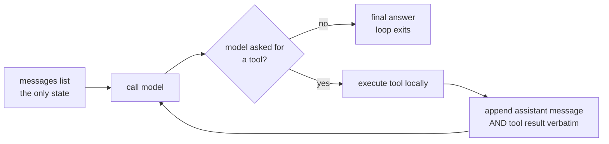

# S01-agent-loop — The agent loop

**What this teaches:** what an LLM agent actually is mechanically — a client-side loop
around a stateless API — and the two invariants that keep it alive: message-list
preservation and tool-call/tool-result pairing.
**Time:** ~60 min with the notebook. **Prerequisites:** none beyond Python.
**Hands-on (easy):** [`notebooks/s01_agent_loop_toy.ipynb`](../notebooks/s01_agent_loop_toy.ipynb)
**Hands-on (hard, optional):** [`labs/s01_loop.md`](../labs/s01_loop.md) — after the notebook.
**Video:** [Gemini Notebook overview](videos/S01-agent-loop.mp4) — generated with Google Gemini Notebook (formerly NotebookLM); preview or review, never a substitute for the notebook.

---

## The theory in depth

### The API is stateless; the loop is the agent

Every call to a chat-completions-style API is independent. The model does not remember
your previous request, does not keep a session, does not "know what we were doing."
What it sees is exactly one thing: the `messages` list you send. Memory, personality,
progress — all of it is that list, re-sent in full, every call.

This lesson teaches the **client-owned loop** — you hold the message list. That is
deliberate: local and open-model stacks still work exactly this way, and the stateful
alternatives (see the SOTA table) are this same loop with the list moved server-side.

An *agent* is what happens when you wrap that stateless call in a loop and let the
model decide when to stop:

That is the entire architecture. Simon Willison's definition — *"an LLM agent runs
tools in a loop to achieve a goal"* — is deliberately unglamorous
([simonwillison.net](https://simonwillison.net/2025/Sep/18/agents/)).
Everything else — planning, memory, reflection, multi-agent — is a modification of
this diagram, usually by editing what goes into the messages list.

### The two mechanical invariants

The protocol has rules that are invisible until you break them:

1. **Append-verbatim.** The assistant message that contains the tool call must go into
   the history *exactly as received* — including its tool-call metadata — followed by
   the tool result. If you reformat, summarize, or drop it, the next request contains
   a tool result whose call was never made: an **orphaned tool result**, and real APIs
   reject it with a 400. This is one of the most common production breakages in agent
   code, and it usually appears when someone adds retry or compaction logic later
   (real-world instances:
   [learn-claude-code#325](https://github.com/shareAI-lab/learn-claude-code/issues/325),
   [anthropics/claude-code#62577](https://github.com/anthropics/claude-code/issues/62577)).
2. **Tool errors are messages, not exceptions.** When a tool raises, the correct move
   is to catch it and append the error *as the tool result* (Anthropic's protocol has
   `is_error: true` for exactly this), so the model can see what happened and adapt.
   Letting the exception kill the loop throws away everything the run had
   accomplished. Anthropic's tool-design guidance makes the same point from the other
   side: error text is *prompt content* — write tool errors the model can recover
   from ([anthropic.com/engineering/writing-tools-for-agents](https://www.anthropic.com/engineering/writing-tools-for-agents)).

The notebook's mock model rejects orphaned tool results the way a real API does
— that one failure class, not full protocol validation — so the experiments
fail the way production would, cheaply.

### Where the model stops being the hard part

Once the loop works, the failures move elsewhere: the context fills up, the model
loops without terminating, tool results poison the history. That is why the field's
attention moved from "the loop" to *what flows through it* — context engineering,
which is S03's topic. The loop is solved; the stream is not.

## Exercises (in the notebook, predict first)

Run the notebook top-to-bottom. For each experiment cell, **write your prediction as
a comment before running it** — a prediction you didn't write down is a
prediction you'll retroactively fix.

1. The happy path: run the loop on the weather question. Predict how many turns the
   run takes and what each transcript row contains — which roles appear, in what
   order, carrying what — then run and read the transcript.
2. Drop the assistant message: the labeled broken variant removes the
   append-verbatim line. Predict what fails and where, then run — the mock
   reproduces the orphaned-tool-result failure class the way a real API does
   (one check, not full protocol validation), so the failure you watch
   is the production one.
3. The model that never stops: `mock_model_forever` requests a tool on every turn.
   Predict what ends the loop and after how many turns — and note whose property
   the thing that ends it is (the harness's, not the model's).
4. The tool that raises: run the fragile weather service. Predict whether the loop
   crashes or the error becomes data — and where in the transcript it surfaces.

After the notebook, optional hard path: [the trivia-host loop](../labs/s01_loop.md) — same session, live or cassette. Skip it and the easy path is still complete.

## State of the art (as of August 2026)

Mapped to *recognize vs adopt*: what the field converged on that this session already
teaches, what's newer, what to ignore for now.

| Development | Status | Take |
|---|---|---|
| "Agents are just loops" is now the industry baseline definition (Willison; Anthropic's [Building effective agents](https://www.anthropic.com/engineering/building-effective-agents): "start by using LLM APIs directly") | **already in this path** | You are learning the thing the industry considers the durable core. |
| Frameworks consolidated: AutoGen + Semantic Kernel merged into [Microsoft Agent Framework](https://devblogs.microsoft.com/foundry/introducing-microsoft-agent-framework-the-open-source-engine-for-agentic-ai-apps/) (Oct 2025); [OpenAI Swarm](https://github.com/openai/swarm) superseded by the [Agents SDK](https://github.com/openai/openai-agents-python); [LangGraph](https://langfuse.com/blog/2025-03-19-ai-agent-comparison), [Google ADK](https://google.github.io/adk-docs/), [Pydantic AI](https://ai.pydantic.dev) are the serious production set | **recognize** | Frameworks now sell the loop as a product. Learn the loop first — which is what you're doing — so a framework is a choice, not a crutch. |
| Anthropic's own Dec-2024 post now carries a banner steering readers to managed agent infrastructure ([Building effective agents](https://www.anthropic.com/engineering/building-effective-agents)) | **recognize** | The minimal loop survives as *pedagogy* while vendors productize it. Knowing the loop is how you evaluate what they're selling. |
| Code-as-action loops ([smolagents](https://github.com/huggingface/smolagents): the model writes Python instead of JSON tool calls) | **recognize** | A different point in the same design space. Same loop, different action encoding. |
| `strict: true` tool schemas for guaranteed-conformant arguments ([OpenAI function-calling guide](https://developers.openai.com/api/docs/guides/function-calling)) | **adopt** | When you hit real APIs: cheap reliability win; the toy's mock doesn't model it. |
| OpenAI's stateful Responses API (Conversations, `previous_response_id`) is now the recommended default for new projects; Chat Completions "remains supported" ([migration guide](https://developers.openai.com/api/docs/guides/migrate-to-responses)) | **recognize** | Server-side state moves the message-list management this lesson teaches into the platform. Learn the client-owned loop anyway: it's the mental model that survives every vendor abstraction, and every local/open-model stack still works this way. |
| Multi-agent orchestration frameworks | **ignore** | For now — OpenAI's own guide: [start with a single agent](https://openai.com/business/guides-and-resources/a-practical-guide-to-building-ai-agents/). S05 and S11 cover when structure actually pays. |

## Annotated readings

- **Anthropic, [Building effective agents](https://www.anthropic.com/engineering/building-effective-agents)
  (Dec 2024).** The canonical primary source. Extract this: the workflows-vs-agents
  distinction, and the observation that the most successful deployments were
  "simple, composable patterns," not frameworks. The framework survey inside it is
  dated (the post's own banner says so); the philosophy is not.
- **OpenAI, [A Practical Guide to Building Agents](https://openai.com/business/guides-and-resources/a-practical-guide-to-building-ai-agents/)
  (2025).** Extract this: agent = model + tools + instructions, and `max_turns` as
  the explicit non-termination guardrail — the same cap you just exercised in the toy.
- **Drew Breunig, [How contexts fail and how to fix them](https://www.dbreunig.com/2025/06/22/how-contexts-fail-and-how-to-fix-them.html)
  (Jun 2025).** The four failure modes (poisoning, distraction, confusion, clash).
  Read it now as a preview; it becomes the working vocabulary of S03.

## Misconceptions and failure modes

- **"The model remembers our conversation."** It doesn't. You re-send the whole
  transcript every call. Anyone who believes otherwise writes retry logic that drops
  messages — and ships orphaned-tool-result 400s.
- **Retrying a failed call without the failed attempt in history.** The model can't
  adapt to an error it never saw. Append the failure, then continue.
- **Catching tool errors at the loop level.** That converts a recoverable,
  model-visible event into a run-killing exception. Errors belong *in* the messages.
- **Loop non-termination.** No authoritative postmortem exists, but every production
  guide converges on the same three defenses: descriptive tool errors, a deterministic
  repeat-detector, and a hard iteration cap. The toy demonstrates the cap; the other
  two are S06/S07 material.

## Self-check

Why can't the model "just remember" the last turn?

The API is stateless: each request is independent and contains the full messages
list. There is no server-side conversation state to remember — continuity is entirely
client-side list management.

What exactly makes a tool result "orphaned"?

A tool result appears in the messages list without the assistant message containing
its matching tool call immediately before it. Real APIs validate the pairing and
reject the request (400). It happens when retry/compaction code drops or rewrites the
assistant message but keeps the result.

A tool raises mid-run. Two handling strategies — which is correct and why?

Kill the loop with the exception, or catch it and append the error as the tool
result. The second: the error becomes model-visible context, the model can adapt or
degrade gracefully, and the run's prior progress survives. The first throws away
work and teaches the model nothing.

Why is `max_turns` a correctness mechanism and not just a cost cap?

Because a model stuck in a tool loop will otherwise run forever — Breunig's
"distraction" failure mode. A hard cap is the only defense that works even when every
smarter mechanism fails.

## What's next

**S02 — Golden sets and baselines:** you have a loop that runs; next, how do you
*measure* whether it's any good? The answer is an eval suite, and the surprising part
is that the eval suite — not the agent — is where most of the engineering lives.
