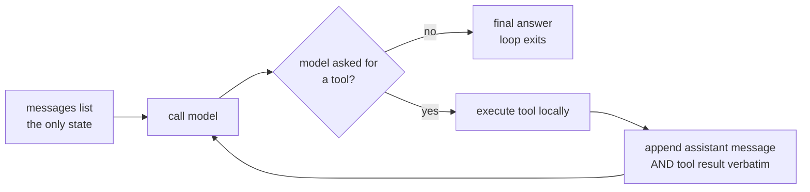

# S01-agent-loop — The agent loop

**What this teaches:** what an LLM agent actually is mechanically — a client-side loop
around a stateless API — and the two invariants that keep it alive: message-list
preservation and tool-call/tool-result pairing.
**Time:** 20–40 min active reading, 30–60 min notebook work, 5–10 min self-check.
These are planning estimates, not measured learner timings; optional lab time is separate. **Prerequisites:** none beyond Python.
**Hands-on (easy):** [`notebooks/s01_agent_loop_toy.ipynb`](../notebooks/s01_agent_loop_toy.ipynb)
**Hands-on (hard, optional):** [`labs/s01_loop.md`](../labs/s01_loop.md) — after the notebook.
**Video:** [Gemini Notebook overview](videos/S01-agent-loop.mp4) — generated with Google Gemini Notebook (formerly NotebookLM); preview or review, never a substitute for the notebook.

---

## The theory in depth

### The API is stateless; the loop is the agent

In the notebook’s client-owned Chat Completions shape, each model call receives
the `messages` list supplied by the caller. Earlier turns matter only when that
list carries them forward. Treat the list as explicit input: compare the first
request with the next and identify what changed. The local mock has no hidden
conversation store. Real providers can offer other state interfaces; this lesson
does not claim that every API is stateless.

This lesson teaches the **client-owned loop** — you hold the message list. That is
deliberate: it makes the bookkeeping inspectable. Stateful alternatives can manage
history for you, but tool execution, failure policy and stopping still need owners.

An *agent* is what happens when you wrap that stateless call in a loop and let the
model decide when to stop:

This diagram is the notebook's complete control-flow skeleton. The model proposes
an action or a final answer; Python owns whether to execute, how to record the
result, and when to stop. The arrow back to the model carries **history**, not an
invocation of the tool inside the model. Trace that distinction with your finger
before looking at the implementation.

### The two mechanical invariants

The protocol has rules that are invisible until you break them:

1. **Preserve the assistant call message.** Retain its protocol fields, including
   the call IDs and arguments, before appending results. Each requested call needs
   a result associated with its ID before continuing the model conversation. One
   assistant message may request several tools; the results form a group. An ordinary
   final assistant explanation with no calls needs no tool result. The
   [OpenAI function-calling guide](https://developers.openai.com/api/docs/guides/function-calling)
   describes zero, one or multiple calls and preserving the message while returning
   the results. Dropping the call message but keeping a result creates an orphan.
2. **Choose how a recoverable tool failure enters the conversation.** In this toy,
   `dispatch` catches the fragile weather service's exception and returns a short
   error string. The loop records it against the call ID so the mock can respond.
   This is a selected continuation policy, not a rule to catch every exception and
   expose its text. A host may stop on failure; sensitive internals should not become
   tool output. Anthropic's [tool-writing guidance](https://www.anthropic.com/engineering/writing-tools-for-agents)
   treats useful error responses as information for a subsequent correction. Its
   wire format is different from this OpenAI-shaped toy; do not substitute field
   names across APIs.

The notebook's mock model rejects orphaned tool results the way a real API does
— that one failure class, not full protocol validation — so the experiments
fail the way production would, cheaply.

### A worked trace: state, operation, evidence

Start with a weather question and label three different things: the **request**
(the list sent to `mock_model`), the **assistant message** inside the response, and
what `dispatch` returns. The response envelope contains usage metadata too, but
`run_loop` extracts the assistant message before recording it. Appending the entire
response envelope would put the wrong shape into history. Appending only the
assistant's text would lose the tool call when its content is null.

For a trace on paper, draw columns for row number, role, call IDs and content.
Read `_tool_call`: the function builds a fresh ID, a function name and JSON-encoded
arguments. Then read `dispatch`: it decodes the arguments, looks up a Python
function in `TOOLS`, and calls it. The ID does not choose the Python function;
the name does. The ID associates the eventual result with the requested operation.
That separation becomes especially useful when the same function is called for
two cities. Equal function names do not make their results interchangeable.

At the loop boundary, distinguish **message validity** from **answer truth**. A
well-paired result saying a fixture city is sunny can be structurally valid and
factually wrong outside the fixture. A schema can constrain a city to a string
without checking that a city exists. The notebook's weather dictionary is a toy
oracle: its behavior is completely visible, which lets you isolate control flow
without a real forecast service. Do not turn its response into a weather claim.

Now make the loop state deliberately wrong in your mental trace: erase the
assistant call message but retain the tool result. Locate the first function that
will read that malformed history. The demonstration already contains this broken
variant; you are predicting its behavior, not repairing a production defect.
After running it, match the exception to the row you erased. A failure at the
next model call can originate in bookkeeping performed during the previous turn.

### Stopping and recovery are different decisions

The mock can choose an answer with no tool calls; the host can also exhaust
`max_turns`. Those are different outcomes. Inspect the returned answer as well as
the turn count: a bounded run is not automatically a successful run. The toy's cap
counts **model iterations**, including ones that ask for tools. It does not promise
that a tool finishes. If a tool never returns, Python may never reach the next
iteration check. A per-operation timeout or overall deadline addresses elapsed
waiting; the turn budget addresses repeated model decisions. We do not implement
a general executor here.

For the fragile service, separate three observations: an operation failed, the
host chose to continue with an error result, and the final model text mentioned
that result. Continuation is not successful weather retrieval. The toy catches
broad exceptions for the visible experiment; it is deliberately incomplete as a
real execution policy. Preserve this experiment and explain its boundary rather
than silently "hardening" it into a general harness.

Active reading means drawing the state table and tracing those two counterfactuals,
not spending 40 minutes on the page. If the trace is already obvious, move on;
if JSON roles are new, spend the time aligning each row with a line in `run_loop`.
Record one uncertainty before the notebook so the later observation has something
to correct.

## Exercises (in the notebook, predict first)

Run the notebook top-to-bottom. For each experiment cell, **write your prediction as
a comment before running it** — a prediction you didn't write down is a
prediction you'll retroactively fix.

1. The happy path: run the loop on the weather question. Predict how many turns the
   run takes and what each transcript row contains — which roles appear, in what
   order, carrying what — then run and read the transcript.
2. Drop the assistant message: the labeled broken variant removes the
   append-verbatim line. Predict what fails and where, then run — the mock
   reproduces the orphaned-tool-result failure class the way a real API does
   (one check, not full protocol validation), so the failure you watch
   is the production one.
3. The model that never stops: `mock_model_forever` requests a tool on every turn.
   Predict what ends the loop and after how many turns — and note whose property
   the thing that ends it is (the harness's, not the model's).
4. The tool that raises: run the fragile weather service. Predict whether the loop
   crashes or the error becomes data — and where in the transcript it surfaces.

5. Attempt the added **two-city weather transcript** cell without opening the
   reference. Supply result records for the supplied calls, preserve their original
   message, and explain whether a separate ordinary explanation needs a tool result.
   Run your attempt only after recording the prediction. The native self-check
   below contains a foldable reference for comparison; it does not fill the cell.
6. Write a prediction/observation pair and explain one limit of the mock validator.

After the notebook, optional hard path: [the trivia-host loop](../labs/s01_loop.md) — same session, live or cassette. Skip it and the easy path is still complete.

## State of the art (as of September 9, 2026)

These are narrow primary-source observations reviewed on this date, not a ranking
of frameworks or a claim that the whole industry uses one design.

| Development | Status | Take |
|---|---|---|
| Simple workflows and agents ([Anthropic, Building effective agents](https://www.anthropic.com/engineering/building-effective-agents)) | **already in this path** | The workflows-versus-agents distinction helps identify who selects the next step. Start with the simple composition you can inspect. |
| [Microsoft Agent Framework](https://devblogs.microsoft.com/foundry/introducing-microsoft-agent-framework-the-open-source-engine-for-agentic-ai-apps/) brings together ideas from Semantic Kernel and AutoGen, with migration paths; the predecessor projects remain supported | **recognize** | A framework can own orchestration. Inspect its state and execution boundaries before adopting it. |
| Strict function schemas ([OpenAI function-calling guide](https://developers.openai.com/api/docs/guides/function-calling)) require closed objects and required fields; nullable fields can represent optional values | **adopt** | When using a provider that supports this contract, schema adherence helps with argument shape. It does not establish truth, permission or safe execution. The toy does not simulate strict mode. |
| OpenAI recommends Responses for new projects while Chat Completions remains supported ([migration guide](https://developers.openai.com/api/docs/guides/migrate-to-responses)) | **recognize** | This is OpenAI's recommendation. Compare client-owned history with the provider's state interface; neither chooses your tool failure policy for you. |

## Annotated readings

- **[OpenAI function-calling guide](https://developers.openai.com/api/docs/guides/function-calling).**
  Extract the lifecycle: receive calls, retain their assistant message, execute
  operations and return ID-matched results. Compare a multi-call response with the
  notebook's single-call happy path. Read strict-mode constraints separately.
- **[Anthropic, Building effective agents](https://www.anthropic.com/engineering/building-effective-agents).**
  Extract the workflows-versus-agents distinction and simple composable patterns.
  Publication context is December 2024; the conceptual comparison is useful here
  without treating a changing site banner as evidence.
- **[Anthropic, Writing effective tools](https://www.anthropic.com/engineering/writing-tools-for-agents).**
  Inspect how error information helps a later correction. Compare that goal with
  the toy's broad exception catch; a useful learning example is not a full policy.

## Misconceptions and failure modes

- **"Every assistant message needs a tool result."** Only messages containing
  tool calls introduce result obligations. An ordinary final answer does not.
- **"The immediately previous message must contain the matching call."** A
  multi-call assistant message can be followed by several result messages. Account
  for every call ID in the group rather than looking back exactly one row.
- **"The cap means success, and bounded turns mean bounded time."** Inspect the
  final outcome separately; a hung tool needs an elapsed-time bound.
- **"Errors must always be exposed and retried."** Continue only when host policy
  permits it; a short recoverable error result is one possible decision.

## Self-check

Try each explanation before expanding it. The native disclosure controls work
with Tab and Enter/Space. Optional assistant discussion uses the same conversation;
opening a reference is a learner action, not evidence of mastery.

What exactly makes a tool result orphaned? Does ordinary assistant text need a result?

An orphan result has no retained assistant call with its matching ID. One assistant
message can carry several calls followed by several ID-matched results. An ordinary
assistant explanation with no calls introduces no result obligation. The notebook
validator checks only that a prior call exists, not every real protocol rule.

A tool raises mid-run. When can the loop continue?

If the host elects to continue, a bounded, useful error result associated with the
call lets the model react. The host may instead stop. The toy's catch-all and raw
error text are instructional simplifications, not a recommended universal policy.

What does max_turns bound, and what does it leave unbounded?

It bounds model iterations. It does not bound an individual tool that never returns.
A per-operation timeout or overall deadline addresses waiting. Exhausting the cap
also does not establish that the requested weather answer was produced.

Two-city notebook attempt: compare your transcript after attempting it

<pre><code>proposed_results = [
    {"role": "tool", "tool_call_id": "weather-madrid", "content": "22C, sunny (fixture)"},
    {"role": "tool", "tool_call_id": "weather-oslo", "content": "9C, cloudy (fixture)"},
]
repaired = [weather_calls, *proposed_results]
</code></pre>
Keep weather_calls unchanged, including both call IDs and function arguments.
These are made-up fixture observations. The ordinary explanation needs no tool
result. Compare your IDs, roles and result coverage; the exercise does not validate
truth, ordering in every provider protocol, duplicate calls or tool execution.

## What's next

**S02 — Golden sets and baselines:** you have a loop that runs; next, how do you
*measure* whether it's any good? The answer is an eval suite, and the surprising part
is that the eval suite — not the agent — is where most of the engineering lives.
