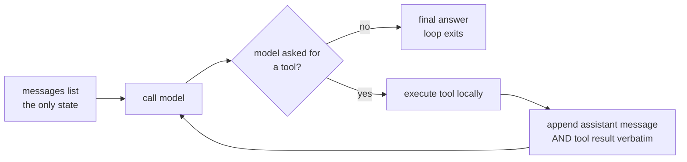

# S01-agent-loop — The order-taking loop

**Carried in:** nothing yet. This is where the café opens.
**Today you ship:** `cafe/loop.py` — the loop every later session extends.
**What this teaches:** what an LLM agent actually is mechanically — a client-side loop
around a stateless API — and the two invariants that keep a tool-calling conversation
legal: message-list preservation and tool-call/tool-result pairing.
**Time:** 20–40 min active reading, 30–60 min notebook work, 5–10 min self-check.
These are planning estimates, not measured learner timings. **Prerequisites:** none beyond Python.
**Hands-on:** [`notebooks/s01_agent_loop_toy.py`](../notebooks/s01_agent_loop_toy.py) — runs against **your** model.
**Video:** [Gemini Notebook overview](videos/S01-agent-loop.mp4) — generated with Google Gemini Notebook (formerly NotebookLM); recorded against an earlier cut of this path, so it still uses the previous toy domain. Preview or review, never a substitute for the notebook.

---

## The hook

A customer at table 4 says *"get me a latte and a chocolate croissant"*. Your model
replies with two tool calls. You look up both prices, send the results back — and
the endpoint rejects the entire conversation with a `400`.

The model did nothing wrong. You broke a bookkeeping rule that is invisible right
up until the moment it isn't.

## The promise

By the end of this session you can state, from memory, the two invariants that
keep a tool-calling conversation legal, and you will have watched a real endpoint
reject a conversation because you broke one on purpose. You will finish with a
running `cafe/loop.py` and a number you cannot yet defend — which is exactly what
S02 is for.

---

## The theory in depth

### The API is stateless; the loop is the agent

Each call to `/chat/completions` receives the `messages` list **you** supply.
Earlier turns matter only because that list carries them forward. There is no
hidden conversation store on the other end: compare the first request with the
second and the only difference is what you appended.

An *agent* is what happens when you wrap that stateless call in a loop and let the
model decide when to stop:



This diagram is the complete control-flow skeleton of `cafe/loop.py`. The model
proposes an action or a final answer; **Python** owns whether the action executes,
how the result is recorded, and when the loop stops. The arrow back to the model
carries *history*, not an invocation of the tool inside the model. Trace that
distinction with your finger before you look at the implementation.

This is the **client-owned loop**: you hold the message list. That is deliberate,
because it makes the bookkeeping inspectable. Some providers offer stateful
alternatives that manage history for you; tool execution, failure policy and
stopping still need owners.

### The two mechanical invariants

1. **Preserve the assistant message verbatim.** Append it — with its `tool_calls`
   and their ids — *before* you append any result. Rebuild it by hand and you will
   drop the id the result has to match. The
   [OpenAI function-calling guide](https://developers.openai.com/api/docs/guides/function-calling)
   describes zero, one or several calls per assistant message, and preserving that
   message while you return the results.
2. **Pair every call with a result.** Each `tool_call` needs a `tool` message
   carrying its `tool_call_id` before the next model call. One assistant message
   may request several tools; their results form a group. An ordinary final
   answer with no calls needs no result at all.

Break either and you create an **orphaned tool result**: a result answering a call
the conversation no longer contains. `cafe/model.py` checks exactly this one
failure class before every request — one check, not full protocol validation —
so you see it fail locally the way a real endpoint fails it.

### Tools are local functions; the model only asks

`cafe/tools.py` holds five in-domain tools: `price_check`, `check_allergens`,
`propose_order`, `fire_ticket`, `close_check`. The model never runs any of them.
It emits a request; your dispatcher decides. That distinction is the whole reason
S05 can put a consent gate in front of `fire_ticket` without the model's
cooperation.

Note which one is irreversible. `price_check` can run a hundred times harmlessly.
`fire_ticket` puts food on the pass. The loop treats them identically today —
that is a deliberate gap you will close in S05.

### Stopping is a harness property

The model does not decide when the conversation ends; it only decides whether to
request another tool. The loop stops when the model answers in words, when the
script is exhausted, or when the turn cap fires. A run that ends for an unknown
reason is a run you cannot report on, so `run_shift` always returns a
`stop_reason`. You will reuse that field in S07, S08 and S09.

---

## Build (in the notebook, predict first)

Open [`notebooks/s01_agent_loop_toy.py`](../notebooks/s01_agent_loop_toy.py).
Configure your endpoint first:

```bash
export CAFE_BASE_URL=http://127.0.0.1:11434/v1   # Ollama, LM Studio, anything OpenAI-compatible
export CAFE_API_KEY=ollama                       # any non-empty string for a local server
export CAFE_MODEL=qwen2.5:14b-instruct
uv run python -m cafe.doctor                     # one live call; proves the endpoint
uv run marimo edit notebooks/s01_agent_loop_toy.py
```

1. **The first call.** Predict whether the model calls a tool or answers in words,
   and which tool. Run it. A real model will sometimes surprise you; the gap
   between your prediction and the result is the lesson.
2. **Break invariant 1 on purpose.** A deliberately broken loop drops the
   assistant message and keeps the result. Watch the orphan get rejected before
   the request ever leaves your machine.
3. **Supply the tool results yourself.** The attempt cell gives you two calls and
   no results. Return one record per call, each carrying its id. The reference is
   behind a reveal switch — flip it *after* you attempt.
4. **Run a real shift.** `run_shift` against your model, then inspect the message
   list: every id opened, every id answered.

---

## Checkpoint — the number you bank

Run the shift three times and record **how many of the three produced a legal,
fully paired conversation**. On a small local model this is often not 3/3.

Write the number down with the model name next to it. It is an anecdote repeated
three times, not evidence — and knowing the difference is what S02 installs.

---

## State of the art (as of August 2026)

| Development | Status | Take |
|---|---|---|
| [OpenAI function calling](https://developers.openai.com/api/docs/guides/function-calling) | **already in this path** | The message/result pairing contract this session teaches is the same one every OpenAI-compatible server implements. |
| [Anthropic tool use](https://docs.anthropic.com/en/docs/build-with-claude/tool-use) | **recognize** | Different field names, identical shape: assistant proposes, client executes, result returns referencing the call id. |
| [OpenAI Agents SDK](https://openai.github.io/openai-agents-python/) | **recognize** | Owns the loop for you. Worth reading *after* you have written one, so you can see what it is hiding. |
| [Model Context Protocol](https://modelcontextprotocol.io/) | **recognize** | Standardises where tools come from, not how the loop runs. Orthogonal to this session. |
| [Ollama OpenAI compatibility](https://docs.ollama.com/openai) | **already in this path** | This is why the course needs no vendor key: the same wire format, on your laptop. |

---

## Annotated readings

- **OpenAI function-calling guide** — read only the request/response cycle. Extract: what the client must send back after a tool call, and why the id matters.
- **Ollama OpenAI-compatibility page** — extract: which fields a local server actually implements, so you know what to expect when a small model ignores `tools`.
- **Your own endpoint's logs** — extract: what a rejected request looks like from the server's side. Nothing teaches the pairing rule faster.

---

## Misconceptions and failure modes

- *"The model runs the tool."* It does not. It emits a request; your code decides. Everything in S05 depends on this.
- *"The framework handles the message list."* Some do. Then compaction (S03) and replay (S08) become someone else's opinion instead of your decision.
- *"A turn cap is a model limitation."* It is a harness property you chose. Say so in your reports.
- *"It worked three times, so it works."* Three successes on one endpoint is an anecdote. S02 is the fix.
- *"A small model that ignores `tools` is broken."* It is a small model. That is a routing decision (S11), not a bug.

---

## Self-check

<details><summary>Why does dropping the assistant message break the next request, even though the tool result still has the right id?</summary>

Because the id now refers to nothing. The result claims to answer a call that the
conversation no longer contains, so the server cannot validate the pairing. The id
is only meaningful relative to an assistant message that is still present.</details>

<details><summary>One assistant message requests three tools. How many tool messages do you append before calling the model again?</summary>

Three — one per call, each carrying its own `tool_call_id`. They form a group; a
partial group is as invalid as none.</details>

<details><summary>Your loop ran to the turn cap. Is that a model failure?</summary>

No. The cap is a harness property you configured. It tells you the model kept
requesting tools and never produced a final answer; whether that is the model's
fault, the prompt's, or the tools' is a separate question the trace (S08) answers.</details>

<details><summary>Why does the course check tool pairing client-side when the server checks it anyway?</summary>

So the failure is visible where you caused it, before a paid request leaves the
machine — and so you can see the rule as one explicit function instead of a `400`.</details>

---

## What this unlocks

You have a working loop and a number you cannot defend. **[S02 — Golden sets &
baselines](S02-golden-evals.html)** turns that anecdote into a measurement
instrument: a golden set of café scenarios, checkers whose failures you trust, and
a naive baseline your governed loop has to beat. Everything after S02 is measured
against it.
