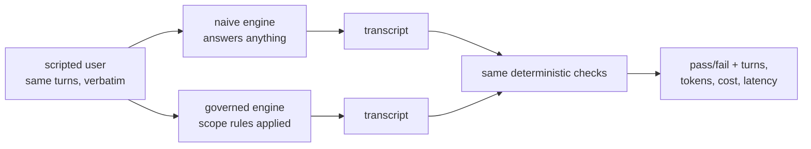

# S02 — Golden sets & baselines

**What this teaches:** an eval suite is a *measurement instrument*, not a test suite —
scripted users, two-tier checkers, the fixture invariant, and why the naive baseline
is a product argument rather than a courtesy number.
**Time:** ~90 min with the notebook. **Prerequisites:** S01 (the loop).
**Hands-on:** [`notebooks/s02_scripted_user_eval_toy.ipynb`](../notebooks/s02_scripted_user_eval_toy.ipynb)
**Video:** [NotebookLM overview](videos/S02-golden-evals.mp4) — auto-generated summary; preview or review, never a substitute for the notebook.

---

## The theory in depth

### Tests ask "is it broken?"; instruments ask "would I believe the number?"

A test suite is binary and self-centered: does *my code* still work? A measurement
instrument is comparative and skeptic-centered: *how much better is A than B, and what
would make me wrong?* That second question — defensibility — is the whole game,
because an eval number that can't survive scrutiny is worse than no number: it gives
you confidence you haven't earned.

Four moving parts make the number defensible. Each exists to kill a specific
confound.

### 1. The scripted user — reproducibility comes from the script

A conversational product can't be exercised by a single prompt; you need a *user*.
Two options:

- **LLM-simulated user** — a second model plays the user from a persona and
  instructions. This is what the frontier practice uses for coverage: τ-bench, the
  reference benchmark for conversational agents, simulates the user with an LLM and
  grades the *final environment state* rather than the transcript
  ([arXiv:2406.12045](https://arxiv.org/abs/2406.12045)). Anthropic's agent-eval
  guidance describes the same pattern
  ([anthropic.com/engineering/demystifying-evals-for-ai-agents](https://www.anthropic.com/engineering/demystifying-evals-for-ai-agents)).
  The catch: simulated users are measurably *not* real users — they ask more
  questions and stay more polite on identical tasks ([arXiv:2601.17087](https://www.arxiv.org/pdf/2601.17087)) —
  and they inject their own variance into your measurement.
- **Scripted user** — a fixed list of user turns, replayed verbatim. Zero diversity,
  zero variance. This is what you use for *regression*: the same probe, every run,
  so any delta belongs to the system under test.

The toy uses a scripted user, and that is the right default for a golden set whose
job is to compare naive vs governed *on the same probe*. Practice converges on:
scripted for determinism, simulated for coverage — use both, know which number came
from which.

### 2. Diverge / rejoin — the delta must have exactly one cause

Naive and governed share the script, the fixture, and the checker; they differ *only*
in the scaffolding under test. Then — and only then — is the delta attributable to
the scaffolding. Every shared component you *don't* hold constant is a confound your
conclusion can't survive. This is also why the naive row matters commercially: naive
mode *is* the status quo (a chatbot told to role-play), so `governed − naive` is the
measured answer to "why does this product deserve to exist?"

### 3. Two checker tiers — and why safety never rides on the judged one

- **Deterministic tier**: code asserts structure and safety invariants — the refusal
  happened, the ceiling held, the required signpost is present. Cheap, reproducible,
  gameable only in ways you can audit.
- **Judged tier**: an LLM scores quality — persona realism, tone, usefulness.
  Expressive, expensive, and *itself a model*: it inherits every bias and failure
  mode of the models it grades.

The judge literature is unambiguous that the judged tier needs its own validation.
Zheng et al. documented position bias, verbosity bias, and self-preference in 2023
([arXiv:2306.05685](https://arxiv.org/abs/2306.05685)); "Who Validates the Validators?"
showed judge criteria drift as you grade — the rubric is never fully fixed a priori
([arXiv:2404.12272](https://arxiv.org/abs/2404.12272)); and judges measurably favor
their own model family ([arXiv:2404.13076](https://arxiv.org/abs/2404.13076)).
Current practitioner consensus: binary pass/fail beats 1–5 scales, calibrate against
~30 human-labeled examples, and report judge agreement as its own number
([hamel.dev/blog/posts/llm-judge](https://hamel.dev/blog/posts/llm-judge/)).

Hence the rule: **safety asserts live in the deterministic tier, always.** The judged
column is reported separately and labeled *uncalibrated* until you've measured the
judge against human labels (that's S12's job).

### 4. The fixture invariant — validate the checker before trusting it

Before any number means anything, prove the checker can fail and can pass:

- Bare fixture (no system output) must **FAIL** — a checker that passes on nothing
  asserts nothing.
- Fixture + known-good reference output must **PASS** — a checker that fails the
  reference measures the wrong thing.

This is the eval-suite version of watching a test fail before making it pass, and
it's skipped constantly in practice. The notebook runs both halves against the toy.

### Error analysis is the actual skill

Hamel's data, across many teams: unsuccessful AI products almost always fail at
*evaluation*, not modeling — and the fix is a loop of reading traces, classifying
failures, and converting each failure class into a check
([hamel.dev/blog/posts/evals](https://hamel.dev/blog/posts/evals/)). The number is
the prompt that gets you to read transcripts; the reading is where the number's
meaning lives. Aggregate pass rate alone hides *which* failures you're buying.

## Exercises (in the notebook, predict first)

1. Read the script and both engines; write down each row's pass/fail before running.
2. Weaken one check (drop the signpost requirement). Which rows flip? A check that
   flips nothing is decoration — this is how you audit a checker.
3. Run the fixture invariant: empty transcript vs reference transcript.
4. Add a third engine that refuses *everything*. It passes the scope check — which
   tier catches it, and why can't the deterministic one?

## State of the art (as of August 2026)

| Development | Status | Take |
|---|---|---|
| **Inspect AI** (UK AISI) is the reference open-source agent-eval framework: evals as dataset + solver + scorer, both code and model scorers ([inspect.aisi.org.uk](https://inspect.aisi.org.uk/)) | **recognize** | Its scorer/solver split is the same two-tier idea you're learning, industrialized. |
| OpenAI Evals repo effectively dormant (banner steers to Dashboard); `simple-evals` no longer updated ([github.com/openai/evals](https://github.com/openai/evals)) | **recognize** | The energy moved to Inspect, promptfoo, DeepEval, and the tracing platforms. |
| **promptfoo / DeepEval** for CI-first assertion evals; **Braintrust / LangSmith / Langfuse** add tracing + datasets + human annotation ([comparison](https://qaskills.sh/blog/llm-observability-vs-evaluation-2026)) | **recognize** | The 2026 stack is usually two tools: an eval runner + a tracing platform. |
| Capability-vs-regression split: capability evals climb from a low baseline; regression evals sit near 100% and block merges; tasks *graduate* from the former to the latter ([Anthropic](https://www.anthropic.com/engineering/demystifying-evals-for-ai-agents)) | **adopt** | This is the mature form of "bank the naive baseline": today's hill-climb number is tomorrow's regression floor. |
| Golden set in git, CI run on PR, threshold gate, metrics tracked outside CI ([pattern catalog](https://github.com/benchflow-ai/awesome-evals/blob/main/PATTERNS.md), [worked example](https://www.metacto.com/blogs/llm-evals-regression-suite-production)) | **adopt** | Cross-source consensus (vendor blogs, but they all agree with Hamel and Anthropic). |
| τ²-bench dual-control simulation; LLM-simulated users for coverage ([arXiv:2506.07982](https://arxiv.org/pdf/2506.07982)) | **newer than this session** | The scripted user is your regression instrument; simulated users are a coverage tool with a known realism gap. |
| Position-swap testing and Cohen's κ against human labels as standard judge hygiene ([writeup](https://mbrenndoerfer.com/writing/position-bias-in-llm-judges)) | **adopt at S12** | You'll calibrate your judge then; until then the judged column stays labeled uncalibrated. |
| Fully synthetic eval pipelines with no human reading of traces | **ignore** | Every credible source puts *reading transcripts* at the center. Tools that promise otherwise are selling the absence of the one activity that works. |

## Annotated readings

- **Hamel Husain, [Your AI Product Needs Evals](https://hamel.dev/blog/posts/evals/).**
  Extract four things on reread: (1) eval failure is the root cause of product
  failure; (2) the three levels — cheap deterministic checks on every change,
  human+model eval on a cadence, A/B only after big changes; (3) tests are scoped by
  feature×scenario and *grown from observed failures*; (4) "your pass rate is a
  product decision" — 100% green is not the goal.
- **Hamel, [LLM judges](https://hamel.dev/blog/posts/llm-judge/).** The judge
  playbook: binary verdicts, critique-shadowing against the domain expert, iterate
  the judge prompt to convergence on ~30 examples.
- **Zheng et al., [Judging LLM-as-a-Judge](https://arxiv.org/abs/2306.05685).** The
  bias catalog your judged tier inherits. Skim for the four biases and the
  mitigations table.
- **Anthropic, [Demystifying evals for AI agents](https://www.anthropic.com/engineering/demystifying-evals-for-ai-agents).**
  The 2026 consolidation: two-tier grading, simulated users, capability/regression
  split — plus the τ² cautionary tale of a model "failing" a task by finding a
  *better* solution than the rigid spec allowed.

## Misconceptions and failure modes

- **Pass rate as progress.** A suite can go green by the checker weakening, the
  fixture leaking the answer, or the model gaming the check. The number is a
  pointer to transcripts, not a result.
- **One tier doing both jobs.** Deterministic checks can't see tone; judges can't be
  trusted with safety invariants. Merge them and you get the weaknesses of both.
- **The unvalidated checker.** Skipping the fixture invariant because "the check is
  obviously right." The obviously-right check that passes on an empty fixture is a
  classic.
- **Synthetic-everything.** Generating model *outputs* to eval against (rather than
  user *inputs*) bakes the generator's blind spots into your golden set. Hamel's
  rule: synthetic inputs, real system outputs, human-read traces.
- **A baseline with stale infrastructure.** A number recorded against a cold or
  degraded backend measures the backend. Warm the route; sanity-check for empty
  generations before you bank anything.

## Self-check

What makes a naive-vs-governed comparison defensible?

Shared everything except the scaffolding under test: same script, same fixture, same
checker, same model route. Any other difference is a confound the delta can't
survive.

Why must the judged tier never carry a safety assertion?

Because the judge is itself a model, with documented biases (position, verbosity,
self-preference) and criteria drift. Safety invariants must be asserted by
deterministic code whose failure modes you can audit.

State the fixture invariant and what each half detects.

Bare fixture must FAIL (detects a checker that asserts nothing); fixture + reference
must PASS (detects a checker that measures the wrong thing).

Why is the naive baseline a product argument?

Naive mode is the status quo — the thing you'd ship without the platform. The delta
governed − naive, measured on shared inputs, is the quantified reason the product
deserves to exist.

## What's next

**S03 — Context engineering:** your governed engine's rules live in the context
window. What happens to those rules as the conversation grows past the window's
useful length? The loop is solved; the stream is not.
