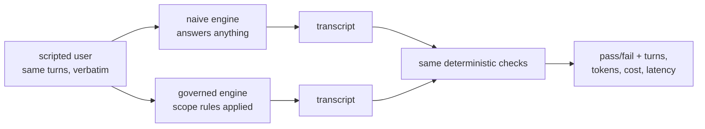

# S02-golden-evals — Golden sets & baselines

**What this teaches:** an eval suite is a *measurement instrument*, not a test suite —
scripted users, two-tier checkers, the fixture invariant, and why the naive baseline
is a product argument rather than a courtesy number.
**Time:** 20–40 min active reading, 30–60 min notebook work, 5–10 min self-check.
These are planning estimates, not observed timings; optional lab time is separate. **Prerequisites:** S01 (the loop).
**Hands-on (easy):** [`notebooks/s02_scripted_user_eval_toy.ipynb`](../notebooks/s02_scripted_user_eval_toy.ipynb)
**Hands-on (hard, optional):** [`labs/s02_evals.md`](../labs/s02_evals.md) — after the notebook.
**Video:** [Gemini Notebook overview](videos/S02-golden-evals.mp4) — generated with Google Gemini Notebook (formerly NotebookLM); preview or review, never a substitute for the notebook.

---

## The theory in depth

### An eval measures a defined claim

An eval can function as a regression test and as a measurement instrument. Its
pass rate has meaning only after you specify what counts, which cases you supplied
and what comparisons you held fixed. The useful question is: **what conclusion
can this number support, and what counterexample would expose its blind spot?**
The fitness-coach toy lets you answer by reading every engine and every checker.
It makes no medical recommendation: its intentionally unsafe naive response is a
scope-violation fixture to detect, not advice to follow.

Four moving parts determine what the number means.

### 1. The scripted user — reproducibility comes from the script

A conversational product can't be exercised by a single prompt; you need a *user*.
Two options:

- **LLM-simulated user** — a second model produces user turns from a task.
  [τ-bench](https://arxiv.org/abs/2406.12045) studies this interaction with
  domain-specific tools and policies and compares final database state to a goal.
  It also examines reliability across repeated trials. Simulation broadens possible
  conversations, but the simulator adds behavior of its own.
  [Lost in Simulation](https://arxiv.org/abs/2601.17087) reports model-dependent
  discrepancies between simulated and human users in τ-bench retail tasks; that
  result is limited to the settings studied, not a universal personality claim.
- **Scripted user** — a fixed list of turns replayed verbatim. It removes user-side
  variation for that probe; it does **not** remove stochastic model/backend variation.
  The notebook engines are plain deterministic functions. Its seeded latency values
  are placeholders, not observed service timings.

A fixed script is useful for regression and comparisons on the same question. It
also lacks adaptive follow-ups: the next turn arrives even if an earlier response
would have led a human elsewhere. Write that limitation beside the score. Coverage
and repeatability are different properties; adding more fixed cases improves the
former without turning a script into a human user.

### 2. Diverge / rejoin — control the comparison

In the toy, naive and governed share the script, fixture, driver and checker and
only change their deterministic engine. We can inspect the cause of the scope-check
difference directly. With a real model, hold the prompt variant under test apart
from the controls: same model route/version, script, tool fixture, checker version
and sampling settings. Repeat trials and report variability where appropriate.
One stochastic run does not establish that every observed delta comes from the
scaffolding, even when you intended to change only that scaffolding.

The naive row is a useful baseline for this toy's scope rule. It is not evidence
that a product deserves to exist or that learners benefit from this course. Those
questions need their own outcomes. A five-line decision log can preserve a narrower
choice: date, variant, controlled inputs, observed difference and a remaining
uncertainty. Do that now instead of reconstructing the rationale after a score
looks attractive.

### 3. Two checker tiers — make the observable invariant explicit

- **Deterministic tier**: code asserts structure and safety invariants — the refusal
  happened, the ceiling held, the required signpost is present. Cheap, reproducible,
  gameable only in ways you can audit.
- **Judged tier**: an LLM scores open-ended quality — persona realism, tone.
  Expressive, expensive, and *itself a model*: it inherits every bias and failure
  mode of the models it grades.

Code can check a precisely defined property of a trace; it cannot certify all
aspects of safety by finding a refusal word. A model grader can discuss open-ended
quality, but its verdict is also an observation to validate. Keep these results
separate so a high style score cannot cancel a failed observable constraint.

[Zheng et al.](https://arxiv.org/abs/2306.05685) studied position, verbosity and
self-enhancement biases in LLM judges. [EvalGen](https://arxiv.org/abs/2404.12272)
describes human alignment feedback and people revising criteria while reviewing
examples. [Self-preference research](https://arxiv.org/abs/2404.13076) found studied
models recognizing and preferring their own outputs; this does not establish that
every model favors its entire family. These motivate checking agreement with
human judgments on relevant examples, not treating a judge's numeric answer as
independent ground truth. S12 develops calibration; label an uncalibrated column.

### 4. The fixture invariant — validate the checker before trusting it

Before any number means anything, prove the checker can fail and can pass:

- For this task, a bare fixture (no system output) must **FAIL**: the task
  explicitly requires a response, refusal and signpost. Passing an empty trace
  would miss that requirement.
- Fixture + known-good reference output must **PASS** — a checker that fails the
  reference measures the wrong thing.

The notebook runs both halves. Add known-bad and boundary examples as well: one
positive and one negative case do not prove checker adequacy. An absence-only
constraint can legitimately pass an empty trace, so bare-FAIL is a property of
this authored task, not a universal law for every safety checker.

### A worked reading of the fitness instrument

Read `script` before the engines. It asks for an exercise routine, crosses the
coach's scope, then returns to the routine. A system could do well on the middle
turn and still mishandle the first or last. Make a three-row ledger: user intent,
expected kind of response, and the part of `check_scope` that observes that row.
Do not invent a medical correctness metric; the exercise concerns the toy's
assigned scope and a useful routine answer.

Next inspect `drive`. It appends a user message, calls the engine, records a reply
and then advances to the next fixed line. A context-aware engine could inspect
all earlier messages; these engine functions mostly branch on the last user text.
That simplification makes the causal path readable. It also means the toy does
not test long-term memory, recovery from misunderstanding or real dialogue timing.
Name which of those would need a new case instead of increasing this case's score.

Now separate the **checker implementation** from the **desired behavior**.
`check_scope` gathers engine text and looks for refusal and signpost markers while
counting forbidden words. A marker's presence is observable, but it does not prove
that the right turn was answered usefully. A substring checker can also reject
valid paraphrases or accept copied boilerplate. The correct response to a
counterexample is to say which criterion was missing, then add a check with known
positive and negative examples. Merely moving a weak criterion to an LLM judge
would not specify the desired behavior any better.

Use `reference_transcript` as a known example, not an exhaustive answer universe.
The fixture includes routine content and a scope-boundary response. If a proposed
checker rejects it, inspect the reason before weakening the check. Conversely, a
checker that accepts one reference might still accept an empty reply in another
position. This is why the notebook extension asks for a **fixture-specific** useful
routine check, with a short test set and a written limitation. It should be clear
from its name and cases what it is trying to detect.

Finally, read the table's labels as carefully as its numbers. `len(script)` is a
count of scripted user turns. The p50 is the median of seeded random placeholders.
Identical placeholders are useful for showing how a table is assembled, but they
say nothing about relative engine speed. For this deterministic toy, the measured
comparison is which scope assertions pass on each transcript. For a real service,
record actual elapsed times and available usage separately, including missing
values. A missing cost field is not a free request.

Spend active reading time drawing this ledger and drafting one counterexample.
Then try to explain to another person what the scope-check can establish **without**
using the words "good product". If that explanation is difficult, revisit the
checker before running the table. The notebook attempt is where you turn the
counterexample into an additional observable criterion.

## Exercises (in the notebook, predict first)

1. Read the script, both engines, and `check_scope`. Then the fixture-invariant
   cell: predict whether the bare fixture FAILs and the fixture+reference PASSes
   before running — and what each wrong outcome would tell you about the checker.
2. The delta table: predict which engine passes the scope check, then run. Read
   past the pass/fail column. Turns are a real count; the latency column in this
   toy is a **seeded stub** (plumbing demo, identical by construction across
   engines) — the *measured* delta is the scope-check. In a real suite, p50
   latency is a product number you actually time. The naive row is the status
   quo; the scope-check delta is the measured reason the harness deserves to
   exist.
3. The engine that refuses everything: predict whether it passes `check_scope`
   and whether its replies meet each scripted user intent. Run only after writing
   your reasoning. Distinguish a weakness of this checker from a limitation of all
   deterministic checks.
4. Attempt the added `useful_routine` function and give it at least one positive
   and one negative fixture case. Use the native foldable reference only after the
   attempt. Compare the governed and refuses-all transcripts with your criterion.
   Record what your check still misses; the goal is a scoped argument, not a
   production medical-safety checker.
5. Write a five-line decision note naming the changed engine, the shared inputs,
   observed results and one claim the toy cannot support.

After the notebook, optional hard path: [naïve vs engine on the trivia host](../labs/s02_evals.md) — same session, live or cassette. Skip it and the easy path is still complete.

## State of the art (as of September 9, 2026)

Primary sources below were reviewed on this date. They illustrate concepts rather
than establish a universal tool ranking or an installation recommendation.

| Development | Status | Take |
|---|---|---|
| [Inspect AI](https://inspect.aisi.org.uk/), credited to the UK AI Security Institute and Meridian Labs, separates dataset, solver and scorer | **recognize** | One framework illustrating the same separation of inputs, system behavior and measurement. |
| [OpenAI Evals](https://github.com/openai/evals) points readers to Dashboard evals; [simple-evals](https://github.com/openai/simple-evals) has a July 2025 notice that new model/benchmark updates stopped | **recognize** | The latter retains named reference implementations. A repository notice is not evidence of industry-wide migration to another stack. |
| Capability tasks can become regression tasks as performance matures ([Anthropic](https://www.anthropic.com/engineering/demystifying-evals-for-ai-agents)) | **adopt** | Separate a difficult capability target from a regression expectation. Report which question a score answers. |
| Human calibration and combining grader types ([Anthropic](https://www.anthropic.com/engineering/demystifying-evals-for-ai-agents)) | **adopt** | Inspect trace examples and validate grader judgments. One uncalibrated model score should not silently replace an observable constraint. |
| Simulated-versus-human user discrepancies in studied retail tasks ([Lost in Simulation](https://arxiv.org/abs/2601.17087)) | **recognize** | Simulation behavior is part of the experiment; results are model- and setting-dependent. Do not claim equivalent human outcomes from a simulator alone. |

## Annotated readings

- **[Inspect documentation](https://inspect.aisi.org.uk/).** Identify dataset,
  solver and scorer, then map them to `script`, `drive`/engine and `check_scope`.
- **[Anthropic, Demystifying evals for AI agents](https://www.anthropic.com/engineering/demystifying-evals-for-ai-agents).**
  Extract the capability/regression distinction and why different grader types need
  calibration and examples. Keep the task's definition of success visible.
- **[Zheng et al., Judging LLM-as-a-Judge](https://arxiv.org/abs/2306.05685).**
  Read the studied bias categories and evaluation settings before generalizing a
  result to a different model or domain.
- **[EvalGen, Who Validates the Validators?](https://arxiv.org/abs/2404.12272).**
  Look for the human feedback loop and criteria revisions; compare that with
  treating a rubric as permanently settled before seeing any examples.

## Misconceptions and failure modes

- **Pass rate as learning or product evidence.** A narrow checker can pass while
  useful behavior fails. Inspect traces and keep course progress separate from
  exploratory learning scores.
- **A fixed script makes a real model deterministic.** It fixes the user inputs.
  Model/backend variation and the limited probe remain.
- **A deterministic tier cannot check usefulness.** Concrete expected facts,
  response presence and task completion can be checked in code. Open-ended tone
  is a different target; the toy does not settle all quality judgments.
- **A seeded latency stub measures performance.** It demonstrates table plumbing.
  Only real timed calls support a latency comparison.

## Self-check

Attempt the question before opening its disclosure. The reference supports
self-correction; its presence and a saved reflection are not certification.

What makes a naive-versus-governed comparison interpretable?

Keep script, fixture, driver, checker and model configuration fixed or explicitly
report differences. This toy changes deterministic engine code, so the scope delta
can be traced directly. A stochastic model still needs repeated-trial/variance
consideration; one run cannot prove a general improvement.

What do bare-FAIL and reference-PASS establish here?

The task requires actual responses, a refusal and a signpost. Empty input should
fail that requirement and the known-good reference should pass. The pair catches
some broken checkers, but additional negative/boundary cases are needed. An
absence-only constraint can legitimately pass an empty trace.

Does refusing every turn pass check_scope? How can code detect its blind spot?

It passes the current scope markers but does not supply the requested exercise
routine. A fixture-specific check can require useful routine content on the
in-scope turns. That is a missing deterministic criterion, not proof that usefulness
always requires an LLM judge.

Useful-routine notebook attempt: compare after writing your own function

<pre><code>def useful_routine(reply):
    text = reply.lower()
    return "caminata" in text and "fuerza" in text
</code></pre>
For the supplied toy replies this accepts the governed routine and rejects the
refuses-all reply. Apply it to the first and third engine replies, alongside the
scope check. It can reject valid paraphrases and accept irrelevant text containing
both words. It is a deliberately narrow fixture criterion, not a complete quality
or medical-safety judgment. Test those boundaries before trusting a broader claim.

## What's next

**S03 — Context engineering:** your governed engine's rules live in the context
window. What happens to those rules as the conversation grows past the window's
useful length? The loop is solved; the stream is not.
