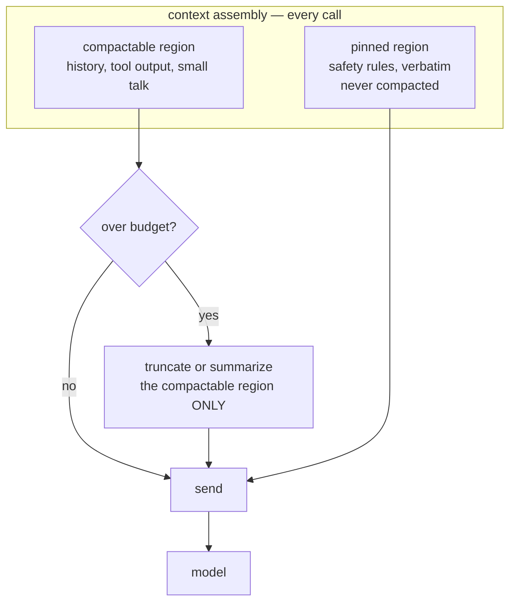

# S03-context-engineering — governance decays across compaction

**What this teaches:** the context window is two budgets, not one — a hard token
budget and a soft attention budget — and what happens to in-context rules when the
window fills: compaction deletes them silently. The fix is an invariant (safety
constraints live in code, with prompt copy in a pinned, never-compacted region),
and the proof is a measurement: rule survival probed across the compaction boundary.
**Time:** ~75 min with the notebook. **Prerequisites:** S01 (the loop), S02
(scripted probes and deterministic checkers — both get reused here, one level down
the stack).
**Hands-on:** [`notebooks/s03_context_engineering_toy.ipynb`](../notebooks/s03_context_engineering_toy.ipynb)
**Video:** [NotebookLM overview](videos/S03-context-engineering.mp4) — auto-generated summary; preview or review, never a substitute for the notebook.

---

## The theory in depth

### Two budgets, not one

The window has a hard limit: overflow it and the API answers with a 400, not an
answer. But the operative limit is softer and lower. Anthropic's framing is that
attention is a *finite budget* — the smallest set of high-signal tokens wins, and
every low-signal token you keep taxes the ones that matter
([anthropic.com/engineering/effective-context-engineering-for-ai-agents](https://www.anthropic.com/engineering/effective-context-engineering-for-ai-agents)).
The measurement agrees. Chroma ran 18 models through long inputs and found
performance degrades with length even on simple tasks — they named it *context rot*
([trychroma.com/research/context-rot](https://www.trychroma.com/research/context-rot)).
Liu et al. had already shown the positional half: models use the beginning and end
of a long context well and the middle badly — *lost in the middle*
([arXiv:2307.03172](https://arxiv.org/abs/2307.03172)).

So: "it fits" is not "it works." A rule sitting 40k tokens into a 128k window is
present and impaired at the same time, and no error message tells you.

### Compaction is a rewrite, not a trim

When the budget runs out, something has to go. The two standard moves:

| Policy | Mechanism | What dies |
|---|---|---|
| Truncation | drop the oldest messages | whatever was only said early: the setup, the standing constraints, the corrections |
| Summarization | replace history with a digest | whatever the summarizer found non-salient — and summaries are built to keep *what was discussed*, not *what was forbidden* |

Both are silent. The transcript afterwards reads coherently — coherence is what
summarizers optimize for. Nothing announces that a constraint stopped existing. If
your only instrument is reading transcripts, you will not find the decay there; you
will find it in production, reported by a user.

### Governance decay is a measured result, not a metaphor

Chen et al. put numbers on it in *Governance Decay* ([arXiv:2606.22528](https://arxiv.org/abs/2606.22528)):
across seven models and 1,323 episodes, in-context governance constraints that held
at **0% violation before compaction** failed at **30–59% after**. Two details make
the result actionable. First, the control: when the constraint text survived into
the summary, violation stayed at 0% — the failure is the omission, not the model.
Second, the attack: an adversary who can bias what the summarizer keeps can arrange
for a specific constraint to be deleted (their Compaction-Eviction Attack). The
context-management layer is a safety-critical failure surface, and "the model
misbehaved" is often "the harness deleted the rule."

### The pinned-region invariant

Hence the design rule: **safety and boundary constraints never live only in
compactable prose.** Two layers:

1. **Code first.** The constraint is enforced by deterministic machinery that does
   not ride on the model having read anything (S06 builds that layer). Prompt text
   is the explanation of the rule, not the enforcement of it.
2. **Pinned prompt copy.** Whatever constraint text does go into the context sits
   in a region compaction may not touch — re-sent verbatim at every assembly.

Pinning is rent: those tokens ride every request forever, so the pinned region
stays small and high-signal. And pinning is necessary but not sufficient — it keeps
the rule *present*; the attention budget decides whether it gets *used*. The
notebook watches both failure modes happen.

### Just-in-time, and the cache angle

The complementary skill is deciding what enters the window at all. Pre-loading
everything is the naive default; the alternative is *just-in-time* context — the
agent fetches what it needs with tools, when it needs it (the S01 loop is the
retrieval mechanism; Anthropic's post is the argument). And every context decision
is also a billing decision: prompt caches serve a stable prefix at roughly 10% of
the input price, so volatile content goes last, and — the part nobody budgets for —
**every compaction rewrites the prefix and invalidates the cache**. Anthropic's own
context-editing docs warn about exactly this interaction
([docs.claude.com](https://docs.claude.com/en/docs/build-with-claude/context-editing)).
Log every compaction as a first-class event: what was dropped, what the summary
kept, what it cost. It is a behavior change and a cache flush at the same time.

## Exercises (in the notebook, predict first)

Run top-to-bottom; write each prediction before running the cell that settles it.

1. Establish why compaction exists at all: run with no policy until the API's hard
   limit rejects the request. Predict the turn it dies.
2. Naive truncation: predict which probe is the first to fail, then read the log.
   Note what the transcript *doesn't* tell you.
3. Summarization: predict whether the transcript stays coherent (it does) and
   whether the rule survives (it doesn't). Read the actual summary the model saw.
4. Fix it yourself: the attempt cell asks what has to change for the rule to
   survive. Hint: not the policy function. Verify all probes pass, and note the rent.
5. No compaction anywhere, rule present in every request — and the decaying model
   still loses it. Predict the shape of compliance vs distance, then measure it.

## State of the art (as of August 2026)

| Development | Status | Take |
|---|---|---|
| Anthropic's context-engineering post: finite attention budget, smallest-high-signal-token-set, compaction / structured note-taking / sub-agents as the three moves at the limit ([anthropic.com](https://www.anthropic.com/engineering/effective-context-engineering-for-ai-agents)) | **already in this path** | The assigned frame. This session operationalizes its compaction section. |
| *Governance Decay* ([arXiv:2606.22528](https://arxiv.org/abs/2606.22528)): 0% → 30–59% constraint violation across a compaction boundary; 0% when the constraint text survives the summary | **already in this path** | The notebook is this paper's mechanism rebuilt as a toy. The control condition is the pinned-region argument in experimental form. |
| Context rot ([Chroma, 18 models](https://www.trychroma.com/research/context-rot)) and lost-in-the-middle ([arXiv:2307.03172](https://arxiv.org/abs/2307.03172)) | **already in this path** | Degradation is gradual and length- and position-driven — not a cliff at the window's edge. |
| Server-side context editing ([Anthropic docs](https://docs.claude.com/en/docs/build-with-claude/context-editing)): `clear_tool_uses_20250919` clears old tool results above a token threshold; pairs with the memory tool so the model saves state before clearing | **adopt** | When you hit real APIs: truncation-as-a-service for tool output. Read the fine print: clearing invalidates the prompt cache, and it clears *tool results* — your pinned constraints are still your problem. |
| Prompt caching with explicit breakpoints ([Anthropic docs](https://docs.anthropic.com/en/docs/build-with-claude/prompt-caching)): ~90% discount on cached input tokens | **adopt** | Stable prefix, volatile suffix. Compaction is a cache-invalidation event — the cost side of this session's topic. |
| MemGPT / Letta ([arXiv:2310.08560](https://arxiv.org/abs/2310.08560)): the model pages its own memory via tool calls | **recognize** | OS-style virtual memory: the same invariant — what must never be paged out — with the policy delegated to the model. |
| Million-token windows marketed as "just put everything in context" | **ignore** | The attention budget and the context-rot data do not care how big the window is. Fitting is not using. |

## Annotated readings

- **Anthropic, [Effective context engineering for AI agents](https://www.anthropic.com/engineering/effective-context-engineering-for-ai-agents)
  (Sep 2025).** Extract three things: the finite-attention-budget framing; the
  smallest-high-signal-token-set principle for system prompts; and the
  compaction / structured note-taking / sub-agent triage for long-horizon tasks,
  with the guidance on when each is the right move.
- **Chen et al., [Governance Decay](https://arxiv.org/abs/2606.22528) (2026).**
  Extract the experimental design, not just the headline: the probe is behavioral
  and runs *across* the compaction boundary, which is exactly how your golden set
  should test a context policy. The 0%-when-the-constraint-survives control is the
  strongest argument for pinning you will find.
- **Liu et al., [Lost in the Middle](https://arxiv.org/abs/2307.03172) (2023).**
  Extract the U-shaped curve and its design consequence: critical instructions go
  at the beginning or the end of the context, never the middle. This is why the
  pinned region in a real harness is usually re-injected *near the latest turn*,
  not left to drift into the middle of the transcript.
- **Drew Breunig, [How long contexts fail](https://www.dbreunig.com/2025/06/22/how-contexts-fail-and-how-to-fix-them.html)
  (Jun 2025).** S01 assigned it as a preview; now read it as working vocabulary.
  Poisoning, distraction, confusion, clash are all *content* failures. This session
  adds the maintenance failure — a constraint deleted by your own compaction —
  which the four do not cleanly cover.

## Misconceptions and failure modes

- **"Bigger windows solved this."** Two budgets, not one. Overflow is a 400;
  attention decay is silent, gradual, and starts long before the nominal limit.
- **"The transcript reads fine, so the rules held."** Summaries preserve coherence
  and topics, not constraints. Rule survival is a behavioral measurement — a
  scripted probe plus a deterministic checker — not something you can eyeball.
- **"It's in the system prompt, so it's permanent."** Only if nothing is allowed
  to rewrite it. Summarizers and context editors rewrite whatever isn't pinned,
  and even a permanent rule decays with distance from the action.
- **"The summarizer will keep the important parts."** Salience keeps decisions and
  topics; a constraint is usually one prescriptive sentence, and prescriptive prose
  is the first thing a digest drops.
- **"Compaction is free maintenance."** It rewrites the prefix: cache invalidation
  on the billing side, silent state change on the behavior side. An unlogged
  compaction is an undebuggable agent.

## Self-check

Name the two budgets and the failure signature of each.

The token budget: hard window, overflow returns a 400 — loud and exact. The
attention budget: effective recall degrades with length and position — silent,
gradual, and it produces plausible wrong answers while everything still "fits".

Why doesn't a coherent transcript prove the rules survived compaction?

Because coherence is what summarization optimizes for. The digest keeps what was
discussed and drops what was forbidden, so the conversation reads naturally while
the constraint is gone. Survival is only established by probing behavior across
the boundary with a deterministic checker.

State the pinned-region invariant and its two layers.

Safety and boundary constraints never live only in compactable prose. Layer one:
enforcement in deterministic code that doesn't depend on the model reading
anything. Layer two: the prompt copy sits in a pinned, never-compacted region,
re-sent verbatim at every assembly. Prose alone is not enforcement.

Where does volatile content go in a request, and why?

At the end. Prompt caches key on stable prefixes: one changed early token
invalidates everything after it. This is also why compaction is a cost event, not
just a context event — it rewrites the prefix and flushes the cache.

## What's next

**S04 — Structured generation:** you now control what flows *into* the model; next,
constrain what flows *out*. Schemas, validation, and the retry-on-invalid loop —
because an agent whose outputs you can't parse is an agent you can't govern.
