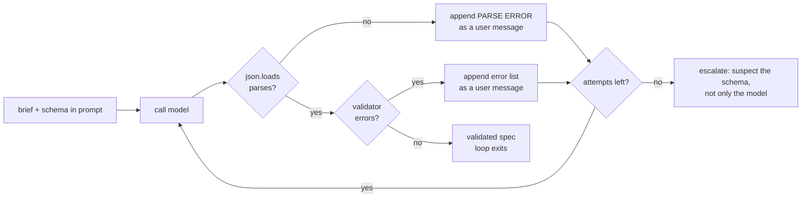

# S04-structured-generation — The schema is the contract

**What this teaches:** getting data instead of prose out of a model is a contract
problem, not a prompting problem — the three ways to get structure (prompt-and-pray,
validate-and-retry, constrained decoding), why the validator is the real interface,
and why schema-valid is never the same as correct.
**Time:** ~75 min with the notebook. **Prerequisites:** S01 (the loop — the retry
you'll build reuses its errors-are-messages rule), S02 (golden sets — the agreement
score is the same instrument thinking).
**Hands-on:** [`notebooks/s04_structured_generation_toy.ipynb`](../notebooks/s04_structured_generation_toy.ipynb)
**Video:** [NotebookLM overview](videos/S04-structured-generation.mp4) — auto-generated summary; preview or review, never a substitute for the notebook.

---

## The theory in depth

### Free text is a liability at a system boundary

An agent that only talks to humans can afford prose. The moment its output feeds
*code* — a scheduler, a database, a gate, another agent — prose becomes a parsing
problem, and parsing prose with regex and hope is where reliability goes to die.
The standard move is the **intake pattern**: free-text brief in, machine-readable
plan out, with a machine check between the model and everything downstream.

That check has a consequence people skip: model output crossing a boundary is
*untrusted input*. You wouldn't `INSERT` a user-submitted form without validating
it; a model's JSON deserves exactly the same suspicion. The validator is not a
nicety bolted on after generation — it *is* the interface. The prompt is a request;
the schema is the contract; the validator is the enforcement.

### Three ways to get structure — one of them is a guarantee

| Approach | Mechanism | Guarantee | Works on | What still fails |
|---|---|---|---|---|
| Prompt-and-pray | instructions and examples in the prompt | none — a request, not a constraint | every API and model | everything, occasionally: fences, preamble prose, dropped fields, wrong types |
| Validate-and-retry | parse + validate locally, append the error as a message, re-ask — capped | eventual conformance, *if* the failure is convergent | every API and model | non-convergence, retry cost and latency |
| Constrained decoding ("Structured Outputs", guided decoding) | schema compiled to a grammar; invalid tokens masked at sampling time | syntactic conformance *by construction* | supporting APIs and runtimes | semantics — and schema-subset limits, refusals, truncation |

Only the third row is a guarantee, and only of *shape*. OpenAI's 2024 launch of
Structured Outputs reported schema adherence on its complex-schema eval going from
under 40% unconstrained to 100% with constrained decoding
([announcement](https://openai.com/index/introducing-structured-outputs-in-the-api/),
[docs](https://platform.openai.com/docs/guides/structured-outputs)). Read that
number precisely: 100% *schema adherence*, not 100% correct.

The second row is the portable fallback — it works on every backend, including
local models whose `response_format` support is partial or absent. The first row
is not a strategy; it's the naive baseline you measure the other two against.

### The retry loop is S01's loop with the validator as the tool

Two things to notice. First, there are **two failure classes** — output that
doesn't parse (fences, prose, truncated) and output that parses but violates the
schema (missing field, wrong type, out-of-enum value). They share a loop but not a
fix, and the feedback text should say which class fired. Second, this is S01's
machinery verbatim: the error goes *into the messages* (errors are messages, not
exceptions), and the attempt cap is a harness property, exactly like `max_turns`.
An uncapped retry loop is a non-terminating agent wearing a trench coat.

### The schema is a product document, not a DTO

A schema for LLM output is not a data-transfer object you derive from a struct.
Every keyword is a decision with a failure mode attached:

- **Every required field is a claim the input must support.** If the brief doesn't
  contain it, the model will still fill it in — hallucination with perfect types.
  OpenAI's own guide warns that the model "will always try to adhere to the
  provided schema, which can result in hallucinations" on unrelated input
  ([docs](https://platform.openai.com/docs/guides/structured-outputs)). A field
  the input can't support belongs in `optional`, or nowhere.
- **Enums are policy.** An enum says what the world is allowed to be. Too narrow,
  and reality itself fails validation — the notebook has a brief whose device is
  not in the enum, and the model is *right* every time it refuses to lie. Repeated
  identical validation errors are telemetry about the schema, not the model.
- **Minimalism is a safety property.** Every field you keep must earn its render
  downstream. Fields nobody reads are fields the model hallucinates that nobody
  checks. This becomes concrete at the next session's gate, where a human reads
  the spec.

The toy hand-rolls a validator over a JSON-Schema subset (`type`, `required`,
`properties`, `enum`) so the checks are visible. The full spec adds `items`,
`anyOf`, `additionalProperties`, and more
([json-schema.org](https://json-schema.org/learn/getting-started-step-by-step)) —
worth knowing exists, and worth reaching for via the real library once your subset
starts growing its tenth keyword.

### Valid ≠ correct

Conformance is checkable by code. Correctness is checkable only against the world.
Two failure classes sail through any validator:

- **The in-enum wrong value** — `priority: "normal"` on a brief that says
  *tomorrow 8am or we lose the account*. Valid; wrong.
- **The unconstrained-field hallucination** — a `parts_mentioned` entry the
  customer never said. An array of strings can't object.

The measurement that catches these is S02's instrument moved one step downstream:
blinded human labels on *n* briefs, recorded *before* generation, then an agreement
score, n/5. Until you've run it, "it validates" is a claim about syntax. After
you've run it, you know which semantic errors your schema is structurally blind
to — which is the thing you actually needed to know.

## Exercises (in the notebook, predict first)

1. Run the naive extractor over the five briefs. **Predict first:** for each
   brief, does the raw output fail to parse, parse but fail validation, or pass?
   Note which failure class dominates — the remedy differs by class.
2. Write the validate-and-retry loop yourself (attempt cell provided): parse,
   validate, append the error as a user message, re-ask, cap at 4 attempts.
   **Predict first:** which briefs converge, and which one *can't* — and why not?
3. Attack the schema. The failing brief keeps failing the same field. Decide
   whether the model or the schema is wrong; fix the enum; re-run to green.
   Then say what *else* you'd challenge in this draft schema.
4. Valid ≠ correct. The mock "upgrades" to constrained decoding: every output is
   schema-valid. **Predict first:** blinded — write down your expected `device`
   and `priority` for all five briefs *before* running. Then score agreement
   n/5 and identify which failures the validator structurally cannot see.

## State of the art (as of August 2026)

| Development | Status | Take |
|---|---|---|
| Constrained decoding is default on hosted APIs: OpenAI Structured Outputs (`strict: true` + `json_schema` response format; vendor-reported schema adherence ~100% vs <40% unconstrained) ([announcement](https://openai.com/index/introducing-structured-outputs-in-the-api/), [docs](https://platform.openai.com/docs/guides/structured-outputs)) | **adopt** | On routes that support it: buys syntax, never semantics. Note the supported-schema subset (no `allOf`/`if`/`then`, root must be an object) and the refusal/truncation edge cases. |
| Prompt → validate → retry, industrialized: Instructor wraps pydantic schemas and re-prompts with the validation error, capped by `max_retries` ([github.com/567-labs/instructor](https://github.com/567-labs/instructor)) | **already in this path** | The notebook's loop with plumbing. Build it by hand once — which you just did — and the library becomes legible instead of magical. |
| Same mechanism in open runtimes: vLLM structured outputs (xgrammar/guidance backends; the `guided_*` params were retired for `structured_outputs` in v0.12) ([docs](https://docs.vllm.ai/en/latest/features/structured_outputs.html)) | **adopt** | When self-hosting: local backends honor JSON-Schema features unevenly. Test your exact schema, and keep the retry loop as the net underneath. |
| Anthropic Structured Outputs, GA across the Claude API: grammar-constrained `output_config.format` with `type: "json_schema"` plus strict tool use; SDK helpers `client.messages.parse()`/`output_format`; documented on Opus 4.5–5, Sonnet 4.5–5, Haiku 4.5 (also a Bedrock subset and Foundry) ([docs](https://platform.claude.com/docs/en/build-with-claude/structured-outputs)) | **newer than this session** | Constrained decoding is now table stakes on every major API. Documented holes: refusals and max_tokens can break schema compliance, and enum casing is not guaranteed. The portable validate-retry fallback still earns its place — for those edges, and for the semantic layer no sampler can fix. |
| Format restrictions can degrade reasoning: "Let Me Speak Freely?" ([arXiv:2408.02442](https://arxiv.org/abs/2408.02442)) | **recognize** | Think in free text, structure the extraction. If a task's quality drops under a schema, split the call: reason first, emit JSON second. |
| JSON mode without a schema (`{"type": "json_object"}`) ([docs](https://platform.openai.com/docs/guides/structured-outputs)) | **ignore** | As a reliability strategy: guarantees parseable, not valid — the vendor's own comparison table says schema adherence: "No". Prompt-and-pray with a parser attached. |
| Schemas became the agent-to-agent contract: MCP tools declare `inputSchema`/`outputSchema` in JSON Schema ([spec 2026-07-28](https://modelcontextprotocol.io/specification/2026-07-28)) | **recognize** | Your validator skills transfer verbatim. A tool schema is the same contract, one hop further downstream. The spec has moved two revisions since 2025-06-18 (2025-11-25, then 2026-07-28) — pin the version you code against. |

## Annotated readings

- **OpenAI, [Structured Outputs guide](https://platform.openai.com/docs/guides/structured-outputs).**
  Extract three things: the supported-schema subset (so you know which JSON-Schema
  features won't survive the trip), the refusal/incomplete edge cases (the schema
  guarantee has holes — handle them), and the "handling user-generated input"
  warning, which is the vendor's own version of valid ≠ correct.
- **OpenAI, [Introducing Structured Outputs in the API](https://openai.com/index/introducing-structured-outputs-in-the-api/)
  (Aug 2024).** Extract the mechanism section: schema → grammar → token masking at
  each sampling step. Then reread the headline number and name exactly what it
  measures (schema adherence) and what it doesn't (task quality).
- **Tam et al., [Let Me Speak Freely?](https://arxiv.org/abs/2408.02442) (2024).**
  Extract the shape of the result, not just the headline: reasoning tasks degrade
  under format restriction, stricter formats degrade more, and
  classification/extraction mostly hold. That shape is your rule for when to split
  thinking from structuring.
- **Instructor, [repo](https://github.com/567-labs/instructor) and docs.** Extract
  the retry contract: the validation error is re-inserted into the prompt, retries
  are capped, and pydantic is the validator. It's the loop you built, with
  production plumbing — read it to recognize your own machinery, not to copy it.

## Misconceptions and failure modes

- **"JSON mode means structured output."** Parseable is not schema-valid. JSON
  mode guarantees the braces balance; it says nothing about your fields. The
  validator still has to run.
- **"Constrained decoding makes the output right."** It constrains the sampler,
  not the truth. An in-enum hallucination validates. Worse, adherence pressure
  makes the model fill fields the input doesn't support — garbage, perfectly typed.
- **"Retry until valid."** Some failures can't converge: an enum that doesn't
  cover reality, a required field the brief can't support. Cap the retries, and
  read repeated identical errors as a schema bug report, not a model bug.
- **"More fields, more value."** Every field is a claim the model must support
  from the input and a line a human must read downstream. Unsupported required
  fields are hallucination magnets. Delete fields that don't earn their render.
- **"Validation errors are noise to suppress."** They're the highest-signal
  channel in the system: re-prompt content for the model, schema-quality telemetry
  for you. Log them; don't swallow them.

## Self-check

Why does "please reply in JSON" fail even with a perfect prompt?

Because a prompt constrains nothing at sampling time — it's a request, and the model
can always drift into fences, preamble prose, or a dropped field. Only constrained
decoding is a guarantee (of shape). Everything between the two is why you validate:
prompts can't be trusted, validators can be audited.

Name the two failure classes of raw model output, and the remedy for each.

Unparseable (fences, prose, truncation) — retry with the parse error as feedback,
or remove the class with constrained decoding. Parseable but schema-invalid —
validator error list appended as feedback, targeted retry. Same loop, different
feedback text; saying which class fired is part of the feedback.

A retry loop fails on the same field three times. Model problem or schema problem?

Suspect the schema: an enum that doesn't cover the domain, or a required field the
input can't support. Repeated identical validation errors are telemetry about the
contract, not the generator. Fix the schema or escalate to a human — retrying a
fourth time is how you pay for the same error again.

Your pipeline emits 100% schema-valid specs. Why isn't that enough to ship?

Valid ≠ correct: wrong in-enum values and hallucinated unconstrained fields
validate fine. Semantic agreement needs blinded human labels and an n/5 score —
and before any spec *executes*, a human gate, which is S05.

## What's next

**S05-consent-gate:** you can now produce a validated, machine-readable plan — and
a schema minimal enough that a human can actually read it. S05 puts that human in
the loop: a gate that renders the spec for explicit approval before anything
executes, where "every field earns its place" becomes "every field earns its render
in under 60 seconds." Validation told you the plan is well-formed; it cannot tell
you the plan should run.
