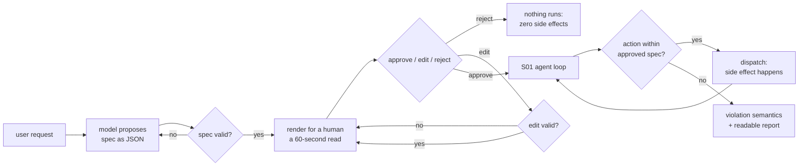

# S05-consent-gate — Approval that actually constrains execution

**What this teaches:** plan-then-execute with a human gate in the seam — and the part
everyone skips: the approved plan becomes *data*, and the harness checks every action
against it before it runs. The prompt states the limits; code holds them. Plus
violation semantics: what the system does when execution would cross the approved
boundary.
**Time:** ~75 min with the notebook. **Prerequisites:** S01 (the loop), S02 (naive vs
governed).
**Hands-on:** [`notebooks/s05_consent_gate_toy.ipynb`](../notebooks/s05_consent_gate_toy.ipynb)
**Video:** [NotebookLM overview](videos/S05-consent-gate.mp4) — auto-generated summary; preview or review, never a substitute for the notebook.

---

## The theory in depth

### The prompt is not a fence

The default way to constrain an agent is to write the constraint down: "never exceed
power level 2," "the nursery is off-limits." That works exactly as well as the model's
cooperation allows. A system-prompt instruction is *advice the model usually takes* —
under an insistent user, an adversarial tool result, or a long distracting context,
compliance degrades, and it degrades **silently**: the transcript says success while
the world says otherwise.

Any constraint that must hold has to live outside the model, in deterministic code,
and it has to fire **before** the side effect, not after. A post-hoc audit of the
transcript finds the violation after the nursery floor is already wet. Enforcement is
pre-dispatch, per-action, and indifferent to how persuasive the conversation got.

The notebook's mock executor makes this concrete: it never even parses the system
prompt containing its limits. Real models do parse them — and then, measurably often,
talk themselves out of them. The gate exists for both cases.

### Plan-then-execute: separate proposing from doing

The consent gate splits the run in two and puts a human in the seam:

1. **Propose.** The agent produces a plan *as data* — a JSON spec naming the scope
   (what may be touched), the ceilings (how far it may go), the off-limits list, and
   a budget (turns or time). Data is the whole point: a prose plan can't be checked
   mechanically; a JSON spec can be compared against every later action.
2. **Consent.** The spec is rendered for a human — short enough to actually read,
   because a gate whose text nobody reads is decoration. The human has exactly three
   moves: **approve** (execution may start, bound by this spec), **edit** (amend the
   spec; the amendment is revalidated and re-presented in full — an amended plan
   restarts the flow, no partial state carries over), **reject** (nothing happens,
   and "nothing happens" must be verifiable: zero side effects).
3. **Execute.** The S01 loop, with one addition: every tool call is checked against
   the *approved* spec before dispatch.

The approved spec is the contract, and it binds the model — not the other way around.
If the human lowered the ceiling and the model still attempts the level it originally
wanted, the check fires. That is the gate working, not a malfunction.

### Why the gate asks once, up front

The tempting fourth move — execution pausing mid-run to ask "level 3, just this
once?" — renegotiates consent under pressure. It destroys the property the gate
exists to create: the user knew exactly what would happen before anything happened.
It also trains the worst habit in this corner of the industry: reflexive approval.
Anthropic measured a 93% approval rate on Claude Code's permission prompts and
responded by automating part of the consent away
([anthropic.com/engineering/claude-code-auto-mode](https://www.anthropic.com/engineering/claude-code-auto-mode)).
A dialog everyone clicks through is a gate that has already failed. Design the
contract so execution never needs to ask; when the run genuinely can't proceed inside
it, that's what abort is for.

### Violation semantics: abort, degrade, ask

When a checked action crosses the approved boundary, something has to happen. There
are three honest options and one dishonest one:

| Semantics | What happens | What it costs | When it's right |
|---|---|---|---|
| **abort** | Stop the run; emit a readable violation report (turn, action, clause, approved vs attempted) | Partial work; the human re-plans | When a half-done state is worse than a clean stop, or when the divergence itself is the harm |
| **degrade-to-cap** | Clamp the action to the approved bound, log the clamp, continue | The run reports success while delivering X′ against an approval of X | Only where divergence is itself safe — and the clamps are reported as loudly as violations |
| **pause-and-ask** | Interrupt for fresh consent mid-run | Predictability; trains reflexive approval | Rarely: low stakes, and the user explicitly asked to be asked |
| **silent divergence** | Execution crosses the boundary; the success message doesn't say so | Everything — this is the only unforgivable option | Never |

Violation semantics is a design decision, not an implementation detail: chosen at
design time, documented, loud. The notebook runs the same adversarial scenario under
abort and under degrade so you can watch what each one costs — and notice that
"which one" is a product question, not an engineering one.

### The pattern predates agents

Terraform has shipped exactly this shape for a decade: `plan` produces the approval
object, `apply` executes precisely it
([docs](https://developer.hashicorp.com/terraform/cli/commands/apply)). CI pipelines
gate deploys on manual approval; migration tools print the DDL and wait; `sudo`
re-asks before the irreversible. Agents didn't invent the consent gate — they made it
necessary at conversation speed, with a probabilistic executor that can *want* to
cross the boundary mid-run. Which is why the load-bearing piece was never the dialog.
It's the per-action check behind it.

## Exercises (in the notebook, predict first)

Run the notebook top-to-bottom. Each experiment has an attempt cell; write your
predictions there before running the solution cell below it.

1. **Clean path.** The scripted owner approves the spec as proposed; the robot
   cleans. Predict the executed actions, the highest power level used, and the
   baby's state — then verify the world matches.
2. **Reject path.** The owner rejects. Predict the side-effect count, then assert
   it. "Nothing happens" is a claim you can test.
3. **Edit path.** The owner's first edit is invalid (the validator refuses it; the
   gate re-presents); the second lowers the power cap. Predict where the run stops,
   and which spec the violation report names — the proposed one or the approved one.
4. **Pressure, two harnesses.** Same model, same prompt, same begging owner — one
   harness enforces, one trusts the prompt. Predict which one notices the ceiling
   breach, and at which turn. Then run the post-hoc auditor over the naive
   transcript: what did it catch, and what had already happened by then?
5. **Degrade semantics.** Rerun the pressure scenario with clamp-and-continue. The
   run completes. Before reading the clamp log, write down what you think diverged
   from the approved spec. Then decide, in a comment: abort or degrade for (a) a
   coding assistant, (b) this robot?

## State of the art (as of August 2026)

| Development | Status | Take |
|---|---|---|
| Approve/edit/reject interrupts are a first-class, documented pattern in agent frameworks ([LangChain human-in-the-loop](https://docs.langchain.com/oss/python/langchain/human-in-the-loop)) | **already in this path** | The triad you just built is the industry vocabulary. The framework supplies the pause; the per-action check against the approved object is still yours to write. |
| Plan mode and permission modes in coding agents: a read-only propose phase, then approval-gated execution (Claude Code; see the auto-mode link below) | **already in this path** | Plan-then-execute, productized. Notice what is enforced in code (tool allowlists, read-only tools) versus what is merely asked of the model. |
| Approval fatigue measured at scale: 93% of permission prompts get approved; vendors now ship classifiers to auto-approve the boring ones ([Anthropic](https://www.anthropic.com/engineering/claude-code-auto-mode)) | **recognize** | The gate's usability failure mode, quantified. Automating consent away is one response; designing runs that rarely need to ask is another. Hold both. |
| MCP elicitation: a server may pause tool execution to request structured user input mid-run ([spec 2026-07-28](https://modelcontextprotocol.io/specification/2026-07-28)) | **recognize** | Pause-and-ask, standardized. Legitimate for missing parameters; as a re-consent channel it formalizes the ambush question. The spec has moved two revisions since 2025-06-18: 2026-07-28 ([release post](https://blog.modelcontextprotocol.io/posts/2026-07-28/)) makes requests stateless and self-contained (no initialize handshake, no `Mcp-Session-Id`), adds per-request capability negotiation and a versioned Extensions framework (Tasks, MCP Apps, Skills over MCP), hardens OAuth/OIDC, and deprecates Roots/Sampling/Logging — check which revision your server pins. |
| OWASP ranks excessive agency a top LLM risk; mitigations include scoping tools narrowly and human approval for high-impact actions ([LLM06:2025](https://genai.owasp.org/llmrisk/llm062025-excessive-agency/)) | **adopt** | The security community's name for this session's problem (the 2026 revision keeps it near the top). The mitigation list reads like your toy's spec fields. |
| OWASP Top 10 for Agentic Applications (Dec 2025): ASI01–ASI10 — Goal Hijack, Tool Misuse, Identity & Privilege Abuse, Agentic Supply Chain, Unexpected Code Execution, Memory & Context Poisoning, Insecure Inter-Agent Communication, Cascading Failures, Human-Agent Trust Exploitation, Rogue Agents ([OWASP GenAI Security Project](https://genai.owasp.org/)) | **recognize** | The 2026 threat vocabulary for the governance sessions — Tool Misuse and Human-Agent Trust Exploitation are this session's gate and its 93% click-through under their new names. |
| Terraform plan/apply as the reference shape: the plan file is the approval object, apply runs exactly it ([apply docs](https://developer.hashicorp.com/terraform/cli/commands/apply)) | **adopt** | A decade of production evidence for the two-phase split. Your agent gate is the same shape at conversation speed. |
| Human oversight in EU law, on a delayed schedule: AI Act Article 14 requires high-risk systems to be built so assigned humans can effectively oversee and intervene ([Article 14](https://artificialintelligenceact.eu/article/14/)), but the Digital Omnibus on AI ([Regulation (EU) 2026/1744](https://eur-lex.europa.eu/eli/reg/2026/1744/oj), in force 27 July 2026) dates the obligations — Annex III high-risk from 2 Dec 2027, Annex I product-embedded from 2 Aug 2028 | **recognize** | What binds today (Aug 2026) is the Art 5 prohibitions (since Feb 2025), GPAI obligations (since Aug 2025), and Art 50 transparency (from 2 Aug 2026) — the high-risk human-oversight duties are not yet enforceable. The gate becomes a compliance artifact on a published schedule; worth knowing before someone asks for yours. |
| Fully autonomous YOLO modes that skip per-action approval | **ignore** | For anything you can't undo: fine for sandboxes and throwaway branches. The moment actions touch state you care about, you are back here building the gate. |

## Annotated readings

- **LangChain, [Human-in-the-loop](https://docs.langchain.com/oss/python/langchain/human-in-the-loop).**
  Extract this: the approve/edit/reject decision shapes and how the interrupt
  carries the pending action to the human. Note what the framework does *not* give
  you: the policy deciding which actions need asking, and any check of what happens
  after approval.
- **Anthropic, [How we built Claude Code auto mode](https://www.anthropic.com/engineering/claude-code-auto-mode).**
  Extract this: the 93% approval-rate measurement — your standing citation for
  approval fatigue — and the design tension of automating consent without hollowing
  it out.
- **HashiCorp, [terraform apply](https://developer.hashicorp.com/terraform/cli/commands/apply).**
  Yes, the man page. Extract this: the plan file as the exact artifact of consent,
  and what the docs say `-auto-approve` is for. Ten years of the two-phase pattern,
  hiding in a man page.
- **OWASP, [LLM06:2025 Excessive Agency](https://genai.owasp.org/llmrisk/llm062025-excessive-agency/).**
  Extract this: the mitigation list — constrain tool scope, require approval for
  high-impact actions, log everything — and map each item to a line of the toy's
  spec or harness.

## Misconceptions and failure modes

- **"It's in the system prompt, so it holds."** The prompt is advice. Under
  pressure — an insistent user, a long context, an adversarial tool result — the
  model talks itself out of it, and the transcript won't tell you. If a limit must
  hold, code holds it.
- **"A confirmation dialog is a consent gate."** If nothing checks later actions
  against what was confirmed, the dialog is theater: consent preceded execution but
  never bound it. The gate is the per-action check; the dialog is its front door.
- **"Degrade is the safe default."** Clamping quietly rewrites the contract — the
  human approved X, the machine delivered X′, the report says success. Degrade only
  where divergence is itself harmless, and log clamps as loudly as aborts.
- **"When unsure, ask again mid-run."** Re-consent under interruption trains
  reflexive approval — the measured 93%. Ask once, in the calm, before anything
  moves; if the run can't continue inside the contract, abort to a report.
- **"Post-hoc audit is enforcement."** Audit finds the violation after the side
  effect. Useful for learning, useless for prevention — the baby is already awake.

## Self-check

Why can't the approved limits live only in the system prompt?

Because the model is a probabilistic executor and the prompt is advice it usually
takes. Under pressure it degrades silently — the run reports success while the
constraint is already broken. A limit that must hold must be checked by deterministic
code, per action, before dispatch.

What turns an approval dialog into a contract?

The approved plan exists as data, and every subsequent action is mechanically checked
against it before it executes — including actions the model believed were fine.
Binding execution to the approved spec (not the proposed one, not the prompt) is what
makes consent real; without the per-action check, the dialog is theater.

Abort vs degrade — what does each cost, and what is never acceptable?

Abort costs partial work and forces a re-plan; degrade costs delivering something the
human never approved under a success message. Both are defensible when chosen at
design time and reported loudly. Silent divergence — crossing the approved boundary
with no report — is the one unforgivable option.

Why does this design refuse mid-run re-approval questions?

Because predictability is the feature: the human consented to a specific shape of
run, in the calm, up front. Mid-run questions renegotiate under pressure and train
reflexive approval (the measured 93% click-through). A gate that asks constantly is
a gate nobody reads.

## What's next

**S06 — Layered detection:** the gate constrains what the agent *planned* to do. It
says nothing about what flows through the run — the user turn that discloses a
crisis, the tool result carrying an injection, the content your policy must catch on
the fly. Next: detection as data-driven policy, in layers, with a false-trigger
budget you actually count.
