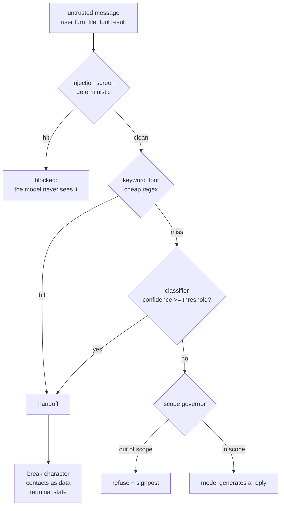

# S06-layered-detection — Safety detection in layers, policy as data

**What this teaches:** why a safety rule in the prompt is advice rather than
enforcement, how a layered detection pipeline (deterministic floor + classifier
pass) routes untrusted input, why the policy belongs in data rather than code,
and why the false-trigger count is a product metric you record, not noise you
tolerate.
**Time:** ~75 min with the notebook.
**Prerequisites:** S01 (the loop), S02 (golden sets, the fixture invariant).
**Hands-on:** [`notebooks/s06_layered_detection_toy.ipynb`](../notebooks/s06_layered_detection_toy.ipynb)
**Video:** [NotebookLM overview](videos/S06-layered-detection.mp4) — auto-generated summary; preview or review, never a substitute for the notebook.

---

## The theory in depth

### The threat model: untrusted text meets a system that can act

Your agent reads text you don't control — user turns, files, retrieved
documents, tool results — and it can act: reply, call tools, store data. Simon
Willison's *lethal trifecta* names the dangerous combination: access to private
data, exposure to untrusted content, and a channel to exfiltrate
([simonwillison.net](https://simonwillison.net/2025/Jun/16/the-lethal-trifecta/)).
Hold all three and you are one crafted message away from a breach; the reliable
fix is to remove a leg, not to ask the model to be careful. OWASP's LLM Top 10
puts prompt injection at LLM01 for the same underlying reason: the model reads
your instructions and the attacker's instructions as one token stream and cannot
reliably privilege yours
([owasp.org](https://owasp.org/www-project-top-10-for-large-language-model-applications/)).

Injection is the adversarial case. The other high-stakes case needs no adversary
at all: a user in genuine crisis telling your system about it. A support bot
that continues business-as-usual through an emergency message is a defect even
though nobody attacked it.

Both cases share a shape: some inputs must never reach the model unscreened,
and some inputs must change what the system does next — deterministically, in
code, not at the model's discretion.

### Why one detector is never enough

Each detection mechanism sits at a different point in cost, recall, and
auditability:

| Layer | Cost per call | Catches | Misses | Failure signature |
|---|---|---|---|---|
| Deterministic patterns (regex, keywords) | ~free | known phrasings, known attacks | paraphrase, novel attacks | brittle; slang false-triggers |
| Small classifier model | cheap, local | semantic variants, paraphrase | off-distribution phrasing | threshold tradeoffs; its own blind spots |
| Frontier-model review | expensive, slow | subtle, context-dependent cases | — | cost, latency, judged-tier problems (S02) |
| Human escalation | most expensive | everything, eventually | — | doesn't scale; fatigue |

No row is sufficient alone. The deterministic floor is auditable and free but
brittle: `fire` matches "fireplace", while "rotten-egg smell and a hissing
noise" contains no keyword at all. A classifier catches the paraphrase but hands
you a threshold to tune and blind spots you haven't mapped. So you layer them —
which is what production containment actually looks like (Anthropic's account of
its own stack:
[How we contain Claude across products](https://www.anthropic.com/engineering/how-we-contain-claude)).

And keep the layers in their place: every row in that table is a *signal*, never
the boundary. Each layer has recall below one and false positives above zero, so
a union of layers is still fallible — a pipeline that stops 99% of attacks is a
sensor that misses 1% of attacks. Enforcement is architectural, and it is what
holds when every signal misses: capability isolation, least-privilege
credentials, tool authorization, egress control, and careful output handling
(the model's output stays untrusted text for everything that consumes it).
Detection routes traffic and buys time; the boundary is what the system
structurally cannot do.

### The mechanism: ordered layers, union for the catastrophic class

The invariants live in the ordering and the exit:

- **Deterministic screens run first.** Nothing model-shaped touches the text
  before the cheap, auditable checks have passed. An injected instruction that
  reaches the model has already won too often.
- **The catastrophic class is a union.** For the one class where a miss is
  unacceptable (the crisis case), *either* layer may trigger. Union buys recall
  at the price of more false triggers — which is exactly why the false-trigger
  counter exists.
- **A trigger is a terminal state, not a log line.** On a crisis trigger the
  system breaks character, delivers the policy-configured handoff, and ends the
  interaction in a distinct, honest stop state. A detector that fires and lets
  the conversation continue is telemetry, not safety.

### Policy as data

Everything the pipeline uses — the keyword list, the threshold, the handoff
text, the emergency contacts, the scope markers — lives in configuration, not
code. Three reasons. First, the policy changes faster than the code: new
attacks, updated contacts, retuned thresholds. A data diff is reviewable in a
way a code refactor is not. Second, some of the data carries its own provenance
requirement: emergency contacts must be verified against official sources, with
the verification date recorded next to them — a contact you never checked is a
liability wearing a safety costume. Third, an explicit config forces the honesty
question: what is *enforced in code*, and what is merely *documented as a
limitation*? Both belong in the record. Pretending the second category is the
first is how safety claims rot.

### The false-trigger counter is a product metric

Over-triggering is a real defect: a tool that routes "the previous guests smoked
indoors, we want a refund" to an emergency handoff is unusable, and it trains
users to dismiss the real handoffs. So the benign half of the fixture bank
matters as much as the attack half. The threshold is not a default you inherit —
it is chosen from a sweep over the bank, and the false-trigger count at the
chosen point is recorded as a product number. And the bank itself is grown
adversarially: you write the red-team list *before* you trust the policy, and
every attack you think of becomes a permanent regression row (S02's fixture
invariant applies here unchanged — a pipeline that flags nothing asserts
nothing).

## Exercises (in the notebook, predict first)

Run the notebook top-to-bottom. Write each prediction down before running the
cell — a prediction you didn't write is a prediction you'll retroactively fix.

1. The keyword floor alone, with naive substring matching: for each bank row,
   predict caught / missed / false-trigger. Watch "fireplace" and "smoked" trip
   a detector that lets a paraphrased gas leak walk straight past.
2. Word-boundary floor in union with the classifier at threshold 0.7: which rows
   flip versus experiment 1, and why is the crisis class a union rather than an
   intersection?
3. The threshold sweep: predict where false triggers appear and where recall
   drops, then pick the operating point from the table and record it together
   with its false-trigger count.
4. The injection, screen off vs screen on: predict what the downstream mock
   assistant does with the unscreened injected message. (It complies. That is
   the point.)
5. Red-team rep: write three attack fixtures of your own *before* opening the
   solution cell. Whatever escapes becomes a permanent bank row and a documented
   limitation.

## State of the art (as of August 2026)

| Development | Status | Take |
|---|---|---|
| Lethal-trifecta framing ([Willison, Jun 2025](https://simonwillison.net/2025/Jun/16/the-lethal-trifecta/)) | **already in this path** | The threat model this session sits in. Remove a leg; don't ask the model to be careful. |
| OWASP Top 10 for LLM Applications, 2026 list (the current release) — prompt injection still first, excessive agency up from sixth to third ([OWASP GenAI LLM Top 10 2026](https://genai.owasp.org/resource/owasp-genai-llm-top-10-2026/)) | **already in this path** | The shared vocabulary. The injection screen and the scope governor map to those two entries (LLM01 and LLM06 in the 2025 numbering). |
| OWASP Top 10 for Agentic Applications (Dec 2025, [OWASP GenAI Security Project](https://genai.owasp.org/)) — goal hijack, tool misuse, identity & privilege abuse, agentic supply chain, unexpected code execution, memory & context poisoning, insecure inter-agent communication, cascading failures, human-agent trust exploitation, rogue agents (ASI01–ASI10) | **recognize** | The agent-era successor vocabulary: the LLM list names the input problems, this one names what autonomous systems do with them. |
| Anthropic's production containment write-up, [How we contain Claude across products](https://www.anthropic.com/engineering/how-we-contain-claude) (May 2026) | **recognize** | The industrial version of this session: environment isolation first, model-level controls second — and the admission that the software you build yourself is often the weakest layer. |
| Constitutional classifiers — input *and* output classifier shells, stress-tested with 3,000+ hours of human red-teaming ([arXiv:2501.18837](https://arxiv.org/abs/2501.18837)) | **recognize** | The research-grade union-of-layers design. Note the metric: red-team hours survived, not a benchmark score. |
| Small open injection classifiers — [Llama Prompt Guard 2](https://huggingface.co/meta-llama/Llama-Prompt-Guard-2-86M) (86M/22M, benign/malicious), [ProtectAI's DeBERTa injection model](https://huggingface.co/protectai/deberta-v3-base-prompt-injection) | **adopt** | When you leave the toy, this is what replaces the notebook's readable-rules classifier: a real, local, free layer 2. You still tune its threshold on *your* bank. |
| Guardrail toolkits and managed layers — [NeMo Guardrails](https://github.com/NVIDIA/NeMo-Guardrails), OpenAI's [moderation endpoint](https://platform.openai.com/docs/guides/moderation) | **recognize** | The same layered pattern, packaged. A vendor default is not your operating point — validate the layer against your own fixture bank. |
| "Safety system prompt" products — one mega-instruction that forbids everything | **ignore** | Prompt-level prohibition is advice to the model, not enforcement. If the whole story is a prompt, there is no detection. |

## Annotated readings

- **Willison, [The lethal trifecta](https://simonwillison.net/2025/Jun/16/the-lethal-trifecta/).**
  Extract: the three legs stated precisely (private data, untrusted content,
  exfiltration channel) and the design rule "remove one leg" — then check which
  leg your own system removes, in code.
- **OWASP, [LLM Top 10 2026](https://genai.owasp.org/resource/owasp-genai-llm-top-10-2026/).**
  Extract: prompt injection (still first) and excessive agency (now third; LLM06
  in the 2025 numbering). Skim the remaining eight as vocabulary for later sessions.
- **Anthropic, [How we contain Claude across products](https://www.anthropic.com/engineering/how-we-contain-claude)
  (May 2026).** Extract: which layers are environmental versus model-level, why
  battle-tested primitives beat custom controls, and the approval-fatigue data —
  a ~93% approval rate is a detection layer failing quietly.
- **Sharma et al., [Constitutional Classifiers](https://arxiv.org/abs/2501.18837).**
  Extract: the input/output classifier split, and the evaluation protocol — they
  define "universal jailbreak" up front and measure in red-team hours survived.
  That is what a defensible detection claim looks like.

## Misconceptions and failure modes

- **"The system prompt says never to..."** Instructions are text the model
  weighs against other text, including the attacker's. Enforcement lives in code
  around the model: screens before it, terminal states after a trigger.
- **Keyword-only detection.** A floor is a floor: paraphrase walks over it,
  slang trips it. It exists because it is free and auditable, not because it is
  sufficient.
- **Detection as the perimeter.** Classifiers and keyword floors are fallible
  signals with measurable error rates; if the pipeline *is* the security
  boundary, one miss is one breach. The boundary is what holds when every
  signal misses: capability isolation, least privilege, tool authorization,
  egress control, careful output handling.
- **Threshold by intuition.** The operating point is a data decision: sweep the
  bank, pick the point, record the false-trigger count next to it. An unrecorded
  threshold is an unmade decision.
- **Log-and-continue on trigger.** If firing the detector doesn't change what
  the system does next, you built telemetry and named it safety.
- **Testing what you built instead of what you fear.** Red-teaming after the
  policy is written measures your implementation; the attack list written first
  measures your imagination. You need both, in that order.

## Self-check

Why can't the system prompt carry the safety rule?

The model reads instructions and untrusted content as one token stream and
cannot reliably privilege yours — that is why prompt injection is OWASP LLM01.
Detection and routing must live in deterministic code around the model: screens
before it, terminal states after a trigger.

Why is the crisis class detected by a union of layers, not one good classifier?

Each layer has a different failure signature: the floor misses paraphrase, the
classifier misses off-distribution phrasing and carries threshold error. For the
class where a miss is catastrophic, either layer firing must be enough — union
maximizes recall, and the price (false triggers) is paid knowingly and counted.

What does the false-trigger counter measure, and why is it recorded?

How many benign bank rows the pipeline misroutes — emergency handoffs on normal
messages. Over-triggering makes the product unusable and teaches users to ignore
real handoffs. The count is recorded next to the chosen threshold so the
operating point is a defensible decision, not an inherited default.

What must happen on a crisis trigger — and what must not?

Must: break character, deliver the policy-configured handoff (contacts as data,
verified against official sources and dated), end in a distinct terminal state.
Must not: continue the interaction, soften the trigger into a log line, or let
the model improvise the handoff text.

## What's next

**S07-repair-loop:** detection handles the catastrophic tail, but most
turn-level defects aren't catastrophic — a character break, a generic reply, a
register slip. Those don't deserve a terminal state; they deserve a bounded
retry with a curated failure view. Next session builds that loop, plus the
honest stop reasons for when it runs out.
