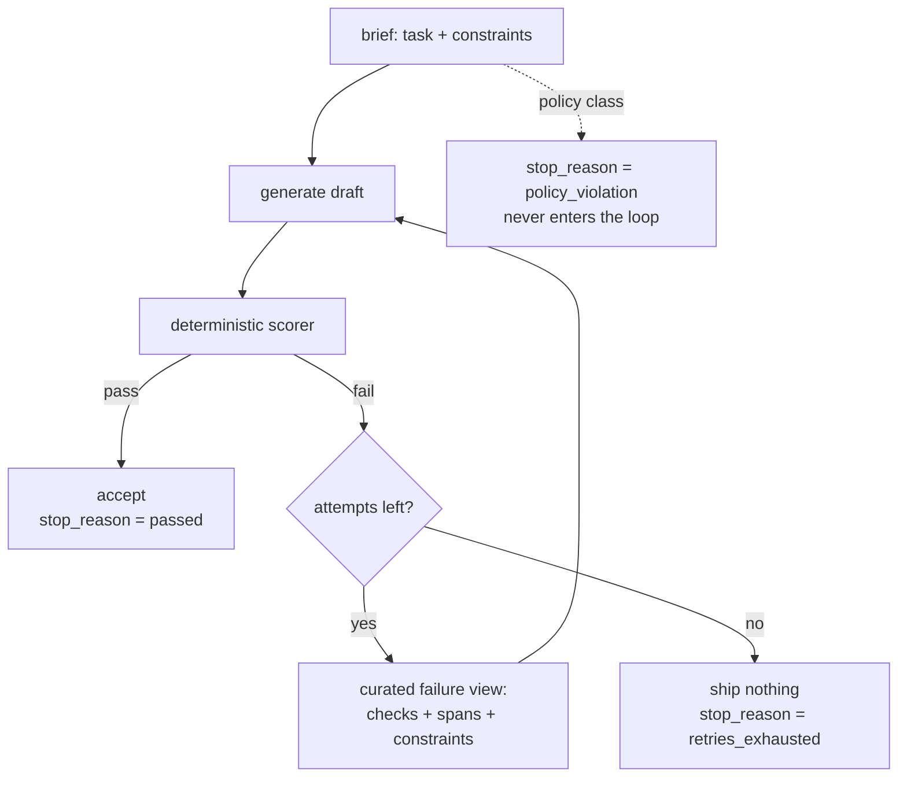

# S07-repair-loop — Bounded self-repair

**What this teaches:** a detected defect can be *repaired* while the run is still
alive — but only if the retry carries new information (a curated failure view), the
loop is capped, and the run always ends with an honest stop reason. Same-context
retry is not repair; it is resampling.
**Time:** ~60 min with the notebook. **Prerequisites:** S01 (the loop), S02
(deterministic checks).
**Hands-on:** [`notebooks/s07_repair_loop_toy.ipynb`](../notebooks/s07_repair_loop_toy.ipynb)
**Video:** [NotebookLM overview](videos/S07-repair-loop.mp4) — auto-generated summary; preview or review, never a substitute for the notebook.

---

## The theory in depth

### Detection without repair is half a mechanism

S02 and S04 gave you cheap, deterministic defect detection: string checks, schema
validation, scope rules. Left alone, a check can only do one thing — fail the run.
That is a strange place to stop. The draft failed one named check; the model can
usually fix a named defect in one more pass; the check costs nothing to re-run.
The repair loop closes that circuit: score the draft, and if it fails, regenerate
with the failure as input — then score again.

This is Anthropic's *evaluator-optimizer* workflow made concrete
([anthropic.com/engineering/building-effective-agents](https://www.anthropic.com/engineering/building-effective-agents)):
one component generates, another evaluates and returns feedback, the loop repeats.
Their two fit criteria are worth memorizing, because they tell you when *not* to
build this: you need (1) clear evaluation criteria, and (2) evidence that refinement
measurably improves the output. A repair loop over a vague rubric is a random walk
with a budget.

### Naive retry is resampling, not repair

The tempting implementation is `for attempt in range(3): draft = generate(prompt)`
— same context, fresh sample. What does that buy you? If each draft passes
independently with probability *p*, then *n* attempts pass with probability
1 − (1 − *p*)ⁿ. You have converted your defect rate into a lottery ticket:

| per-draft pass rate *p* | naive attempts | pass within cap |
|---|---|---|
| 0.50 | 3 | 0.875 |
| 0.25 | 3 | 0.578 |
| 0.05 | 3 | 0.143 |
| 0.05 | 10 | 0.401 |

Three problems. First, the independence assumption is false: failures correlate,
because a prompt that confused the model once usually confuses it the same way
twice — real gains sit below the table. Second, for the defects that matter
(rare, systematic), the lottery is a bad deal: at *p* = 0.05 even ten attempts
fail more than half the time. Third — and this is the measured result, not a
hunch — asking a model to "check your answer" with no external signal makes
reasoning output *worse*, not better (Huang et al., ICLR 2024,
[arXiv:2310.01798](https://arxiv.org/abs/2310.01798)). Intrinsic self-correction
degrades; correction works when the feedback adds information the first attempt
lacked. A retry is worth exactly the new information it carries.

### The failure view is an interface, so design it

If the retry is only worth its new information, the failure view *is* the repair
loop. The SWE-agent paper makes the general version of this point: its
agent-computer interface work showed that feedback *design* — concise, localized,
actionable — moved outcomes more than swapping the underlying model
([arXiv:2405.15793](https://arxiv.org/abs/2405.15793), §2). Your scorer's output
is prompt content (S01's lesson): you are designing a message, and the design
rules are the ACI rules:

- **Name the check that failed.** One line per failure, not the whole rubric.
- **Quote the offending span.** "banned word: 'amazing'" beats "tone issues."
- **State the constraint.** "max 10 words" — the fix target, not just the crime.
- **Change-nothing-else framing.** Without it, models fix the named defect and
  introduce a fresh one in the untouched half of the draft.

What stays out: the full rubric (a wall of text buries the signal — S03's
distraction failure), the run's history, and any prose about how disappointed
the harness is. The failure view is a diff request, not a performance review.

### What context does a retry get?

The one real design decision — and the one the course makes you record. Three
options, in increasing context:

| Retry context | What the model sees | Failure mode |
|---|---|---|
| nothing (naive) | the original brief, again | resampling lottery; no targeting |
| everything (full history) | brief + every failed draft + feedback | anchoring: visible failures are salient, models imitate their own rejected drafts; context grows per attempt |
| curated | brief + failure view (failed drafts dropped) | loses the draft as a starting point for edits; the view must carry everything actionable |

The toy demonstrates the middle row: with failed drafts visible, the mock orbits
its own failures — fixes the length, keeps the banned phrase it can see. This is
why reflection-style systems store *distilled* lessons rather than full failed
trajectories (Reflexion, [arXiv:2303.11366](https://arxiv.org/abs/2303.11366)).
There is no universal right answer — heavy edits favor keeping the last draft,
fresh starts favor dropping it — which is precisely why it is a recorded decision
and not a default. One invariant holds regardless of choice: **regeneration never
grows the approved scope.** The retry rewrites the draft, not the task. If fixing
the failure requires changing what was asked, that is not a retry — it is a new
request, and it goes through the front door.

### The cap is the epistemics; the stop reason is the contract

Why a small cap (three, in the course build): because failures correlate, the
marginal attempt collapses fast. If attempt 2 fails the *same check* as attempt 1,
attempt 4 is not going to save you — it is going to cost you. The cap is not a
compromise with quality; it is the mechanism that converts "unfixable within
budget" into an explicit, inspectable outcome instead of an infinite loop or —
worst of all — a silently shipped failing draft.

Which leaves the contract: every run ends with a `stop_reason` from a closed set.
`passed` means a draft survived the scorer. `retries_exhausted` means the defect
class is unfixable by this generator within budget — that is a *diagnosis
surface*, not an error to swallow; it routes to error analysis (S10). And some
outcomes must never pass through the loop at all: a policy violation is a defect
in the *request*, not the draft, so regenerating it is incoherent. The toy uses
three reasons; the real build adds budget and turn caps and a safety handoff.
The rule is the same at both scales: **no run ends ambiguously.** Downstream code
keys on the reason; a missing reason is a lie about what happened.

## Exercises (in the notebook, predict first)

Run top-to-bottom. Write each prediction as a comment in the attempt cell before
running the solution cell.

1. Score the mock's whole repertoire — its sampling distribution, made visible.
   Which drafts pass, and which check kills each failure?
2. Naive retry: predict the three drafts and the stop reason. Then the seed
   sweep: across 30 seeds, how often does resampling luck through — and what
   does that number have to do with the lottery table above?
3. Curated failure view: predict which attempt passes. Read the exact feedback
   text that was sent — would *you* know what to fix from it?
4. Full-history retry: predict what the visible failed draft does to attempt 2.
   Watch the loop orbit its own failures.
5. The contradictory spec: predict the stop reason. Confirm nothing ships. Then
   answer: which failure classes must never enter the loop at all?

## State of the art (as of August 2026)

| Development | Status | Take |
|---|---|---|
| Evaluator-optimizer as a named workflow ([Anthropic, Building effective agents](https://www.anthropic.com/engineering/building-effective-agents)) | **already in this path** | This session is that workflow with a deterministic scorer. Remember their two fit criteria: clear eval criteria, and evidence refinement helps. |
| ACI finding: feedback design beats model swaps ([SWE-agent](https://arxiv.org/abs/2405.15793), §2) | **already in this path** | The failure view is the highest-leverage surface in the loop. Design it like an interface, because it is one. |
| Intrinsic self-correction degrades reasoning ([Huang et al., ICLR 2024](https://arxiv.org/abs/2310.01798)); apparent self-correction gains trace to external/oracle signals | **already in this path** | The evidence under "naive retry is resampling." Correction needs new information; vibes are not information. |
| Self-generated feedback loops: [Self-Refine](https://arxiv.org/abs/2303.17651), [Reflexion](https://arxiv.org/abs/2303.11366) | **recognize** | The 2023 ancestors: the model writes its own critique. Works when self-critique adds signal; weaker than an external check, and it inherits the model's blind spots. |
| Tool-verified correction ([CRITIC](https://arxiv.org/abs/2305.11738)): critique grounded in external tool output | **recognize** | The conceptual bridge: correction anchored to something outside the model. Your scorer is that anchor, in miniature. |
| Productized reask loops: validators with `on_fail=REASK`, failure message re-prompted verbatim, `num_reasks` cap ([Guardrails AI docs](https://guardrailsai.com/guardrails/docs/concepts/validator_on_fail_actions)) | **adopt** | If already using the framework: exactly this loop, off the shelf — including the cap. Read the failure-pattern reports before chaining validators; reask costs multiply. |
| Make format defects unrepresentable instead of repairing them (`strict: true` schemas, constrained decoding — [OpenAI function-calling guide](https://developers.openai.com/api/docs/guides/function-calling)) | **adopt** | S04's point, restated as triage: construction beats repair for structure. Reserve the repair loop for semantic defects construction can't reach. |
| Calibrated LLM judge as the scorer for semantic defects ([judge playbook](https://hamel.dev/blog/posts/llm-judge/)) | **newer than this session** | S12 calibrates judges against human labels. Until then: deterministic checks carry pass/fail; a judge's verdict is uncalibrated input, not a stop condition. |
| "Reflect on your answer" prompt-only retries | **ignore** | Intrinsic self-correction with zero new signal — measured to degrade. The failure view exists precisely because this doesn't work. |

## Annotated readings

- **Yang et al., [SWE-agent: Agent-Computer Interfaces Enable Automated Software
  Engineering](https://arxiv.org/abs/2405.15793), §2.** Extract this: the ACI
  design principles — feedback concise, localized, lint-like — and the headline
  that interface design moved outcomes more than model choice. Your failure view
  is an ACI for one user: the generator.
- **Huang et al., [Large Language Models Cannot Self-Correct Reasoning
  Yet](https://arxiv.org/abs/2310.01798) (ICLR 2024).** Extract this: without
  external feedback, self-correction *degrades* accuracy; the gains in earlier
  self-correction papers came from oracle labels — i.e., from new information
  smuggled in. This is the paper that tells you what a retry is worth.
- **Anthropic, [Building effective agents](https://www.anthropic.com/engineering/building-effective-agents)
  — the evaluator-optimizer section.** Extract this: the two fit criteria (clear
  evaluation criteria; demonstrable value from refinement) and the examples they
  file it under. Note what they *don't* recommend: looping without a measurable
  criterion.
- **Guardrails AI, [Validator OnFail actions](https://guardrailsai.com/guardrails/docs/concepts/validator_on_fail_actions).**
  Extract this: what REASK actually sends — the validator's error message,
  re-prompted — and how `num_reasks` interacts with chained validators. The
  productized version of your toy, costs included.

## Misconceptions and failure modes

- **"Retry is repair."** Same-context retry is a lottery ticket with a correlation
  discount. If the context carries no new information, you are buying variance,
  not fixing defects — and self-critique with no external signal is measured to
  make things worse.
- **"Paste the whole rubric into the feedback."** The failure view is an
  interface: name the failed checks, quote the spans, state the constraints. A
  wall of rubric text buries the one actionable line — S03's distraction failure,
  self-inflicted.
- **"Keep the failed drafts in context for transparency."** Visible failures
  anchor: the model imitates what it can see, and the loop starts orbiting its
  own rejections (the toy shows this oscillation). Curate the retry context;
  record the decision.
- **"If it keeps failing, raise the cap."** Attempt 2 failing the *same check* as
  attempt 1 means the defect is systematic, not unlucky. Raising the cap converts
  an honest, cheap stop into a slow, expensive one. The cap firing *is* the
  diagnosis.
- **"Everything is retryable."** Policy and scope violations are defects in the
  request, not the draft. Regenerating them is incoherent — the loop rewrites
  drafts, never tasks, and must never grow the approved scope to make a check
  pass.

## Self-check

Why is a same-context retry "resampling, not repair"?

Because the model faces the identical distribution: the retry carries zero new
information, so success is a lottery (1 − (1−p)ⁿ under independence that real,
correlated failures violate). Worse, intrinsic self-critique with no external
signal measurably degrades output. A retry is worth exactly the new information
it carries — which is why the failure view is the mechanism.

What goes into a curated failure view, and what stays out?

In: one line per failed check, the offending span quoted, the constraint stated
as a fix target, and a change-nothing-else framing. Out: the full rubric, the
run history, and any prose that isn't actionable. Feedback is prompt content —
an interface you design, concise and localized.

Why can a visible failed draft hurt the next attempt?

Anchoring: text in context is salient, and models imitate what they can see —
the retry keeps the rejected phrase while fixing the named detail, or orbits
between visible failures. This is why reflection systems store distilled lessons
rather than full failed trajectories, and why "what context does a retry get" is
a recorded decision, not a default.

Why must every run end with a stop_reason from a closed set — and which outcomes must never enter the loop?

Because downstream code keys on the reason: `passed` means the artifact survived
the scorer; `retries_exhausted` means the defect class is unfixable within budget
and routes to error analysis. An ambiguous ending lets a failing draft pass as a
success. Policy violations never enter the loop: the defect is in the request,
not the draft, and regenerating must never grow the approved scope.

## What's next

**S08 — Observability and replay:** the repair loop makes runs *branch* — failed
drafts, feedback messages, a stop reason — and the final transcript alone can no
longer tell you what happened. Next: trace every phase, record every request and
response, and replay a session byte-identical offline.
