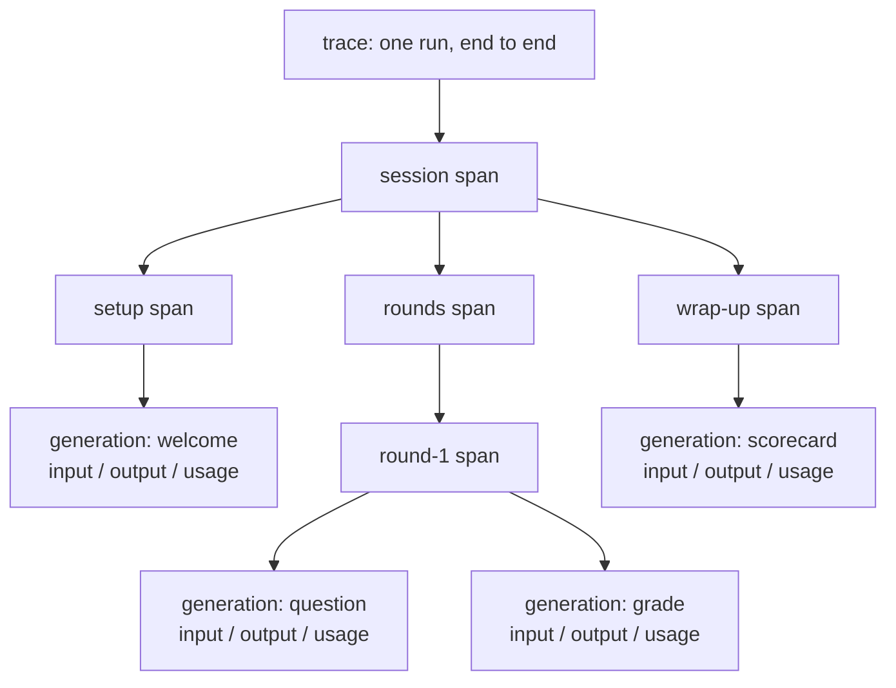
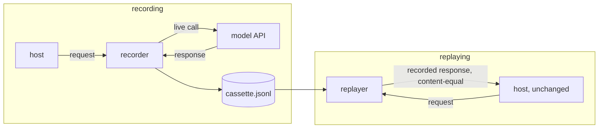

# S08-observability-replay — Traces and deterministic replay

**What this teaches:** how to see what an agent run actually did — the span /
generation / trace data model, telemetry that fails soft instead of taking the
product down, and record/replay cassettes that reproduce a run offline,
content-identical, with zero model calls — plus what replay can never prove.
**Time:** ~90 min with the notebook.
**Prerequisites:** S01 (the loop); S02 (scripted users, fixtures) recommended.
**Hands-on:** [`notebooks/s08_observability_replay_toy.ipynb`](../notebooks/s08_observability_replay_toy.ipynb)
**Video:** [Gemini Notebook overview](videos/S08-observability-replay.mp4) — generated with Google Gemini Notebook (formerly NotebookLM); preview or review, never a substitute for the notebook.

---

## The theory in depth

### Logs say what happened; traces say what caused what

A finished agent run leaves you with questions that are causal and financial:
*which phase produced the bad output? which phase burned the tokens?* Flat logs
can't answer either without archaeology — a log line knows its own text and
nothing about what it belongs to. An agent run is not a list of events; it is a
tree: the session contains phases, phases contain model calls, model calls
contain retries.

The industry converged on one data model for this tree — OpenTelemetry,
Langfuse, and the OpenAI Agents SDK all share the shape:

- **Trace** — one run of the system, end to end. The unit you link to from an
  eval row or an incident.
- **Span** — one named, timed unit of work with a parent. The parent edge is
  the causality; without it you have a pile of timestamps.
- **Generation** — a span specialized for a model call: input, output, model
  identity, token usage. This is where the money lives. The name is Langfuse's
  vendor term ([data model](https://langfuse.com/docs/observability/data-model));
  OTel models the same unit as model/agent spans, not a distinct type.

The payoff is arithmetic: sum `usage` over the generations under a phase span
and you have cost per phase — the number every routing and budget decision
(S11) is made from. No tree, no attribution.

### A span is a question someone will ask later

Design the tree around the questions, not the code structure. A span per
pipeline phase because someone will ask *which phase failed and what did it
cost*; a generation per model call because someone will ask *what exactly did
the model see, and what did it return*. Both directions fail:

- **Too coarse** (one span for the whole run): you are back to grep.
- **Too fine** (a span per function, attributes nobody reads): span spam — you
  pay storage for a tree too noisy to read. Auto-instrumentation defaults tend
  here.

### Telemetry is a sidecar, never on the critical path

The tracing backend will go down. The SDK will rename its API between the
version you pinned and the one that resolved. Both are routine events, which is
why the rule is absolute: **an exception in telemetry must never fail the
product run.** Instrument inline, export at the boundary, catch everything at
that boundary, degrade to no traces, keep the session. The notebook runs both
variants; the unguarded one finishes all the work and then throws the result
away when the exporter raises — the worst outcome, all cost and no artifact.

One more boundary telemetry inherits: traces contain the transcript, usually
the most sensitive data you hold. Vendors' own docs concede the collision —
OpenAI's tracing is unavailable under a Zero Data Retention policy, and its SDK
ships a `trace_include_sensitive_data` switch
([docs](https://openai.github.io/openai-agents-python/tracing/)). What may
leave the machine is a decision, not a default; S11 makes you take it.

### Record/replay: the cassette contract

Wrap the model function. Recording: forward each call, append
`{request, response}` to a JSONL file — the cassette. Replaying: answer each
call from the cassette, but only when the full request matches a recorded one.
Three properties buy almost everything:

- **Offline.** Zero model calls, zero network, zero cost. You can debug on a
  plane.
- **Content-identical.** Same cassette ⇒ same response content ⇒ same
  transcript content: diffable, hashable, bankable as a fixture (S02's fixture
  invariant applies to the cassette itself).
- **Strict matching.** If the code under test changes what it asks for, replay
  fails loudly instead of serving the nearest response. A sequential replayer
  would serve the old "CORRECT" verdict to the new wrong answer — wrong, and
  invisible. Strictness turns the cassette into a behavior-drift alarm.

The lineage is VCR's HTTP cassettes
([vcrpy](https://github.com/kevin1024/vcrpy), itself a port of 2012-era Ruby
VCR); the agent version moves the same contract up one layer, from HTTP to "the
model function." Note that vcrpy's default matcher is method + URL — weaker
than full-body matching. Whatever the layer, know your matcher's strength.

### What replay guarantees — and what it can't

Replay freezes the *model*. It does not freeze your code, and it does not
freeze the world:

- **It can't make your pipeline deterministic.** The wall clock, an unseeded
  RNG, iteration order, volatile envelope fields (response `id`, `created`) all
  leak around the cassette. The cassette guarantees identical model *content*
  for identical requests; whether your transcript is byte-identical is a
  property of the whole pipeline.
- **It can't speak for the model today.** A cassette is a photograph. Providers
  don't promise determinism even at temperature 0 — Thinking Machines measured
  80 distinct completions out of 1000 identical greedy requests, traced to
  batch-size-dependent kernels
  ([post](https://thinkingmachines.ai/blog/defeating-nondeterminism-in-llm-inference/)).
  Re-record cassettes deliberately, the way you re-baseline a golden set.
- **It can't cover what it didn't see.** An unmatched request is the cassette
  telling you the truth: this path was never recorded.

The diagnostic that separates model nondeterminism from yours: **replay the
same cassette twice.** The recorded responses are frozen content (parsed
JSON) — replay cannot
introduce model variance — so if two replays differ, the nondeterminism is
provably in your code. Then the fix is the fixture fix: inject the clock,
inject the RNG, fresh seeded instances per run (one shared seeded RNG
reproduces across processes but drifts across two runs inside one).

## Exercises (in the notebook, predict first)

Run top-to-bottom. Write your prediction in the attempt cell before opening the
solution.

1. **Trace anatomy.** One trivia session, tracer attached. Predict the tree —
   which spans nest where, how many generations — then render it and check the
   token totals.
2. **The dead exporter.** Point the tracer at a backend that raises. Predict
   whether the quiz still completes; compare against the unguarded variant.
3. **Record, then replay.** Record a session to a JSONL cassette; replay it.
   Prove zero live model calls and a content-identical transcript.
4. **Replay as tripwire.** Change one scripted answer, replay the old cassette.
   Predict where it breaks — and what a non-strict replayer would have done
   instead.
5. **The hunt.** A teammate's "harmless" PR adds a dated header and livelier
   praise. Two live runs now differ; so do two replays of one cassette.
   Localize the nondeterminism from the diff, fix it by injection, and prove
   content-identity end to end.

## State of the art (as of August 2026)

| Development | Status | Take |
|---|---|---|
| Trace data model converged: trace → observations (span / generation / event) + sessions at [Langfuse](https://langfuse.com/docs/observability/data-model); traces and spans on by default in the [OpenAI Agents SDK](https://openai.github.io/openai-agents-python/tracing/) | **already in this path** | The tree you build by hand in the notebook is the industry shape. You learned the model, not a vendor. |
| OpenTelemetry GenAI semantic conventions, now in a dedicated repo: core semconv deprecated `gen_ai.*` in v1.42.0 (June 2026); development moved to [semantic-conventions-genai](https://github.com/open-telemetry/semantic-conventions-genai) — inference and agent spans, usage metrics | **adopt** | When you wire real telemetry: vendor-neutral names; emit OTLP and any backend can read your traces. The toy's attributes are a pocket sketch of this — pin the semconv version you emit, because the names are still settling. |
| HTTP cassettes: [vcrpy](https://github.com/kevin1024/vcrpy) (+ pytest-recording) as the CI standard | **recognize** | The lineage of record/replay, one layer down. Default matcher is method+URL — weaker than the toy's full-request match. |
| [LangGraph time travel](https://docs.langchain.com/oss/python/langgraph/use-time-travel): replay from state checkpoints | **recognize** | Different mechanism: re-executes the graph from saved state, which can call the model *again*. A cassette recalls; a checkpoint re-runs. Know which guarantee you're holding. |
| Record & replay as an agent paradigm: [AgentRR](https://arxiv.org/abs/2505.17716) records execution traces, abstracts them into reusable "experience," replays under a check function | **newer than this session** | The cassette idea promoted to a memory mechanism. Same contract, bigger claims — the check function is their strict matcher. |
| Bitwise-deterministic inference: [Thinking Machines on batch invariance](https://thinkingmachines.ai/blog/defeating-nondeterminism-in-llm-inference/) (Sep 2025) | **newer than this session** | Even if providers ship true determinism, it freezes only the model — your clock and RNG still leak. The cassette remains the guarantee you own. |
| Zero-config agent observability in cloud APM suites ([Datadog Agent Observability](https://docs.datadoghq.com/llm_observability/) et al.) | **ignore** | For now — auto-captured spans answer the platform's questions. The span tree is a design artifact; revisit when production telemetry decisions land (S11). |

## Annotated readings

- **Langfuse, [Tracing data model](https://langfuse.com/docs/observability/data-model).**
  Extract the hierarchy — sessions contain traces, traces contain observations,
  observations are typed (span / generation / event) — and why `generation` is
  the special one: the only observation that carries model identity, usage, and
  cost.
- **OpenTelemetry, [Traces concepts](https://opentelemetry.io/docs/concepts/signals/traces/).**
  Extract the span record itself: `trace_id`, `parent_id`, start/end,
  attributes, status. The toy's `Tracer` is this page with the distributed
  parts amputated — note what was amputated (context propagation across
  processes) and when you'd need it.
- **vcrpy, [README](https://github.com/kevin1024/vcrpy).** Extract the cassette
  contract and the record modes (once / new episodes / none) — the policy knob
  for when re-recording is allowed. Then ask what the equivalent modes would be
  for a model cassette.
- **OpenAI Agents SDK, [Tracing](https://openai.github.io/openai-agents-python/tracing/).**
  Extract three things: what gets traced by default (one span kind per workflow
  concept), the disable switches, and the two confessions — tracing unavailable
  under ZDR, and `trace_include_sensitive_data` existing at all. Telemetry
  inherits the privacy boundary.

## Misconceptions and failure modes

- **"Tracing is structured logging."** A log line has no parent. The tree is
  what makes "which phase burned the tokens" an arithmetic question instead of
  an afternoon of grep.
- **"Temperature 0 (or a seed) gives me replay."** Provider-side determinism is
  best-effort and does not survive model version changes — and even true
  inference determinism freezes only the model, not your clock or RNG. The
  cassette is the only guarantee you own.
- **"The cassette matched, so my code is deterministic."** It proves the
  requests matched. Nondeterminism in *rendering* — timestamps, draws from a
  global RNG — never touches the request. Hence the diagnostic: two replays of
  one cassette, not one.
- **Telemetry on the critical path.** An unguarded exporter converts a
  monitoring outage into a product outage — after the work is done and paid
  for. Catch at the boundary; degrade to no traces.
- **"Record everything, forever, just in case."** Cassettes rot (prompts
  change, models drift) and transcripts are usually the most sensitive data you
  hold. Re-record deliberately; keep telemetry inside the privacy boundary.

## Self-check

What does a generation span carry that a plain span doesn't, and what question does that answer?

Input, output, model identity, and token usage. That is what makes "which phase
burned the tokens / produced the bad output" answerable by summing over a
subtree — cost and quality attribution per phase.

Why must a replayer match requests instead of serving responses in order?

Sequential serving hides behavior drift: change the code's questions and it
still gets the old answers, producing a silently wrong transcript. Strict
matching converts drift into a loud mismatch — the cassette doubles as a
determinism audit of your own code.

Two replays of the same cassette differ. Where is the bug, and why can you be certain?

In your code, necessarily. The model's responses are frozen content (parsed
JSON) in the cassette, so replay cannot introduce model variance. The leak is
on your side —
wall clock, unseeded RNG, iteration order. Find it in the diff, then inject and
seed it.

Why is fail-soft telemetry a correctness requirement and not polish?

Because the exporter shares the process with the product. If its exception
propagates, a monitoring outage becomes a product outage — typically after the
expensive work is done, so you pay for the run and lose the result. Catch at
the boundary, degrade to no traces, never fail the session.

## What's next

**S09 — Evidence reports:** you can now capture a run completely and replay it
offline; next is compression. S09 turns one recorded session into a debrief a
depleted reader can trust in thirty seconds without opening the raw transcript —
and the trace pointer at the bottom of that report is why this session came
first.
