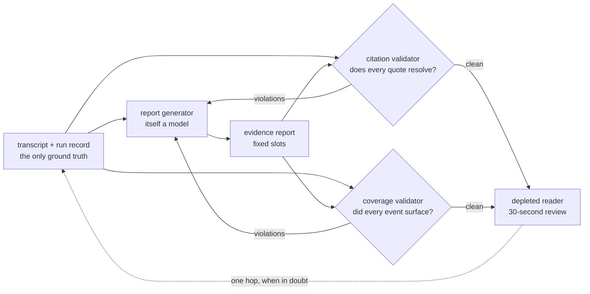

# S09-evidence-reports — The report a depleted reader can trust

**What this teaches:** an evidence report is an *interface to what happened*, not a
summary of it — fixed sections that pre-answer a depleted reviewer's questions,
claims phrased as checkable observations, and two deterministic validators
(citation, coverage) that catch the two lies checkable against the record — and
certify checkability, not honesty.
**Time:** ~75 min with the notebook. **Prerequisites:** S02 (checker tiers, the
fixture invariant); S08 (traces and replay) helps but is not required.
**Hands-on (easy):** [`notebooks/s09_evidence_report_toy.ipynb`](../notebooks/s09_evidence_report_toy.ipynb)
**Hands-on (hard, optional):** [`labs/s09_debrief.md`](../labs/s09_debrief.md) — after the notebook.
**Video:** [Gemini Notebook overview](videos/S09-evidence-reports.mp4) — generated with Google Gemini Notebook (formerly NotebookLM); preview or review, never a substitute for the notebook.

---

## The theory in depth

### The reader is depleted, and the log is write-only

Nobody rereads a forty-turn transcript. The raw log is where truth lives, but as a
reading experience it is write-only: the information is all there, evenly weighted,
in chronological order, with no signposts. The report exists because the reader who
matters most is you at your worst — thirty seconds after a hard session, attention
spent, wanting to know one thing: *what just happened, and can I trust it?*

The transferable property comes from code review. Google's reviewer guide
([google.github.io/eng-practices](https://google.github.io/eng-practices/review/reviewer/looking-for.html))
is, structurally, a list of questions a good change description pre-answers — the
author writes so the reviewer never has to dig. Treat your report's reader as a
reviewer with a fixed question list:

1. What was I trying to do?
2. Did it finish — and if it stopped, why?
3. What actually happened — the moments that mattered, not all of them?
4. Did anything safety-relevant happen?
5. What do I do next?
6. What did it cost, and where is the proof?

A report that answers all six, in fixed slots, with surprises first, passes the
thirty-second review. A chronological recap — "turn 1 the user said, turn 2 the
assistant replied" — answers none of them quickly, even when it is perfectly
faithful. Faithfulness is not the bar; *sufficiency at reading time* is.

### Fixed sections are a feature, not a template fetish

The anatomy that converged across incident postmortems, code-review descriptions,
and clinical notes is the same handful of slots:

| Slot | Content | Rule that keeps it honest |
|---|---|---|
| Goal | The user's objective, **in the user's own words** — quoted, not paraphrased | The quote must appear verbatim in the opening turn |
| Outcome | What the run record says: stop reason verbatim, turns used | Never inferred from how the last message *felt* |
| Moments | Annotated events, each with an event id, a turn reference, and a verbatim quote. The toy cites every logged event (five in the fixture). A production report may highlight 2–4 plus a dedicated safety slot — coverage still keys on ids, not highlight count | Every quote must resolve to its cited turn; every logged id must surface |
| Safety | The safety events, or an explicit "none logged" | Silence is forbidden; absence must be stated |
| Next step | One concrete increment | Observable, not motivational |
| Proof | Cost/latency, and a pointer to the raw trace | One hop from any doubt to the evidence |

Fixed order is doing cognitive work: after three sessions the reader knows exactly
where the safety slot lives, and a non-empty safety slot *surprises in the right
place*. The trace pointer is load-bearing in the other direction — the report never
replaces the log, it indexes it. A report with no path back to the transcript is
asking to be trusted on authority it has not earned.

### Observations, not grades

"Good session, 8/10" is a claim about a person: unverifiable, arguable, and it
invites the reader to negotiate with the report instead of checking what happened.
"You seated the second bracket without the torque note (turn 11)" is a claim about
the transcript: checkable, and it survives being checked. Blameless-postmortem
culture made this the convention for incident reports decades ago — contributing
causes and timelines, not verdicts
([sre.google/sre-book/postmortem-culture](https://sre.google/sre-book/postmortem-culture/)).
The same rule applies here, and it has a hard edge: **a claim that cannot resolve
to a turn does not belong in the report.** Quality judgments that can't be grounded
that way (was the next step actually *good*?) are a judged-tier question, and the
judged tier waits for judge calibration — that is S12's job.

### Fabrication and omission: the two checkable lies

The report generator is itself a model, and summarization research named its
failure modes years ago: intrinsic hallucination — the summary contradicts the
source — and extrinsic hallucination — the summary asserts what the source cannot
support ([Maynez et al. 2020](https://arxiv.org/abs/2005.00661)). For reports over
transcripts the practical forms are sharper:

- **Fabrication.** An annotated moment whose quote never appears; a turn reference
  that points one turn off; an outcome the run record contradicts. Characteristic
  of LLM summarizers: the tidy paraphrase presented as a quote — fluent, same
  meaning, not what was said.
- **Omission.** Every sentence accurate, every quote verbatim — and the safety
  event simply absent. The harder lie: nothing on the page is false, so no amount
  of reading the page detects it. Note that omission is in neither hallucination
  category above; the taxonomy covers additions, and the report's signature lie is
  a subtraction.

Each lie has exactly one defense, and both are deterministic:

- **Citation validator.** Checks exactly three mechanical properties: every quoted
  string appears verbatim in the turn its reference cites (substring presence);
  the goal quote appears in the opening user turn; the stated stop reason matches
  the run record. Catches fabrication. This is S02's fixture
  invariant pointed at a generator: check the claims against ground truth before
  the reader has to. Note what the check does *not* establish: that the cited
  passage supports the claim made next to it. Support is entailment — a
  judged-tier property (S12's tier), not a substring property. APIs are absorbing
  the resolution half — Anthropic's Citations feature
  returns claim-level pointers it *guarantees* resolve into the provided documents
  ([docs.claude.com](https://docs.claude.com/en/docs/build-with-claude/citations)) —
  and the guarantee stops there: the pointer always lands inside the supplied
  text, but whether the passage it lands on is relevant, or backs the claim, is
  not promised.
- **Coverage validator.** Checks one property: every event the harness logged
  during the run — identified by a stable event **id**, not by turn number —
  surfaces in the report (the toy requires each id in the moments list; safety
  ids also in the safety slot). Turn numbers stay for display and citation.
  The wrong event narrated at the right turn fails: the ids don't match. Two
  events sharing one turn cannot mask an omission. Catches omission of a
  logged event. What it still cannot catch: the report names the right event
  and *describes it wrongly* — wording, emphasis, unsupported interpretation —
  because identity is not accurate narration. No API can do this half for you:
  only your harness knows which event ids were logged.

A report is *checkable* iff both hold — and checkable is not honest. One
validator alone certifies nothing: the
citation-clean report that dropped the safety event is the canonical failure, and
the notebook makes you watch it happen. But both together still leave the lies no
substring check can see:

- **Unsupported interpretation** — every quote verbatim, the gloss on them spun.
- **Misleading emphasis** — everything cited, weighted so the wrong moment reads
  as the story.
- **Wrong notes, stale figures** — numbers and claims that are not quotes (no
  citation resolves them) and not logged events (coverage never asks).
- **Privacy leakage** — a verbatim quote that should never have left the
  transcript is citation-clean by construction.

The validators are the floor: they make the two mechanical lies expensive. What
the citations *mean* stays where it always was — with the depleted reader and the
one-hop path, and eventually with S12's calibrated judge.

### The thirty-second review test

The acceptance test is behavioral, not textual. Hand the report to the reader cold
— no transcript — and have them answer the six questions, timed. If they can't, the
report failed, however accurate it is. *Then* open the raw log and check the
report didn't lie. Accuracy is the entry fee; the bar is a depleted reader
finishing the review in thirty seconds and being right. You will run this test on
the toy in the notebook, and then again on a real session's report — where the
depleted reader is you.

## Exercises (in the notebook, predict first)

1. Read the raw transcript once. Generate the honest report, then run the
   thirty-second test: answer the six reviewer questions from the report alone,
   timed. Then verify your answers against the transcript. Any question you
   couldn't answer is a report defect, not a reader defect.
2. The chronological recap: run the naive turn-by-turn summary through the same
   six-question check. Which questions can it structurally not answer — and
   which does it technically contain but bury?
3. The fabricated citation: build the citation validator. Watch the honest report
   pass and the "tidied" variant — paraphrased quotes presented as verbatim —
   fail. Then weaken the validator to check only that turn numbers exist, and
   watch which lies slip through.
4. The omission lie: a variant report drops the safety event and keeps every
   remaining sentence accurate. Run the citation validator on it (clean!), then
   build the coverage validator and catch it. State the invariant each validator
   enforces.
5. The failed run: a second transcript hits the turn cap mid-task. Generate its
   report. What must the outcome slot say? Then run the validators on
   `write_report_rounded_up` (declares the run complete) — which one catches
   that, and which lie does *neither* validator catch? (`write_report_reassuring`
   is the omission variant from exercise 4, not this one.)

After the notebook, optional hard path: [debrief + one real round](../labs/s09_debrief.md) — same session, live or cassette. Skip it and the easy path is still complete.

## State of the art (as of August 2026)

| Development | Status | Take |
|---|---|---|
| Citation grounding as an API primitive: Anthropic's Citations parses responses into claims with pointers *guaranteed* to resolve into the provided documents ([docs.claude.com](https://docs.claude.com/en/docs/build-with-claude/citations)) | **adopt** | When you move off mocks, the guarantee is the pointer: every citation resolves into a supplied document. That the cited passage actually *supports* the claim stays model judgment — and whether you cited the right things, or dropped the safety event, remains yours. |
| ALCE: automatic citation evaluation — recall (is every statement entailed by its citations?) and precision (is every citation pertinent?), NLI-judged ([Gao et al., arXiv:2305.14627](https://arxiv.org/abs/2305.14627)) | **recognize** | Your citation validator is the deterministic special case: substring match instead of entailment. But ALCE's recall is statement support and its precision is citation relevance — claims judged against their own citations. Neither asks whether the report covered the run's events; that remains your coverage validator's job. |
| Deep-research products ship long, cited reports — and their own disclosures admit hallucinated facts, weak uncertainty calibration, and citation errors at launch ([OpenAI, Feb 2025](https://openai.com/index/introducing-deep-research/); [system card](https://cdn.openai.com/deep-research-system-card.pdf)) | **recognize** | The frontier's flagship report generator ships with known citation defects. Validation plus spot-checking against sources is the industry norm, not paranoia. |
| Blameless postmortems: fixed anatomy, timeline with evidence, contributing causes not verdicts, written for readers who weren't there ([Google SRE book](https://sre.google/sre-book/postmortem-culture/)) | **already in this path** | This session's report anatomy is that convention pointed at agent sessions. "Blameless" and "observations, not grades" are the same move. |
| Faithfulness as a measured property of summaries: intrinsic vs extrinsic hallucination ([Maynez et al., arXiv:2005.00661](https://arxiv.org/abs/2005.00661)) | **recognize** | The taxonomy names the addition lies (contradiction, unsupported claims). Omission — the report's signature lie — is in neither bucket, which is why you build a separate coverage validator. |
| LLM-judged faithfulness metrics: decompose the answer into claims, judge each against the context (e.g. [RAGAS faithfulness](https://docs.ragas.io/en/stable/concepts/metrics/available_metrics/faithfulness/); [paper](https://arxiv.org/abs/2309.15217)) | **newer than this session** | A judged tier for reports — useful at scale, but it is a model grading a model, uncalibrated until S12. The deterministic validators stay the floor. |
| Fully automated report chains: AI summarizes the run, the summary feeds the dashboard, no human ever opens the trace | **ignore** | Independent analysis keeps finding these systems well short of human care ([futuresearch.ai, Feb 2025](https://futuresearch.ai/blog/oaidr-feb-2025/)). A report without a one-hop path to raw evidence is a hallucination delivery mechanism. |

## Annotated readings

- **Google, [What to look for in a code review](https://google.github.io/eng-practices/review/reviewer/looking-for.html).**
  Extract the transferable property, not the code advice: a good description
  pre-answers the reviewer's questions. List the questions your own report's
  reader has, and check each maps to a slot.
- **Google SRE book, [Postmortem culture](https://sre.google/sre-book/postmortem-culture/).**
  Extract the anatomy — summary, impact, timeline, root cause, action items — and
  the reason blamelessness is a *correctness* property: verdicts make people
  defend themselves; observations make them verify.
- **Gao et al., [ALCE: Enabling LLMs to Generate Text with Citations](https://arxiv.org/abs/2305.14627) (EMNLP 2023).**
  Extract the recall/precision definitions and the finding that fluency is easy
  while attribution is the measurable hard part. Note the metric is NLI-judged:
  your substring validator certifies that the quote exists where cited, never
  that it supports the claim — the entailment question stays judged-tier.
- **Maynez et al., [On Faithfulness and Factuality in Abstractive Summarization](https://arxiv.org/abs/2005.00661) (ACL 2020).**
  Extract the intrinsic/extrinsic split — then notice what it omits: a summary
  that only subtracts. That gap is your coverage validator.

## Misconceptions and failure modes

- **"Accurate means honest."** A report where every sentence is true can still
  lie by subtraction. Omission is invisible to any check that only reads the
  report — coverage must be derived from the run record.
- **"The summary replaces the transcript."** The report indexes the log; it never
  supersedes it. Ship every report with a trace pointer, and treat any report
  without one as unverified by construction.
- **Grades as evidence.** "8/10" cannot be checked against a turn, so it teaches
  the reader to argue with the report. Observations cite turns and survive
  checking; verdicts belong to the calibrated judge you don't have yet (S12).
- **The chronological recap as report.** Narrating everything is summarizing
  nothing: in the notebook the safety event sits at line 9 of 16, weighted the
  same as the small talk. Fixed slots with surprises first exist precisely for
  the reader who will not scroll that far.
- **The unvalidated generator.** The report writer is a model with documented
  fabrication modes; shipping its output unchecked is shipping confidence you
  haven't earned. The validators are cheap, deterministic, and always on.

## Self-check

Who is the report's reader, and what does that impose on the format?

The user at their most depleted, thirty seconds after a hard session. That imposes
fixed slots that pre-answer a known question list, surprises first (safety never
buried), and a one-hop pointer to the raw evidence. Faithful prose that takes
twenty minutes to mine fails this reader even when every sentence is true.

Why "observations, not grades"?

A grade is an unverifiable claim about a person; an observation is a checkable
claim about a transcript. Every claim in the report must resolve to a turn —
claims that can't (quality judgments) are the judged tier's job, deferred until
judge calibration in S12.

A report in which every sentence is accurate still lies. How, and what catches it?

By omission — the safety event simply absent. Nothing on the page is false, so no
check that reads only the page can catch it. The coverage validator catches it by
deriving what must surface from the run record: every logged event appears in the
report.

What do the citation and coverage validators each catch, and why do you need both?

Citation catches fabrication: quotes that don't appear in their cited turn, wrong
references, a stop reason the run record contradicts (including a cap that fired
but the outcome slot rounded up). Coverage catches omission: logged events
(safety, setbacks, milestones) whose **ids** never surface in the report. A
wrong event at the right turn fails on id mismatch. Each passes reports the
other fails, so you need both — but the conjunction buys *checkability*, not
honesty: support, emphasis, unquoted numbers, and leakage still belong to the
reader. Identity is not accurate narration.

## What's next

**S10 — Error analysis:** a good report lets one depleted reader trust one
session. But across a suite of runs, the failures themselves are a pile of raw
evidence no one has read — and reading them, open-coded, is how the eval suite
grows. Next: failure transcripts into a labeled taxonomy, and the taxonomy into
new golden tasks.
