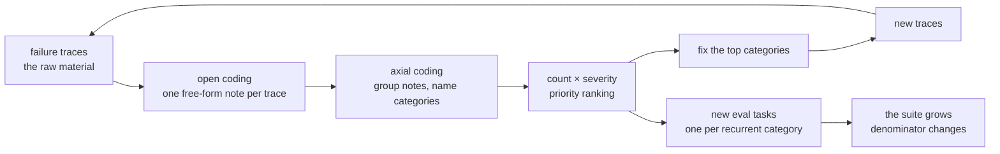

# S10-error-analysis — Failures into taxonomy, taxonomy into evals

**What this teaches:** open-coded error analysis — reading failure traces into
free-form notes, grouping the notes into a labeled taxonomy, prioritizing by
frequency × severity, and converting each recurrent category into a new eval
task. The eval suite grows from observed failures, not from imagination.
**Time:** ~90 min with the notebook.
**Prerequisites:** S02 (eval suites as measurement instruments); S08 (you need
traces you can actually pull).
**Hands-on:** [`notebooks/s10_error_analysis_toy.ipynb`](../notebooks/s10_error_analysis_toy.ipynb)
**Video:** [NotebookLM overview](videos/S10-error-analysis.mp4) — auto-generated summary; preview or review, never a substitute for the notebook.

---

## The theory in depth

### The number says something is wrong; reading says what

Your suite says 6/9. Two different systems can both score 6/9 — one failing on
safety, one failing on formatting — and the number cannot tell them apart. The
aggregate is a smoke detector: it tells you there is a fire and roughly where,
but it never tells you what is burning. Treating the pass rate as the result —
tuning whatever moves it — is how teams ship a green suite over a red product.

Error analysis is the discipline that converts the number into work. The loop:

Hamel's field data is blunt about the ordering: the most common mistake in
applied AI is *skipping* this loop and going straight from "the number moved"
to a fix ([hamel.dev/blog/posts/field-guide](https://hamel.dev/blog/posts/field-guide/)).
A fix chosen before the failures are classified fixes the loudest bug, not the
most frequent one.

### Open coding: let the data name the categories

The method is borrowed, not invented. Qualitative researchers have done
"categories from data" since Glaser & Strauss's grounded theory (1967):
**open coding** means reading each artifact and writing a free-form note about
what happened, with no fixed list of allowed answers
([overview](https://en.wikipedia.org/wiki/Grounded_theory)). The applied-AI
version, per Hamel:

1. Pull a pile of failure traces — from your suite's failures, from dogfooding,
   from user complaints. This is why S08's trace capture matters: you cannot
   read what you did not record.
2. Read the *whole* trace, not the final turn. Write one note per failure in
   plain language: what went wrong, for the user, in this conversation.
3. Label the **most upstream** error. Failures cascade: a misread user intent
   in turn 1 produces a wrong tool call in turn 3 and a confident nonsense
   answer in turn 4. If you label the turn-4 symptom you will "fix" the answer
   text and leave the cause. The earliest error is the tractable one; the rest
   are usually symptoms of it.

Why not write the category list first? Because a list written before reading
encodes what you already believe — and the failures you haven't imagined are
precisely the ones the exercise exists to find. Forced into a priori buckets,
a novel failure gets misfiled or dumped in "other." The diagnostic: **if
"other" is your biggest bucket, your taxonomy is wrong.** In the notebook you
will guess the categories before reading, then watch the data grade your
guess. Most people's guesses miss at least one bucket that turns out to be
real.

### Axial coding: a taxonomy that earns its rows

**Axial coding** is the grouping pass: lay the notes side by side, cluster the
ones describing the same underlying cause, and name each cluster. The output
is a taxonomy — a table whose every row has to earn its place:

| Taxonomy row | Verdict | Why |
|---|---|---|
| "the model was wrong" | **category collapse** | Fits every failure, suggests no fix. A category too broad to disagree with is a label, not an analysis. |
| "bot said 250 g for a stick of butter in f11" | **over-shattered** | That is a *note*, not a category — one trace, no pattern. Everything at n=1 gives you no prioritization signal. |
| "unit-mismatch (n=3: f01, f07, f11)" | **earns its row** | Narrow enough to be wrong, broad enough to rank, and it names its fix: honor requested units. |

Two invariants make the table trustworthy:

- **Every row cites ≥1 trace reference.** A category you cannot point to in a
  real trace is astrology. The references are also how a skeptic (or future
  you) audits the taxonomy without redoing the reading.
- **The "other" bucket is a sensor, not a landfill.** It should stay near
  empty; when it grows, the taxonomy needs a new row, not more force.

Then quantify. Count traces per category, and weight by severity, because raw
frequency lies about priority: a safety-miss at n=2 can outrank a formatting
annoyance at n=8 — but you need both columns to *argue* that, and the argument
is what a reviewer or teammate will demand.

### From taxonomy to eval growth

A prioritized taxonomy is a to-do list with two kinds of items:

- **Fixes**, for the top categories — prompt changes, guardrails, tool changes.
- **New eval tasks**, one per recurrent category, each *isolating* the failure
  class: a scripted input that reproduces it on demand. The task must fail on
  the old system (that is what "isolates" means — the failure is provably
  present), pass on the fixed system, and its check must still pass the S02
  fixture invariant (bare fixture FAILs, reference PASSes). Mechanically
  assertable categories get deterministic checks; taste-level categories get
  judged criteria — which stay labeled *uncalibrated* until S12.

This is the eval-growth half of the session: the suite you built top-down in
S02 now grows bottom-up from observed failures. The denominator changes —
your /6 becomes /9 — and that is the point, not a bookkeeping nuisance. Each
new task converts a real, observed failure mode into a permanent regression
guard. Anthropic's capability/regression split is the same motion viewed from
the other end: today's failure-grown task is tomorrow's merge gate
([anthropic.com/engineering/demystifying-evals-for-ai-agents](https://www.anthropic.com/engineering/demystifying-evals-for-ai-agents)).

And the loop does not end. After the fixes ship, read the new failures:
categories die, new ones appear, the taxonomy is a living document. The one
thing you may not do is automate the reading away. Keyword rules and embedding
clusters are legitimate *triage* — they order the reading queue — but as a
substitute they file confidently and wrong, and the notebook will show you the
ugliest version of that: the auto-filer undercounting the safety bucket
exactly where it has no keywords. The failure you have not imagined has no
keyword and no cluster centroid yet.

## Exercises (in the notebook, predict first)

Run top-to-bottom. Write predictions as comments *before* running each
experiment — including your guessed categories, which the data will grade.

1. **Open coding.** Read three traces closely; write one free-form note each.
   Before that: write down the 2–3 category names you *guess* the pile
   contains. Keep the guess — experiment 2 scores it.
2. **Axial coding.** Label all twelve traces with categories of your choosing;
   count them; rank by frequency × severity. Check your "other" bucket. How
   many of your guessed categories survived?
3. **The auto-filer.** Write a keyword-only classifier — no re-reading the
   traces — and score it against your hand labels. Predict the agreement rate
   and which bucket gets undercounted. Then explain why the undercounted
   bucket is the worst one to get wrong.
4. **Category → guard.** Convert the top-ranked category into a deterministic
   check plus one isolating eval task. Predict, then verify: the old engine
   fails the task, the patched engine passes it, the bare fixture fails the
   check.

## State of the art (as of August 2026)

| Development | Status | Take |
|---|---|---|
| Error analysis as open coding + axial coding on traces, then failure-grown evals (Hamel, [A Field Guide to Rapidly Improving AI Products](https://hamel.dev/blog/posts/field-guide/), 2025) | **already in this path** | The assigned reading and the exact loop this session rehearses: notes first, categories second, evals third. |
| The method itself is 60 years old — open/axial coding from grounded theory (Glaser & Strauss, 1967; [overview](https://en.wikipedia.org/wiki/Grounded_theory)) | **already in this path** | Applied AI rediscovered a social-science method. Categories emerge from data; "constant comparison" is your axial pass. |
| MAST: a research-grade failure taxonomy for multi-agent systems — 14 failure modes in 3 categories, open-coded from 200+ annotated traces ([arXiv:2503.13657](https://arxiv.org/abs/2503.13657)) | **recognize** | A published top-down taxonomy to sanity-check your bottom-up one against. Note they built it with the same process you just practiced, at annotation-team scale. |
| Eval tasks grown from observed failures; capability evals graduate into the regression floor ([Anthropic](https://www.anthropic.com/engineering/demystifying-evals-for-ai-agents)) | **adopt** | Where your new tasks land. The denominator change is the mechanism working, not scope creep. |
| Platforms productize the loop: LangSmith auto-clusters traces for analysis ([langchain.com/langsmith/observability](https://www.langchain.com/langsmith/observability)); Langfuse's academy teaches the manual version ([langfuse.com/academy/monitoring/error-analysis](https://langfuse.com/academy/monitoring/error-analysis)) | **recognize** | Clustering is triage for the reading queue — ordering, not replacement. The vendors' own teaching material still starts with "read the traces." |
| Fully automated failure discovery: pipelines promising taxonomies and fresh evals with zero human trace-reading | **ignore** | The failure you haven't imagined has no keyword and no cluster centroid. Skipping the reading skips the product. |

## Annotated readings

- **Hamel Husain, [A Field Guide to Rapidly Improving AI Products](https://hamel.dev/blog/posts/field-guide/)
  (Mar 2025).** The primary source. Extract: the open/axial two-phase loop,
  the most-upstream-error labeling heuristic, and the framing of error
  analysis as the highest-ROI activity in applied AI — "the most common
  mistake" is skipping it.
- **Hamel, [Fuck You, Show Me The Prompt](https://hamel.dev/blog/posts/prompt/)
  (Feb 2024).** Written about frameworks, but the muscle is the same one error
  analysis trains: read the raw payload end to end instead of trusting the
  abstraction over it. Extract the interception technique — and the attitude.
- **Cemri et al., [Why Do Multi-Agent LLM Systems Fail?](https://arxiv.org/abs/2503.13657)
  (2025).** Skim the 14-mode taxonomy table, then read how they built it:
  200+ traces, six expert annotators, open coding. Extract the category
  boundaries — where do they split what you'd merge? — as calibration for
  your own taxonomy's grain size.
- **[Grounded theory](https://en.wikipedia.org/wiki/Grounded_theory) (overview).**
  Thirty minutes of methods background. Extract: *constant comparison* — each
  new trace is coded against the categories formed so far, and the categories
  themselves get revised. That is why your taxonomy is a draft until the last
  trace is read.

## Misconceptions and failure modes

- **Fix first, classify later.** You read one ugly trace and patch it
  immediately. That is whack-a-mole: you fixed the loudest bug, and the
  frequency data that would have ranked it never got collected. Classify the
  pile, then fix the top of the ranking.
- **The a priori taxonomy.** Categories written from imagination before
  reading. Novel failures get forced into wrong buckets or land in "other" —
  and when "other" is the biggest bucket, the taxonomy is measuring your
  blind spots.
- **Category collapse.** "The model was wrong" fits every trace and suggests
  no fix. A category too broad to disagree with is a label, not an analysis.
- **Taxonomy rows without trace references.** If you cannot point the row at
  a real trace, it is unverifiable — astrology with extra steps. The
  reference is also the audit trail for anyone reviewing your counts.
- **Automating the reading away.** Keyword rules and embedding clusters as a
  *substitute* for reading file failures confidently and wrong — and, as the
  toy demonstrates, they undercount exactly the bucket where being wrong
  hurts most. Use them to order the queue, never to close it.

## Self-check

Why must category names come from the data instead of a pre-made list?

A list written before reading encodes what you already believe. Failures you
haven't imagined — the ones the exercise exists to find — get forced into
wrong buckets or dumped in "other." Open coding lets the data correct your
guesses; the size of the "other" bucket tells you whether it worked.

What makes a taxonomy row trustworthy?

Three things: it cites at least one real trace reference (auditable), it is
narrow enough to be wrong (disagreeable), and it suggests a fix (actionable).
"The model was wrong" fails all three.

Your counts: unit-mismatch n=5 (low severity), allergen-miss n=2 (high). Which gets the first new eval task, and why?

The allergen-miss. Priority is frequency × severity, not frequency alone —
an n=2 safety failure outranks an n=5 annoyance. Recording both columns is
what makes that argument explicit instead of a vibe.

You added three failure-grown tasks and the suite went from /6 to /9. Why is the denominator change the point?

Each new task converts a real, observed failure mode into a permanent
regression guard. The suite growing bottom-up from failures *is* the
mechanism — today's failure-grown task is tomorrow's merge gate, and the
denominator is the ledger of failure modes you now provably watch.

## What's next

**S11 — Budgets, routing, and the privacy boundary:** your suite now grows
every time the product fails in a new way, which means you will run it often —
and every run costs tokens, latency, and a decision about which model serves
which phase. Next session makes those costs policy: budgets that stop a
meandering run, routing that sends each phase to the cheapest model that holds
the number, and a privacy boundary enforced as code rather than intention.
