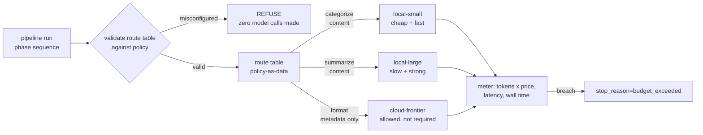

# S11-budgets-routing — Budgets, routing, and the privacy boundary

**What this teaches:** a run's cost, latency, and data flow are harness-enforced
invariants, not operational afterthoughts — budgets that stop runs as a first-class
outcome, route tables as policy-as-data justified by a measured number, and a
privacy boundary that *refuses to run* when misconfigured.
**Time:** ~90 min with the notebook. **Prerequisites:** S01 (the loop), S02
(defensible comparisons — the routing argument *is* a delta table).
**Hands-on:** [`notebooks/s11_budgets_routing_toy.ipynb`](../notebooks/s11_budgets_routing_toy.ipynb)
**Video:** [NotebookLM overview](videos/S11-budgets-routing.mp4) — auto-generated summary; preview or review, never a substitute for the notebook.

---

## The theory in depth

### A runaway agent is a billing bug

S01 gave the loop a `max_turns` cap because a model that can't stop will run
forever. The same argument applies to money and time, except worse: `max_turns`
bounds iterations but says nothing about what each iteration costs. A loop of
frontier-priced calls that stays politely under the iteration cap can still be
the most expensive bug you ship this quarter.

So the harness treats the budget as a runtime invariant. The run carries a meter
(tokens × route price, wall time), and crossing the budget ends the run with a
first-class `stop_reason=budget_exceeded` — the same dignity as a normal
completion, not a crash. Two properties matter:

- **It stops the run, not the conversation about the run.** A budgeted stop is
  an outcome the product can handle — degrade, ask the user, reschedule. An
  invoice is not an outcome; it's evidence.
- **The budget is set from the value of the task, not from fear.** It encodes
  "this run is no longer worth what it's spending." A session that meanders past
  that line isn't being generously thorough — it's defective. A run that costs
  more than the task is worth has failed even when the transcript looks great.

### Routing is policy-as-data, justified by a number

Different phases of one pipeline differ wildly in difficulty. Classifying a
transaction is not writing prose about it; rendering a table is not judging a
summary. Route everything to the strongest model and you pay frontier rates for
clerical work. Route everything to the cheapest and you ship the cheap model's
failure rate on the hard phases.

The mechanism is a **route table**: a mapping from phase → route, kept as *data*
— a config file, a dict — not as `if` statements inside the engine. Data can be
reviewed, diffed, validated, and re-measured without touching engine code; a
hardcoded model choice cannot. But the table is only half the story. The other
half is what justifies it:

- **Naive:** "I tried the small model once and it seemed fine." Unfalsifiable,
  unrepeatable, and un-auditable — the three horsemen of config drift.
- **Defensible:** S02's diverge/rejoin. Same fixtures, same deterministic
  checker, same everything except the route under test. The route that ships is
  the **cheapest one that holds the number** on your suite. The deliverable of a
  routing exercise is not the table — it's the measurement the table cites.

### The privacy boundary is a routing invariant, enforced as refusal

Routing has a second axis besides cost and quality: **where the data goes**.
Give every phase a data classification (raw *content* vs derived *metadata*) and
every route a location (*local* vs *cloud*). The invariant: content-classified
phases resolve to local routes, always.

The failure mode to design against is not malice but drift. Someone tunes the
route table for cost, points a content phase at a cloud route, and the pipeline
— helpful as ever — runs it. Hence the enforcement rule: **a misconfigured table
refuses to run.** Not warns, not logs-and-continues: validation raises before a
single model call is made. Warnings are output; output gets ignored; a refusal
makes the bad configuration un-runnable and turns review of the route table into
review of the boundary.

This is how the big systems are built, not toy paranoia: Apple Intelligence
routes on-device by default and escalates only to a stateless, attested cloud
([Private Cloud Compute](https://security.apple.com/blog/private-cloud-compute/))
— the boundary is architecture, not a promise in a privacy policy.

Note the subtlety the toy demonstrates: the boundary runs on **data
classification, not vendor virtue**. Category *totals* may lawfully take a cloud
route; transaction *descriptions* may not take any cloud route — even the cheap,
fast, tempting one. And content on a local route can still leak through your own
logs. "Local = safe, cloud = unsafe" is a starting heuristic, not the policy.

### Latency is a budget with a human attached

Cost budgets answer to finance; latency budgets answer to the nervous system.
Human conversational turn-taking clusters around ~250 ms response offsets across
ten languages (Stivers et al.,
[PNAS 2009](https://doi.org/10.1073/pnas.0903616106)), and users read much more
than ~1 s of dead air in a voice interface as "broken." OpenAI's GPT-4o launch
made the same point numerically: audio responses in 232 ms (average 320 ms),
versus 2.8–5.4 s for the older chained ASR → LLM → TTS pipeline — which also
shed tone, laughter, and emotion at every hand-off
([Hello GPT-4o](https://openai.com/index/hello-gpt-4o/)).

So a voice-mode design starts from a per-turn latency budget and works backward:
sum the phase latencies on the turn's critical path, take the p50 across real
turns (the *typical* experience; the p95 is the *memorable* one — budget both,
but p50 decides whether the average turn feels human), and interrogate every
phase: does this need to be in the turn at all, can it stream, can it be
precomputed, can a faster route hold its number? Routing shows up twice here —
the route table is also your latency table — and the privacy boundary removes
the easy escape of buying latency from the frontier cloud for content phases.
That is why the math happens on paper before the build, not after the first
demo.

## Exercises (in the notebook, predict first)

1. **The meandering run.** A summarize phase with no convergence criterion on
   all-large routes. First run it with no budget and watch it price itself into
   the pass cap. Then set `budget_usd = 0.25`: predict the exact pass it dies
   on, and the `stop_reason`.
2. **Measure the tiers.** Run the 3-month suite under `all-small` and
   `all-large`. Predict, per phase, where small holds its number — then read the
   pass/cost table.
3. **The cheapest table that holds the number.** Write your own route table
   targeting suite parity with all-large at minimum cost. Any table that passes
   cheaper than the solution is a correct answer — the constraint is the number,
   not the answer key.
4. **The privacy refusal.** Point `summarize` (content) at `cloud-frontier`.
   Predict *when* it fails and how many model calls happen first. Then the
   subtle case: `format` (metadata) on cloud runs fine — and costs more than
   local. Allowed ≠ wise.
5. **The voice budget.** From the latency models in the suite logs, compute p50
   per-turn latency for all-large vs routed against a 1000 ms budget. Predict
   which fits before running; then name the phase that dominates the losing
   config and the fix the boundary still permits.

## State of the art (as of August 2026)

| Development | Status | Take |
|---|---|---|
| Model families ship in explicit cost/latency tiers ([Anthropic model overview](https://docs.anthropic.com/en/docs/about-claude/models/overview), [OpenAI models](https://platform.openai.com/docs/models)) | **already in this path** | The price/quality spread across tiers is the raw material your route table arbitrages. |
| FrugalGPT: cascade cheap→strong with a learned accept/escalate scorer; matched GPT-4 at up to 98% lower cost on narrow tasks ([arXiv:2305.05176](https://arxiv.org/abs/2305.05176)) | **recognize** | The academic root of routing. The 98% figure is task-specific and widely over-quoted; the durable idea is paying for the big model only on the fraction that needs it. |
| RouteLLM: routers trained on preference data choose strong-vs-weak per query; >2× cost cuts at fixed quality ([arXiv:2406.18665](https://arxiv.org/abs/2406.18665), [LMSYS blog](https://lmsys.org/blog/2024-07-01-routellm/)) | **newer than this session** | The learned generalization of your hand-built table. Revisit when phase count or traffic makes hand-tuning the bottleneck — it still starts from a measured quality/cost frontier. |
| Gateway-enforced budgets: LiteLLM proxy per-key/tag `max_budget` + `budget_duration`, rejects over-budget calls with `budget_exceeded` ([docs](https://docs.litellm.ai/docs/proxy/provider_budget_routing)) | **adopt** | Belt and suspenders: proxy caps protect the account, the in-harness meter protects the run. Even mature proxies ship stale-counter budget bugs ([issue #31292](https://github.com/BerriAI/litellm/issues/31292)) — your own meter is the audit of last resort. |
| Routing by data sensitivity at production scale: Apple Intelligence on-device by default, escalating to stateless, attested Private Cloud Compute ([security guide](https://security.apple.com/documentation/private-cloud-compute), [launch post](https://security.apple.com/blog/private-cloud-compute/)) | **recognize** | The existence proof that "content never leaves" can be enforced as architecture. Your validation-time refusal is the same idea at toy scale. |
| Voice latency as a product spec: GPT-4o answers audio in ~232 ms (avg 320 ms), "similar to human response time in conversation"; the chained pipeline it replaced ran 2.8–5.4 s ([OpenAI, Hello GPT-4o](https://openai.com/index/hello-gpt-4o/)) | **already in this path** | These numbers anchor Exercise 5; the human base rate underneath is Stivers et al. 2009 ([PNAS](https://doi.org/10.1073/pnas.0903616106)). |
| Managed auto-routers that pick a model per prompt for you ([OpenRouter Auto Router](https://openrouter.ai/docs/guides/routing/routers/auto-router)) | **ignore for now** | A learned black box between you and your bill — and per-request model changes are a reproducibility hazard for evals. Build and measure the table by hand first; then you'll know what to audit the service against. |

## Annotated readings

- **LMSYS, [RouteLLM blog](https://lmsys.org/blog/2024-07-01-routellm/)
  (Jul 2024).** Extract this: the savings-at-fixed-quality table, and the fact
  that even a *learned* router is trained and judged against a measured
  quality/cost frontier — the thing you build by hand this session.
- **OpenAI, [Hello GPT-4o](https://openai.com/index/hello-gpt-4o/) (May 2024).**
  Extract this: the description of the old three-model chained voice pipeline
  and why chaining loses *both* time and information at every hand-off — the
  argument for computing per-phase latency honestly instead of hoping.
- **Apple, [Private Cloud Compute security guide](https://security.apple.com/documentation/private-cloud-compute).**
  Extract this: the enforcement mechanisms — stateless computation, no
  persistence, attestation — i.e., what a boundary looks like when it's
  verifiable rather than promised.
- **Stivers et al., [Universals and cultural variation in turn-taking in
  conversation](https://doi.org/10.1073/pnas.0903616106) (PNAS 2009).** Extract
  this: the ~250 ms median response offset and its cross-linguistic stability.
  That is the number your voice latency budget ultimately answers to.

## Misconceptions and failure modes

- **"Budgets are a finance concern."** The invoice arrives a month after the
  bug. The meter belongs in the loop, next to `max_turns`, denominated in the
  run's own currency: tokens × route price.
- **"Warn, don't refuse."** A warning on a misrouted content phase is a log line
  read by no one during the incident. Validation-time refusal is the only
  version that holds — it makes the bad config un-runnable.
- **Routing by vibes.** "The small model seemed fine" is unfalsifiable. If the
  route choice doesn't cite a suite number, you haven't measured anything —
  you've just decided.
- **"Local = safe, cloud = unsafe."** The boundary runs on data classification,
  not vendor virtue. Metadata can lawfully take a cloud route; content on a
  local route can still leak through your own logs.
- **Quoting mean (or best-case) latency.** Users experience the distribution,
  not the average. A config whose p50 fits but whose p95 doubles the budget will
  be remembered as sluggish: budget p50 for "feels human," p95 for "not broken."

## Self-check

Why is budget_exceeded a stop_reason rather than an alert?

An agent that can't stop converts software bugs into invoices. An alert notifies
a human after the money is gone; a stop_reason is a first-class run outcome the
product handles programmatically — degrade, ask, reschedule. It is S01's
max_turns logic extended from iterations to money and time.

What justifies moving a phase to a cheaper route?

A measured delta under diverge/rejoin: same fixtures, same deterministic
checker, same everything except the route under test — and the cheapest route
whose suite number holds wins. Intuition justifies nothing; the shipped table
cites the measurement.

Why refuse at validation time instead of warning at runtime?

Warnings are output, and output gets ignored — especially mid-incident.
Validation-time refusal makes the misconfiguration un-runnable and forces the
fix into the route table itself, which, being data, is diffable and reviewable.
Zero model calls happen before the refusal; that's the point.

all-large p50 per-turn latency is 1180 ms against a 1000 ms voice budget. Cheapest correct fix?

Route categorize to the small route (its number holds on the suite) and keep
summarize on the large route — routed p50 is ~861 ms. The tempting alternative,
frontier cloud at ~790 ms, is off the table: content phases stay local, so
latency gets engineered (streaming, precompute) rather than bought.

## What's next

**S12 — Adversarial review and judge calibration:** the routed pipeline still
leans on model judgment — a critic reading transcripts, a judge scoring quality.
Next session measures the judges themselves: seeded-defect detection rates,
false positives, and agreement against your own hand labels, because an
unmeasured judge is decoration.
