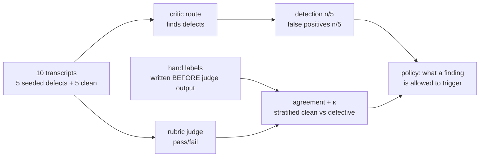

# S12-judge-calibration — Measuring the measurers

**What this teaches:** an unmeasured judge is decoration. Two instruments get
calibrated here — a *critic* that finds defects (measured by detection rate and
false-positive rate on seeded ground truth) and a *rubric judge* that grades
quality (measured by agreement with your hand labels, chance-corrected). Until
both have numbers attached, the judged tier of your eval suite is vibes with a
dashboard.
**Time:** ~90 min with the notebook. **Prerequisites:** S02 (two-tier checks —
the judged column was labeled *uncalibrated* there; this session removes the
label, with a rate attached).
**Hands-on:** [`notebooks/s12_judge_calibration_toy.ipynb`](../notebooks/s12_judge_calibration_toy.ipynb)
**Video:** [NotebookLM overview](videos/S12-judge-calibration.mp4) — auto-generated summary; preview or review, never a substitute for the notebook.

---

## The theory in depth

### The recursion problem: the judge is also a model

S02 split checking into two tiers because deterministic code can't see quality —
tone, consistency, whether the question was actually answered. So you add a
judged tier, and immediately inherit the recursion: the judge is itself a model,
with the biases documented for the models it grades — position bias, verbosity
bias, self-preference
([Zheng et al., arXiv:2306.05685](https://arxiv.org/abs/2306.05685)) — plus one
that only appears in grading: *criteria drift*, the rubric quietly redefining
itself as grading proceeds
([Shankar et al., arXiv:2404.12272](https://arxiv.org/abs/2404.12272)). You added
the judge because the model's output couldn't be trusted unexamined; the same
logic applies to the judge's output. A judge whose agreement with you has never
been measured is not an instrument — it is a second opinion from a stranger.

Two different instruments hide under the word "judge". They fail differently, so
they are measured differently:

| Instrument | Question it answers | Ground truth | Metric |
|---|---|---|---|
| **Critic** (detector) | Does this transcript contain a defect? | Transcripts with seeded, known defects | Detection rate **and** false-positive rate |
| **Rubric judge** (grader) | Is this transcript good enough to ship? | Your hand labels | Raw agreement + Cohen's κ, stratified |

### Seeded defects: ground truth you control

You cannot measure a detector without knowing where the defects are — and in
production you never know. So you manufacture ground truth: take transcripts
known to be clean, seed each with exactly one subtle defect, mix in clean
controls, run the critic blind, and count. This is mutation testing's logic
applied to evaluators
([mutation testing](https://en.wikipedia.org/wiki/Mutation_testing)): the test
of a detector is whether it catches a known-planted fault.

Four rules keep the game honest:

- **Subtle defects only.** A critic that catches blatant garbage proves nothing;
  production defects are the quiet kind — an ignored allergy, a recipe that
  contradicts its own serving count, an engine that abandons a correct answer
  the moment the user pushes back. Seed the quiet kind.
- **One defect per transcript.** Two defects in one transcript makes a catch
  unattributable: which one did it find?
- **The pair is the metric, never one number.** A critic that flags everything
  scores detection 5/5 and false positives 5/5. Reported alone, the first number
  is a lie of omission.
- **Counts, not percentages.** 2/5 is the honest report of five probes; "40%"
  borrows precision the sample doesn't have. Grow the set when the counts stop
  fitting in one hand — Hamel starts at ~30 labeled examples
  ([hamel.dev/blog/posts/llm-judge](https://hamel.dev/blog/posts/llm-judge/)).

And the set rots: once the critic has been tuned against these five defects,
they stop being an independent probe. Re-seed fresh ones every calibration
round — the same reason you never report a judge's agreement on the examples
you tuned it against.

### Hand labels before judge output: the calibration protocol

For the rubric judge there is no planted fault — "good enough" is defined by
*your* judgment, so the ground truth is hand labels and the measurement is
agreement. The protocol, in order (the order is the protocol):

1. **Label first, blind.** Write pass/fail for every transcript in the sample
   *before* any judge output exists on your screen. A verdict seen before you
   label anchors your label, and the measurement dies quietly — you end up
   measuring how much you trust the judge, not how much you agree with it.
2. **Then run the judge** and compute two numbers: raw agreement, and Cohen's
   κ, which corrects for the agreement you'd get by chance from the label
   marginals alone
   ([Cohen's κ](https://en.wikipedia.org/wiki/Cohen%27s_kappa)):
   κ = (po − pe) / (1 − pe). A judge that
   passes everything in a mostly-clean stream posts a beautiful raw agreement
   and a κ near zero. The conventional reading
   ([Landis & Koch, 1977](https://doi.org/10.2307/2529310)) calls anything under
   ~0.6 less than "substantial"; the practitioner rule is simpler — below that,
   the judged column doesn't gate anything.
3. **Stratify the disagreement.** Split agreement by clean vs defective. A judge
   that agrees with you on every clean transcript and none of the defective ones
   posts a fine-looking aggregate — and is blind exactly where judgment is
   needed. The aggregate hides the bias; the strata expose it.
4. **Iterate on the disagreeing classes, then re-measure on fresh labels.**
   Each disagreement class is either a rubric gap (write the missing clause)
   or a judge gap (fix the prompt, swap the model). Then label a *new* sample:
   reporting agreement on the set you tuned against is overfitting with extra
   steps.

What the toy cannot teach is when the measurement earns an operational gate. A
10-item, single-author, binary set is enough to learn the mechanics — the
blinding, the pair of rates, the κ — but nobody should ship a gate on it. A real
calibration adds what the toy strips away: multi-annotator labeling with
adjudication for the subjective calls, because one author's blind spot becomes
the judge's target; bootstrap uncertainty intervals around agreement and κ,
because a point estimate on ten items borrows precision the sample doesn't have;
repeated runs of a stochastic judge, so one lucky sample doesn't pass as
agreement; position-swap testing, because order bias does not retire under a
binary rubric; and a prevalence-aware reading of κ, which deflates exactly when
a lopsided label stream makes raw agreement look best. Mechanics first — then
the machinery that makes the number worth gating on.

### The measured rates decide policy

The point of both measurements is a decision, not a report:

A critic with false positives 1/5 is telling you a blocking finding has a real
chance of being wrong — so a blocking finding triggers at most one bounded,
human-auditable repair, never a silent rewrite, and every finding carries a
turn reference so a human can check it in thirty seconds. A rubric judge at
κ = 0.2 gets its verdicts reported as advisory; only a measured κ earns the
gate. That is how the *uncalibrated* label from S02 comes off — not by trusting
the judge, but by stapling its track record to every number it produces.
Recalibrate whenever the rubric or the judge model changes; the calibration is
a property of the pair, not of either alone.

## Exercises (in the notebook, predict first)

1. Run the seeded-defect game blind: before the answer key, predict how many
   transcripts the keyword critic will flag — and how many of those flags will
   be right. Which defect *classes* is a keyword machine structurally unable
   to see?
2. Make the critic negation-aware. Predict which confusion-table cells move —
   and which provably don't. Re-measure both rates.
3. Hand-label all 10 transcripts against the rubric *before* running the judge
   (the notebook instructs the order — your discipline, not a gate, is what
   enforces it). Predict judge v1's agreement and κ; then
   measure. Then score your own labels against the reference.
4. Stratify: agreement on clean vs defective. Where does the judge's bias
   actually live, and what does the aggregate hide?
5. Judge v2, calibrated against the failure classes. Predict whether agreement
   reaches 10/10 — then inspect the one residual disagreement and explain why
   that class defeats any judge without ground truth.

## State of the art (as of August 2026)

| Development | Status | Take |
|---|---|---|
| Binary verdicts, ~30-example calibration, critique-shadowing the domain expert, judge agreement as its own reported number ([Hamel, Creating an LLM Judge](https://hamel.dev/blog/posts/llm-judge/)) | **already in this path** | The notebook is exactly this loop, shrunk to 10 items so you can see every cell of the confusion table. |
| The bias catalog your judge inherits — position, verbosity, self-preference ([Zheng et al., arXiv:2306.05685](https://arxiv.org/abs/2306.05685)); criteria drift while grading ([Shankar et al., arXiv:2404.12272](https://arxiv.org/abs/2404.12272)) | **already in this path** | The toy's judge v1 ships with the verbosity bias built in; criteria drift is why the rubric gets frozen between calibration rounds, not during. |
| Reviewer routes with their own context: critics read, they never write to the user ([Anthropic, How we built our multi-agent research system](https://www.anthropic.com/engineering/multi-agent-research-system)) | **adopt** | A reviewer that shares the writer's context shares the writer's blind spots. Separation is what makes the critic's findings evidence. |
| G-Eval: chain-of-thought, form-filling rubric scoring ([Liu et al., arXiv:2303.16634](https://arxiv.org/abs/2303.16634)) | **recognize** | The influential ancestor of every rubric judge; its own authors flagged bias toward LLM-generated text. Practice has since moved from 1–5 scales to binary verdicts — scales hide disagreement in the middle. |
| Open-weight specialized judge models ([Prometheus 2, arXiv:2405.01535](https://arxiv.org/abs/2405.01535)) | **recognize** | A judge you can version, diff, and run offline. Specialization is still not agreement with *your* rubric — calibrate it like anything else. |
| Meta-evaluation benchmarks for judges ([JudgeBench, arXiv:2410.12784](https://arxiv.org/abs/2410.12784)) | **newer than this session** | Useful when shopping among judge models. Your own hand-labeled transcripts remain the final word — a benchmark measures judges in general, not on your data. |
| "A frontier model is judge enough, no calibration needed" | **ignore** | Model strength is not agreement with your rubric. The measurement exists precisely to replace that assumption. |

## Annotated readings

- **Hamel Husain, [Creating an LLM Judge](https://hamel.dev/blog/posts/llm-judge/).**
  Extract this: binary pass/fail with written critiques (not scores), the
  ~30-example starting sample, and critique-shadowing — iterate the judge prompt
  until it converges with the domain expert, then keep checking on a cadence.
  His FAQ answer to "how do you evaluate the judge?" is this entire session.
- **Zheng et al., [Judging LLM-as-a-Judge](https://arxiv.org/abs/2306.05685).**
  Extract this: the four biases (position, verbosity, self-enhancement, limited
  reasoning) and the mitigations table — position-swap testing is the cheap one
  worth adopting on real APIs.
- **Shankar et al., [Who Validates the Validators?](https://arxiv.org/abs/2404.12272)**
  Extract this: criteria drift — you cannot fully fix a rubric before grading,
  because grading is how you discover what you meant. Version the rubric, freeze
  it between calibration rounds, and re-measure when it changes.
- **Anthropic, [How we built our multi-agent research system](https://www.anthropic.com/engineering/multi-agent-research-system).**
  Extract this: why evaluators and reviewers run in their own context, and
  "start evaluating immediately with small samples" — a small labeled set is a
  feature, not a compromise, as long as you report counts honestly.

## Misconceptions and failure modes

- **"The judge is a stronger model, so its verdict is trustworthy."** Strength
  and agreement are different axes. A frontier model graded against *your*
  rubric can still post κ = 0.2 — the notebook's judge v1 does, while being
  "right" in every individual rationale.
- **Reporting the detection rate alone.** The flag-everything critic has
  perfect detection and perfect false positives. The pair is the metric.
- **Percentages on tiny probes.** 4/5 is a count; "80%" is a claim about the
  world. On five items the honest report is the count.
- **Tuning the judge on the calibration set, then reporting agreement on the
  same set.** That number describes the tuning, not the judge. Fresh labels,
  every round.
- **Labeling after seeing the judge's output.** Anchoring is silent: you'll
  sincerely believe you disagreed with the judge more than you did. The
  protocol's order — labels first — is the whole mechanism.

## Self-check

Why must hand labels be written before the judge runs?

Because a seen verdict anchors your label. Once you've read the judge's pass/fail
and its confident rationale, your "independent" label is partially the judge's —
and you end up measuring how much you trust the judge instead of how much you
agree with it. The blindness is the measurement.

What does Cohen's κ correct that raw agreement doesn't, and what does κ ≈ 0 mean?

It corrects for chance agreement given the label marginals: if 90% of transcripts
are clean, a judge that passes everything scores 90% raw agreement. κ subtracts
that base-rate luck — κ ≈ 0 means the judge agrees with you no more than a
coin weighted by the marginals would.

A critic flags all 10 transcripts in the seeded-defect game. What are its two rates, and is it a good critic?

Detection 5/5, false positives 5/5. No — it detected everything, including
nothing. This is why the pair is the metric: either number alone can be
perfect while the instrument is useless.

Why stratify judge agreement by clean vs defective instead of trusting the aggregate?

Because the bias you care about is concentrated in one stratum. A judge that
agrees on all clean transcripts and misses every defective one can still post
a passable aggregate — and it is blind exactly where a quality gate must see.
The aggregate hides the failure; the strata name it.

## What's next

**S13-rebuild-from-memory:** you now own the full chain — a loop, an eval suite,
and a judged tier with its own measurement stapled to it. Next session turns the
instrument on you: rebuild the core of your system from memory, no assistant,
then diff against the original. The forgot-list you write afterward is the
honest inventory of what you actually own.
