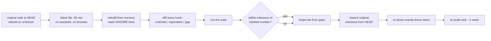

# S13-rebuild-from-memory — The closed-book audit

**What this teaches:** why "I built it" is not evidence that you own it — and the one
measurement that is: a closed-book rebuild of the core component, judged by your own
eval suite, with the diff as diagnosis and the forgot-list as the deliverable.
**Time:** ~20 min reading, then ~90 min for the audit itself.
**Prerequisites:** S01–S02 for the instrument vocabulary — and a non-trivial project
you own to audit. **This session is optional.** The path's twelve toys are
independent, so there is no cumulative build to point at: the audit target is a
project of yours, built here, at work, or in another course. Completing S01–S12
does not require S13.
**Hands-on:** none — there is no notebook this session. Scaffolding the rebuild would
defeat it. The protocol below is the hands-on.
**Video:** [Gemini Notebook overview](videos/S13-rebuild-from-memory.mp4) — generated with Google Gemini Notebook (formerly NotebookLM); preview or review, never a substitute for the protocol.

---

## The theory in depth

### Authorship is not ownership

Take any non-trivial project you own — built in this path, at work, or in another
course — much of it, these days, with an assistant in the loop. Owning it feels
like authorship. Mechanically, it was closer to code review: you
read diffs, judged them, accepted or rejected them. Reviewing builds **recognition
fluency** — you see the append-verbatim line and nod along — which is a different
and weaker thing than **recall**: producing the line, unaided, in a blank file.
The gap between the two is where "I know this system" goes to die.

The learning-science version of this is decades old. Bjork's frame: **storage
strength** (how durably something is embedded) vs **retrieval strength** (how easily
you can produce it right now). Re-reading raises retrieval strength briefly and
*feels* like learning; it does almost nothing for storage. Karpicke & Roediger's
2008 result is the sharpest version: students who studied by retrieving beat
students who re-studied — at a delay, by a wide margin — while the re-studiers
predicted the opposite for themselves
([doi:10.1126/science.1152408](https://doi.org/10.1126/science.1152408)). Your
self-assessment of what you know is not just unreliable; it is reliably wrong in
the optimistic direction.

The AI-era data says the same thing with higher stakes. METR's RCT: experienced
developers believed AI made them ~20% faster; the clock said 19% slower — a
39-point gap between felt and measured
([arXiv:2507.09089](https://arxiv.org/abs/2507.09089)). Shen & Tamkin: developers
who delegated to AI produced comparable output but scored dramatically lower on
mastery of what they had just *built*
([arXiv:2601.20245](https://arxiv.org/abs/2601.20245)). The felt sense of
competence is not evidence. The audit replaces it with evidence.

### The audit is a measurement instrument

Same stance as S02: the rebuild is a probe, the suite is the checker, and the only
question is "would I believe the number?" The naive self-audit — scroll through the
code, nod, conclude ownership — fails for the same reason an unvalidated checker
fails: it cannot fail. An instrument that cannot return a negative result asserts
nothing.

So the audit is built to be losable. Four invariants:

1. **The original is out of reach.** One peek converts a recall event into a
   recognition event. The measurement silently stops measuring memory and starts
   measuring eyesight — and the forgot-list it feeds is now wrong in a way you
   cannot detect. Git history counts as out of reach: the original lives in HEAD,
   not in your editor, and `git show` is a deliberate act you can catch yourself
   making — unlike a stray tab.
2. **The clock is visible.** Fluency illusions survive leisure; they collapse
   under a time cap. Sixty minutes forces the honest version of every choice.
3. **The pass bar is external.** Not "it looks right" — the number your own eval
   suite produces with the rebuilt component, against the number you banked.
4. **The byproducts are captured.** The diff is not waste; it is the raw material
   of the forgot-list.

### The suite is the decision instrument; the diff is the diagnosis

This is why the audit sits at S13 and not S03: it consumes the instrument the rest
of the path teaches. Without a defended eval suite, the only bar a rebuild can
clear is "it runs and feels right" — the fluency illusion with extra steps. With
the suite, the question becomes empirical: does the rebuilt core hold the number
you already banked?

Note what the instrument is *not*: the diff. Byte-similarity measures typing memory,
and punishes exactly what you want to see — a rebuild that produces a different but
behavior-preserving construction demonstrates ownership of the *abstraction*, not
the text. So diff hunks get classified, not counted:

| Hunk class | What it looks like | Verdict |
|---|---|---|
| Cosmetic | different names, order, formatting | ignore |
| Behavior-preserving | different construction, same contract, invariants intact | pass — you own the idea |
| Behavioral gap | weakened or missing behavior, dropped invariant | forgot-list item |

The pass bar is the suite number within a small tolerance of the last banked one.
The tolerance absorbs suite noise; it does not make gaps invisible, and a small or
noisy suite can miss a real regression wherever you set it. That is why the suite
is the audit's *decision instrument* rather than its whole judgment: the hunk
review above stays a separate step, and behavioral-gap hunks feed the forgot-list
even when the number comes back green.

### The forgot-list is the deliverable

The number tells you *whether* you own the system; the forgot-list tells you *which
parts* you don't. This is S10's error analysis turned inward: each behavioral gap
becomes a taxonomy entry — what you dropped, why the original had it, the one-line
rule that would have saved it.

Two rules make the list do work:

1. **Re-study exactly the list.** Blanket re-study of the whole system is the
   rereading fallacy scaled up to a curriculum: high effort, low yield, and it
   re-trains recognition on parts that were never broken.
2. **Re-audit after a delay, not immediately.** An instant second pass measures
   short-term priming, not storage. A week later, cold, measures whether the
   re-study took — and the spaced retrieval is itself the mechanism that makes it
   stick (Bjork & Bjork 2011; Nielsen's
   [Augmenting Long-term Memory](http://augmentingcognition.com/ltm.html)).

Run twice, a week apart, the audit is the whole learning loop: measure, diagnose,
repair, verify the repair.

## The protocol

One sitting, no interruptions, roughly 90 minutes end to end. It runs against any
non-trivial project you own — from this path, from work, from another course —
and "the suite" and "the banked number" below are that project's own.

0. **Choose the core.** One component: the load-bearing abstraction, the file
   whose invariants *are* the system's invariants (in an agent harness, the loop).
   Criteria: everything else imports it; it holds the protocol rules; it fits in
   one sitting. Never the whole system — the rest is reference material, and
   looking reference material up is the *correct* move, not a failure. The audit
   targets restating and rebuilding the core abstractions and their invariants —
   not memorizing implementation trivia; whatever documentation can hold, let
   documentation hold.
1. **Set the terms.** Commit a clean tree — HEAD now holds the canonical
   original. Rebuild off the main line: `git switch -c rebuild-audit` (or a
   scratch worktree: `git worktree add /tmp/rebuild-audit HEAD`). Delete the
   target file there; the original survives only in history, a deliberate
   `git show` away. Close the assistant. Close the browser.
   Allowed: the language, its standard library, `--help`. Set a visible timer:
   60 minutes.
2. **Rebuild.** Blank file at the same path, from memory. When stuck, write what
   you think it should be and mark it `# UNSURE` — unsure marks are data. They
   become honestly-labeled forgot-list items instead of hiding inside a lucky diff.
3. **Diff and classify.** `git diff HEAD -- core.py`. Label every
   hunk: cosmetic, behavior-preserving, or behavioral gap. Only the third bucket
   feeds the forgot-list.
4. **Run the suite.** The rebuilt component runs the full eval suite. Pass: the
   number within tolerance of the last banked one. Fail: it moved — and the
   behavioral gaps from step 3 tell you why. Either way the gap hunks stand: a
   small suite can stay green through a dropped invariant, so the step-3 review
   is not optional decoration.
5. **Write the forgot-list.** One line per behavioral gap: what you dropped, why
   the original had it, the one-line rule that would have saved it. Then **restore
   the original** — `git checkout HEAD -- core.py`, or drop the branch/worktree
   entirely: the rebuild was a probe, not a patch — the
   banked artifact stays canonical.
6. **Re-study, then re-audit cold.** Study exactly the forgot-list items, nothing
   else. Wait a week. Run the audit again from step 1. The second pass is where
   retention happens; the first pass only told you the truth.

## State of the art (as of August 2026)

| Development | Status | Take |
|---|---|---|
| Retrieval practice beats re-study: Karpicke & Roediger, *Science* 2008 ([doi](https://doi.org/10.1126/science.1152408)); practice testing and distributed practice rated highest-utility, rereading and highlighting lowest (Dunlosky et al. 2013, [doi](https://doi.org/10.1177/1529100612453266)) | **already in this path** | This session is the testing effect aimed at your own repo. The rebuild is a test — and the research says the test is also the learning event. |
| Fluency self-reports are miscalibrated at scale: METR's RCT, 16 experienced developers — believed ~20% faster with AI, measured 19% slower ([arXiv:2507.09089](https://arxiv.org/abs/2507.09089)) | **adopt** | Adopt the stance, not the number: "I know this system" is evidence of nothing until it survives a closed-book measurement. |
| AI assistance impairs skill formation unless cognitively engaged: Shen & Tamkin RCT, 52 engineers; the delegating patterns produced output without learning, three engaged patterns preserved it ([arXiv:2601.20245](https://arxiv.org/abs/2601.20245); [Anthropic write-up](https://www.anthropic.com/research/AI-assistance-coding-skills)) | **adopt** | The prevention side of this session: how you build determines what the audit finds. Engage during construction; audit after. |
| "Cognitive debt" framing: Kosmyna et al., EEG essay study — the LLM group showed weakest engagement and poorest recall of their own text ([arXiv:2506.08872](https://arxiv.org/abs/2506.08872)); see the methodological critique ([arXiv:2601.00856](https://arxiv.org/abs/2601.00856)) | **recognize** | Direction matches authorship≠ownership, but it is a small preprint with a published critique. Motivation, never proof. |
| Desirable difficulties: storage vs retrieval strength; conditions that slow practice improve retention (Bjork & Bjork 2011, [chapter PDF](https://bjorklab.psych.ucla.edu/wp-content/uploads/sites/13/2016/04/EBjork_RBjork_2011.pdf)) | **recognize** | The theoretical frame: the audit is deliberately difficult because difficulty is what makes the measurement honest and the repair durable. |
| Spaced repetition for the forgot-list (Nielsen, [Augmenting Long-term Memory](http://augmentingcognition.com/ltm.html)) | **adopt** | Each forgot-list item becomes cards; the cold re-audit a week later is the spaced retrieval event. |
| "Just re-read the codebase and your notes" as audit prep | **ignore** | The lowest-yield study activity known (Dunlosky). A recognition warm-up that inflates fluency and quietly spoils the measurement. |

## Annotated readings

- **Karpicke & Roediger, [The Critical Importance of Retrieval for Learning](https://doi.org/10.1126/science.1152408)
  (*Science*, 2008).** Extract this: the prediction reversal — students forecast
  that re-study would win, retrieval won at the delay. Your intuitions about what
  you know are the thing being measured *and* the thing being disproved.
- **Becker et al. (METR), [Measuring the Impact of Early-2025 AI on Experienced
  Open-Source Developer Productivity](https://arxiv.org/abs/2507.09089) (2025).**
  Extract this: the three-way gap — forecast +24%, felt +20%, measured −19%. That
  is the calibration curve of every "I'm on top of this system" report you have
  ever given yourself.
- **Shen & Tamkin, [How AI Impacts Skill Formation](https://arxiv.org/abs/2601.20245)
  (2026).** Extract this: the six interaction patterns and which three preserved
  learning. Delegation ships code without forming skill; engagement is the
  difference, and it is a choice you make per interaction.
- **Bjork & Bjork, [Making things hard on yourself, but in a good way](https://bjorklab.psych.ucla.edu/wp-content/uploads/sites/13/2016/04/EBjork_RBjork_2011.pdf)
  (2011).** Extract this: storage strength vs retrieval strength, and why
  performance-during-practice is a misleading index of learning — the reason the
  audit is closed-book, timed, and re-run cold.

## Misconceptions and failure modes

- **"I wrote it, so I own it."** Assisted authorship is code review, and review
  trains recognition. The audit exists precisely because authorship and ownership
  come apart under assistance.
- **The single peek.** One look at the original converts recall into recognition,
  invalidates the measurement, and poisons the forgot-list — you will re-study the
  wrong things with full confidence.
- **Treating the diff as the score.** Byte-similarity measures typing memory. A
  clean suite number over a heavily-rewritten file is a pass; a near-identical
  file that dropped one invariant is a forgot-list item — and if the suite is too
  small to see it, the hunk review is the separate check that catches it. The
  suite decides; it is an instrument, not an oracle.
- **Auditing the whole system.** The audit covers the load-bearing core. For
  everything else, lookup is the designed behavior — expanding scope just
  guarantees a noisy, discouraging measurement.
- **Re-studying everything after a bad audit.** The forgot-list is the
  deliverable; blanket re-study is the rereading fallacy at curriculum scale.

## Self-check

Why does re-reading your own code overestimate what you can rebuild?

Re-reading trains recognition fluency — the code feels familiar, and familiarity
masquerades as knowledge. Recall (producing the code unaided) draws on storage
strength, which re-reading barely improves. The gap only shows up at a blank file,
under a clock.

What does one peek at the original do to the measurement?

It converts a recall event into a recognition event. The rebuild now measures
eyesight, not memory — and the forgot-list inherits the error, so the re-study
phase fixes the wrong gaps while the real ones stay invisible.

The rebuild holds the suite number but the diff is enormous. Pass or fail?

Pass — if the hunks classify as cosmetic or behavior-preserving. The suite is the
decision instrument; the diff is the diagnosis. Behavior-preserving
differences demonstrate ownership of the abstraction rather than the text — that
is the stronger result, not a problem.

Why does this audit sit at S13 and not earlier?

Two reasons. It needs the eval instrument S02–S12 teach you to build — without a banked,
defended number, "it runs and feels right" is the only bar, and that bar is the
fluency illusion. And it needs a system large enough that ownership is genuinely
in doubt — a project you own, not a toy.

## What's next

**S14-ship-and-pilot:** the audit proves the system is yours; the last session
proves it works for someone who is not you. Acceptance runs on unseen scenarios,
assembled architecture and failure documentation, and a public evidence artifact —
the rebuild says you can defend the machine, S14 makes you defend it in public.
