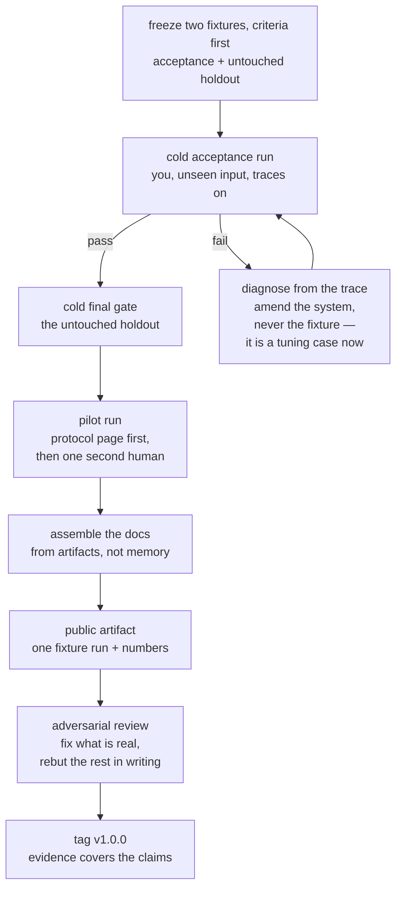
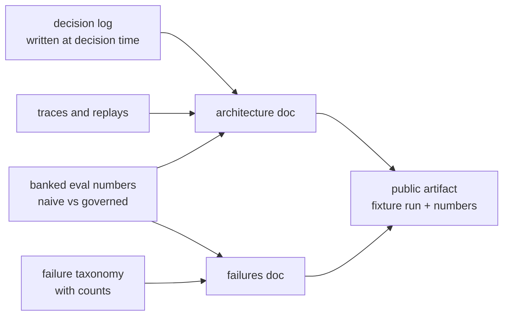

# S14-ship-and-pilot — The cold run, the pilot, and the public artifact

**What this teaches:** shipping is the last measurement, not a mood — a cold
acceptance run on unseen input, one pilot with a second human under a written
protocol, documentation *assembled* from artifacts rather than composed from
memory, and a public evidence artifact that shows measured behavior instead of
vision.
**Time:** ~20 min of reading, ~4 h of doing (fine to split across days).
**Prerequisites:** S01–S13 for the vocabulary and the mechanisms — and, as in S13,
a non-trivial project of your own to ship. **This session is optional.** The
path's toys are independent; there is no cumulative build waiting to be shipped,
so "your system" means one you own. Completing S01–S12 does not require S14.
**Hands-on:** no notebook — the hands-on is your own system, run through the
protocol below.
**Video:** [Gemini Notebook overview](videos/S14-ship-and-pilot.mp4) — generated with Google Gemini Notebook (formerly NotebookLM); preview or review, never a substitute for the protocol.

---

## The theory in depth

### Done is a measurement, not a mood

Every system feels finished from the inside. You know which inputs it handles,
which routes are warm, which pauses to narrate over. That knowledge is exactly
the problem: a run you conduct on inputs you chose, in an environment you
prepared, with you steering, measures *your memory of the system*. The demo
effect is not dishonesty; it is contamination.

The fix is the fixture invariant from S02, promoted from the eval suite to the
whole system. An acceptance run counts only if:

- the input is one the system has **never seen** — not a golden-set task you
  tuned against,
- the pass criteria were **written down before** the run — predict-first at
  system scale, so "done" can't be retro-fitted to whatever happened,
- the run starts **cold** — clean state, traces on, no warmup, no steering.

A failed acceptance run is not a disaster and not a secret: it is a result.
The trace tells you where it broke; you amend the *system* and rerun. But count
what the failure cost the fixture: an input you have diagnosed from and fixed
against is no longer unseen — it is a tuning case now, and a green rerun on it
is regression evidence, not acceptance evidence. So the final gate runs on a
second fixture, a holdout frozen at the same time and never opened during
fixing. The one move that is actually fatal is editing the fixture to fit — that is
S02's suite-gaming move at ship scale, with no checker left above you to
catch it.

### The second human changes the instrument

You are the least representative user your system will ever have. You know
what it is for, what it can't do, and — worst of all — what you meant by every
label on the screen. The second acceptance run is therefore done by someone
else: one consenting, trusted adult, under a written protocol.

The protocol page comes first, and it is short on purpose. Four statements:

1. **What this is and is not** — a tool with hard limits, not a professional
   service. The run stops being harmless the moment the pilot believes
   otherwise.
2. **What happens to their data** — where it lives, and that it is deleted on
   request. This is what makes their reaction usable evidence.
3. **Where to go if things go wrong** — stated up front, not discovered after.
4. **The authorship rule** — an assistant may attack your draft of the page;
   the words are yours and final.

Then the pilot: they read, they use the system end-to-end, you stay quiet. You
record their honest reaction, with permission, in their words. The Mom Test's
taxonomy of bad data applies verbatim — compliments, fluff ("I'd totally use
it"), and feature ideas are worth nothing; what they *did*, where they
hesitated, and what they worked around is the evidence
([momtestbook.com](https://www.momtestbook.com/)).

And calibrate what one pilot proves. Discount usability testing's famous
result — a handful of users finds most problems — is a statement about
*finding showstoppers*, never about their absence
([Nielsen](https://www.nngroup.com/articles/why-you-only-need-to-test-with-5-users/)).
Your n=1 pilot is a smoke detector, not a sample. A quiet detector reports one
fact: the house was not on fire during the test. It certifies nothing about the
house — not the wiring, not the market, not the next occupant.

### Assembly, not composition

Documentation written at ship time, from memory, describes the system you
*meant* to build. The decisions have faded; what remains is intent, and intent
reads well and matches nothing. Hence the session's core move: **the docs are
assembled, not composed.** The mechanical test is a citation test — every
*evidence-bearing* claim about behavior or architecture points at an artifact
that already existed: a decision record, a banked
eval number, a trace. Procedural and explanatory prose needs no pointer; a
behavioral or architectural claim with no citation is invention.

Assembly is only possible because the records were written at decision time.
That is the payoff of the decision log you have kept since the early sessions
— the architecture-decision-record pattern in its original minimal form
([Nygard 2011](https://cognitect.com/blog/2011/11/15/documenting-architecture-decisions)).

The architecture doc gets one section most docs lack: the honest two columns.

| Survives a model swap | Workaround — delete when the model improves |
|---|---|
| eval suite and banked baselines | prompt patches for model quirks |
| deterministic governors and consent gates | retry hacks |
| traces, replay, schemas, validators | output post-processing crutches |

The first column is the asset; the second is technical debt with a demolition
date. Writing both down is what makes the next model generation an upgrade
instead of a regression hunt.

The failures doc is a postmortem anthology in the SRE sense: blameless,
mechanism-first, and honest about what remains
([Google SRE book, ch. 15](https://sre.google/sre-book/postmortem-culture/)).
Top failure categories with counts, what fixed them, what remains — including
the uncomfortable numbers (your false-trigger rate, your judge-agreement
score), stated plainly. A failures doc without the worst number in it is
marketing wearing a hair shirt.

### Public evidence, not vision

The last artifact is public: a write-up or ~10-minute recording of one full
run, end to end, with the naive-vs-governed numbers. Two invariants:

- **Fixture-only, always.** Never real-session content. Transcript
  anonymization is far weaker than it looks — style and circumstance
  re-identify — and "anonymized" is a judgment call you can't audit. The
  fixture rule is absolute precisely because it is mechanical.
- **Reproducible by a stranger.** The claim is the numbers, and the numbers
  ship with everything needed to rerun them. This is the system-card pattern
  at solo scale — labs publish measured behavior, failures included, as the
  artifact of record
  ([OpenAI o1 system card](https://arxiv.org/abs/2412.16720)).

Then, before the tag, one adversarial pass: hand the write-up and the repo to
the strongest critic available — a frontier model in adversarial mode, or a
hostile friend — with one instruction: find the unsupported claims. Fix what
is real; rebut what is not, in writing, next to the claim. This is the S12
cross-examination muscle pointed at your own evidence.

The tag — v1.0.0 — carries two promises from two different authorities. In
[semver](https://semver.org) terms, v1.0.0 asserts exactly one thing: a defined
public API exists, and the version number now describes how it changes. The
second promise — the evidence in the repo covers the claims in the
artifact — is not SemVer's; it is this path's own release policy, signed at the
tag. No more. Everything deliberately parked (wider pilots, new surfaces,
dashboards) starts from the tag, not before it — a parked list is only
meaningful against a frozen baseline.

## The protocol

Run this against your own system, in order. Each step has an artifact and a
"done when" line. Reorder them and the later steps inherit the earlier steps'
contamination.

1. **Freeze the fixtures and the criteria.** Choose end-to-end scenarios the
   system has never processed — not golden-set tasks you tuned against: one
   acceptance fixture, plus a holdout reserved for the final gate and never
   opened while fixing. Write
   the pass criteria down, dated, before touching the system. Predict-first at
   system scale. *Done when:* the criteria exist in writing and a skeptic
   could apply them without you in the room.
2. **Run the acceptance pass cold.** Clean state, traces on, no narration, no
   steering. If it fails: diagnose from the trace, amend the system, rerun.
   Never edit the fixture to fit — and remember what the failure cost: a fixture
   you have diagnosed from and fixed against is a tuning case, not unseen
   evidence. The final gate is one cold run on the untouched holdout. *Done
   when:* a green holdout run whose trace
   and numbers you would show a hostile reviewer.
3. **Write the one-page pilot protocol.** The four statements: is/is-not, data
   handling, where to go if things go wrong, authorship rule. Draft it, then
   have your strongest model attack the draft. *Done when:* it fits on one
   page and a non-engineer can read it in two minutes.
4. **Run the pilot.** One consenting, trusted adult reads the protocol page
   first, then uses the system end-to-end while you stay quiet. Record their
   honest reaction, with permission, in their words. *Done when:* their
   reaction is written down — including the part where the system lost them.
5. **Assemble the architecture doc.** Components, data flow, the decision
   table from your decision log, known limits, and the honest two columns
   (survives a model swap / workaround to delete). Timebox 45 minutes: if
   assembly takes longer, the artifacts weren't there, and that is a finding.
   *Done when:* no behavioral or architectural claim lacks a citation to an
   existing artifact.
6. **Assemble the failures doc.** Top failure categories with counts, what
   fixed them, what remains — the false-trigger rate and the judge-agreement
   score included, plainly. Blameless in the SRE sense: mechanisms and
   contributing factors, never people. *Done when:* the worst number is in
   the doc.
7. **Publish one fixture run.** Write-up or ~10-minute recording: one full
   run, end to end, naive-vs-governed numbers, your voice. Never real-session
   content. *Done when:* a stranger could reproduce your claim from the public
   repo alone.
8. **Cross-examine, then tag.** Adversarial review of write-up plus repo by
   the strongest critic available; fix what is real, rebut what is not, in
   writing. Then tag v1.0.0 — SemVer's half of the promise is a defined public
   API; the other half, that the evidence covers the claims, is this path's
   own release policy, not SemVer's. *Done when:* every objection has a fix or a written rebuttal, and the
   parked list (everything after v1.0.0) is written down, not started.

## State of the art (as of August 2026)

| Development | Status | Take |
|---|---|---|
| Architecture decision records are the standard lightweight form for keeping rationale ([Nygard 2011](https://cognitect.com/blog/2011/11/15/documenting-architecture-decisions); [Fowler](https://martinfowler.com/bliki/ArchitectureDecisionRecord.html)) | **already in this path** | Your decision log is an ADR log. Assembly works because the records exist — this session is the payoff. |
| Blameless postmortem culture ([Google SRE book, ch. 15](https://sre.google/sre-book/postmortem-culture/); [SRE workbook](https://sre.google/workbook/postmortem-culture/)) | **adopt** | The failures doc is a postmortem anthology. Steal the structure: what happened, contributing factors, what fixed it, what remains. |
| Discount usability testing: a handful of users surfaces most showstoppers ([Nielsen](https://www.nngroup.com/articles/why-you-only-need-to-test-with-5-users/)) | **recognize** | Legitimizes n=1 as a smoke detector — and states its limit. Do not let it talk you into calling a pilot a study. |
| "Do things that don't scale" ([Graham](https://paulgraham.com/ds.html)) | **recognize** | The pilot is deliberately concierge-scale. Unscalable honesty now beats scalable theater later. |
| System cards as the lab-scale public evidence artifact ([OpenAI o1 system card](https://arxiv.org/abs/2412.16720)) | **recognize** | Labs publish measured behavior, failures included, as the artifact of record. Your fixture-run write-up is the solo-scale version. |
| Semantic versioning as the public contract behind a v1.0.0 tag ([semver.org, spec 2.0.0](https://semver.org/spec/v2.0.0.html)) | **adopt** | SemVer 1.0.0 asserts exactly one thing: a defined public API exists. The tag's second promise — the evidence covers the claims — is this path's own release policy, not SemVer's. Cheap to type, expensive to mean. |
| EU AI Act staged application, as amended by the Digital Omnibus ([Regulation (EU) 2026/1744](https://eur-lex.europa.eu/eli/reg/2026/1744/oj), in force 27 Jul 2026): Art 5 prohibitions and GPAI obligations already apply; Art 50 transparency from 2 Aug 2026 — with a transition carve-out: for certain pre-existing systems under Art 50(2) as amended, the transparency obligations apply from **2 Dec 2026**; Annex III high-risk obligations postponed to **2 Dec 2027**, Annex I product-embedded to **2 Aug 2028** | **newer than this session** | A one-trusted-adult pilot is etiquette; a scaled pilot is a compliance question with dates that keep moving — check them at ship time. Your protocol page is the seed of that file — parked, deliberately. |
| Simulated "users" as a stand-in for the pilot ([arXiv:2601.17087](https://www.arxiv.org/pdf/2601.17087), cited at S02) | **ignore** | S02 established the realism gap. A simulated pilot is theater; ship the awkward human conversation. |

## Annotated readings

- **Google SRE book, [Postmortem Culture: Learning from Failure](https://sre.google/sre-book/postmortem-culture/)
  (ch. 15).** Extract the blameless constraint — describe mechanisms and
  contributing conditions, never people — and the criterion that a postmortem's
  value is measured by the changes it triggers. The failures doc is an
  anthology of these; steal the structure.
- **Michael Nygard, [Documenting Architecture Decisions](https://cognitect.com/blog/2011/11/15/documenting-architecture-decisions)
  (2011).** Extract the minimal record — context, decision, status,
  consequences — and above all *when* it is written: at decision time.
  Ship-time assembly is only possible because of that timing.
- **Jakob Nielsen, [Why You Only Need to Test with 5 Users](https://www.nngroup.com/articles/why-you-only-need-to-test-with-5-users/)
  (2000).** Extract the direction of the claim: small-n testing finds
  problems; it never proves their absence. Recalibrate what your one pilot
  certifies.
- **Rob Fitzpatrick, [The Mom Test](https://www.momtestbook.com/) (2013).**
  Extract the three kinds of bad data — compliments, fluff, feature ideas —
  and the rule to ask about past behavior, not future intentions. Governs how
  you record the pilot's honest reaction.

## Misconceptions and failure modes

- **"The demo went fine, so it's done."** The warm-path illusion: chosen
  input, warm route, narration over the stalls. Cold, unseen, criteria-first —
  or it didn't happen.
- **"Documentation is writing."** Composing at ship time produces the system
  you meant to build. The citation test is the whole discipline: no artifact,
  no claim.
- **"They said they loved it."** Compliments are the worst data in the
  building. Hesitations, workarounds, and the thing they did instead — that is
  the data. Record what they did, not what they politely said.
- **"It's anonymized, so I can publish it."** Transcript anonymization is
  weak; style and circumstance re-identify. The fixture-only rule exists
  precisely because it is the only version you can audit.
- **"Tag it and move on."** v1.0.0 as morale ritual. The tag is a claim —
  evidence covers exactly what the artifact asserts — and an unsupported claim
  at tag time is the bug every later session inherits.

## Self-check

Why must the acceptance run be cold, on unseen input, with criteria written first?

Because anything warmer measures your memory of the system: you subconsciously
steer toward inputs it handles and away from known weak spots. Unseen input
makes it a measurement of the system rather than of your rehearsal, and
criteria written first prevent "done" from being retro-fitted to whatever the
run happened to produce.

What four statements does the pilot protocol page carry, and why does each exist?

Is/is-not (the run stops being harmless if the pilot mistakes a tool for a
professional service); data handling (it is what makes their reaction usable
evidence); where to go if things go wrong (caps the blast radius of a bad run,
up front); the authorship rule (assistants may attack the draft; your words
are final). Without the page you have neither permission nor trustworthy
data.

What is the mechanical test that distinguishes assembled from composed documentation?

The citation test: every evidence-bearing claim — about behavior or
architecture — points at an artifact that already existed: decision record,
banked number, trace. Such a claim with no citation is
invention: you are composing the system you meant to build. Procedural and
explanatory prose needs no pointer.

Why is the public artifact always fixture-based, never a real session?

Two reasons. Transcript anonymization is far weaker than it looks — style and
circumstance re-identify — and "anonymized" is a judgment call you can't
audit, while the fixture rule is mechanical. And the fixture run is
reproducible: the numbers carry the evidence; intimacy adds risk, not
credibility.

## What's next

There is no S15. What you own after the tag: a core you can rebuild from
memory (S13), a measurement instrument you can defend (S02), the mechanisms of
a governed, observed, budgeted, calibrated harness (S05–S12) — and, for the
system you applied them to, a public claim with
the evidence to survive cross-examination. The parked list — wider pilots, new
surfaces, outcomes aggregation — is real work with real protocols of its own,
and it starts from the tag, not before it.
