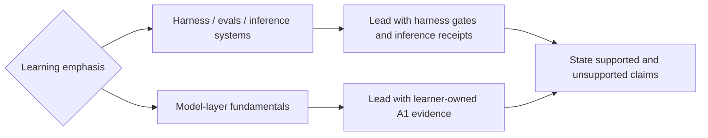

# Six-week calibrated post-core / BYO-artifact overlay

**What this is:** a post-core, bring-your-own-artifact schedule that pairs the Agent
Harness Path with bounded external model-layer study. It links to the authoritative
courses; it does not copy their lessons, exercises, assignment text, or solutions.
**Time:** 32.5 hours across six weeks: 23.0 model hours and 9.5 harness hours.
**Prerequisites:** completed S01–S12 and, if chosen, the hard path, or equivalent
harness experience; an inspectable agent/eval artifact with a green, banked
baseline; Python; and enough version-control fluency to bank evidence without
committing credentials or external course material.

## Hard prerequisite gate

Do not begin W1 until both conditions are true:

1. You completed the S01–S12 core route (and the hard path if that is your chosen
   artifact), or you already have equivalent harness experience. If you are new to
   harnesses, do S01–S12 first.
2. You can name an inspectable agent/eval artifact and reopen its green, banked
   baseline. The hard-path trivia host can satisfy this artifact gate; otherwise
   bring your own.

Record the gate before starting with the
[`study/PROGRESS.template.md`](../study/PROGRESS.template.md) record:

```bash
mkdir -p study/evidence
cp study/PROGRESS.template.md study/PROGRESS.md
```

Then update `study/PROGRESS.md` during each week.

---

## Learning-purpose emphasis

This route pairs one defensible model-layer build with an existing agent/eval
artifact. Choose which learning emphasis leads; complete and bank both evidence
sets.

| Learning emphasis | What evidence leads | What this route can honestly support |
|---|---|---|
| Harness, evals, and inference-systems depth | The shipped harness artifact, reproducible gate receipts, and inference benchmark | CS336 A1 and the short courses add bounded model-layer fundamentals so harness and inference tradeoffs can be explained from evidence. |
| Model-layer fundamentals depth | Learner-owned A1 code, tests, loss curve, and sample generations | The harness receipts and inference benchmark add systems context. Six part-time weeks do not demonstrate large-scale training or the full CS336 core. |

Choose the learning emphasis before ordering the evidence narrative. The same
evidence set supports both emphases; only the leading evidence changes.



## Evidence over claims

1. **Bank before claiming.** "Completed" means the named receipt exists, can be
   reopened, and identifies the run or commit that produced it. A watched lecture
   or course-completion badge is not implementation evidence.
2. **Separate observed from inferred.** Record commands, configuration, environment,
   raw measurements, failures, and the interpretation separately.
3. **Keep work learner-owned.** Bank your code, tests, measurements, and restatements;
   do not copy assignment text, external notebooks, course answers, or solution code.
4. **Use honest tense.** Until the A1 loss curve and sample generations are banked,
   say "building CS336 A1," not "built a Transformer from scratch."
5. **Prefer one inspectable artifact to five vague bullets.** Each week below has one
   required receipt. Stretch work never substitutes for it.

## Scope boundaries before the calendar

- [Stanford CS336, Spring 2026](https://cs336.stanford.edu/) supplies the single
  deep build: **Assignment 1 (A1)** only. **A2 (systems)** is deferred. **A3 is
  scaling** and **A5 is alignment**; they are named for orientation, not scheduled
  as six-week implementation deliverables.
- Stanford's honor-code boundary applies. Agents may help answer high-level and
  low-level questions, but may not solve an assignment. All assignment
  implementation, debugging decisions, tests, and explanations remain
  learner-owned.
- The [DeepLearning.AI RLHF course](https://www.deeplearning.ai/courses/reinforcement-learning-from-human-feedback)
  is a managed Google Cloud pipeline experience. It is **not** a from-scratch
  reward-model (RM) or PPO implementation; describe the receipt accordingly.
- The [DeepLearning.AI vLLM course](https://www.deeplearning.ai/courses/fast-and-efficient-llm-inference-with-vllm)
  is the optimize-deploy-benchmark block. Its receipt must preserve the optimization
  configuration, deployment command/configuration, benchmark workload, environment,
  raw result, and at least one before/after or baseline comparison number.

## The six-week calendar

The hour split is a cap, not a suggestion to fill unused time with new scope.

| Week | Theme | Model hours | Harness hours | Total |
|---|---|---:|---:|---:|
| W1 | Artifact baseline + managed post-training pass | 2.0 | 3.0 | 5.0 |
| W2 | Optimize, deploy, benchmark inference | 3.5 | 1.5 | 5.0 |
| W3 | CS336 A1: concepts + tokenizer | 5.5 | 0.5 | 6.0 |
| W4 | CS336 A1: Transformer + training loop | 6.0 | 0.0 | 6.0 |
| W5 | Finish and bank A1 | 5.0 | 1.0 | 6.0 |
| W6 | Ship the harness artifact + evidence narrative | 1.0 | 3.5 | 4.5 |
| **Total** |  | **23.0** | **9.5** | **32.5** |

### W1 — Artifact baseline + managed post-training pass

- **Base:** Run the local harness verification gates and record their exact results.
  Complete the RLHF short course as a managed Google Cloud pipeline concept pass;
  do not describe it as hand-building an RM or PPO loop.
- **Stretch:** Draft a one-page artifact narrative that distinguishes mechanisms,
  measurements, and claims.
- **Defer:** New lesson authoring, new harness features, or a second post-training
  course.
- **Banked evidence artifact:** `study/evidence/w1-baseline-and-rlhf.md`, containing
  dated local gate commands/exit results plus a learner-written account of what the
  managed pipeline demonstrated and did not demonstrate.

### W2 — Optimize, deploy, benchmark inference

- **Base:** Complete the vLLM optimize-deploy-benchmark sequence. Preserve enough
  detail for another engineer to distinguish optimization effects from workload or
  hardware changes.
- **Stretch:** Add the strongest benchmark comparison to the harness artifact
  narrative, with its workload and environment beside the number.
- **Defer:** CS336 A1. Starting it early is not permission to omit the inference
  receipt.
- **Banked evidence artifact:** `study/evidence/w2-vllm-receipt.md`, containing the
  optimization configuration, deployed model/server configuration, exact benchmark
  workload, environment, raw output location, and one labeled baseline-versus-result
  number. Do not include copied course solution code.

### W3 — CS336 A1: concepts + tokenizer

- **Base:** Use the Spring 2026 CS336 materials needed for A1, then implement and test
  the A1 tokenizer yourself. Ask agents questions; do not ask them to solve the
  assignment.
- **Stretch:** Sketch the Transformer module interfaces in your own words before
  implementing them.
- **Defer:** A2 systems work, A3 scaling implementation, A5 alignment implementation,
  and any unrelated model project.
- **Banked evidence artifact:** `study/evidence/w3-a1-tokenizer.md`, containing the
  learner-owned commit SHA, test command/results, one failure investigated, and a
  restatement of the tokenizer invariants.

### W4 — CS336 A1: Transformer + training loop

- **Base:** Implement the A1 Transformer and training loop. Debug with the smallest
  useful run before spending on a larger run. The code and debugging decisions stay
  learner-owned.
- **Stretch:** Capture an early training trace if the base implementation is already
  tested.
- **Defer:** A2, A3, A5, benchmark polishing, and harness feature work.
- **Banked evidence artifact:** `study/evidence/w4-a1-training-smoke.md`, containing
  the learner-owned commit SHA, architecture/configuration, test results, first
  successful training-smoke log, and one explained defect.

### W5 — Finish and bank A1

- **Base:** Finish A1 and bank the result that makes the build claim truthful: a
  labeled loss curve plus sample generations tied to a commit and run
  configuration. Keep harness work to maintenance only.
- **Stretch:** Write a short comparison between the W1 managed RLHF experience and
  the A5 alignment concepts, without attempting A5 or copying course material.
- **Defer:** Every second coding assignment, especially A2. A3 scaling and A5
  alignment remain conceptual orientation, not completed deliverables.
- **Banked evidence artifact:** `study/evidence/w5-a1-result.md`, containing the
  commit SHA, run configuration, loss-curve path, sample-generation path, test
  results, and limits on what the run proves.

### W6 — Ship the harness artifact + evidence narrative

- **Base:** Re-run the harness gates, bank the release commit, and write the
  evidence narrative. Explain what the harness receipts demonstrate, what the A1
  evidence demonstrates, and what neither evidence set demonstrates.
- **Stretch:** Take the optional free
  [Anthropic API course](https://anthropic.skilljar.com/claude-with-the-anthropic-api)
  for platform fluency. It does not replace the release receipt.
- **Defer:** The CCA exam. There is no CCA exam objective in this six-week route.
- **Banked evidence artifact:** `study/evidence/w6-release.md`, containing the release
  commit SHA, exact verification commands/results, artifact location, supported
  claims by evidence source, and an explicit list of unsupported claims.

## Slip policy

Protect the two needle-movers: the learner-owned CS336 A1 build and the shipped
harness artifact. If a week slips:

1. Cut stretch work first.
2. Carry only the unfinished base item that blocks A1 or the artifact receipt.
3. Keep A2, A3 implementation, A5 implementation, the optional Anthropic API course,
   and the CCA exam deferred.
4. Do not schedule a make-up binge. Re-estimate the remaining weeks using their
   original hour caps; if the receipts no longer fit, extend the calendar.

## Honest longer alternative

If full CS336 A1 + A2 is non-negotiable, use roughly **10–12 weeks at 8–10 hours
per week**. Do not compress both assignments into this route. The six-week version
buys A1 depth, bounded inference/post-training breadth, and a shipped harness
artifact; it does not buy the full CS336 core.
