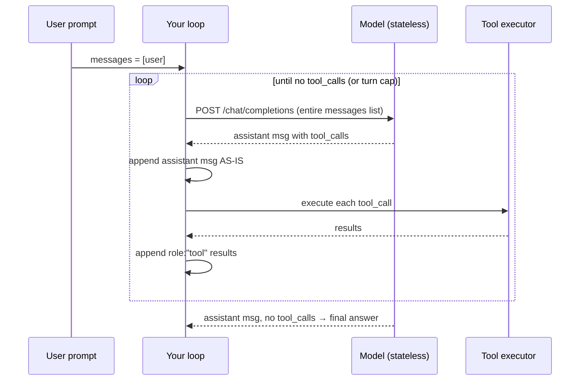

# S01 — The agent loop (companion)

Course session: `syllabus.md` §S1 (DONE 2026-07-30 — this companion is written after
the fact, so it also serves as the S13 warm-up: can you still explain all of it?)

Companion flow: **Concept → Toy → Bridge → Build map → Self-check → Field guide**

---

## 1. Concept (15 min)

**The one idea:** an agent is a `while` loop around a stateless API. The model never
*does* anything — it returns `tool_calls`, your code executes them, appends the
results, and asks again. The intelligence is in the model; the *agency* is in your loop.

Three facts that everything else follows from:

1. **The API is stateless.** Every request carries the whole `messages` list. There is
   no server-side conversation. Context engineering (S3) is just managing that list.
2. **The assistant message containing `tool_calls` must be appended verbatim.**
   The tool results reference it by `tool_call_id`; drop or mutate it and the next
   request is incoherent (most APIs reject it outright).
3. **Stop conditions are your responsibility.** The model will happily call tools
   forever. The loop stops when (a) the reply has no `tool_calls`, (b) the turn cap
   fires, or (c) an error fires. (b) and (c) are not failures of the model — they're
   the harness doing its job (D-01).

## 2. Toy (30 min)

Notebook: [`notebooks/s01_agent_loop_toy.ipynb`](../notebooks/s01_agent_loop_toy.ipynb)

A weather-bot loop against a **mock model** — a plain Python function returning
API-shaped dicts. No network, no keys, no cost. You can read the entire "model" and
predict exactly what it will do, which is the point: the loop's behavior becomes fully
transparent when the model is not a black box.

Experiments in the notebook (predict first, then run — the course discipline):

1. Run the happy path; read the transcript cell's output until the message-list shape
   is boring.
2. Comment out the line that appends the assistant message. Predict what breaks, then
   verify.
3. Point the loop at the "broken" mock that calls a tool forever. Predict the turn
   count at exit.
4. Make the tool raise. Where does the error surface — in the loop, or in the transcript?

## 3. Bridge (30 min)

Small reps on the toy, each one a move the real `loop.py` required:

1. **Add a tool** (`get_time(city)`) to the toy: definition dict + dispatcher branch.
   Feel how the model *selects* tools purely from the JSON schema you show it.
2. **Add per-tool argument validation** that returns `"ERROR: ..."` as the tool result
   instead of raising. Notice the loop survives and the model sees the error — that's
   `execute_tool`'s try/except in the real `loop.py`.
3. **Cap tool output** at N characters (the toy has no limit; the real one caps at
   4,000, D-02). What information do you lose from the middle vs. the head/tail?
4. **Explain out loud** (teach-back, 2 min): why the turn cap is a harness property,
   not a model property. Record yourself if it helps — this is FDE interview material.

## 4. Build map — toy → real `harness/loop.py`

| Toy element | Real counterpart | What's new in the real one |
|---|---|---|
| `mock_model(messages)` | `call_model` via httpx to LiteLLM | real HTTP, auth, 600 s timeout, `usage` accounting |
| `TOOLS` dict | `TOOL_DEFINITIONS` + `dispatch_tool` | 4 real tools; `run_command` executes shell — containment becomes real |
| toy workspace = none | `resolve_in_workspace` path jail | **path jail ≠ shell isolation** — the S1 lesson the trace proved |
| turn cap 6 | `--max-turns` default 15 (D-01) | cap value is a recorded decision, not a magic number |
| print transcript | `LoopResult(turns, tokens, final_answer, error)` | structured result; exit code from error state |

## 5. Self-check

From `progress/S2-UNDERSTANDING.md` §S1 — answer before unfolding.

Why must the assistant message containing <code>tool_calls</code> be preserved verbatim?

The API is stateless: the next request must reconstruct the exact conversation. Tool
results hang off the assistant message via <code>tool_call_id</code>; without it the
results are orphans and the request is invalid.

All loop stop conditions?

(1) assistant reply with no <code>tool_calls</code> (success); (2) turn cap reached
(bounded-execution guarantee, D-01); (3) exception in call or dispatch (surfaced as
<code>LoopResult.error</code>, exit 1).

Purpose of the turn cap?

Bounds runaway execution — cost, time, and side effects — independent of model
behavior. The cap is a property of the harness, chosen from evidence (margin above the
10-turn g04 run), not from intuition.

File-path containment vs shell-command isolation?

<code>resolve_in_workspace</code> guarantees <code>read_file</code>/<code>write_file</code>
stay in the workspace. <code>run_command</code> runs a shell with the workspace as
<code>cwd</code> — and <code>cwd</code> is not containment: the shell can touch
anything the user can. The S1 trace proved this empirically; least-privilege execution
is deferred to S6 for exactly that reason.

## 6. Field guide

- **"It answered without calling tools"** — that's exit condition (a), not a bug. If
  you expected tool use, the tool schemas didn't make the need obvious; read the
  `description` fields as the model sees them.
- **400/422 from the API mid-loop** — almost always a malformed `messages` list:
  orphaned `tool` results or a mutated assistant message (experiment 2 exists so you
  see this once, cheaply).
- **Loop ends at the cap every run** — the task is underspecified or a tool is
  returning errors the model keeps retrying; read the transcript, not the final answer.
- **Done means:** `g04` PASS via the loop where naive failed, both numbers in
  PROGRESS.md, and you can draw the sequence diagram from memory.
