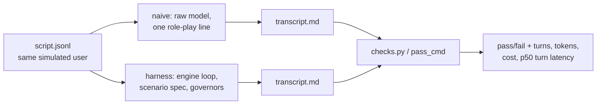

# S02 — Golden set & baselines (companion)

Course session: `syllabus.md` §S2 — design a reproducible eval suite for conversational
software (simulated users, two-tier checkers) and bank a naive baseline that states the
product's reason to exist.

Companion flow: **Concept → Toy → Bridge → Build map → Self-check → Field guide**

---

## 1. Concept (20 min)

**The one idea:** an eval suite is a *measurement instrument*, not a test suite. A test
suite asks "is it broken?"; a measurement instrument asks "how much better is A than B,
and would I believe the number?" Everything in S2 — hermetic fixtures, scripted users,
two tiers, the naive baseline — exists to make the number defensible.

Four moving parts, four ideas:

**1. The scripted user (`script.jsonl`).** A rehearsal is multi-turn, so a single
`prompt.md` can't exercise it. The simulated user is a fixed list of user turns,
replayed verbatim, temperature 0. Reproducibility comes from the *script*, not from
hoping the model repeats itself.

**2. Diverge / rejoin.** Naive and harness modes must differ *only* in the scaffolding,
and must produce the same artifact shape so one checker judges both:

If the comparison shares the script, the fixture, and the checker, the delta between
naive and harness is attributable to the harness. That's what "defensible" means here —
and why the naive baseline is the product argument: naive mode *is* the status quo
(free-form chatbot role-play), so `harness − naive` is the measured reason the platform
deserves to exist.

**3. Two checker tiers, reported separately.** The deterministic tier asserts structure
and safety invariants in code (refusal happened, ceiling held, ≥N turn references).
The judged tier scores quality (persona realism, pacing) via an LLM judge — reported as
a separate column, labeled *uncalibrated* until S12 measures the judge. Safety never
rides on the judged tier.

**4. The fixture invariant.** `runner.sh` proves the checker itself works: bare fixture
must FAIL `pass_cmd` (nothing to check → honest failure), fixture + reference must PASS
(the checker isn't impossible). A checker that passes on an empty fixture measures
nothing; one that fails on the reference measures the wrong thing.

## 2. Toy (30 min)

Notebook: [`notebooks/s02_scripted_user_eval_toy.ipynb`](../notebooks/s02_scripted_user_eval_toy.ipynb)

A customer-support scripted user against two mock "engines": a naive one (answers
anything, including what it shouldn't) and a governed one (refuses + signposts). Runs
both through the same driver, same script, same deterministic checks — and prints the
delta table. The naive row *fails* the scope check; the harness row passes. That tiny
table is the entire product argument of the platform, in miniature.

Experiments (predict first):

1. Read the script and both mocks; predict each row's pass/fail before running.
2. Weaken one check (e.g., drop the signpost requirement). Which rows flip? A check
   that flips nothing is decoration — this is how you audit a checker.
3. Run the fixture invariant on the toy: empty transcript vs reference transcript.
4. Add a third "engine" that refuses *everything*. It passes the scope check — is it a
   good product? Which tier would catch it, and why can't the deterministic one?

## 3. Bridge (40 min)

Reps on the exact moves the real build needs:

1. **Write a deterministic check from scratch** on the toy transcript: "every engine
   turn after a refusal must stay out of character" — or any invariant you invent.
   Feel the gap between *what you mean* and *what a string match can assert*. That gap
   is why the judged tier exists.
2. **Add p50 turn latency** to the toy driver (latencies are fake — the point is the
   plumbing: per-turn measurement happens inside the driver; aggregation happens in the
   runner).
3. **Design the toy's `task.yaml`** on paper: which keys does the runner need, which
   does the checker need, which are just documentation? Compare against the anatomy in
   `syllabus.md` §The eval spine.
4. **Trace the divergence question** the real build forces on you: for rehearsal tasks,
   where does the driver live, and how does run.py learn per-turn latencies from a
   subprocess? (There is a design discussion from your S2 session with the candidate
   seams marked — revisit it now that the toy has made the mechanics concrete.)

## 4. Build map — toy → real `evals/run.py` + `p01…p06`

| Toy element | Real counterpart | What's new |
|---|---|---|
| mock engines | engine route via LiteLLM (`gpt-oss-20b`, D-03 rev-1) | real latency, real cost, real variance |
| `drive(engine, script)` | rehearsal mode of `harness/loop.py`, subprocessed by `run.py` | honest timeouts (D-04), machine-readable result line |
| inline transcript list | `transcript.md` written into the fixture copy | the transcript is *evidence* — saved under `evals/results/` |
| toy `check_*` functions | per-task `checks.py` run via `pass_cmd` | `runner.sh` invariant must hold offline: bare FAIL / reference PASS |
| toy delta table | `reports/p0-baseline.md` via `--bank` | judged column present but labeled *uncalibrated* |
| — | p02/p03/p04 safety fixtures | policy/governor machinery doesn't exist until S5–S6: S2 versions carry minimal stubs, recorded as stubs |

The stub discipline matters: p01's schema stub is tightened at S4, p04's ceiling
enforcement becomes real at S5, p02's policy file becomes verified data at S6. A stub
that isn't labeled a stub becomes silent drift — label them in the task dirs.

## 5. Self-check

From `progress/S2-UNDERSTANDING.md`:

Why was the July-19 baseline invalid rather than a model failure?

Wedged-backend timeouts were recorded as model FAILs. A timeout on dead infra measures
the infra, not the model — hence D-04's declared budget plus probe validation: fast
one-token probe → backend alive, verdict stands; hanging probe → infra incident, row
invalid.

What makes a naive-vs-agent comparison defensible?

Shared everything except the scaffolding under test: same task, same fixture, same
script, same checker, same route. Any other difference is a confound the delta can't
survive.

Model failure vs harness failure vs infrastructure failure — one line each.

Model: the model's behavior is wrong given working scaffolding. Harness: the driver
mangles the task (exit 97's "no code block matched" class). Infra: the backend/network
lies (exit 98 class, probe-validated per D-04).

Why is aggregate pass rate insufficient?

Pass rate hides the distribution of causes; a suite can go green by the checker
weakening, the fixture leaking the answer, or the model gaming the check. Failed and
surprising transcripts are where the number's meaning lives — the reading habit is the
S2 skill, the number is just its prompt.

## 6. Field guide

- **exit 97** — the model's reply produced no artifact matching `target_files`
  (g-tasks: no labeled code block; p-tasks analogue: no transcript written). Harness-
  shaping failure, not necessarily model incompetence.
- **exit 98** — `pass_cmd` timeout (600 s). Probe before banking (D-04).
- **exit 2 from run.py** — environment: `LITELLM_BASE_URL` or the key env var missing;
  check the vault file, don't debug the code.
- **runner.sh SKIP** — the reference couldn't cover `target_files`; fix the reference
  layout, never special-case the validator.
- **runner.sh BROKEN (bare exit=0)** — the checker passes on an empty fixture: the
  check is asserting nothing. Weakest-link defect; fix before anything banks on it.
- **0-token rows** — the banking sanity check; a 0-token row means the engine answered
  empty and the row is lying about the comparison.
- **Cold vs warm latency** — first call on an idle Ollama route pays model load
  (D-03 rev-1's 7–21 s vs 80–89 s spread). Warm the engine route before banking, or
  the baseline measures Ollama's disk, not the engine.
- **Done means:** `./runner.sh p` green on all six, predictions logged before the run,
  `reports/p0-baseline.md` banked with the judged column labeled uncalibrated, every
  surprise explained in the session log.
