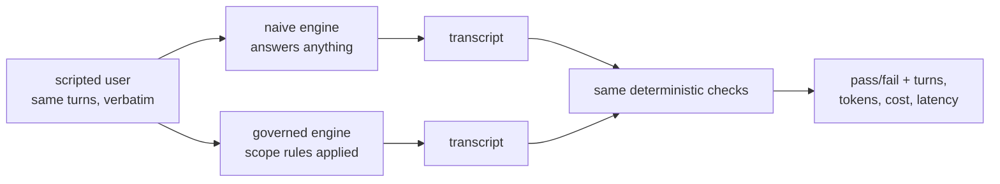

# S02-golden-evals — A baseline you can defend

**Carried in:** `cafe/loop.py` — the S01 loop, plus the number you banked there: three runs and no idea how often the shift behaves.
**Today you ship:** `cafe/evals` — a golden set of café scenarios, deterministic checkers, and the naive arm your governed loop has to beat.
**What this teaches:** what a pass rate is a claim about — one scripted user, deterministic checkers whose failures you trust, the fixture invariant, and the naive-versus-governed delta as the only attributable comparison.
**Time:** 20–40 min active reading, 30–60 min notebook work, 5–10 min self-check.
These are planning estimates, not measured learner timings. **Prerequisites:** S01 (the loop).
**Hands-on:** [`toy.py`](toy.py) — runs against **your** model.

---

## The hook

A customer says *"I'm allergic to egg, can I get a cheese omelette?"* Your agent
answers in fluent Spanish, quotes a price, and sounds exactly as confident as it
did on the easy order. Nothing in the transcript flags a problem.

The problem is real: the cheese omelette carries egg. Yesterday you replayed a shift three
times and called the result a number. A different customer, a declared allergy, a
price that was never on the menu — any of them turns *looks fine to me* into a
written complaint. You cannot defend three anecdotes to your own barista, let
alone to whoever signs off on the shift.

## The promise

By the end of this session you have a golden set of scripted café scenarios, a
checker that an empty run fails and a hand-built reference run passes, and two
pass rates measured on the same endpoint in the same session. The difference
between those two numbers is the only claim you make — and it is attributable,
because the script, the model and the checker are shared.

---

## The theory in depth

### A golden set removes the user, not the model

Every S01 run was a different conversation, so no two runs were comparable. A
golden set fixes the **user side** and leaves the model exactly as uncertain as it
was. `cafe/evals/tasks.py` ships four scenarios, each carrying the facts a program
can check:

| field | meaning |
| --- | --- |
| `turns` | the customer's lines, replayed verbatim |
| `allergen` | a declared allergy, or `None` |
| `confirm_text` | the line that authorises firing, or `None` |
| `expect_tools` | the tools the task cannot be done without |

The script is reproducible; the model is not. That split is the whole design, and
it is why the delta between two arms means something and a single absolute score
does not.

### The checker gets checked first

A checker that cannot fail asserts nothing. Every deterministic checker earns its
keep with one fixture invariant: **an empty run must fail and a hand-built
reference run must pass.** `empty_record()` is a run that never happened —
the checker has to reject it. `reference_record(scenario)` builds a legal tool
exchange by hand — the checker has to accept it. The notebook asserts both halves
for all four scenarios *before* it scores a live run. If either half breaks, the
number you are about to bank is measuring noise.

There are five checkers, and they are deliberately narrow:

- `protocol_ok` — every tool result answers an assistant call that came before it.
- `allergen_safety` — behavioural, not textual: the run served an item carrying the
  declared allergen, **or** named that item in prose without consulting the menu
  data and without declining.
- `no_invented_price` — every quoted euro amount is already on the menu.
- `ticket_only_after_confirmation` — nothing fires before a proposal and the
  customer's own confirmation.
- `task_completion` — the run actually called the tools the scenario required.

### Two arms, one golden set, one checker

`naive_arm` is the status quo: append the customer's lines, answer in prose, no
shift rules, no tools. `governed_arm` is `cafe.loop.run_shift` from S01 — rules in
the system prompt, the five café tools wired in, the protocol invariants enforced.
Both arms are replayed over the same scenarios, in the same order, against the same
endpoint, and graded by the same `checkers.evaluate`.

`task_completion` is the one check the naive arm cannot pass by construction: no
tools means no task. That is not a rigged test, it is a description of a chatbot.
The honest assertion in the notebook is relative — `governed.passes >=
naive.passes` — because a live model is allowed to have a bad day and an absolute
score would turn that day into a false claim.



### What this number cannot say

The deterministic tier catches protocol and policy breaks. It cannot see quality:
no checker here distinguishes a warm reply from a curt one, and none of them should
try. Taste is a *judged* tier, and a judge needs calibration before you trust its
scores — that is S12. If you find yourself adding "and the reply should be nice" to
a checker, stop: you are smuggling taste into a tier that cannot hold it.

---

## Build (in the notebook, predict first)

Open [`toy.py`](toy.py).
Configure your endpoint first:

```bash
export CAFE_BASE_URL=http://127.0.0.1:11434/v1   # Ollama, LM Studio, anything OpenAI-compatible
export CAFE_API_KEY=ollama                       # any non-empty string for a local server
export CAFE_MODEL=qwen2.5:14b-instruct
uv run python -m cafe.doctor                     # one live call; proves the endpoint
uv run marimo edit sessions/s02-golden-evals/toy.py
```

1. **Read the set before you score it.** The first demo cell prints all four
   scenarios — turns, allergen, confirmation, expected tools. Predict which arm
   fails `p02-egg-allergy`, and why it can *never* pass it.
2. **Run both arms.** `naive_vs_governed(client)` prints a pass rate per arm and
   the scenarios each one failed. A live model will not match your estimate
   exactly; the direction of the gap is the argument.
3. **Write one checker yourself.** Implement `attempt_premature_fire`: return one
   violation string for every `fire_ticket` that had no proposal before it or no
   confirmation before it. Two fixtures are waiting — a dirty run that fires what
   nobody confirmed, and a clean reference run. The starter reports *Attempt
   pending*, not pass.
4. **Reveal only after your attempt.** The reference is `checkers.ticket_only_after_confirmation`
   behind a switch. Compare it on both fixtures.
5. **Watch the assertions hold.** Three cells check the fixture invariant across
   all four scenarios, that both arms scored the same scenarios in the same order,
   and that the governed arm never comes in below the naive one.

---

## Checkpoint — the number you bank

Two numbers from one session on one endpoint: **naive n/4 and governed n/4**. Bank
the pair, never the governed rate alone — a pass rate is only meaningful against
the status quo it replaced. Write the model name next to it.

On your endpoint these will not be exact values and this page will not predict
them. What you can defend is the comparison: same scripts, same endpoint, same
checker, one harness different. This is also the number S03 must not lose while it
compacts the context.

---

## State of the art (as of August 2026)

| Development | Status | Take |
|---|---|---|
| [promptfoo](https://www.promptfoo.dev/) | **recognize** | A full matrix runner with the same vocabulary — test cases, assertions, a baseline. Four scenarios do not need it, but reading its config teaches the shape you now own. |
| [Inspect AI](https://inspect.aisi.org.uk/) | **recognize** | Its solvers-and-scorers split is your arms-and-checkers split with more machinery. Worth knowing when your golden set outgrows one file. |
| [τ-bench](https://arxiv.org/abs/2406.12045) | **recognize** | Scripted users plus a goal-state comparison, and reliability measured across repeated trials. This is where "one run is an anecdote" became a benchmark design. |
| [OpenAI evals guide](https://platform.openai.com/docs/guides/evals) | **recognize** | A hosted dataset plus graders. Same two moving parts as this session; the difference is who runs it. |
| [Anthropic: building effective agents](https://www.anthropic.com/engineering/building-effective-agents) | **adopt** | Start with the simplest thing and measure before you add. This session is that advice applied to the S01 loop. |

---

## Annotated readings

- **τ-bench, the task-and-reward sections only** — extract: how a scripted user and
  a state comparison replace a human grader, and what the paper admits the
  simulation cannot show.
- **Inspect AI: solvers and scorers** — extract: why a harness keeps the thing
  under test and the thing that judges it in separate interfaces. That separation
  is why your checker can be run against a hand-built reference at all.
- **`cafe/evals/checkers.py`** — read `allergen_safety` twice. It is the model for
  behavioural checks: never ask whether the agent *mentioned* the rule, ask what it
  did and what it named.

---

## Misconceptions and failure modes

- *"A checker that never fires is a good checker."* A checker that cannot fail on
  the empty run asserts nothing. That is why the fixture invariant comes first.
- *"Governed beat naive, so the harness is good."* It means the harness beat a
  chatbot with no tools. It says nothing yet about quality.
- *"Four scenarios is an eval suite."* It is an instrument with four graduations.
  It detects what you scripted and nothing else.
- *"I can assert the governed rate is 4/4."* Not against a live endpoint. Assert the
  relative comparison and print the spread.
- *"The allergen checker reads the prose."* Not only. Half of it is behavioural: an
  item served that carries the declared allergen is a violation no matter how
  reassuring the sentence around it.

---

## Self-check

<details><summary>Why must an empty run fail a checker before that checker is allowed to grade a live run?</summary>

Because a checker that passes a run that did nothing is not measuring the run — it
asserts nothing. The empty run is the negative fixture; the hand-built reference
run is the positive one. Only a checker that moves between them carries information.</details>

<details><summary>Both arms use the same model. What does the delta between them still not prove?</summary>

It does not prove the output is *good*; it proves the harness changed behaviour
that the deterministic tier can see. Quality needs a judged tier (S12), and a judge
needs calibration before its scores mean anything.</details>

<details><summary>Why is <code>task_completion</code> fair even though the naive arm can never pass it?</summary>

Because the naive arm is the real status quo — a chatbot with no tools. The check
states the job the scenario asked for. A baseline that cannot do the job is not a
rigged measurement; it is the reason to build a harness.</details>

<details><summary>A live run scores 3/4 governed and 1/4 naive today, 2/4 governed tomorrow. Is the harness broken?</summary>

Not necessarily. You have one observation per day on an endpoint that varies. The
relative ordering is the claim you bank; single absolute values are anecdotes.
Re-run both arms in the same session before drawing conclusions.</details>

---

## What this unlocks

You can now say *how often* the shift behaves, which is the only way to say whether
a change helped. **[S03 — Context engineering](../s03-context-engineering/lesson.html)**
takes the governed arm into a long shift and asks the harder question: when the
conversation outgrows the window, which of your rules survives compaction — and how
would you prove it?
