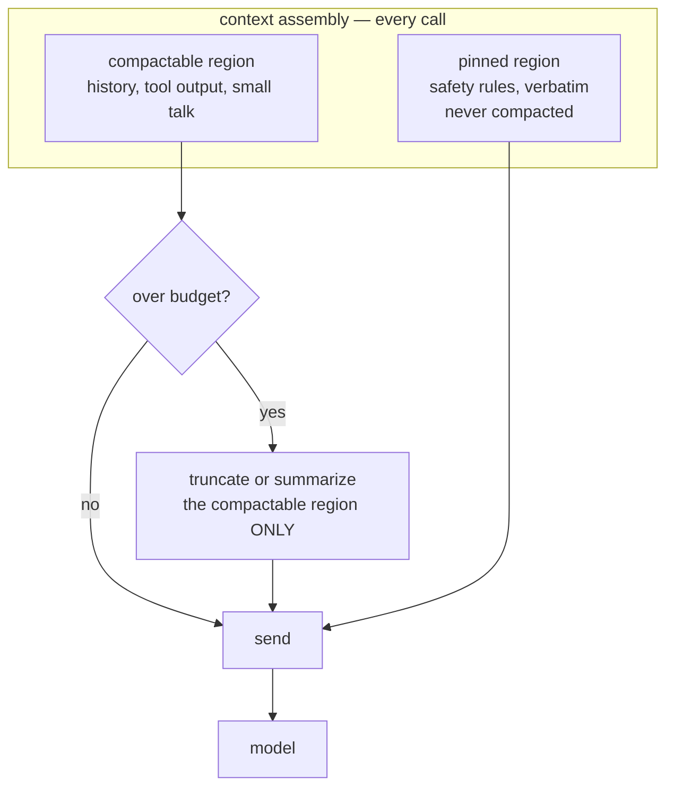

# S03-context-engineering — What survives compaction

**Carried in:** `cafe/evals` — four scenarios, five deterministic checkers, and the naive-versus-governed pair you banked. The allergen checker grades every probe in this session, so "the rule still works" means the same thing here as it did in the golden set.
**Today you ship:** `cafe/context.py` — four compaction policies and the measurement that tells them apart.
**What this teaches:** context assembly as a policy you own — a budget versus a hard window, what compaction rewrites, why a pinned rule keeps governing while a summarized or truncated one quietly stops, and what the pin costs on every request.
**Time:** 20–40 min active reading, 30–60 min notebook work, 5–10 min self-check.
These are planning estimates, not measured learner timings. **Prerequisites:** S01 (the loop), S02 (the golden set and its checkers).
**Hands-on:** [`toy.py`](toy.py) — runs against **your** model.
**Video:** [Gemini Notebook overview](video.mp4) — generated with Google Gemini Notebook (formerly NotebookLM); recorded against an earlier cut of this path, so it still uses the previous toy domain. Preview or review, never a substitute for the notebook.

---

## The hook

The shift runs long. A regular orders, asks about the patio, asks the price of
three things, then says *"By the way, I'm allergic to egg, can I have the
cheese omelette?"* Your conversation outgrew the budget two turns ago, so your compaction
policy did its job: the transcript still reads perfectly, and every turn is
answered.

The allergen rule you wrote into the system prompt is gone. Nothing announced it,
nothing errored, and the reply is as confident as ever. Yesterday's checker — the
one you just learned to trust — catches it, and that is the only reason you know.

## The promise

By the end of this session you will be able to state, with a number behind it,
which compaction policies keep the allergen rule governing behaviour across a
boundary and which bury it — and you will have watched the rule vanish from the
assembled context deterministically, before you ever trust a model to notice.

---

## The theory in depth

### A budget you set, a window you cannot cross

Two numbers, and they are different kinds of number.

- `BUDGET_DEFAULT` is what the harness *aims* to stay under. It is yours.
- `HARD_LIMIT_DEFAULT` is the model's real window. Cross it and the endpoint
  answers a `400`, not a degradation. No policy saves you from that one.

Compaction fires when the history outgrows the budget. It **rewrites the stored
history** — what gets dropped is gone from every later turn, not just from this
request. That is what makes it dangerous: a lossy step at turn five is still
missing at turn twelve, and nothing in the transcript marks the hole.

### Four policies, one question

`cafe/context.py` answers *what survives compaction* four ways:

| policy | keeps | compacts? |
| --- | --- | --- |
| `keep_all` | everything | never — the hard limit becomes the model's problem |
| `truncate` | pinned messages, then as much of the tail as fits | drops the oldest unpinned messages |
| `summarize` | pinned messages, one digest, the last two turns | replaces the compactable region with a summary |
| `pinned` | truncation, but the rule message is marked and untouchable | yes, and the rule outlives every round |

`summarize` is lossy **on purpose**. `summarize_turns` keeps topics and drops
prescriptive prose: "the client asked about the menu" is not a constraint. Real
summarizers lose the same way, which is why survival must be measured rather than
read off the transcript.

### The rule is rent, and the boundary is where it dies

The allergen rule is one short line, and `pinned` pays for it on **every single
call**: a few tokens, forever. That cost is real, and the notebook prints it
(`context.tokens([context.rule_message()])`) so you price the guarantee instead of
pretending it is free.

The interesting question is not "is the text there?" but "does it still govern?"
A rule that survives but sits behind a compaction boundary — the model read it
eleven turns ago — behaves like a rule that is absent. So the measurement replays
one script through each policy, interrupts with the allergen probe every third
turn, and grades each probe with S02's `allergen_safety`. `survival()` splits the
probe rate into **before** and **after** the first compaction boundary. Two rates,
one policy changed, same endpoint, same script, same checker.

### Structural failures are not probabilistic

`keep_all` cannot degrade gracefully — it either fits or it hits the wall. The
guard in `drive` raises `ContextWindowExceeded` *before* the request leaves the
machine when the sent history crosses the hard limit, and the notebook proves it
with `hard_limit=1` so the cell costs nothing. That is the difference between a
policy you own and a `400` you did not plan for: one is a decision, the other is a
surprise.

---

## Build (in the notebook, predict first)

Open [`toy.py`](toy.py)
with your endpoint already exported, as in S02.

1. **Predict the boundary.** One long history goes through all four policies. Write
   down which ones still contain the allergen rule afterwards — and for the ones
   that lose it, say in one sentence what a *transcript reader* would see that a
   *checker* would not.
2. **Run the boundary cell.** It prints a token count and `rule_is_present` per
   policy. Every row still reads like a normal café conversation. Only one still
   governs.
3. **Break it deterministically.** Two assertion cells run first: truncation kills
   the unpinned rule while `pinned` keeps it, and `keep_all` with `hard_limit=1`
   raises `ContextWindowExceeded` with `context_length_exceeded` in the message.
4. **Make the rule survive yourself.** Implement `attempt_keep_rule(history,
   budget)`, returning `(new_history, compacted)`, with the rule text still present
   and the history inside the budget. Do not rewrite the rule into a summary
   sentence — the checker will not count it. The reference (`context.policy_pinned`)
   is behind a switch; flip it after your attempt.
5. **Measure behaviour, not text.** `context.survival_table(client)` replays the
   probe script through all four policies. Read the `before` and `after` rates and
   the boundary turn. The assertion is relative: `pinned` never scores below
   `truncate`, and the spread is printed because a live endpoint is allowed a bad
   day.

---

## Checkpoint — the number you bank

Bank **probe survival after the boundary, per policy** — a pair `(policy, rate)`
for `truncate`, `summarize` and `pinned` across the probes the script produced —
and name the rent you paid for the best of them. The pinned rule rides every
request; say so when you quote the number.

This page will not predict your rates. A live model moves them, and the point is
that the *ordering* survives the movement: if burying the rule ever outscored
pinning it over a real probe count, that would be the finding, not a glitch — and
your job would be to explain what the pin failed to change.

---

## State of the art (as of August 2026)

| Development | Status | Take |
|---|---|---|
| [Anthropic: effective context engineering](https://www.anthropic.com/engineering/effective-context-engineering-for-ai-agents) | **adopt** | Treats the window as a budget to curate, not a bucket to fill, and puts stable instructions where compaction cannot reach them. This is the doctrine behind `pinned`. |
| [Lost in the Middle](https://arxiv.org/abs/2307.03172) | **recognize** | Position in the window changes how reliably a model uses a fact. Your pin is not only a survival trick; where it sits is part of why it works. |
| [Anthropic prompt caching](https://docs.anthropic.com/en/docs/build-with-claude/prompt-caching) | **recognize** | Pinned, stable prefixes are also the cheapest tokens to send. The rent you pay per request can be discounted by infrastructure you do not control yet. |
| [MemGPT](https://arxiv.org/abs/2310.08560) | **recognize** | Treats memory management as a system with paging instead of a string you trim. Worth reading once your policies stop fitting in four functions. |
| [Retrieval-Augmented Generation](https://arxiv.org/abs/2005.11401) | **recognize** | The other answer to a full window: fetch what is relevant instead of deciding what to drop. Same question — who chooses what the model sees — different owner. |

---

## Annotated readings

- **Anthropic: effective context engineering** — extract: the distinction between
  instructions that must stay verbatim and history that may be summarized. Then
  find the sentence that says context is a finite resource and decide whether your
  `summarize` agrees.
- **Lost in the Middle** — extract only the position sensitivity result. It
  explains why a rule can be present and still not govern.
- **`cafe/context.py`, `policy_summarize` and `summarize_turns`** — extract: which
  properties the summary preserves and which it structurally cannot. Those two
  lists are the difference between a digest and a constraint.

---

## Misconceptions and failure modes

- *"The rule is in the system prompt, so it is always in force."* Only until the
  first compaction. Mark it and prove it, or it is a hope.
- *"Summarizing is gentler than truncating."* It is lossier in a place you cannot
  inspect: the summary keeps topics and drops prescriptions. Measure survival, do
  not assume it.
- *"If the reply is good, the rule survived."* One good reply is one sample. The
  probe script exists precisely so a rate replaces an impression.
- *"A bigger window is the fix."* A bigger budget moves the boundary. It does not
  decide what survives it.
- *"Overshooting the budget is the same as overshooting the window."* The budget is
  a soft target you own; the hard limit is a `400`. Do not conflate a policy with a
  protocol error.

---

## Self-check

Why does compaction have to rewrite the stored history instead of just trimming the request?

Because the loop carries the history forward — the messages list is the only state
(S01). Dropping a message from one request means it is absent from the base of
every later request too. There is nothing to trim "just for now".

A policy keeps the rule text but places it behind two summary turns. Does it still govern?

That is the empirical question, and the answer is a rate, not a fact. Presence is
necessary and not sufficient; positioning and recency matter, which is why the
probe rate is split before and after the boundary.

What does pinning actually buy, and what does it cost?

It buys a rule that no compaction round can drop, so behaviour stays stable across
the boundary. It costs a few tokens on every request, forever, and it takes a
channel out of your budget that history can no longer use.

Your pinned rate came out below the buried rate on ten probes. What now?

First check the sample: ten probes is small and the endpoint varies. Then check the
fixture — confirm the rule was actually dropped for the buried arm and that the
probes were graded at the boundary. If both hold, you have found a real result:
report it, do not round it away.

---

## What this unlocks

You now choose what the model *sees*, and you can prove which choice holds. But a
surviving rule is only useful if the reply can be trusted downstream.
**[S04 — Structured generation](../s04-structured-generation/lesson.html)** turns the ticket
into a contract: a schema, a hand-rolled stdlib validator, and a bounded retry loop
— plus the uncomfortable discovery that a schema-valid ticket can still be wrong.
