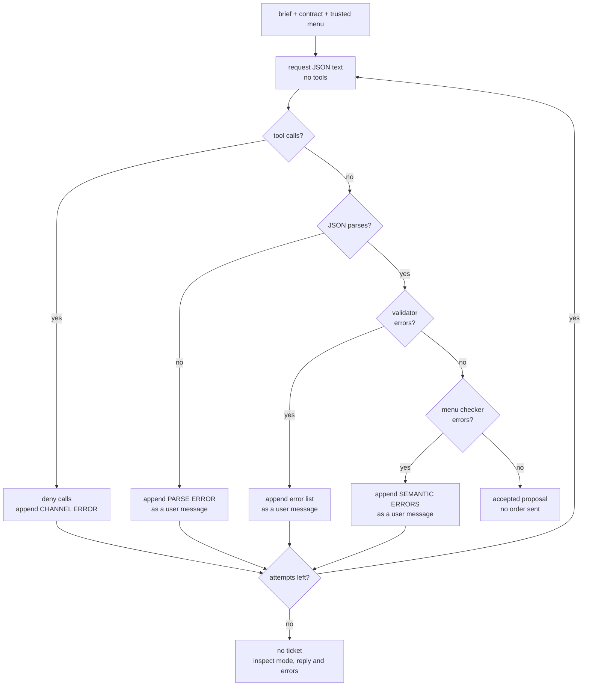

# S04-structured-generation — The ticket contract

**Carried in:** `cafe/context.py` — compaction policies, retained-rule evidence, and measured compliance after the boundary. Now the *reply* must cross a contract boundary too.
**Today you ship:** `cafe/schema.py` — the ticket contract, a hand-rolled stdlib validator, and a bounded validate-and-retry loop.
**What this teaches:** structured generation as a contract with two gates — shape against a schema, meaning against tonight's data — plus error-feedback retries, a cap you choose, and why a valid ticket is not automatically a correct one.
**Time:** 20–40 min active reading, 30–60 min notebook work, 5–10 min self-check.
These are planning estimates, not measured learner timings. **Prerequisites:** S01 (the loop), S02 (the checkers).
**Hands-on:** [`toy.py`](toy.py) — offline by default; `COURSE_MODE=live` uses **your** model.

---

## The hook

A customer orders. The model answers with a friendly paragraph, a fenced code
block, and a price nobody ever quoted. The kitchen's ticket system eats JSON and
nothing else, so none of it reaches the pass.

So you add a schema. The model now returns valid JSON every single time — and one
of those valid tickets asks the kitchen to cook an item it ran out of two hours
ago, at a total that is wrong by eighty cents. The schema did exactly what you
asked. It was not enough.

## The promise

By the end of this session you will have a ticket contract, a validator you wrote
yourself out of stdlib pieces, and a capped retry loop that turns validation errors
into messages the model can act on. You will also be able to explain why *valid is
not correct*, and point at the checker that catches the difference.

---

## The theory in depth

### The contract is a data model, not a prompt style

`TICKET_SCHEMA` describes what the kitchen's system accepts: `table` as an integer,
`items` as a non-empty array drawn from the menu, `total_eur` as a number,
`allergen_checked` as a boolean. The menu itself is the `enum` — enums are policy,
and a schema is the place where policy gets written down where a machine can check
it.

The validator is a **stdlib subset** of JSON Schema: `type`, `required`,
`properties`, `enum`, `items`, `minItems`. That is deliberate. A library is these
same checks with more keywords; writing them once means you know exactly which
promises your contract does and does not make. One detail earns its place
immediately: `bool` is an `int` in Python, so a table number of `True` passes a
naive integer check. The validator excludes it, because `True` is not a table.

### Two gates, not one

The first gate is *shape*: is this the object the contract describes? The second is
*meaning*: does it agree with tonight's menu and prices? `checkers.ticket_matches_menu`
from S02 is the second gate — it catches an 86'd item by name and a total that does
not match the menu sum. A ticket can clear the first gate and fail the second on
every field the schema allowed. This is the session's central fact: **the schema
constrains what you thought to describe; it cannot constrain what you forgot.**

### Read the reply before choosing feedback

Before validation there is parsing. `parse_json` recovers an object from a real
reply: it strips code fences, tries the whole string, then falls back to the first
`{` through the last `}`. Distinct failures reach the retry loop, and they need
different feedback:

- `CHANNEL ERROR` — a tool call arrived even though none were offered. Deny the
  call without executing it, then request JSON text. Empty text in a tool-call
  response is a channel mismatch, not a failed attempt to write JSON.
- `PARSE ERROR` — there was no object to validate. The fix is to ask for the raw
  JSON only, no prose, no fences.
- `VALIDATION ERRORS` — there was an object; the schema rejected it. The fix is the
  error list, verbatim, with paths like `$.items[0]`.
- `SEMANTIC ERRORS` — the object was valid and disagrees with the menu. The fix is
  the menu disagreement, not a schema lecture.

Specific errors are the whole mechanism. A model cannot act on "invalid"; it can act
on "`$.table`: expected integer, got `\"four\"`".

### The loop is capped, and the transcript stays legal

`ask_ticket` gives the model at most three attempts. An uncapped retry loop is a
non-terminating agent holding your budget. Each attempt appends the assistant turn
**verbatim** before the feedback — the S01 invariant, reused. This experiment
supplies trusted menu facts directly and offers **no tools**: ticket generation
must not send an order. Unexpected tool calls receive paired denial results,
never execution. The
returned message list is the receipt: it shows exactly what the model was told
after each failure. `ask_ticket` retains its `(ticket_or_None, messages, attempts)`
interface. `ask_ticket_run` also returns every attempt's `parsed`, `shape_ok`,
`semantic_ok`, the reply, the failed stage and error lists. Meaning is not evaluated when shape fails;
`semantic_ok=None` records that distinction. Final acceptance never erases an
earlier error.

`stop_reason` distinguishes `accepted`, `attempt_cap`, `transport_error` and
`completion_limit`. A failed HTTP request keeps earlier validation outcomes and
stops the batch; it is not another schema failure. A reply marked `length` is
withheld even if its visible text happens to parse. A client timeout does not
prove the server stopped generating: check endpoint readiness before rerunning.
For a slow local reasoning model, set `CAFE_TIMEOUT=180` before starting marimo;
the default remains 120 seconds. A cold model load may need separate warmup.

### Escalation is a decision

Three failures on the same brief do not identify the cause by themselves. Read
the mode, reply channel and exact errors first. An authored offline reply is not
evidence about a model. In live mode, missing facts, a channel mismatch, a
contradictory request, the schema or the model may be responsible. Repeating the
same request without changing any of those is not a diagnosis.

The third brief requests an 86'd item and rules out substitutions. The loop may
end without a ticket: it has no clarification branch. The prompt requests
`allergen_checked=false`, but the schema only checks that it is a boolean. Passing
shape and menu checks does not establish
allergy safety, agreement with the customer's intent or consent to send an order.

---

## Build (in the notebook, predict first)

Open [`toy.py`](toy.py). By default, `get_client(stub_scenario="tickets")` selects
**authored offline fixtures** for the three supplied briefs. These are separate
from the optional lab's recorded cassettes. They demonstrate the gates and repeat
when you rerun the cell; their success rate says nothing about a live model.
With `COURSE_MODE=live` and your endpoint configured in the notebook environment,
the same seam uses your model and ignores the fixture selection. Use live mode
for edited briefs; the offline fixture set covers only the supplied cases.

1. **Predict the validator.** Before running: which of a ticket missing `total_eur`
   with `"table": "four"`, and a correct two-item ticket, does `validate` accept —
   and what exact error does it hand the other one? Then run the cell.
2. **Predict the semantic gap.** A ticket below is *schema-valid*. Write down how
   many semantic violations it should earn and name them. Then implement
   `attempt_semantic`, which must check the shift data rather than the schema. The
   reference is `checkers.ticket_matches_menu` behind a switch.
3. **Predict the retry run.** Offline, classify the supplied first replies before
   running the loop; live, predict from the briefs before seeing the replies.
   Write down parse error, schema invalid, semantically wrong, or accepted, and
   whether retries can help. Run `ask_ticket_run`, then compare the actual reply
   and error at every attempt. Live results may differ from the offline fixtures.
4. **Read the assertions.** They do not claim your model produces valid tickets.
   They claim the machinery: the validator accepts a hand-built reference and
   rejects an off-menu item on the enum; a valid-but-wrong ticket passes the schema
   and fails the semantic checker; and the retry loop keeps the conversation
   protocol-legal across every attempt.

---

## Checkpoint — the number you bank

Compare **first attempts**: how many of the three were schema-valid, and how many
also matched the menu? Separately count final accepted tickets after retries.
Every accepted ticket already passed both gates; comparing only final tickets
hides the errors the loop repaired. A zero first-attempt gap is a valid result.

Bank both numbers with the mode and, for a live run, the model name. An offline
result demonstrates a fixture invariant, not model quality. Keep the distinction
intact: "valid" is a claim about shape, "correct" is a claim about agreement with
tonight's data.

---

## State of the art (as of August 2026)

| Development | Status | Take |
|---|---|---|
| [JSON Schema](https://json-schema.org/) | **already in this path** | The subset in `cafe/schema.py` is this specification minus the parts a café ticket does not need. Read the `enum` and `items` sections and you can reconstruct the validator. |
| [OpenAI structured outputs](https://platform.openai.com/docs/guides/structured-outputs) | **recognize** | Server-side schema enforcement that makes the parse failure mostly disappear. It does not touch the second gate — a conforming object can still name an 86'd item. |
| [Outlines](https://github.com/dottxt-ai/outlines) | **recognize** | Constrained decoding removes the invalid shape before it is generated. Same goal as your retry loop, moved earlier in the pipeline and out of your control. |
| [Guidance](https://github.com/guidance-ai/guidance) | **recognize** | Interleaves generation with program structure so the contract and the output share one grammar. Worth reading as the alternative to validate-and-retry. |
| [Instructor](https://python.useinstructor.com/) | **adopt** | The validate-and-retry loop you just hand-rolled, packaged and maintained. Read its error-feedback behaviour against yours before you decide you need it. |

---

## Annotated readings

- **JSON Schema, `enum` and array keywords only** — extract: how a schema expresses
  policy (the menu) rather than just structure. Then decide what it means that
  tonight's 86 list is data, not an enum.
- **OpenAI structured outputs guide** — extract: what the API guarantees about the
  object's *shape* and what it explicitly does not guarantee about its *content*.
  That sentence is S04's thesis, written by someone else.
- **`cafe/schema.py`, `ask_ticket`** — extract: where the assistant turn is
  appended and why it has to be recorded even when the attempt fails. The receipt
  is only useful if it is complete.

---

## Misconceptions and failure modes

- *"Valid JSON is a correct ticket."* Validity is shape. Correctness is agreement
  with tonight's menu, prices and 86 list. Two gates.
- *"Give the model the errors and it will fix them."* Sometimes. That is why the
  loop is capped, the attempt count is returned, and three identical failures are
  a reason to inspect the receipt, not proof of a particular root cause.
- *"The schema is model-independent."* Any schema that enumerates the menu encodes
  tonight's policy. When the menu changes, the enum changes with it.
- *"Retries are free."* Every live attempt spends time and compute, and may cost
  money. A cap is a budget decision (S11), not a politeness.
- *"Parse errors mean the model is broken."* They mean the reply contained no
  object. Ask for raw JSON and no fences, then look at the receipt before blaming
  the model.

---

## Self-check

Why does the validator reject a boolean for <code>table</code> instead of accepting it as an integer?

Because `bool` subclasses `int` in Python: `isinstance(True, int)` is true, while
`type(True) is int` is false. A table number of `True` is nonsense, and a contract that accepts it is
weaker than it reads. The validator excludes bool explicitly.

A ticket passes the schema but names an 86'd item. Which gate failed, and who catches it?

The second gate, meaning. The schema only knows the enum of menu items; it has no
knowledge of tonight's stock. `checkers.ticket_matches_menu` catches it — the same
kind of deterministic checker you learned to trust in S02.

Why is the retry loop capped at three attempts and not "until it works"?

Because an uncapped retry loop is a non-terminating agent with your budget in its
hand. A cap turns "it never produced a valid ticket on this brief" into a countable
outcome, which is what makes it reportable.

The model fails all three attempts with the same validation error. What does that tell you?

That the feedback did not produce an accepted ticket within the cap. Check whether
the run used authored fixtures or a live model, then inspect the reply channel,
available facts, brief and exact errors. Those failures alone cannot identify which
part is wrong; a fourth identical attempt is not a fix.

---

## What this unlocks

You can now force a shape and tell a valid reply from a correct one. But a
perfectly valid, perfectly correct ticket is still only a proposal — and
`fire_ticket` is irreversible. **[S05 — The consent gate](../s05-consent-gate/lesson.html)**
puts a human confirmation between the two, and asks what your harness does when the
customer says no.
