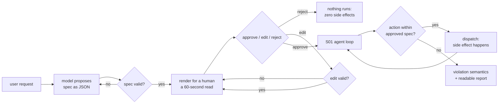

# S05-consent-gate — The gate before the irreversible action

**Carried in:** `cafe/schema.py` — the ticket contract and the validator that decides whether a proposal is even readable. A ticket you can validate is a ticket a human can approve.
**Today you ship:** `cafe/consent.py` — the gate that stands between the model and the one irreversible action in the café.
**What this teaches:** propose → confirm → fire, with approve, edit and reject as first-class outcomes; an enforcement check that runs before dispatch on the harness's own copy of the approved ticket; and the two violation semantics, abort and degrade.
**Time:** 20–40 min active reading, 30–60 min notebook work, 5–10 min self-check.
These are planning estimates, not measured learner timings. **Prerequisites:** S01 (the loop), S04 (the ticket contract).
**Hands-on:** [`toy.py`](toy.py) — offline by default; `COURSE_MODE=live` uses **your** model.

---

## The hook

A customer asks for a latte. The model calls `propose_order`, and then — without
waiting for anyone — it calls `fire_ticket`. A ticket is already in the kitchen
before a human has read a word. The coffee is on the pass; you cannot un-make it.

S01's loop ran whatever the model asked for. It had no concept of *consent*, and no
amount of prompt wording changes that: the model can say anything, so the decision
cannot live in the model's mouth.

## The promise

By the end of this session you will have watched a rejected plan leave the world
untouched, an edited plan change what actually executes, and a drifting model get
stopped *before* dispatch — and you will be able to say which of those three is the
property that matters. (It is the rule they share: the approved ticket is the
only ticket in the building — reject, edit, and drift are its three faces.)

---

## The theory in depth

### The proposal is data, so the check can be mechanical

A prose plan cannot be checked: there is nothing to compare a later request
against. The ticket from S04 is JSON — `{"items": [...], "table": int}` — so every
downstream action can be compared with the approved object field by field.
`enrich_ticket` attaches the data-derived fields the contract requires and never
takes a total from the model or the customer; `validate_ticket` reuses S04's
contract, so a ticket that fails validation **never reaches a human**. A customer
only ever reads a valid order.

### Propose → consent → fire

`consent_gate` renders the ticket, asks the responder for a decision, and loops on
edits. The rendered ticket is short enough to read in seconds — that is a safety
property, not a design preference. The three outcomes are not variations on one
another:

- **approve** returns the approved ticket and the log records it.
- **edit** revalidates the payload and re-presents the amended ticket **in full**.
  An amended plan restarts the flow; no partial state carries over. A customer who
  walks away without answering is a rejection, the safe default.
- **reject** returns `None`. Nothing downstream ever runs.

### Reject means zero side effects, and that is a claim to test

"Nothing happens" is an assertion about the world, so it gets tested instead of
asserted in prose. The notebook's first cell drives a rejection through the gate and
then through `fire_requested`, and checks three things: the approved ticket is
`None`, `state.fired` is empty, and `state.tool_log` is empty. A rejected plan
leaves no ticket, no log entry, no order — by construction, not by good behaviour.

### The gate is the check, not the dialog

`check_fire(requested, approved)` compares one requested ticket against the approved
one, and the request is never the authority — `approved` is. The model can drift, or
a customer can edit the order down to a single `espresso`, and the request that
fires must match what was approved. `fire_requested` is the only caller of
`fire_ticket` that this module allows, and it has two violation semantics:

- **abort** (the default) — return `{"action": "aborted"}` and touch nothing.
- **degrade** — fire **exactly the approved ticket** and log, loudly, what was
  refused.

Note what degrade does *not* do: it never fires the model's request. The approved
ticket is the only ticket in the building.

Approval is not retry safety. Suppose the kitchen accepts the approved ticket,
but its reply is lost. Retrying with a new operation ID can make a second order.
A durable design binds one idempotency key to the exact approved payload,
reuses that key after an uncertain response, rejects a different payload under
the same key, and preserves the operation's outcome. See [Temporal's idempotency
explanation](https://temporal.io/blog/idempotency-and-durable-execution).
[LangGraph interrupts](https://docs.langchain.com/oss/python/langgraph/interrupts)
can re-run a node on resume, so side effects before an interrupt need idempotent
handling. This toy enforces consent in memory; it does not implement durable
execution, crash recovery or an idempotent kitchen service.

### The gate inside the loop

`cafe/consent.py`'s `run_shift` intercepts `propose_order` to collect consent and
stash the approved ticket on the run; a later `fire_ticket` is compared against it
before anything reaches `state.fired`. When the gate refuses, the loop stops with
`stop_reason="consent_violation"` instead of pretending the turn succeeded. The
stop reason set is still the harness's: `answered`, `script_done`, `turn_cap`,
`consent_violation` — every run can say why it ended.

---

## Build (in the notebook, predict first)

Open [`toy.py`](toy.py)
with your endpoint already exported.

1. **Predict the render.** A model proposes `latte + tomato toast` for table
   4; the scripted customer edits it down to a single `espresso` and approves.
   Before running: what does the customer read, and what exactly ends up in the
   approved ticket? Then run the cell and compare the log against your answer.
2. **Write the enforcement point.** Implement `attempt_gate(state, requested,
   approved)`: decide whether the irreversible action runs. On a violation **nothing
   may fire** — no ticket, no tool log. Return a record with at least `fired` and
   `action`. The reference is behind a switch; flip it after your attempt.
3. **Watch the three properties.** `test_s05_reject_leaves_zero_side_effects` checks
   the untouched world. `test_s05_edit_rebinds_what_executes` checks that the model
   asking for the *original* ticket aborts while the *edited* request fires.
   `test_s05_degrade_fires_exactly_the_approved_ticket` checks that degrade fires the
   approved object, never the request.
4. **Run the shift with a scripted model.** A stub script walks propose → fire →
   answer so you can see the whole path with the decisions visible in `gate_log`.
5. **Then your model.** The same run, live. A real endpoint usually does not rush to
   `fire_ticket`, and when it never proposes, the gate has nothing to hold. That is
   not a failure — it is the honest shape of the path. Watch what the model actually
   does and read `stop_reason`, `approved`, `gate_log` and `fires`.

---

## Checkpoint — the number you bank

Try three runs with a rejecting customer. Count **observed rejections that fired
nothing / observed rejections**, and separately count runs that never reached a
customer rejection. An empty `gate_log` is unexercised, not a successful rejection;
0 observed rejections supplies no evidence for this checkpoint.

Bank the counts with the client mode and model name. Use the scripted rejection
control to inspect the invariant even when the model never proposes. A live run
only tests the path it actually took; the separate drift assertion covers a model
asking to fire something nobody approved.

---

## State of the art (source review: 20 September 2026)

| Development | Status | Take |
|---|---|---|
| [Temporal: idempotency and durable execution](https://temporal.io/blog/idempotency-and-durable-execution) | **recognize** | A stable operation key prevents duplicate effects only when the receiving system enforces it. This toy does not implement that service. |
| [OpenAI Agents SDK](https://openai.github.io/openai-agents-python/) | **recognize** | Owns the loop and offers tool-level approval flows, so a human can interrupt before a sensitive call. The same design question: who holds the approved object. |
| [Anthropic tool use](https://docs.anthropic.com/en/docs/build-with-claude/tool-use) | **recognize** | A tool call is a request, not an execution. Every consent design starts from that fact, which S01 established the hard way. |
| [OWASP Top 10 for LLM Applications](https://owasp.org/www-project-top-10-for-large-language-model-applications/) | **recognize** | Names excessive agency as a risk class and treats human approval as the control. Read it as a checklist for what your gate does not yet cover. |
| [Model Context Protocol](https://modelcontextprotocol.io/) | **recognize** | Standardises tool discovery and deliberately leaves approval to the host. The gate you wrote is that host's job. |
| [LangGraph interrupts](https://docs.langchain.com/oss/python/langgraph/interrupts) | **recognize** | Resume may re-run a node. Review side effects around the interrupt; a pause alone does not make retries safe. |

---

## Annotated readings

- **OWASP Top 10 for LLM Applications, excessive agency** — extract: the listed
  mitigations and mark which ones this session implements and which ones it hands
  to S06.
- **OpenAI Agents SDK, human approval for tools** — extract: what the SDK pauses,
  what it preserves across the pause, and how it decides which tools are sensitive.
  Compare it with your single `IRREVERSIBLE_ACTION` name.
- **`cafe/consent.py`, `check_fire` and `fire_requested`** — read them in that order.
  The comparison is small on purpose; the point is *where* it runs, not how clever
  it is.

---

## Misconceptions and failure modes

- *"The prompt can ask the model to confirm before firing."* Asking is not
  enforcing. The model can say anything; the gate is a check on the harness's own
  copy of the approved ticket.
- *"Reject just means the model stops."* Reject returns `None` and nothing
  downstream runs. It is a state, not a message.
- *"Degrade is a softer abort."* Degrade fires exactly the approved ticket. It is
  the product decision to serve what the human agreed to while logging the refusal
  — never to serve the model's request.
- *"An edit only updates the fields that changed."* An edit re-renders the whole
  ticket and restarts the flow. Partial state is how a customer approves one thing
  and gets another.
- *"The model proposed it, so it is obviously what the customer wants."* The
  proposal is unvalidated until the gate validates it, and unauthorised until a
  human approves it. Both checks run before dispatch.

---

## Self-check

Why must <code>fire_requested</code> compare against the approved ticket rather than the model's request?

Because the request is the thing under suspicion. The approved object is the only
record of what a human agreed to; if the model drifts, or a customer edits the
order down, the request will disagree with it. The check exists to catch exactly
that disagreement before dispatch.

What exactly does "reject leaves zero side effects" mean, and how is it tested?

No fired ticket and no tool-log entry, plus an approved ticket of `None`. The cell
drives a rejection through the gate and the enforcement point and asserts all
three. It is a claim about the world, so it is tested, not described.

Under <code>degrade</code>, which ticket reaches the kitchen when the model asks for something else?

The approved ticket, always. Degrade fires the approved object and records the
clauses it refused. Firing the model's request — even partially — would make the
gate decorative.

A live run never calls <code>fire_ticket</code>. Did the gate fail?

No. The gate only acts on what it is given. A model that answers in prose instead
of firing leaves the gate with nothing to hold, which is the honest shape of the
path. Read `stop_reason` and `gate_log` before calling it a success or a failure.

---

## What this unlocks

You can now hold an irreversible action behind a check that runs before dispatch.
But the gate only sees what it is *given*: an untrusted message still flows straight
into the model. **[S06 — Layered detection](../s06-layered-detection/lesson.html)** puts an
ordered pipeline in front of the model — a deterministic keyword floor before any
model call, an allergen classifier, and a scope governor — with a real allergen as
the stake.
