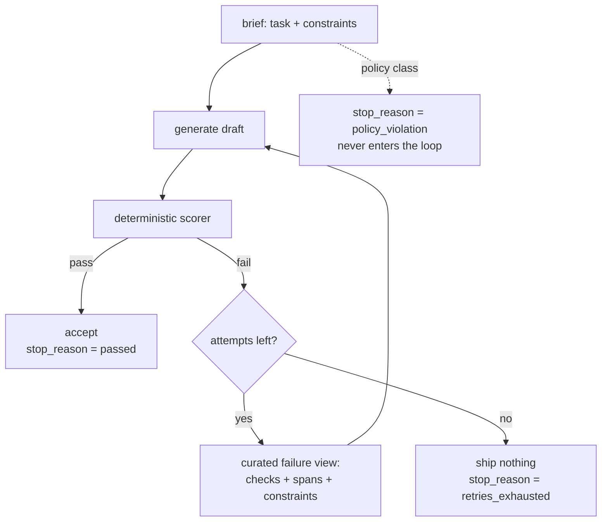

# S07-repair-loop — A bounded re-ask with real feedback

**Carried in:** `cafe/detect.py` from S06 — you can now spot an unsafe, off-menu or out-of-scope
ticket before it reaches the pass.
**Today you ship:** `cafe/repair.py` — bounded regeneration when the model gets the ticket wrong.
**What this teaches:** why a same-context retry is a resample and not a repair, why the failure view
is an interface you design, why the cap is what turns a contradiction into an honest stop, and why
every run must end on a named `stop_reason`.
**Time:** 20–40 min active reading, 30–60 min notebook work, 5–10 min self-check.
These are planning estimates, not measured learner timings. **Prerequisites:** S01 (the loop),
S02 (deterministic checks and the fixture invariant), S06 (the detection layers you now feed).
**Hands-on:** [`toy.py`](toy.py) — runs against **your** model.

---

## The hook

S06 taught you to *reject* a bad ticket. So your shift now refuses a lot and serves nothing.
Detection without repair is just a more articulate failure.

The obvious fix is "ask again". That is where people quietly ship an infinite loop, or a loop that
keeps retrying a request no draft can ever satisfy — and it looks like work being done.

## The promise

By the end of this session your agent re-asks with a **curated view of what failed**, stops at a cap
you chose, and never ends in a state you cannot name. You will watch a scripted generator burn all
three attempts on a spec it cannot satisfy, and end honestly with no ticket.

---

## The theory in depth

### A retry is not a resample

The tempting implementation is `for attempt in range(3): draft = generate(prompt)` — same context,
fresh sample. If each draft passes independently with probability *p*, *n* attempts pass with
probability 1 − (1 − *p*)ⁿ, which is a lottery ticket, not a repair:

| per-draft pass rate *p* | naive attempts | pass within cap |
|---|---|---|
| 0.50 | 3 | 0.875 |
| 0.25 | 3 | 0.578 |
| 0.05 | 3 | 0.143 |
| 0.05 | 10 | 0.401 |

Three problems. Independence is false — failures correlate, because a prompt that confused the model
once usually confuses it the same way twice — so real gains sit below the table. For rare, systematic
defects the lottery is a bad deal at any cap. And the measured result: asking a model to "check your
answer" with no external signal makes reasoning output *worse*, not better (Huang et al., ICLR 2024,
[arXiv:2310.01798](https://arxiv.org/abs/2310.01798)). Correction works when the feedback adds
information the first attempt lacked — which is why `retry_messages` appends a failure view instead
of re-sending the brief.

### The failure view is an interface, so design it

If the retry is worth exactly the new information it carries, the failure view *is* the repair loop.
The SWE-agent work made the general version of this point: feedback design — concise, localized,
actionable — moved outcomes more than swapping the model ([arXiv:2405.15793](https://arxiv.org/abs/2405.15793), §2).
Your scorer's failures become prompt content, so they follow the same rules:

- **Name the check that failed.** One line per failure, not the whole rubric.
- **Quote the offending span.** `'latte' contains milk` beats "allergen problem".
- **State the constraint as a fix target.** What a correct draft would say, not just the crime.
- **Change-nothing-else framing.** Without it, the model fixes the named defect and introduces a
  fresh one elsewhere. `failure_view` opens with exactly that.

What stays out: the full rubric, the run's history, and any prose about how disappointed the harness
is. The failure view is a diff request, not a performance review.

### What the retry is allowed to see

One real design decision, and the course makes you record it. `retry_messages(brief, failures,
attempt, mode)` implements two modes and refuses anything else:

| mode | the retry sees | risk |
|---|---|---|
| `naive` | the identical brief again | resampling: burns attempts on the same mistake |
| `curated` | the brief plus the failure view, failed drafts dropped | the failed draft is no longer a starting point for edits |

`curated` is the default the loop calls. Dropping the failed drafts matters for a specific reason:
text in context is salient, and a model imitates what it can see, so a visible rejected draft tends
to return with the named detail fixed and the original defect intact. Anything that requires changing
what was *asked* is not a repair — it is a new request, and it goes through the front door.

### The cap is the epistemics

`repair_ticket` loops `for number in range(1, cap + 1)` with `CAP_DEFAULT = 3`: generate, score with
`score_ticket` (S04's ticket contract, S06's menu data for allergens and sold-out items), and stop on
the first clean draft. Because failures correlate, the marginal attempt collapses fast: if attempt 2
fails the *same* check as attempt 1, attempt 4 will not save you — it will bill you. Firing the cap
is not a quality compromise, it is the mechanism that converts "unfixable within budget" into an
inspectable outcome, with the attempt log kept as the diagnosis.

### Nothing ends ambiguously, and nothing ships on a lie

Every run returns a `stop_reason` from `STOP_REASONS = {passed, retries_exhausted,
policy_violation}`, and **a ticket exists if and only if the reason is `passed`** — `repair_ticket`
returns `ticket: None` in the other two cases. Downstream code keys on the reason, so a missing one
is a lie about what happened.

Some defects never enter the loop at all. `_request_is_policy_blocked` stops two classes before the
first generation: an injection pattern in the brief itself, and a spec where every requested item
contains the declared allergen. Both are defects in the *request*, and regeneration cannot fix a bad
request — it would only grow the approved scope to make a check pass.

---

## Build (in the notebook, predict first)

Open [`toy.py`](toy.py). Same endpoint
configuration as S06 (`CAFE_BASE_URL`, `CAFE_API_KEY`, `CAFE_MODEL`, then `cafe.doctor`).

1. **The contradiction, scripted.** The first run uses `make_scripted_generator` — no model — whose
   three candidates all fail the ticket contract (each is missing `total_eur` and
   `allergen_checked`). Before running, predict the `stop_reason`, how many attempts appear in the
   log, and whether a ticket survives.
2. **Every run ends with a name.** A test cell asserts the reason is in `STOP_REASONS`, that
   `ticket is None` exactly when the reason is not `passed`, and that the attempt count never
   exceeds `CAP_DEFAULT`. Read those three assertions before you read the implementation.
3. **Your turn — the failure view.** Write `attempt_failure_view(failures, attempt)`: one short,
   specific line per failure. The compare cell checks that every failure is named. The reference is
   behind a reveal switch — flip it *after* you attempt.
4. **Against your model.** `make_model_generator(client)` turns your endpoint into the generator and
   `repair_ticket` runs the real loop. Predict whether your model fails the contract on attempt 1 and
   recovers on attempt 2, or exhausts the cap entirely.
5. **The distribution.** The checkpoint cell runs three specs and bins the results.

---

## Checkpoint — the number you bank

Run the repair over three specs and record the **attempts-to-pass distribution**: how many passed on
attempt 1, on 2, on 3, and how many exhausted. Write it down with the model name. It is also a budget
signal — if most runs need three attempts, you are buying every order three times, and S11 will make
you confront that.

---

## State of the art (as of August 2026)

| Development | Status | Take |
|---|---|---|
| [Anthropic, Building effective agents](https://www.anthropic.com/engineering/building-effective-agents) | **already in this path** | This session is the evaluator-optimizer workflow with a deterministic scorer. Remember the two fit criteria: clear eval criteria, and evidence that refinement helps. |
| [SWE-agent: Agent-Computer Interfaces](https://arxiv.org/abs/2405.15793) | **already in this path** | Feedback design beat model swaps. The failure view is the highest-leverage surface in the loop because it is an interface. |
| [Huang et al., LLMs Cannot Self-Correct Reasoning Yet](https://arxiv.org/abs/2310.01798) | **already in this path** | The evidence under "a retry is not a resample". Self-critique with no external signal degrades output; correction needs new information. |
| [Self-Refine](https://arxiv.org/abs/2303.17651) and [Reflexion](https://arxiv.org/abs/2303.11366) | **recognize** | The self-generated-feedback ancestors. They work when the critique adds signal and inherit the model's blind spots when it does not. |
| [CRITIC: tool-interactive critiquing](https://arxiv.org/abs/2305.11738) | **recognize** | Critique grounded in external tool output — the conceptual bridge to your scorer, which is that anchor in miniature. |
| [Guardrails AI validators](https://github.com/guardrails-ai/guardrails) | **adopt** | On-fail reask with a bounded number of re-asks is this loop, off the shelf. Read its failure reports before chaining validators; reask costs multiply. |
| [Instructor](https://github.com/567-labs/instructor) | **adopt** | The productized version of "validate the output, return specific errors, retry with them attached" for structured extraction. |
| [OpenAI function-calling guide](https://developers.openai.com/api/docs/guides/function-calling) | **adopt** | Strict schemas make format defects unrepresentable instead of repairable. S04's point restated as triage: construction beats repair. |
| ["Reflect on your answer and try again" prompt-only retries](https://arxiv.org/abs/2310.01798) | **ignore** | Intrinsic self-correction with zero new signal, measured to degrade. The failure view exists precisely because this does not work. |

---

## Annotated readings

- **Yang et al., [SWE-agent](https://arxiv.org/abs/2405.15793), §2.** Extract: the interface design
  principles — feedback concise, localized, lint-like — and the headline that interface design moved
  outcomes more than model choice. Your failure view is an interface for one user: the generator.
- **Huang et al., [LLMs Cannot Self-Correct Reasoning Yet](https://arxiv.org/abs/2310.01798).**
  Extract: without external feedback self-correction degrades accuracy, and earlier gains came from
  oracle labels — information smuggled in. This is the paper that tells you what a retry is worth.
- **Anthropic, [Building effective agents](https://www.anthropic.com/engineering/building-effective-agents).**
  Extract: the evaluator-optimizer section and its two fit criteria. Note what they do *not*
  recommend: looping without a measurable criterion.
- **Shinn et al., [Reflexion](https://arxiv.org/abs/2303.11366).** Extract: what gets stored between
  attempts — distilled lessons, not full failed trajectories. That is the curated-context decision,
  made for you by someone else's measurements.
- **Guardrails AI, [validators](https://github.com/guardrails-ai/guardrails).** Extract: what a reask
  actually sends — the validator's message, re-prompted — and how the re-ask count interacts with
  chained validators. The productized version of your toy, costs included.

---

## Misconceptions and failure modes

- *"Retry is repair."* Same-context retry is a lottery ticket with a correlation discount, and
  self-critique with no external signal is measured to make things worse. A retry is worth exactly
  the new information it carries.
- *"Paste the whole rubric into the feedback."* Feedback is prompt content. Name the failed checks,
  quote the spans, state the constraints — a wall of rubric text buries the one actionable line.
- *"Keep the failed drafts visible for transparency."* Visible failures anchor; the model imitates
  what it can see. Curate the retry context, and record that you chose to.
- *"If it keeps failing, raise the cap."* Attempt 2 failing the same check as attempt 1 means the
  defect is systematic, not unlucky. The cap firing *is* the diagnosis.
- *"Everything is retryable."* Policy violations are defects in the request, not the draft.
  Regeneration must never grow the approved scope to make a check pass.
- *"The run ended, so something shipped."* A ticket exists if and only if the reason is `passed`.
  Anything else and `ticket` is `None` — by construction, not by convention.

---

## Self-check

Why is a same-context retry resampling rather than repair?

Because the model faces the identical distribution: the retry carries no new information, so success
is a lottery under an independence assumption that correlated failures violate. Worse, intrinsic
self-critique with no external signal measurably degrades output. That is why `retry_messages` appends
a failure view instead of re-sending the brief.

What goes into a curated failure view, and what stays out?

In: one line per failed check, the offending span quoted, the constraint stated as a fix target, and
the change-nothing-else framing `failure_view` opens with. Out: the full rubric, the run history, and
the failed drafts themselves. Feedback is prompt content — an interface you design.

Why must every run end with a stop_reason from a closed set?

Because downstream code keys on the reason, and the ticket biconditional depends on it: `passed`
means the draft survived the scorer, `retries_exhausted` means the defect class is unfixable within
budget and routes to error analysis (S10), `policy_violation` means the request was the defect. An
ambiguous ending lets a failing run read as a success.

Which failures never enter the repair loop, and why?

An injection in the brief, and a spec where every requested item contains the declared allergen —
`_request_is_policy_blocked` returns `policy_violation` before the first generation. The defect is in
the request, not the draft, so regenerating is incoherent; and a loop that could rewrite the request
to satisfy a check is the bug the consent gate (S05) exists to stop.

---

## What this unlocks

Your agent can now recover from its own contract failures, and it can tell you how many attempts that
cost. What it cannot do is tell you *what happened*: the attempt log lives and dies inside one run.
**[S08 — Observability & replay](../s08-observability-replay/lesson.html)** gives the shift a memory — spans, a
JSONL record of your own live session, and a replay you can prove is content-identical.
