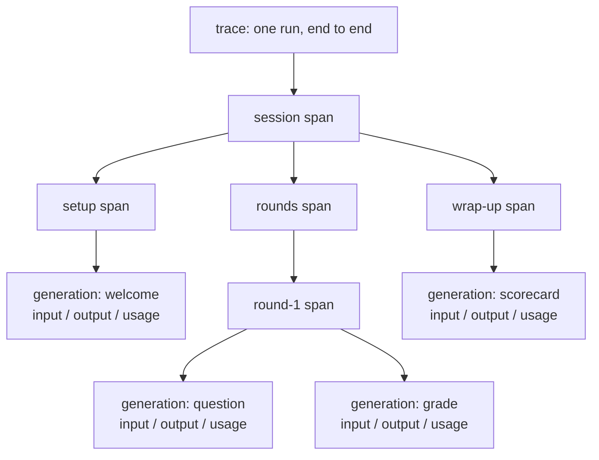
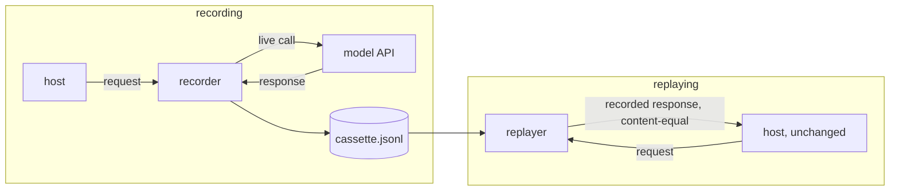

# S08-observability-replay — A shift with a memory

**Carried in:** `cafe/repair.py` from S07 — the bounded re-ask, the last piece of the harness that
only ever existed inside one terminal run.
**Today you ship:** `cafe/trace.py` — spans, a JSONL record of a real shift, and a replay that is
content-identical to the run that produced it.
**What this teaches:** how a trace tree differs from a transcript, why a recording is a contract with
two separate invariants, why export failure is a boundary decision rather than a crash, and how to
hunt the nondeterminism a replay exposes by injecting the clock and the RNG.
**Time:** 20–40 min active reading, 30–60 min notebook work, 5–10 min self-check.
These are planning estimates, not measured learner timings. **Prerequisites:** S01 (the loop and its
`stop_reason`), S07 (the runs you now record).
**Hands-on:** [`toy.py`](toy.py) — runs against **your** model.

---

## The hook

A customer calls back. *"You charged me twice yesterday."* You open a terminal and scroll: the shift
printed a perfectly nice transcript, and it is gone. You cannot show what the model actually saw, you
cannot re-run the shift, and you cannot prove which turn produced the second ticket. The debrief
becomes your memory against theirs, and memory loses.

## The promise

By the end of this session you will have recorded **your own live shift** to a JSONL trace, replayed
it with **zero model calls**, and printed a transcript that is content-identical to the live run.
Then you will do the part that separates a recording from a replay: prove determinism by injecting
the two things that quietly break it — the wall clock and the RNG.

---

## The theory in depth

### A transcript is a printout; a trace is a structure

`run_shift` returns a run record: the message list, the consent decisions, the stop reason, the counters. That
tells you *what* the conversation said, not *where the time and tokens went*. `Tracer` builds a tree
instead. Each span carries a name, a kind, attributes, children, a start time and a rounded duration.
A **generation** is a span that also carries a model call:

This session's shift is that shape with café names: `record_shift` opens one `shift` span and wraps
the client in `TracingClient`, which opens one generation per `chat` call. Into that generation go a
deep copy of the input messages (the loop keeps mutating the list after the call, so the copy is not
a nicety), the output content, the names of any tool calls, and the `usage` block the endpoint
returned. `usage_of` then sums tokens and durations over the generations — which is how "which turn
burned the tokens?" becomes arithmetic instead of an argument. `NullTracer` answers the same
interface while doing nothing, so instrumentation never costs you an `if tracer:` branch.

### A recording is a contract, not a printout

`RecordingClient` wraps any client and appends one JSONL line per call — `{"request": ...,
"response": ...}`, in order. It never constructs a client of its own; it takes whatever
`get_client()` returned. `ReplayClient` serves those responses back and refuses to guess:

Both recording and replay use S05's protected executor. The synthetic customer explicitly
approves the first valid proposal; an exhausted decision queue rejects. Each replay needs
a fresh responder with the same decisions. Tracing never substitutes for consent.

Two invariants, and they catch two different regressions. **Matching** polices the calls that
*arrive*: the next recorded request must equal the incoming one exactly, otherwise `ReplayMismatch`
raises instead of serving a response recorded for something else. **Exhaustion** polices the calls
that *should have arrived*: a regression that deletes the last model call sends nothing bad to match,
so only `assert_exhausted()` — "every recorded call was consumed" — sees it. One client, two ways to
be wrong.

### Telemetry degrades; the shift does not

`Tracer.export()` propagates whatever the exporter raises. That is deliberate: nobody should be able
to pretend a dead backend was fine. `export_fail_soft` is the boundary where you decide what the
failure costs — the traces, or the shift. It returns the error text when the exporter raised and
`None` when the trace shipped. A tracing backend is a network call you do not own; it fails on a
schedule you do not choose.

### Determinism is wired in, not hoped for

Here is the hunt the notebook stages. A teammate ships a "harmless" PR: a timestamped header and a
livelier closing line for the end-of-shift note. Now two replays of the *same recording* disagree.
That is impossible for the model — the recorded responses are frozen JSON on disk, so replay cannot
add variance. The nondeterminism is in the host, and the diff names two suspects: a wall clock read
and an unseeded RNG draw.

The fix is not to delete the timestamp and the flourish; it is to make them *inputs*. Pass a clock
and an RNG into the note builder, and create a **fresh seeded instance per run**. `TickClock` is the
same idea for the tracer itself: a deterministic stand-in for `time.monotonic`, which is what makes
two rendered trees comparable at all. One shared `Random(7)` reproduces across processes but drifts
between two runs inside one process — the trap is subtler than it looks.

Nothing in the notebook writes anywhere it was not handed: every path lives inside a
`tempfile.TemporaryDirectory()`, and a test cell walks the repo root before and after to prove that
not one `.jsonl` landed in it.

---

## Build (in the notebook, predict first)

Open [`toy.py`](toy.py).
Same endpoint configuration as S06, plus the `SCRIPT` of two customer lines the notebook replays.

1. **Record your own shift.** `record_shift(client, SCRIPT, path, responder=make_responder([("approve", None)]), tracer=Tracer(clock=TickClock()))`
   runs the real loop through a recording client and prints the rendered tree, the tools that ran and
   the usage totals.
2. **Predict the replay.** Before running it: how many times will your live model fire during a
   replay? Can the replayed transcript differ from the recorded one, given the responses are frozen
   on disk? Write both answers down.
3. **Replay twice.** Two replays of one recording, compared with `transcript()` — a canonical
   rendering that contains nothing but the conversation, so a difference would be a real divergence
   and not a formatting artefact. A second test cell replays a *stale* script and expects
   `ReplayMismatch`.
4. **Kill the exporter.** `Tracer(exporter=dead_exporter)` raises on export; `export_fail_soft`
   returns the error and the shift still reports its stop reason. Read that boundary before you
   trust it.
5. **The hunt.** Compare the teammate's note across two replays, then write
   `attempt_handover_note(run, *, clock, rng)` yourself, where every changing value must come from
   `clock` or `rng`. The reference is behind a reveal switch — flip it *after* you attempt.

---

## Checkpoint — the number you bank

Two numbers, and both are exact rather than statistical:

- **model calls during replay: 0.** The replay is offline by construction — the notebook counts your
  live client's calls before and after and expects the same total.
- **live transcript == replay transcript.** Content-identical, turn for turn, because the responses
  are frozen on disk and everything else — clock, RNG, system prompt, tool schemas — is now an input.

Write both down with the model name. They are the S08 contract, and S09 spends it: a debrief that
cites turns of a trace you can hand to someone else, who can replay it.

---

## State of the art (as of August 2026)

| Development | Status | Take |
|---|---|---|
| [OpenTelemetry traces](https://opentelemetry.io/docs/concepts/signals/traces/) | **already in this path** | The span tree is this idea, smaller. Spans, parents, attributes and durations are the same vocabulary your `Tracer` speaks. |
| [OpenTelemetry GenAI semantic conventions](https://opentelemetry.io/docs/specs/semconv/gen-ai/) | **adopt** | The agreed attribute names for model calls — model, token usage, prompts. Adopt the names before you ship a trace format nobody else can read. |
| [OpenTelemetry GenAI spans](https://opentelemetry.io/docs/specs/semconv/gen-ai/gen-ai-spans/) | **recognize** | The concrete span shape for a generation. Compare it with `Tracer.generation`; the fields you kept are the ones you can defend. |
| [OpenTelemetry Collector](https://opentelemetry.io/docs/collector/) | **recognize** | Where fail-soft belongs at scale: buffering, retry and backpressure live in the pipeline, not in your request path. |
| [OpenLLMetry](https://github.com/traceloop/openllmetry) | **adopt** | Open-source instrumentation that emits OTel-compatible GenAI spans, if you would rather not maintain a tracer. |
| [Langfuse](https://langfuse.com/docs) | **recognize** | A hosted trace UI and store. Useful the day a human has to read traces; a dependency the day it is down, so keep the JSONL. |
| [VCR.py](https://github.com/kevin1024/vcrpy) | **adopt** | Cassette record/replay for HTTP, in the same spirit as `RecordingClient`/`ReplayClient`. Note its strict-match mode, which is the invariant that matters. |
| [`responses` HTTP mocking](https://github.com/getsentry/responses) | **recognize** | A library-level way to freeze HTTP responses in tests — cheaper than a cassette when the wiring, not the model, is under test. |
| [OpenAI latency optimization guide](https://platform.openai.com/docs/guides/latency-optimization) | **ignore** | For this session. It is about making calls faster; you first need to be able to say which call was slow. |

---

## Annotated readings

- **OpenTelemetry, [traces](https://opentelemetry.io/docs/concepts/signals/traces/).** Extract: span,
  parent, attribute, and the difference between a trace and a log line. Then map those onto
  `Tracer.nodes()` and `Tracer.render()`.
- **OpenTelemetry, [GenAI semantic conventions](https://opentelemetry.io/docs/specs/semconv/gen-ai/).**
  Extract: the attribute names for a model call, and where usage lands. Rename your generation
  attributes to match and your trace becomes readable by tools you did not write.
- **VCR.py [README](https://github.com/kevin1024/vcrpy).** Extract: what a cassette stores, and its
  match-on-request behaviour — the same "matching polices the calls that arrive" invariant, with the
  same blind spot that only an exhaustion check closes.
- **OpenLLMetry [repository](https://github.com/traceloop/openllmetry).** Extract: which attributes it
  emits per call. It is a free answer key for the field list you are about to invent.
- **Your own JSONL file.** Extract: the request at line 1 and the response at line 1. Everything the
  replay guarantees rests on those two objects being complete.

---

## Misconceptions and failure modes

- *"The transcript is the trace."* A transcript is a rendering of one artefact. A trace says which
  phase called what, for how long, with which tokens — which is the question you actually have.
- *"Replay means calling the model again with the same prompt."* That is a re-run, and it measures
  variance. Replay serves recorded responses and makes zero calls; that is why it can be compared at
  all.
- *"A recording that matches is a replay that is correct."* Matching only polices the calls that
  arrived. Deleting the last call passes every match; only `assert_exhausted()` catches it.
- *"Telemetry should never break the shift, so swallow export errors everywhere."* Swallow at the
  boundary you chose, and return the error so somebody can see it. Errors hidden inside a tracer are
  worse than no tracer.
- *"The model injected the nondeterminism."* Frozen responses cannot vary. Look for wall clocks,
  process-wide RNG, unordered iteration and cached state — the host is the usual suspect.
- *"Just delete the timestamp."* Then you lose the information. Make it an input and the same line
  becomes reproducible *and* present.

---

## Self-check

Why does the replay make zero model calls, and why does that matter?

`ReplayClient` serves responses recorded earlier and compares each incoming request against the next
recorded one, raising `ReplayMismatch` rather than calling anything. That is what makes the replay
comparable: any difference between the live transcript and the replay is a harness change, not model
variance — and it costs nothing to run in CI.

The shift makes one fewer model call than the recording. Which invariant catches it, and why not the other?

`assert_exhausted()` — one recorded entry is left unconsumed. Matching cannot catch it, because a
missing final call never sends a mismatched request; there is simply nothing to compare. Two
invariants exist because they catch two different regressions.

Two replays of one recording produce different handover notes. Where is the nondeterminism?

In the host. The responses are frozen JSON, so replay adds no variance. The likely causes are a wall
clock read and an unseeded process-wide RNG draw. Pass a clock and a fresh seeded `Random` into the
note builder and the output becomes reproducible without deleting the timestamp or the flourish.

Why does `Tracer.export()` raise instead of swallowing a failing exporter?

So the failure cannot be mistaken for success. The decision about what telemetry failure costs belongs
at one explicit boundary — `export_fail_soft` — which returns the error text and lets the shift finish.
Errors hidden inside the tracer are worse than no tracer.

---

## What this unlocks

You have a trace and a replay. What you do not have is anything a busy owner would read. **[S09 —
Evidence reports](../s09-evidence-reports/lesson.html)** turns this JSONL into a shift debrief with turn
citations, and builds the two validators that catch the two ways a report lies: the tidy paraphrase
presented as a quote, and the omission that leaves no false sentence behind.
