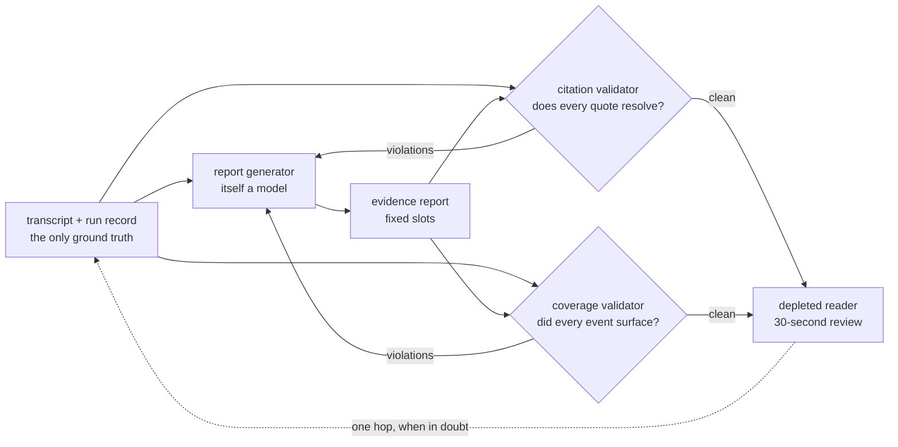

# S09-evidence-reports — The thirty-second debrief

**Carried in:** `cafe/trace.py` from S08 — you can record a real shift and replay it exactly.
**Today you ship:** `cafe/report.py` — a debrief a tired reader can trust, with the validators that
keep it honest.
**What this teaches:** how to write for a depleted reader, why a claim without a verbatim citation is
a rumour, why the two ways a report lies need two complementary validators, and why a failed run still
gets an honest report.
**Time:** 20–40 min active reading, 30–60 min notebook work, 5–10 min self-check.
These are planning estimates, not measured learner timings. **Prerequisites:** S02 (golden sets and
deterministic checks), S08 (the trace and replay this session reads).
**Hands-on:** [`toy.py`](toy.py) — runs against **your** model.

---

## The hook

It is 23:40. Someone has to read what happened on this shift and decide whether to change anything
tomorrow. They will give your report **thirty seconds**.

A chronological transcript fails that test. So does a cheerful summary — and the cheerful one fails
worse, because every sentence in it can be *true* while the report as a whole lies by omission.

## The promise

By the end of this session you can generate a debrief whose every claim resolves to a real turn, and
you will have built the two validators that catch the two different ways a report lies: the quote
that was never said, and the safety event that quietly never happened.

---

## The theory in depth

### Write for the depleted reader

The reader is tired and accountable. They need six things, fast:

| slot | what it answers | where it comes from |
|---|---|---|
| `goal` | what the customer wanted | the first user turn, quoted |
| `outcome` | how the shift ended | the run record's `stop_reason` |
| `moments` | what happened | events read off the conversation |
| `safety` | anything safety-relevant | the safety subset of the same events |
| `next_step` | what to do next | the last thing said to the customer, quoted |
| `cost` | what it cost | model calls, turns, tokens, model latency |

`write_report` produces exactly those slots — not a narrative. It is a deterministic stand-in for the
LLM writer you would ship; two rules make it honest by construction: **quotes are copied from the
conversation**, and **the outcome is read from the run record**, never inferred from how the last
message felt.

### A claim carries a turn and a verbatim quote

`log_events` reads events off the trace rather than off a vibe: an allergen check that reported
`contains: true` is a `safety` event, a check that cleared an item is an `observation`, an actually fired
ticket is a `milestone`, a refused fire is a `safety` event, an item priced while sold out is a `safety` event, and a shift the turn cap
cut short is a `setback` carrying the last spoken turn. Each event quotes the raw tool result — the
same string the loop wrote into the message list — so the quote resolves verbatim to its turn by
construction. For the two free-text slots, `_first_sentence` and `_last_sentence` take a prefix and a
suffix rather than a paraphrase.

That makes the report *checkable*:

`validate_citations` re-reads the trace and confirms every quote appears inside the turn it cites,
and that every number — `stop_reason`, `turns_used`, `model_calls`, the cost block — matches the run
record. An LLM writing the same report will tidy a quote into something nicer and round a stopped
shift up to a clean finish; the validator catches both because it compares bytes and integers, not
impressions.

### The two lies are different, so you need both validators

| lie | shape | caught by |
|---|---|---|
| fabrication | a quote that was never said, a wrong turn, an outcome rounded up | `validate_citations` |
| omission | every sentence true, a safety event quietly absent | `validate_coverage` |

`validate_coverage` compares the report against the events the harness logged, not against the report
itself: every event must surface in `moments`, and every event whose type starts with `safety` must
reach the `safety` slot. That is the only way to catch a lie that leaves no false sentence on the
page. A report that passes one validator and fails the other is still dishonest — honesty is the
conjunction. Neither validator is a judge: they check provenance, not quality, and inventing a
quality score here is S12's problem, not this module's.

S05's consent gate remains active. These examples use an explicitly scripted customer,
not approval inferred from the model's prose. A refused action stays refused when reported.

### A failed run still gets a report

A shift that hit the turn cap is not an excuse to write nothing. `capped_shift_trace()` is one such
trace kept as teaching material: the allergen check found milk in the croissant, the model asked a
clarifying question too many, and the harness stopped the shift before the ticket was fired. The same
generator and the same validators run over it; the `outcome` slot simply says so
(`OUTCOME_NOTES["turn_cap"]` begins with `INCOMPLETE`). Absence is stated, never silent: when no
safety event exists, the rendered report says "none logged".

---

## Build (in the notebook, predict first)

Open [`toy.py`](toy.py). Same endpoint
configuration as S06.

1. **Run a real shift and read its events.** Three scripted customer lines, one live run, then
   `log_events(shift_run)` prints what the harness can actually see. Count the safety events before you
   read the report.
2. **Predict the honest report.** Before running the next cell: will either validator report a
   violation? If the answer is obviously "no", ask what that proves — and what it does not.
3. **The omission.** `reassuring_variant` drops the safety events and keeps everything else. Watch
   `validate_citations` wave it through — nothing on the page is false — and `validate_coverage`
   refuse it. That asymmetry is the lesson.
4. **Your turn — the thirty-second test.** Write `attempt_thirty_second_test(report)`: return the
   slots that are missing or empty. It is a proxy for the reader, not a judge — and knowing the
   difference is the point. The reference is behind a reveal switch; flip it *after* you attempt.
5. **The capped shift.** Run the same generator and validators over `capped_shift_trace()` and read
   the `outcome` slot. A failed run gets a report too.

---

## Checkpoint — the number you bank

Generate a debrief for each scenario in your S02 golden set and record **how many pass both
validators**. Write it down with the model name. Anything short of all of them is a generator bug,
not a reporting style choice — a shift you cannot debit honestly is a shift you cannot defend.

---

## State of the art (as of August 2026)

| Development | Status | Take |
|---|---|---|
| [Anthropic citations](https://docs.anthropic.com/en/docs/build-with-claude/citations) | **already in this path** | Server-side citations point each claim at a source span; your validator is the same contract enforced locally, against your own trace. |
| [OpenAI structured outputs](https://platform.openai.com/docs/guides/structured-outputs) | **adopt** | The six slots are a schema. Making the report a typed object is what lets the validators read it instead of parsing prose. |
| [Attributed QA (Bohnet et al.)](https://arxiv.org/abs/2212.08037) | **recognize** | Long-standing evidence that attribution and answer quality are separate axes — which is why citations alone never certify a report. |
| [RAGAS](https://docs.ragas.io/) | **adopt** | Faithfulness and answer-relevance metrics as code. Useful for the semantic tier; it does not police coverage of harness events, which stays yours. |
| [ARES](https://arxiv.org/abs/2311.09476) | **recognize** | A framework for judging context relevance, answer faithfulness and answer relevance with a calibrated judge. Read it before you let a model grade your reports. |
| [Vectara hallucination leaderboard](https://github.com/vectara/hallucination-leaderboard) | **recognize** | A public measurement of summarization hallucination rates. A reminder that "summarize the trace" is a model call with a known error rate. |
| [OpenAI evals](https://github.com/openai/evals) | **adopt** | The registry pattern for turning your validator into a suite entry. The report generator's contract belongs in the eval suite, not in a reviewer's memory. |
| [Hallucination-free summaries via prompt instruction alone](https://arxiv.org/abs/2212.08037) | **ignore** | Asking the model to "only use the transcript" is advice, not verification. The validator is what makes the claim checkable. |

---

## Annotated readings

- **Anthropic, [citations](https://docs.anthropic.com/en/docs/build-with-claude/citations).** Extract:
  how a cited span is represented and what happens when the source does not contain the claim. Compare
  it with `_check_quote`.
- **Bohnet et al., [Attributed Question Answering](https://arxiv.org/abs/2212.08037).** Extract: the
  separation between attribution and quality, and how they measure each. That separation is the reason
  this session ships two validators and no score.
- **[RAGAS docs](https://docs.ragas.io/).** Extract: the definitions of faithfulness and relevance.
  Then note what none of them measure: whether an event the harness logged was omitted from the
  summary.
- **ARES, [arXiv:2311.09476](https://arxiv.org/abs/2311.09476).** Extract: what has to be true before a
  model-based judge may grade anything — calibration data, agreement measurement, a stated threshold.
  S12 comes back to this.
- **`cafe/report.py`, the `write_report` docstring.** Two rules, one paragraph. Read them and then find
  the line of code that enforces each.

---

## Misconceptions and failure modes

- *"The report is accurate, so it is honest."* Accuracy is per sentence. Omission is a whole-document
  defect: `reassuring_variant` keeps every sentence true and still lies.
- *"A citation validator is enough."* It catches fabrication, not absence. Without coverage, deleting
  the awkward event is a clean pass.
- *"The model wrote a nice summary, so the summary is right."* A tidy paraphrase is the most common
  fabrication precisely because it reads well. Compare bytes, not impressions.
- *"A run that failed does not need a report."* Failure is the run you most need on the record. The
  outcome slot says `INCOMPLETE` and the attempt log stays attached.
- *"Quote roughly; the meaning is what counts."* Then the validator cannot check anything, and neither
  can the reader. Quotes are copied, not remembered.
- *"These validators grade quality."* They check provenance and coverage. Quality belongs to a
  calibrated judge (S12), and calling a provenance check a quality score is its own small lie.

---

## Self-check

Why does `reassuring_variant` pass the citation validator?

Because nothing it keeps is false: the remaining quotes still resolve to their turns and the numbers
still match the record. It simply removed the safety events. That is exactly why a citation check
alone cannot certify a report — it polices the sentences that are present, not the events that are
missing.

What does the coverage validator derive its ground truth from, and why does that matter?

From the events the harness logged (`log_events`), not from the report. Deriving it from the report
would make the check circular — it could only confirm that the report agrees with itself. This is the
only way to catch an omission, which leaves no false sentence behind.

How are the quoted spans guaranteed to resolve verbatim?

Because they are copied from the conversation rather than paraphrased: `log_events` quotes the raw
tool result the loop wrote, and the free-text slots take a first or last sentence, which is a prefix or
suffix of the original string. The validator then checks the quote is a substring of the cited turn.

A shift hits the turn cap. What does its report say, and why is that not optional?

`outcome.stop_reason` is `turn_cap` and its note begins `INCOMPLETE`. The same generator and the same
two validators run over it, with the safety event and the closing turn quoted from the trace. Omitting
the report would hide the run that most needs a decision made about it.

---

## What this unlocks

You can describe one shift honestly, and you can prove the description resolves to the trace. You
still have no idea which failures *recur* — every trace gets read on its own. **[S10 — Error
analysis](../s10-error-analysis/lesson.html)** turns a pile of real traces into open-coded notes, a labeled
taxonomy, and a top category that becomes a permanent eval task.
