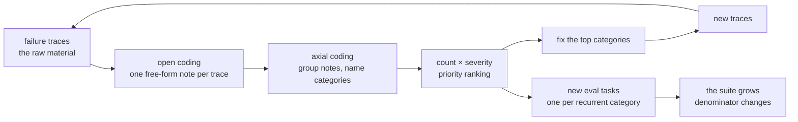

# S10-error-analysis — From a pile of failures to a permanent eval task

**Carried in:** `cafe/report.py` — S09's citation-checked debrief, and the recorded shifts it can describe. You can now tell one shift's story honestly; tonight you find out which failures keep happening.
**Today you ship:** `cafe/taxonomy.py` — the pipeline that turns a pile of real failures into a ranked taxonomy and a new eval task.
**What this teaches:** error analysis as a method — open coding a pile of real traces into free-form notes, axial coding those notes into categories narrow enough to be wrong, ranking by frequency × severity, and promoting the top category into a permanent eval task that fails on the engine that produced the pile and passes on the fix.
**Time:** 20–40 min active reading, 45–75 min notebook work, 5–10 min self-check. These are planning estimates, not measured learner timings. **Prerequisites:** S02 (checker tiers and the fixture invariant); S08 (traces you can pull); S09 (the event log that already flags what the harness noticed).
**Hands-on:** [`toy.py`](toy.py) — runs against **your** model.

---

## The hook

Three shifts, three transcripts, and a suite that says everything is fine. Then you read
the traces. One shift never checked an allergy the customer declared by name. Another
tried to fire a ticket before confirmation; the consent gate refused it. A third ran out of turns with the
customer still waiting for an answer.

The aggregate said 6/9. It could not say *which* six, or why. A number tells you there is
a fire; it does not tell you what is burning.

## The promise

By the end of this session you will have pulled real failures out of several live shifts,
labeled them by close reading, ranked them by frequency × severity, and turned the top
category into a permanent eval task — one you can watch fail on the engine that produced
the pile and pass on the fix. You will finish with a ranked taxonomy with trace
references, one new regression guard, and a number that says how often reading and
keyword-filing agree.

---

## The theory in depth

### The number says something is wrong; reading says what

Your eval suite returns a pass rate. Two different systems can score identically — one
failing on safety, the other on formatting — and the rate cannot tell them apart. Treat
it as a smoke detector: it tells you there is a problem and roughly where, never what is
burning. Tuning whatever moves the number is how teams ship a green suite over a red
shift.

Error analysis is the discipline that converts the number into work: read the failures,
name them, group them, rank them, fix the top, and grow the suite from what you found.



The loop does not end. After a fix ships, read the new failures: categories die, new ones
appear, the taxonomy is a living document. What you may not do is automate the reading
away.

### Open coding: let the data name the categories

Open coding is the first pass: read one trace and write, in your own words, what went
wrong. No fixed list of allowed answers. The method is borrowed from grounded theory
([overview](https://en.wikipedia.org/wiki/Grounded_theory)) and applied to agents by
Hamel Husain's field guide
([hamel.dev](https://hamel.dev/blog/posts/field-guide/)). Two habits make it work:

- **Label the most upstream error.** Failures cascade — a misread request in turn 1
  produces a wrong tool call in turn 3 and a confident non-answer in turn 4. If you label
  the symptom you will patch the last line and leave the cause.
- **Write the category list after reading, never before.** A list written first encodes
  what you already believe, and the failure you have not imagined is exactly what the
  exercise exists to find. The diagnostic: if your `other` bucket is the biggest one, your
  taxonomy is wrong.

### Axial coding: a taxonomy that earns its rows

Axial coding is the grouping pass: lay the notes side by side, cluster the ones with the
same underlying cause, name each cluster. Every row has to earn its place — cite at least
one real trace id, stay narrow enough to be wrong, and name its fix. "The model was
wrong" fits every trace and suggests nothing; it is a label, not an analysis.

Then rank by **frequency × severity**, not frequency alone. A safety failure at n=2 can
outrank an annoyance at n=5 — but you need both columns to argue it. `cafe/taxonomy.py`
weights severity (`high` 3, `medium` 2, `low` 1) and sorts on weight, then count, then
name, and every row keeps the trace ids that put it there.

### The auto-filer orders the queue; it never closes it

The tempting shortcut is to file the pile with keyword rules instead of reading it.
`classify_naive` does exactly that: two keywords, and everything else falls into `other`.
This is not useless — it is triage. It is fatal only as a *substitute*, because the failure
it has no keyword for is invisible to it, and that is usually the bucket where being wrong
hurts most. The notebook makes you score the shortcut against your own reading, so you can
see which records it misfiled.

### Promotion: the top category earns a permanent eval task

A prioritized taxonomy is a to-do list in two halves: fixes for the top categories, and
**new eval tasks**, one per recurrent category. A promoted task carries the script that
reproduced the failure, the tool calls its trace must show, and a deterministic check. Two
invariants make it worth a slot:

1. it **fails on the engine that produced the pile** — the failure is provably present,
   not imagined;
2. it **passes on the fix**, and its check still passes the S02 fixture invariant (bare
   fixture fails, reference passes).

That delta is what makes it a regression guard instead of a wish. `promote` builds the
task; `naive_engine` and `guarded_engine` stand in for the two engines so the
discrimination is provable without another model call.

---

## Build (in the notebook, predict first)

Open [`toy.py`](toy.py).
Configure your endpoint first:

```bash
export CAFE_BASE_URL=http://127.0.0.1:11434/v1
export CAFE_API_KEY=ollama
export CAFE_MODEL=qwen2.5:14b-instruct
uv run python -m cafe.doctor
uv run marimo edit sessions/s10-error-analysis/toy.py
```

1. **Drive the pile.** Three live shifts run through `run_shift` under a deliberately tight
   turn cap (`max_turns=3`), retaining S05's consent gate and an explicit synthetic customer. Each script declares what the customer asked for and which
   tool the shift must call. The cap is a harness choice, not a model-quality score: a
   shift that runs out of turns before the customer is answered is a real failure.
2. **Harvest only what the trace shows.** `harvest` reads each recorded run against its
   script and returns one record per failure — a missing expected tool, a refused consent attempt, an actually fired ticket
   with no prior `propose_order` in an explicitly permissive baseline, an 86'd item sent to the kitchen, a turn cap — each with
   an id, a severity, and a verbatim quote from the conversation. If the trace does not
   show it, it is not in the pile. An empty pile pauses labeling and promotion;
   there is no taxonomy evidence to bank from that run.
3. **Predict first: the categories.** Before you read closely, write down the two or three
   category names you expect this pile to contain. Then fill `attempt_open_code` — one
   category per record — and flip the reveal switch only after your attempt. The reference
   solution names four; yours may differ, and that is fine as long as each name is narrow
   enough to be wrong.
   Every record needs your own nonempty label before ranking continues. Incomplete
   attempts never borrow reference labels; reference source and results require
   both a complete attempt and the reveal switch. Clearing labels pauses results.
4. **Rank and file.** `rank` turns your labels into a frequency × severity table with trace
   references; `agreed` scores your reading against `classify_naive`. Predict the agreement
   count before you run it, then look at *which* records the auto-filer misfiled.
5. **Predict the promotion.** The top category is about to become an eval task. Will it
   fail on `naive_engine`, pass on `guarded_engine`, or fail on both? Write your answer,
   then run `promote` and `check_task` and watch the delta.

The notebook's closing cells are protocol invariants, not decoration: every harvested
record gets exactly one non-empty label, and the promoted task fails the naive engine and
passes the guarded one.

---

## Checkpoint — the number you bank

Record three things from this run, with your model name beside them:

- the agreement count between your hand labels and the auto-filer, over the pile size —
  and, more usefully, which records the shortcut missed;
- the ranked top category with its `n` and `freq × sev`;
- confirmation that the promoted task fails the naive engine and passes the guarded one.

The counts are facts about *this* pile on *your* endpoint, not a model-quality score. The
promoted task discriminates deterministically whatever the model did.

---

## State of the art (as of August 2026)

| Development | Status | Take |
|---|---|---|
| [Hamel Husain — A Field Guide to Rapidly Improving AI Products](https://hamel.dev/blog/posts/field-guide/) | **already in this path** | The assigned method: notes first, categories second, evals third — the exact loop this session rehearses. |
| [Grounded theory (open and axial coding)](https://en.wikipedia.org/wiki/Grounded_theory) | **already in this path** | Applied agent work rediscovered a sixty-year-old social-science method. Constant comparison is your axial pass. |
| [Cemri et al. — Why Do Multi-Agent LLM Systems Fail? (MAST)](https://arxiv.org/abs/2503.13657) | **recognize** | A published top-down taxonomy built from 150 annotated traces. Compare its category grain size with yours. |
| [Anthropic — Demystifying evals for AI agents](https://www.anthropic.com/engineering/demystifying-evals-for-ai-agents) | **adopt** | Where your new task lands: capability evals graduate into the regression floor. The denominator change is the mechanism working. |
| [LangSmith observability docs](https://docs.smith.langchain.com/observability) | **recognize** | Clustering and auto-grouping traces order the reading queue. Ordering, not replacement. |
| [Langfuse academy — error analysis](https://langfuse.com/academy/monitoring/error-analysis) | **recognize** | A vendor teaching the manual version still starts with "read the traces." The reading is the product. |

---

## Annotated readings

- **Hamel Husain, [A Field Guide to Rapidly Improving AI Products](https://hamel.dev/blog/posts/field-guide/).** Extract the open/axial two-phase loop and the most-upstream-error heuristic — and the claim that skipping error analysis is the most common mistake in applied AI.
- **[Grounded theory](https://en.wikipedia.org/wiki/Grounded_theory), overview.** Extract *constant comparison*: each new trace is coded against the categories so far, and the categories get revised. That is why your taxonomy is a draft until the last trace is read.
- **Cemri et al., [Why Do Multi-Agent LLM Systems Fail?](https://arxiv.org/abs/2503.13657).** Extract the category boundaries — where do they split what you would merge? — as calibration for your own taxonomy's grain size.
- **Anthropic, [Demystifying evals for AI agents](https://www.anthropic.com/engineering/demystifying-evals-for-ai-agents).** Extract the capability/regression split: today's failure-grown task is tomorrow's merge gate.

---

## Misconceptions and failure modes

- *"Fix first, classify later."* You read one ugly trace and patch it immediately. That is whack-a-mole: you fixed the loudest bug, and the frequency data that would have ranked it never got collected.
- *"The a priori taxonomy."* Categories written before reading encode your assumptions; novel failures get forced into wrong buckets or dumped in `other`. A big `other` bucket means the taxonomy is measuring your blind spots.
- *"Category collapse."* "The model was wrong" fits every trace and suggests no fix. A category too broad to disagree with is a label, not an analysis.
- *"Rows without trace references."* If you cannot point a row at a real trace id, it is unverifiable — and the references are how a skeptic audits your counts without redoing the reading.
- *"The auto-filer is the answer."* Keyword rules are triage for the reading queue. As a substitute they file confidently and wrong, and they undercount exactly the bucket where being wrong hurts most.

---

## Self-check

<details><summary>Why must category names come from the data instead of a pre-made list?</summary>
A list written before reading encodes what you already believe. The failures you have not imagined — the ones the exercise exists to find — get forced into wrong buckets or dumped in "other." Open coding lets the data correct your guesses, and the size of the "other" bucket tells you whether it worked.</details>

<details><summary>What makes a taxonomy row trustworthy?</summary>
Three things: it cites at least one real trace id (auditable), it is narrow enough to be wrong (disagreeable), and it names a fix (actionable). "The model was wrong" fails all three.</details>

<details><summary>Your counts show one category at n=5 (low severity) and another at n=2 (high). Which gets the first new eval task, and why?</summary>
The high-severity one at n=2. Priority is frequency × severity, not frequency alone — a safety failure that happens twice outranks an annoyance that happens five times. Recording both columns is what makes that argument explicit instead of a vibe.</details>

<details><summary>Why does the promoted task have to fail on the engine that produced the pile?</summary>
Because that is what "isolates the failure" means: the failure is provably present on the old engine and provably gone on the fix. A task that passes on both proves nothing, and a task that fails on both is a broken check, not a regression guard.</details>

---

## What this unlocks

You can now say which failures recur and you have a task that proves the fix. What you do
not yet have is any control over what a check is allowed to cost. **[S11 — Budgets &
routing](../s11-budgets-routing/lesson.html)** turns your taxonomy into an estimate-based
budget gate and a routing-policy simulation. It distinguishes the simulated table from
the actual client, and known usage from incomplete accounting.
