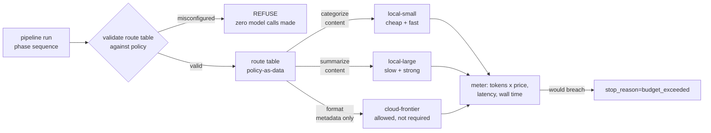

# S11-budgets-routing — Budgets, routes, and the privacy boundary

**Carried in:** `cafe/taxonomy.py` — S10's failure classes, and the debrief number S10 banked. Your shift can now name what goes wrong; tonight it learns what a call is allowed to cost and where it is allowed to run.
**Today you ship:** `cafe/routing.py` — the budget gate, the route table, and the boundary that refuses a leak.
**What this teaches:** cost, latency and data flow as harness-enforced invariants — a budget that refuses a call whose *projected* cost would cross the line before it is dispatched, a route table kept as reviewable policy-as-data, and a privacy boundary that raises on a misconfiguration instead of silently falling back.
**Time:** 20–40 min active reading, 45–75 min notebook work, 5–10 min self-check. These are planning estimates, not measured learner timings. **Prerequisites:** S01 (the loop this gate wraps); S02 (relative comparisons inside one session — the routing argument is a delta table).
**Hands-on:** [`toy.py`](toy.py) — runs against **your** model.
**Video:** [Gemini Notebook overview](video.mp4) — generated with Google Gemini Notebook (formerly NotebookLM); recorded against an earlier cut of this path, so it still uses the previous toy domain. Preview or review, never a substitute for the notebook.

---

## The hook

Last Thursday the till showed **€0.42** of model spend on a task the shift prices at
**€0.05**. Nothing errored. The loop kept refining, every individual call looked
reasonable, and the first moment anyone could see the total was the moment the invoice
existed. Money spent on a call you did not need is not refundable by adding an `if`
afterwards.

The same evening, a "performance tweak" pointed the phase that reads the customer's
handwritten note — card number, phone number, the lot — at a cloud route. It worked
beautifully. It was also a leak, and it happened at the routing decision, not inside the
model.

## The promise

By the end of this session you will be able to write a route table as data, prove that a
call whose projected cost would cross the budget is refused **before** it is dispatched,
and prove that a content phase pointed at a cloud route raises before a single request
leaves the machine. You will also bank real token and latency numbers — read from the
endpoint's own `usage` and the client's own clock, not from a formula.

---

## The theory in depth

### A budget is a runtime invariant, not a finance report

The invoice is a lagging indicator. By the time it exists, the calls have been paid for. So
the budget lives **inside** the loop and reads *ahead*: the route prices its own call
before the call happens, and a call that would cross the line is refused.
`stop_reason="budget_exceeded"` is a first-class outcome — a run that costs more than the
task is worth has failed, even mid-progress.

The estimate is a lie you need: a gate cannot know the usage before the endpoint speaks.
The **ledger** is the truth, and it is written from `response["usage"]` after the call.
Two numbers, two jobs: **the estimate refuses, the usage records.**

### Routing is policy-as-data

A route table is a dict: café phase → route name. Each route carries a location, a model
label, and a price per 1k tokens. It is diffable, reviewable, and validatable without
touching the engine — and the route you choose cites a measured number rather than a
preference. Different phases of one shift differ wildly in difficulty; sending the note
(and its card number) to the same place as a category summary is not a routing policy, it
is an accident.



### The privacy boundary refuses; it does not warn

Every phase carries a **classification**; every route carries a **location**. A content
phase — the note with the card and phone numbers, the prose about this customer's order —
must resolve to a local route. `validate_policy` runs before any model call and **raises**.
It does not warn, and it does not fall back to a safe route: a silent fallback is the same
leak with better logging.

A warning is a log line nobody reads during the incident. A refusal makes the
misconfiguration un-runnable. The one phase allowed off-local is `till_summary`, which
carries metadata only — category totals, no descriptions — because classification decides
what may leave, not the vendor's reputation.

### What "measured" means tonight

`response["usage"]` gives the tokens the endpoint actually charged for.
`client.last_latency_ms` gives the wall time around the request, set by the client around
the call, not by a formula in this notebook. A refused call is never sent, so
`client.calls` and `client.last_latency_ms` keep the values of the previous dispatched
call — which is exactly how the notebook proves the refusal happened before the wire.

---

## Build (in the notebook, predict first)

Open [`toy.py`](toy.py).
Configure your endpoint first:

```bash
export CAFE_BASE_URL=http://127.0.0.1:11434/v1
export CAFE_API_KEY=ollama
export CAFE_MODEL=qwen2.5:14b-instruct
uv run python -m cafe.doctor
uv run marimo edit sessions/s11-budgets-routing/toy.py
```

1. **The seam, unchanged.** `get_client()` is the only way this notebook reaches a model.
   Tonight the numbers that matter come from the client: `usage` on the response and
   `client.last_latency_ms` around the request.
2. **Predict first: the gate predicate.** The harness knows `spent_usd` and the route's
   `projected_usd`. Write the predicate that refuses the call, then flip the reveal switch.
   Edge case that matters: no budget means no limit. The harness does the refusing; your
   predicate only returns a bool.
3. **One real metered call.** A `draft_reply` routed through `local-large`. The projected
   cost prints next to the real one; on a short note they are close, on a long one they
   drift. That gap is why the gate uses an estimate and the ledger uses usage.
4. **Predict first: a table that validates.** Fill `attempt_route_table()` so
   `validate_policy` accepts it: `read_note` and `draft_reply` are content phases,
   `till_summary` is metadata, and `local-small`, `local-large`, `cloud-frontier` are the
   routes. Then flip the reveal switch for a reference. The boundary answers "is it
   allowed"; it never answers "is it wise" — that is a measurement you would run next.
5. **Watch the invariants.** Three notebook cells are protocol invariants: an over-budget
   call is refused and `client.calls` does not move; a content phase on a cloud route
   raises while the metadata phase on the same route is permitted; and every metered token
   count equals the endpoint's `usage`, with latency read from `client.last_latency_ms`.

---

## Checkpoint — the numbers you bank

Two invariants you can now demonstrate on demand:

- a call whose projected cost crosses the budget is refused **before** dispatch, so
  `client.calls` does not move and its cost never lands;
- a content phase pointed at a cloud route raises, while the same route on a metadata
  phase is permitted.

And two measured numbers from your own endpoint: **total tokens** and **median latency**
across the checkpoint calls, plus what they cost at the route's price. On a small local
model these are small and a little noisy; they are still live measurements. S12's judge
costs money too, and without these numbers you cannot say whether it is worth running.

---

## State of the art (as of August 2026)

| Development | Status | Take |
|---|---|---|
| [LiteLLM proxy — provider budget routing](https://docs.litellm.ai/docs/proxy/provider_budget_routing) | **recognize** | A gateway can enforce budgets across providers. Read the semantics: many gateways stop *subsequent* calls rather than refusing the crossing one — verify before you assume it prevents overshoot. |
| [RouteLLM (LMSYS)](https://lmsys.org/blog/2024-07-01-routellm/) | **recognize** | Learned routing between a strong and a weak model. Your table is the hand-written version; their result is the evidence that routing beats "always strong." |
| [RouteLLM — the paper](https://arxiv.org/abs/2406.18665) | **recognize** | Same idea with the numbers: cost reduction at a held quality bar. Read it as the defensible version of "the cheapest route that holds the number." |
| [OpenRouter — auto router](https://openrouter.ai/docs/guides/routing/routers/auto-router) | **recognize** | Model selection as a service. Note that it picks on capability, not on *your* data classification — the privacy boundary stays yours to enforce. |
| [Apple — Private Cloud Compute](https://security.apple.com/blog/private-cloud-compute/) | **adopt** | The industrial version of "content stays local unless the boundary says otherwise." Steal the stance: the boundary is architectural, not a flag you remember to set. |
| [OWASP LLM06: Excessive Agency](https://genai.owasp.org/llmrisk/llm062025-excessive-agency/) | **recognize** | An unbounded, un-metered agent is the excessive-agency risk with a bill attached. Your budget and route table are the governance layer it asks for. |

---

## Annotated readings

- **LiteLLM, [provider budget routing](https://docs.litellm.ai/docs/proxy/provider_budget_routing).** Extract where the budget is checked relative to the request: pre-dispatch or post-usage. The difference is the whole of this session's first invariant.
- **LMSYS, [RouteLLM](https://lmsys.org/blog/2024-07-01-routellm/) / [paper](https://arxiv.org/abs/2406.18665).** Extract the framing of the quality bar: a route is defensible only against a measured number, never a preference.
- **Apple, [Private Cloud Compute](https://security.apple.com/blog/private-cloud-compute/).** Extract the stance, not the infrastructure: the boundary is enforced by design and refuses, which is what `validate_policy` is a toy of.

---

## Misconceptions and failure modes

- *"The budget is a report."* A report is written after the money is gone. The gate must read *ahead*: a crossing call refused before dispatch is cheap; one refused after is an FYI.
- *"The estimate is the cost."* The estimate is a lie you need to make the pre-dispatch decision; the endpoint's `usage` is the truth. Confuse them and your ledger drifts from your invoice.
- *"Warn and fall back to a safe route."* A silent fallback is the same leak with better logging. The boundary raises, and the misconfiguration becomes un-runnable.
- *"Route by which model sounds better."* Route by classification and by a measured number. The vendor's reputation does not entitle a content phase to leave the machine.
- *"A refused call still costs latency."* It does not: a refused call never reaches `client.chat`, so `client.calls` and `last_latency_ms` do not move. That is how you prove the refusal happened before the wire.

---

## Self-check

<details><summary>Why does the gate use an estimate before dispatch if the real cost is only known after?</summary>
Because a post-call meter is a soft stop: by the time it sees the crossing, that call was already paid for. A pre-dispatch estimate refuses the call that would cross, so the cost never lands. The estimate is not the ledger; it only has to be good enough to refuse.</details>

<details><summary>A content phase is routed to a route whose location is cloud. What does the harness do?</summary>
`validate_policy` raises before any model call. It does not warn and does not fall back to a safe route — a silent fallback is the same leak with better logging. The misconfiguration has to be un-runnable.</details>

<details><summary>Why is `till_summary` allowed off-local when `read_note` is not?</summary>
Because classification is a property of the data, not the vendor. `read_note` sees the customer's handwritten card and phone numbers — content. `till_summary` carries metadata only: category totals, no descriptions. The boundary permits the second and refuses the first on the same route.</details>

<details><summary>The metadata phase and the content phase use the same cloud route. Does the boundary care about the route or the data?</summary>
The data. The same route is permitted for metadata and refused for content; `validate_policy` checks each phase's classification against its route's location. Routing decisions are about what the data is, not which model is fashionable.</details>

---

## What this unlocks

You now have a harness that can refuse work before paying for it, and a policy table you can
review in a diff. What you still do not have is any idea whether the thing producing the
answers is any good. **[S12 — Judge calibration](../s12-judge-calibration/lesson.html)** turns a model
into an instrument: it seeds defects you already know the answer to, and makes you measure
detection and false positives before you trust a single verdict.
