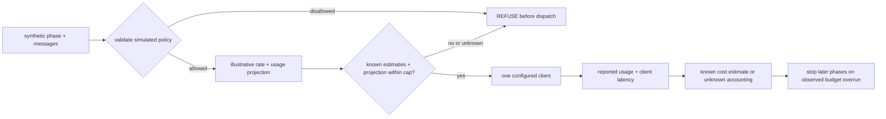

# S11-budgets-routing — Budget estimates and routing policy

**Carried in:** `cafe/taxonomy.py` — S10's failure classes, and the debrief number S10 banked. Your shift can now name what goes wrong; tonight it learns what a call is allowed to cost and where it is allowed to run.
**Today you ship:** `cafe/routing.py` — an estimate-based budget gate and an explicit routing-policy simulation.
**What this teaches:** pre-call estimates, honest usage accounting, and a reviewable classification policy. The route labels are simulated; every dispatched call uses the one configured client.
**Time:** 20–40 min active reading, 45–75 min notebook work, 5–10 min self-check. These are planning estimates, not measured learner timings. **Prerequisites:** S01 (the loop this gate wraps); S02 (relative comparisons inside one session — the routing argument is a delta table).
**Hands-on:** [`toy.py`](toy.py) — offline by default; `COURSE_MODE=live` uses **your** model.

---

## The hook

Last Thursday the till showed **€0.42** of model spend on a task the shift prices at
**€0.05**. Nothing errored. The loop kept refining, every individual call looked
reasonable, and the first moment anyone could see the total was the moment the invoice
existed. Money spent on a call you did not need is not refundable by adding an `if`
afterwards.

The same evening, a "performance tweak" pointed the phase that reads the customer's
handwritten note — card number, phone number, the lot — at a cloud route. It worked
beautifully. It was also a leak, and it happened at the routing decision, not inside the
model.

## The promise

By the end of this session you can write a route table as data and prove that a
projected overage is refused before dispatch. You can also reject a disallowed
content-to-cloud mapping in the policy table. **This is a policy simulation over
synthetic café data:** all route labels use the same configured client. They do not
select models, verify locality, inspect content classification, or prove privacy.
The notebook shows the configured client and any model identity the provider reports.

---

## The theory in depth

### A budget is a runtime invariant, not a finance report

The invoice is a lagging indicator. By the time it exists, the calls have been paid for. So
the budget lives **inside** the loop and reads *ahead*: the route prices its own call
before the call happens, and a call that would cross the line is refused.
`stop_reason="budget_exceeded"` is a first-class outcome — a run that costs more than the
task is worth has failed, even mid-progress.

A pre-call estimate cannot know the final usage. The ledger multiplies reported
usage by an **illustrative** rate card; both money figures are estimates, not invoices.
Missing or invalid token counts are unknown, never zero. With a cap, incomplete
accounting refuses the next call with `usage_unknown`. A completed call can still
exceed the projection and the budget: `budget_overrun` stops later phases, not the
cost already incurred. This is not a hard spending cap.

### Routing is policy-as-data

A route table maps café phase to a simulated route name. Each name carries an
illustrative location, model label and rate. Review that table independently of
the transport: `client_model` records the configured alias, while optional
`reported_model` records what the response says. Neither resolves a hidden backend.



### The classification policy refuses; it does not warn

`validate_policy` rejects content phases assigned to a simulated cloud route and
permits the metadata phase there. Both `run_phases` and `metered_call` validate
before calling the injected client. A label is not a privacy boundary: the toy
does not verify the actual endpoint's location or prove that a payload contains
only metadata. Use synthetic input. A deployed design would need those checks at
the real transport and data boundaries.

### What "measured" means tonight

`response["usage"]` may report token counts. Missing, negative, boolean or
noninteger counts remain unknown; they are not evidence of a free call.
`client.last_latency_ms` gives the wall time around the request, set by the client around
the call, not by a formula in this notebook. A refused call is never sent, so
`client.calls` and `client.last_latency_ms` keep the values of the previous dispatched
call — which is exactly how the notebook proves the refusal happened before the wire.

---

## Build (in the notebook, predict first)

Open [`toy.py`](toy.py).
Start on the offline stub without configuration. For live measurements:

```bash
export COURSE_MODE=live
export CAFE_BASE_URL=http://127.0.0.1:11434/v1
export CAFE_API_KEY=ollama
export CAFE_MODEL=qwen2.5:14b-instruct
uv run python -m cafe.doctor
uv run marimo edit sessions/s11-budgets-routing/toy.py
```

1. **The seam, unchanged.** `get_client()` is the only way this notebook reaches a model.
   Tonight the numbers that matter come from the client: `usage` on the response and
   `client.last_latency_ms` around the request.
2. **Predict first: the gate predicate.** The harness knows `spent_usd` and the route's
   `projected_usd`. Write the predicate that refuses the call, then flip the reveal switch.
   Edge case that matters: no budget means no limit. The harness does the refusing; your
   predicate only returns a bool.
3. **One metered call.** A `draft_reply` uses the configured client and the simulated
   `local-large` rate card. Compare the projection with the usage-based estimate,
   and record missing usage explicitly. No route label changes the actual endpoint.
4. **Predict first: a table that validates.** Fill `attempt_route_table()` so
   `validate_policy` accepts it: `read_note` and `draft_reply` are content phases,
   `till_summary` is metadata, and `local-small`, `local-large`, `cloud-frontier` are the
   routes. Then flip the reveal switch for a reference. The boundary answers "is it
   allowed"; it never answers "is it wise" — that is a measurement you would run next.
5. **Watch the invariants.** Three notebook cells are protocol invariants: an over-budget
   call is refused and `client.calls` does not move; a content phase on a cloud route
   raises while the metadata phase on the same route is permitted; and every metered token
   count matches valid reported usage, or stays unknown. Latency comes from the client.

---

## Checkpoint — the numbers you bank

Two invariants you can now demonstrate on demand:

- a call whose projected cost crosses the budget is refused **before** dispatch, so
  `client.calls` does not move and its cost never lands;
- a content phase pointed at a cloud route raises, while the same route on a metadata
  phase is permitted.

Bank **known tokens**, accounting completeness, **median latency** when available,
and the cost estimate at the illustrative rate. Stub values are deterministic
fixtures; only live mode measures your endpoint. Include the actual configured
client alongside the simulated route. S12 reuses this estimate when comparing rubrics.

---

## State of the art (as of August 2026)

| Development | Status | Take |
|---|---|---|
| [LiteLLM proxy — provider budget routing](https://docs.litellm.ai/docs/proxy/provider_budget_routing) | **recognize** | A gateway can enforce budgets across providers. Read the semantics: many gateways stop *subsequent* calls rather than refusing the crossing one — verify before you assume it prevents overshoot. |
| [RouteLLM (LMSYS)](https://lmsys.org/blog/2024-07-01-routellm/) | **recognize** | Learned routing between a strong and a weak model. Your table is the hand-written version; their result is the evidence that routing beats "always strong." |
| [RouteLLM — the paper](https://arxiv.org/abs/2406.18665) | **recognize** | Same idea with the numbers: cost reduction at a held quality bar. Read it as the defensible version of "the cheapest route that holds the number." |
| [OpenRouter — auto router](https://openrouter.ai/docs/guides/routing/routers/auto-router) | **recognize** | Model selection as a service. Note that it picks on capability, not on *your* data classification — the privacy boundary stays yours to enforce. |
| [Apple — Private Cloud Compute](https://security.apple.com/blog/private-cloud-compute/) | **adopt** | The industrial version of "content stays local unless the boundary says otherwise." Steal the stance: the boundary is architectural, not a flag you remember to set. |
| [OWASP LLM06: Excessive Agency](https://genai.owasp.org/llmrisk/llm062025-excessive-agency/) | **recognize** | An unbounded, un-metered agent is the excessive-agency risk with a bill attached. Your budget and route table are the governance layer it asks for. |

---

## Annotated readings

- **LiteLLM, [provider budget routing](https://docs.litellm.ai/docs/proxy/provider_budget_routing).** Extract where the budget is checked relative to the request: pre-dispatch or post-usage. The difference is the whole of this session's first invariant.
- **LMSYS, [RouteLLM](https://lmsys.org/blog/2024-07-01-routellm/) / [paper](https://arxiv.org/abs/2406.18665).** Extract the framing of the quality bar: a route is defensible only against a measured number, never a preference.
- **Apple, [Private Cloud Compute](https://security.apple.com/blog/private-cloud-compute/).** Extract the stance, not the infrastructure: the boundary is enforced by design and refuses, which is what `validate_policy` is a toy of.

---

## Misconceptions and failure modes

- *"The budget is a report."* A report is written after the money is gone. The gate must read *ahead*: a crossing call refused before dispatch is cheap; one refused after is an FYI.
- *"The estimate is the cost."* Both money figures use an illustrative rate. Usage can be missing, and a completed call can overshoot. Neither figure is an invoice or a hard cap.
- *"Warn and fall back to a safe route."* The table validator raises. That proves the simulated policy check, not the locality of the configured client.
- *"Route by which model sounds better."* Route by classification and by a measured number. The vendor's reputation does not entitle a content phase to leave the machine.
- *"A refused call still costs latency."* It does not: a refused call never reaches `client.chat`, so `client.calls` and `last_latency_ms` do not move. That is how you prove the refusal happened before the wire.

---

## Self-check

<details><summary>Why does the gate use an estimate before dispatch if the real cost is only known after?</summary>
Because a post-call meter is a soft stop: by the time it sees the crossing, that call was already paid for. A pre-dispatch estimate can refuse a projected overage, but underestimation can still let a crossing call through. Record that overrun and stop subsequent calls; a hard cap needs stronger controls.</details>

<details><summary>A content phase is routed to a route whose location is cloud. What does the harness do?</summary>
`validate_policy` raises before any model call. That checks the simulated table. It does not inspect the actual client location or classify payload contents.</details>

<details><summary>Why is `till_summary` allowed off-local when `read_note` is not?</summary>
The teaching table declares `read_note` content and `till_summary` metadata. It permits the second classification on a simulated cloud route. Actual metadata-only payloads and endpoint locality require separate enforcement; this toy uses synthetic data.</details>

<details><summary>The metadata phase and the content phase use the same cloud route. Does the boundary care about the route or the data?</summary>
The data. The same route is permitted for metadata and refused for content; `validate_policy` checks each phase's classification against its route's location. Routing decisions are about what the data is, not which model is fashionable.</details>

---

## What this unlocks

You now have a harness that can refuse work before paying for it, and a policy table you can
review in a diff. What you still do not have is any idea whether the thing producing the
answers is any good. **[S12 — Judge calibration](../s12-judge-calibration/lesson.html)** turns a model
into an instrument: it seeds defects you already know the answer to, and makes you measure
detection and false positives before you trust a single verdict.
