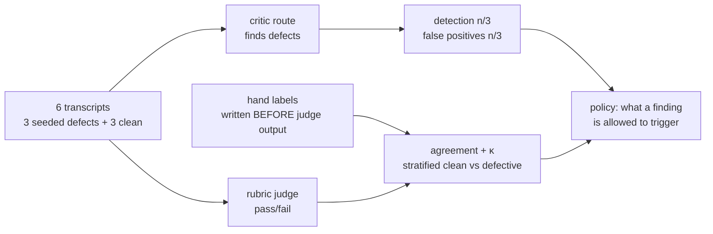

# S12-judge-calibration — A judge you have not calibrated is an opinion

**Carried in:** `cafe/routing.py` — S11's route table, its budget gate, and the token and latency numbers it measured on your endpoint. You now know what a call costs; tonight you find out whether the verdict it returns is worth anything.
**Today you ship:** `cafe/judge.py` — the seeded-defect game, the detection and false-positive rates, and the agreement math.
**What this teaches:** how to turn a model call into an instrument — seed defects you already know the answer to, hand-label the corpus *before* you see any judge output, report detection rate and false-positive rate as a pair, and compute Cohen's κ (which is undefined, not 1.0, when the vectors are constant).
**Time:** 20–40 min active reading, 45–75 min notebook work, 5–10 min self-check. These are planning estimates, not measured learner timings. **Prerequisites:** S02 (the fixture invariant, and checkers whose failures you trust); S10 (the failure classes this session calibrates against).
**Hands-on:** [`toy.py`](toy.py) — runs against **your** model.

---

## The hook

Your judge scored the shift **9/10**, so you let it gate the release. A week later a
customer found two defects it had waved through — and one clean order it had failed for
being "too terse". You never measured either number. The 9/10 was never a measurement; it
was an opinion with a decimal point.

## The promise

By the end of this session you will have seeded known defects into clean café transcripts,
labeled the corpus yourself **before** any judge output existed on your screen, and
reported a detection rate, a false-positive rate, and Cohen's κ — with the pair for an
uncalibrated rubric next to the pair for a calibrated one, so the change is attributable.
You will be able to say exactly what that κ licenses and what it does not.

The six-case corpus is an arithmetic demonstration, not release calibration. Measure
your model rather than assuming it will be good or bad; a release decision needs a larger,
independently labeled corpus that you did not use to tune the rubric.

---

## The theory in depth

### A judge is an instrument; an uncalibrated instrument is an opinion

A rubric judge is a model call that returns pass/fail. Nothing in that call tells you how
often it is right, and a verdict is far more persuasive than it deserves to be. Calibration
is the act of measuring the instrument against something you already know.

### You need an answer key you built

So you seed the defects yourself. Take clean café transcripts, mutate a known number of
them in ways the harness can prove: an allergen served after the customer declared one, a
price that is not on the menu, a ticket fired before the customer confirmed. Now every
transcript has a key — defective class, or clean — and the judge never sees it.

The seeded defects must be *quiet*: the kind a tired shift actually ships, not obvious
garbage. A judge that only catches the blatant is useless.

### The order of operations is the protocol



Hand labels come **before** judge output, because a verdict you have already seen anchors
your label and the measurement dies quietly. Detection reported without false positives is
half a number: a judge that fails everything detects everything. And a judge you tuned
against this corpus has stopped measuring it.

### κ, and what "undefined" means

Raw agreement flatters a judge when one class dominates. Cohen's κ subtracts the agreement
chance would have produced anyway:

κ = (p_observed − p_expected) / (1 − p_expected)

If the chance term is degenerate — every transcript in both vectors carries the same label
— κ is **undefined**, not 1.0. `cohens_kappa` returns `None` there, on purpose: reporting
`1.0` for two constant vectors would be a lie, and a report that turns that `None` into
`1.0` is lying to you. Read a real κ as "how much of the agreement was base rates doing
the work." `κ = 0.4` is a judge that has earned a bigger calibration set, not one you can
gate on.

### One verdict per transcript, and `unparseable` is a result

The harness guarantees the mechanical part: `run_judge_all` returns exactly one verdict per
transcript, in a fixed, mixed corpus order, so "the defective ones are first" never becomes
a habit. `parse_verdict` requires one JSON object with `verdict`, `class`, and a nonempty
`rationale`. It rejects extra prose, duplicate keys, unknown classes and contradictions:
pass requires `none`; fail requires a defect class or `other`. V1 uses `other` for its
intentionally poor style criterion. Invalid output becomes `unparseable`, never pass.

The request includes menu facts separately from the transcript and treats transcript
instructions as evidence. Add approval/tool facts for each real run when available.
Report valid-output coverage alongside detection and false positives, which retain
the full defective/clean denominators. Zero alarms with zero valid outputs is no
evidence of quality.

### Calibration is a property of the pair

The rubric and the model are one instrument. v1 of the rubric is strict, style-sensitive,
and told to distrust short answers — the judge most people ship on the first try. v2 spells
out S10's failure classes and deletes the style bias, with the same model and the same
corpus. Compare both rates and coverage on the same corpus. Either rubric can perform worse;
the direction is an observation, not an assertion. Changing a rubric does not prove
that its model improved.

---

## Build (in the notebook, predict first)

Open [`toy.py`](toy.py).
Configure your endpoint first:

```bash
export CAFE_BASE_URL=http://127.0.0.1:11434/v1
export CAFE_API_KEY=ollama
export CAFE_MODEL=qwen2.5:14b-instruct
uv run python -m cafe.doctor
uv run marimo edit sessions/s12-judge-calibration/toy.py
```

1. **Read the corpus.** Six clean café transcripts in a fixed, mixed order; three of them
   carry exactly one seeded defect. The key stays out of the notebook until the labeling
   section. Read a couple before you go on.
2. **Judge v1.** One pass/fail verdict per transcript, JSON out. This rubric is deliberately
   uncalibrated: strict, style-sensitive, told to distrust short answers.
3. **Hand-label first — this is the protocol, not a warm-up.** Before you see more judge
   output, label all six transcripts yourself in `attempt_hand_labels` against the rubric.
   Then flip the reveal switch for the seed-derived reference. A verdict you have already
   seen anchors your label, and an anchored label measures the judge's influence on you,
   not the judge.
4. **Predict the pair.** Before the calibration cell, write down how many defective
   transcripts judge v1 will catch and how many clean ones it will fail. Detection and
   false positives are reported together, because either alone is half a number.
5. **Read the misses, then judge v2.** The v1 misses are not mysteries; they are classes.
   v2 spells them out and removes the style bias — same corpus, same model, same order,
   only the rubric changed. Re-measure on the same corpus and compare the pairs.
6. **κ both ways.** `cohens_kappa` compares the judge vectors with the reference labels. If
   both vectors are constant, it returns `None` and the notebook prints "undefined" — the
   honest answer. The closing cells are protocol invariants: κ is undefined for constant
   vectors, every transcript gets exactly one verdict, and the rates and coverage retain their denominators.
7. **Price the twelve calls.** Calibration cost two rubrics over six transcripts.
   The cost cell rebuilds each call's messages exactly and projects them on S11's
   route table — worth-it is a question with two numbers, and now you have both.

---

## Checkpoint — the number you bank

Put this in one sentence and defend it: **6 transcripts, 3 seeded defects, detection n/3,
false positives n/3, valid outputs n/6, κ = …** for the calibrated rubric — with the uncalibrated pair next to
it so the change is attributable. On a small local model those numbers may be poor. That is
your instrument's actual precision, and it is worth more than a 9/10 you cannot reproduce.
Bank the projected calibration cost next to the κ: twelve calls priced on S11's table.
A verdict is worth what it measures minus what it cost to get.

---

## State of the art (as of August 2026)

| Development | Status | Take |
|---|---|---|
| [Hamel Husain — Creating a LLM-as-a-Judge that drives business results](https://hamel.dev/blog/posts/llm-judge/) | **already in this path** | The method behind this session: label your own corpus first, report agreement as a pair, and never trust a judge you have not measured. |
| [Cohen's κ — overview](https://en.wikipedia.org/wiki/Cohen%27s_kappa) | **recognize** | Chance-corrected agreement. Note the degenerate case: κ is undefined, not 1.0, when the chance term is 1. |
| [Cohen 1960 — A Coefficient of Agreement for Nominal Scales](https://doi.org/10.2307/2529310) | **recognize** | The original definition your helper implements. Read the assumption your constant-vector guard protects. |
| [Judging LLM-as-a-Judge with MT-Bench and Chatbot Arena](https://arxiv.org/abs/2306.05685) | **recognize** | Documents the judge's known biases — position, verbosity, self-enhancement. Small models are more susceptible, which is why this session expects a poor judge. |
| [Anthropic — Demystifying evals for AI agents](https://www.anthropic.com/engineering/demystifying-evals-for-ai-agents) | **adopt** | Judged criteria stay labeled uncalibrated until you have the rates. This session is the calibration that lets a judged tier count. |

---

## Annotated readings

- **Hamel Husain, [Creating a LLM-as-a-Judge that drives business results](https://hamel.dev/blog/posts/llm-judge/).** Extract the order of operations — hand labels before judge output — and the insistence on reporting agreement as a pair, not a single flattering number.
- **[Cohen's κ](https://en.wikipedia.org/wiki/Cohen%27s_kappa), overview.** Extract the degenerate case and why chance-correction matters: raw agreement flatters a judge when one class dominates.
- **Zheng et al., [Judging LLM-as-a-Judge](https://arxiv.org/abs/2306.05685).** Extract the catalogue of judge biases. It explains why a small local model lands where it lands, and why the rates come before the verdict.

---

## Misconceptions and failure modes

- *"The judge said fail, so it is a defect."* Not until you have measured the judge. An uncalibrated verdict is an opinion with a decimal point; the calibration set is what turns it into an instrument.
- *"Label after you have seen the verdicts."* A seen verdict anchors your label, and the measurement quietly becomes the judge's influence on you. Hands first, always.
- *"Report detection."* Detection without false positives is half a number: a judge that fails everything detects everything. Report the pair.
- *"κ = 1.0 means a perfect judge."* Two constant vectors agree 100% of the time and that agreement carries no information. `cohens_kappa` returns `None` there, and that `None` is the honest answer.
- *"A bad local judge means the setup is broken."* A small local model is often a poor judge — that is the finding. Calibration is what lets you say *how* poor, and whether it is worth the calls.

---

## Self-check

<details><summary>Why must the hand labels come before any judge output?</summary>
Because a verdict you have already seen anchors your label. Your label then measures the judge's influence on you rather than your independent reading, and the agreement you compute is inflated in a way you cannot detect. Hands first is the protocol, not a warm-up.</details>

<details><summary>The judge fails all six transcripts. What are its detection and false-positive rates, and what does that say about it?</summary>
Detection 3/3 and false positives 3/3. It detects everything and flags everything, so it carries no information: a judge that fails every transcript is not strict, it is useless. Reporting only the detection rate would have made it look perfect.</details>

<details><summary>When does <code>cohens_kappa</code> return <code>None</code>, and why not 1.0?</summary>
When the chance term is degenerate — both label vectors are constant, or the lists are empty or unequal in length. Two constant vectors agree 100% of the time, and that agreement carries no information, so reporting 1.0 would be a lie. `None` means "undefined", and the notebook prints it that way.</details>

<details><summary>The calibrated rubric holds the false-positive rate but the detection rate drops. Did calibration fail?</summary>
It is a tradeoff to inspect, not an automatic success. Compare detection, false positives and valid-output coverage on both rubrics. Either rubric can perform worse; six cases do not establish release quality.</details>

---

## What this unlocks

That is the core path closed. Twelve sessions produced **one `cafe/` package** — a loop with
proven invariants, a golden set, a context budget, a ticket contract, a consent gate,
layered detection, bounded repair, a replayable trace, an evidence report, a failure
taxonomy, a cost and latency ledger, and a calibrated judge — plus **a banked number per
session**.

You are not done, but the next step is deliberately unaided and **OPTIONAL**:
**[S13 — Rebuild from memory](../s13-rebuild-from-memory/lesson.html)** is the closed-book audit.
Close every notebook and rebuild the core from memory — no scaffolding, no generated
answers, nothing filled in for you. Everything you would need is already in what you built;
the audit only tells you whether it is in *you*.
